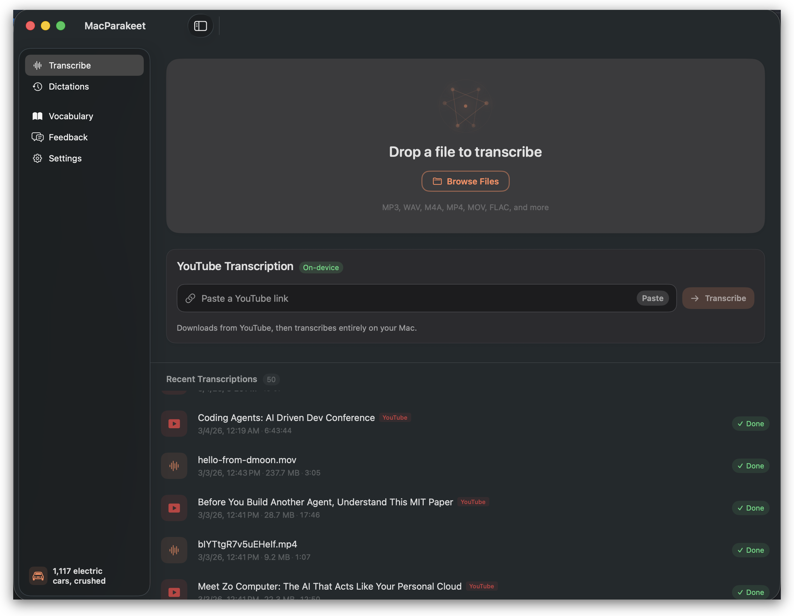
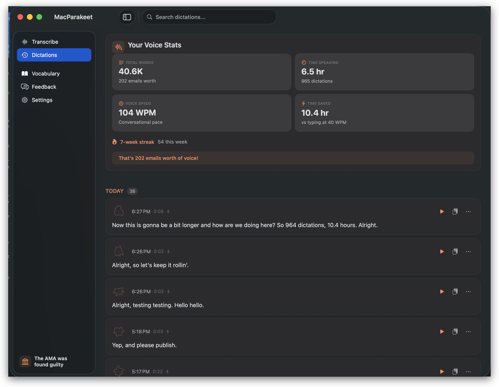

<p align="center">
  
</p>

<h1 align="center">MacParakeet</h1>

<p align="center">
  Fast, local-first voice app for Mac. Free and open-source.
</p>

<p align="center">
  <a href="https://downloads.macparakeet.com/MacParakeet.dmg"></a>
</p>

<p align="center">
  <a href="LICENSE"></a>
  
  
  
  
</p>

<p align="center">
  
</p>

<p align="center">
  
</p>

---

MacParakeet runs NVIDIA's Parakeet TDT speech model on Apple's Neural Engine via FluidAudio CoreML. System-wide dictation and file transcription — all speech recognition runs locally on your Mac. No accounts.

## Features

**System-Wide Dictation** -- Press a hotkey anywhere on macOS, speak, text appears.

- Double-tap for persistent recording, hold for push-to-talk
- Configurable trigger: bare keys, modifiers, or chord combos (Fn default)
- Auto-paste with clipboard preservation
- Private dictation mode (skip saving to history)

**File Transcription** -- Drag audio or video files, get a transcript in seconds.

- 155x realtime: ~60 minutes of audio in ~23 seconds
- ~2.5% word error rate (Parakeet TDT 0.6B-v3)
- Word-level timestamps with confidence scores
- Speaker diarization (auto-detect and label speakers)
- YouTube URL transcription via yt-dlp

**Text Processing**

- Deterministic 4-step cleanup pipeline: filler removal, custom words, snippets, whitespace normalization
- Custom vocabulary for domain terms and proper nouns
- Text snippets with natural language triggers (supports `\n` for newlines)

**Export** -- TXT, Markdown, SRT, VTT, DOCX, PDF, JSON, or copy to clipboard.

**AI Summary & Chat** -- Summarize transcriptions and ask follow-up questions via cloud LLM providers (OpenAI, Anthropic, Ollama, OpenRouter). Optional -- bring your own API keys.

**Everything Else**

- Searchable dictation and transcription history (SQLite)
- Voice stats dashboard
- Automatic background updates via Sparkle (pre-built DMG)
- Menu bar app with drag-and-drop support
- 25 European languages with automatic detection

## Getting Started

### Download

Grab the latest notarized DMG from [macparakeet.com](https://macparakeet.com). Open it, drag to Applications, done.

On first launch, MacParakeet downloads the Parakeet speech model (~6 GB). After that, dictation and transcription work fully offline.

### Or Build from Source

See [Building from Source](#building-from-source) below.

## Requirements

- macOS 14.2+ (Sonoma or later)
- Apple Silicon (M1 or later)
- ~6 GB disk space for the speech model

## Building from Source

MacParakeet is a Swift Package Manager project. No Xcode project file needed.

```bash
# Clone
git clone https://github.com/moona3k/macparakeet.git
cd macparakeet

# Run tests
swift test

# Build, code-sign, and launch the dev app
scripts/dev/run_app.sh

# Or open in Xcode
open Package.swift
```

The dev script builds a signed `.app` bundle (`MacParakeet-Dev.app`) so macOS grants microphone and accessibility permissions. Set `DEVELOPMENT_TEAM=YOUR_TEAM_ID` if the default doesn't match your Apple Developer account.

### Build the CLI

```bash
swift build --target CLI
swift run macparakeet-cli --help
```

## CLI

MacParakeet includes an internal CLI for headless operation and development.

```bash
# Transcribe a file
swift run macparakeet-cli transcribe /path/to/audio.mp3

# Use a separate database for dev work
swift run macparakeet-cli transcribe recording.wav --database /tmp/macparakeet-dev.db

# Check STT model status
swift run macparakeet-cli models status

# View dictation history
swift run macparakeet-cli history
```

## Tech Stack

| Layer | Choice |
|-------|--------|
| STT Engine | Parakeet TDT 0.6B-v3 via FluidAudio CoreML (Neural Engine) |
| Language | Swift 6.0 + SwiftUI |
| Database | SQLite via GRDB |
| Auto-Updates | Sparkle 2 |
| YouTube | yt-dlp |
| Platform | macOS 14.2+, Apple Silicon |

## Privacy

All speech recognition runs locally on the Neural Engine. Your audio never leaves your Mac.

- **Local STT.** The speech model runs on-device, not a server. No audio is transmitted.
- **No accounts.** No login, no email, no registration.
- **Anonymous telemetry.** Non-identifying, session-scoped usage analytics (opt-out in Settings). No persistent IDs, no IP storage, no audio or text content transmitted.
- **Temp files cleaned up.** Audio files are deleted after transcription unless you explicitly save them.

**What does use the network:** The optional AI Summary & Chat feature connects to external LLM providers when you configure it with your own API keys. YouTube transcription downloads video via yt-dlp. Anonymous telemetry pings our server unless you opt out. Core dictation and transcription are fully offline.

## Contributing

MacParakeet is open source and contributions are welcome.

- **Report bugs or request features** -- [Open an issue](https://github.com/moona3k/macparakeet/issues)
- **Submit a pull request** -- Fork the repo, make your changes, run `swift test`, and open a PR
- **Read the specs** -- Architecture decisions and feature specs live in `spec/`. Start with `spec/README.md` for an overview.

For larger changes, open an issue first to discuss the approach.

## License

MacParakeet is free software, released under the [GNU General Public License v3.0](LICENSE).

---

Made for people who think faster than they type.
