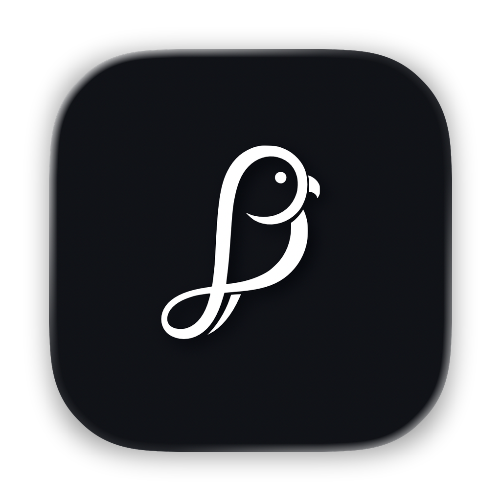

<p align="center">
  
</p>

<h1 align="center">MacParakeet</h1>

<p align="center">
  Fast voice app for Mac with fully local speech and optional AI. Free and open-source.
</p>

<p align="center">
  <em>There are many voice transcription/dictation apps, but this one is mine.</em>
</p>

<p align="center">
  <a href="https://macparakeet.com">macparakeet.com</a>
</p>

<p align="center">
  <a href="https://downloads.macparakeet.com/MacParakeet.dmg"></a>
</p>

<p align="center">
  <a href="LICENSE"></a>
  
  
  
  
</p>

<p align="center">
  
</p>

<p align="center">
  
</p>

<p align="center">
  
</p>

---

MacParakeet runs NVIDIA's Parakeet TDT on Apple's Neural Engine via [FluidAudio](https://github.com/FluidInference/FluidAudio) CoreML. It has three co-equal modes: system-wide dictation, file/URL transcription, and meeting recording. All speech recognition happens on your Mac.

## What it does

**Dictation** — Press a hotkey in any app, speak, text gets pasted. Hold for push-to-talk, double-tap for persistent recording. Works system-wide.

**File transcription** — Drag audio or video files, or paste a YouTube URL. Full transcript with word-level timestamps, speaker labels, and export to 7 formats (TXT, Markdown, SRT, VTT, DOCX, PDF, JSON).

**Meeting recording** — Capture microphone + system audio together, watch a live transcript preview while recording, and save the finished meeting directly into the library with summaries, chat, search, and export support. The meeting pipeline pairs mic/system frames, runs software AEC on the mic path, and applies a conservative system-dominance gate for live mic chunks while preserving both recorded sources in the finalized artifact (headphones still give the cleanest separation).

**Text cleanup** — Filler word removal, custom word replacements, text snippets with triggers. Deterministic pipeline, no LLM needed.

**AI features** — Optional transcript summaries and chat. Ships with a prompt library, built-in and custom summary prompts, multi-summary tabs, and queued summary generation. Use Claude Code or Codex via Local CLI, or connect OpenAI, Anthropic, Google Gemini, Ollama, LM Studio, or OpenRouter. Entirely opt-in, with a fully local setup available when you stay on local providers/features.

### Concurrent by design

- Dictation and meeting recording can run at the same time.
- Audio capture stays independent per flow.
- All STT work routes through one shared runtime owner and explicit scheduler with two default slots: a reserved dictation slot and a shared meeting/batch slot, so file transcription can wait behind interactive work.

### Performance

- ~155x realtime — 60 min of audio in ~23 seconds
- ~2.5% word error rate (Parakeet TDT 0.6B-v3)
- ~66 MB working memory per active Parakeet inference slot
- 25 European languages with auto-detection

### Limitations

- Apple Silicon only (M1/M2/M3/M4)
- Best with English — supports 25 European languages but accuracy varies
- No CJK language support (Korean, Japanese, Chinese, etc.)

## Get it

**Download:** Grab the [notarized DMG](https://downloads.macparakeet.com/MacParakeet.dmg) or visit [macparakeet.com](https://macparakeet.com). Drag to Applications, done.

First launch downloads the speech model (~6 GB) plus speaker-detection assets (~130 MB) when that default-on feature remains enabled. After that, dictation, meeting recording, and transcription work fully offline.

**Build from source:**

```bash
git clone https://github.com/moona3k/macparakeet.git
cd macparakeet
swift test
scripts/dev/run_app.sh    # build, sign, launch
```

The dev script creates a signed `.app` bundle so macOS grants mic and accessibility permissions. Set `DEVELOPMENT_TEAM=YOUR_TEAM_ID` if needed.

**CLI:**

```bash
swift run macparakeet-cli transcribe /path/to/audio.mp3
swift run macparakeet-cli models status
swift run macparakeet-cli history
```

## Tech stack

| Layer | Choice |
|-------|--------|
| STT | Parakeet TDT 0.6B-v3 via [FluidAudio](https://github.com/FluidInference/FluidAudio) CoreML (Neural Engine) |
| STT orchestration | Shared runtime + explicit scheduler across dictation, meeting recording, and transcription |
| Language | Swift 6.0 + SwiftUI |
| Database | SQLite via GRDB |
| Auto-updates | Sparkle 2 |
| YouTube | yt-dlp |
| Platform | macOS 14.2+, Apple Silicon |

## Privacy

All speech recognition runs on the Neural Engine. Your audio never leaves your Mac.

- **No cloud STT.** The model runs on-device. No audio is transmitted.
- **No accounts.** No login, no email, no registration.
- **Opt-out telemetry.** Non-identifying usage analytics and crash reporting go to a self-hosted endpoint only when telemetry is enabled. No persistent IDs, no IP storage, and no transcript/audio content is transmitted. [Source code is right here](Sources/MacParakeetCore/Services/TelemetryService.swift) — verify it yourself.
- **Temp files cleaned up.** Audio deleted after transcription unless you save it.

**What does use the network:** AI summaries and chat connect to configured LLM providers or CLI tools when you choose them. Sparkle checks for app updates. YouTube transcription downloads video via yt-dlp. Telemetry and crash reports go to our self-hosted server unless you opt out. Core dictation and transcription remain fully offline, and the app supports a 100% local setup when you use only local features/providers.

**Note:** Builds from source also send telemetry by default. Opt out in Settings or set `MACPARAKEET_TELEMETRY_URL` to override.

## Contributing

- **Report bugs** — [Open an issue](https://github.com/moona3k/macparakeet/issues)
- **Submit a PR** — Fork, make changes, `swift test`, open a PR
- **Read the specs** — Architecture decisions and feature specs live in `spec/`

For larger changes, open an issue first.

## Support

MacParakeet is free and open source. If it's useful to you, consider [sponsoring](https://github.com/sponsors/moona3k).

## License

GPL-3.0. Free software. [Full license](LICENSE).

---

*Made for people who think faster than they type.*
