# Onboarding lessons from Wispr Flow

Date: 2026-09-23. Status: **design note**. Not an ADR and not an implementation plan.

Source: a fresh local install of Wispr Flow 1.6.937, then three screen recordings of the first run (2:38, 2:40, and 2:44). The account signed in was an existing Wispr account, so the home screen already had cloud history. Stills below are cropped to the Wispr window. History rows are omitted.

MacParakeet context: [ADR 005](../../../spec/adr/005-onboarding-first-run.md) and the activation leak in [2026-09-18-onboarding-activation-leak.md](../../research/2026-09-18-onboarding-activation-leak.md).

## Verdict

Locked for the next onboarding change. The person presses the real hotkey, sees that key light up inside the onboarding card, and only then dictates into a box on that same screen. The speech-model download fills the time before that dictation. It does not sit on the same beat as “start talking.”

1. **Hotkey rehearsal is in the card.** The key cap lights while the key is held. Continue waits for one real press. Edit shortcut is on this screen. Stills: [key at rest](shortcut-test.png), [key lit](key-lit.jpg), [editor](shortcut-editor.png).
2. **The model download is the wait before dictation**, not a separate dead end after the key lesson. Rehearsal needs no speech engine, so it runs while the model loads. Wispr has no local-model wait; the click-here still is the state we show once our engine is ready.
3. **First dictation is inside onboarding.** Click the box, then dictate, and the text lands in that box. Stills: [click the field](click-here.jpg), [words land](practice-email-landed.jpg).
4. **Microphone and Accessibility are one page.** The mic stays skippable. The hotkey grant stays required. Stills: [prompt in view](permissions.png), [rows checked](permissions-done.jpg). Do not copy Wispr’s third row, meeting audio.

A skip on the dictation box, and a single dismissible tip after the window closes, can follow. They are not this change.

Leave Wispr’s sign-in, meeting questionnaire, calendar connect, “hours a week” claim, and Pro referral out.

## Why these four

MacParakeet’s first run is Welcome, Microphone, Accessibility, Hotkey, speech model, All Set. The hotkey step’s “Try it now” line is a caption. It can raise the normal dictation overlay somewhere else on the screen, and that overlay never touches speech recognition. The key drawn inside the card does not light up, the shortcut cannot be changed here, and Continue does not wait for a press. All Set then tells the user to go dictate, after a model download that may still be in front of them.

That matches the leak. About 38% of onboarding starters never finish. Of those who do finish, same-session dictation success fell to about 33% in early September 2026, and the miss is mostly people who never press the hotkey. Speech-model stall and Accessibility are the setup blockers. The growing hole is after “you’re all set.”

Wispr’s window is labeled Get started, Permissions, Setup, Learn, Personalize. Learn is where the product actually happens. Personalize is the home screen, and it appears only after several dictations have already worked.

## 1. Prove the hotkey before Continue

Wispr’s Setup stage asks two yes/no questions that the user can only answer by doing the thing.

The microphone check is “Do you see purple bars while you speak?” Yes is unavailable until the meter moves. Change microphone is on the same card, so a dead Bluetooth headset does not become a stuck step.

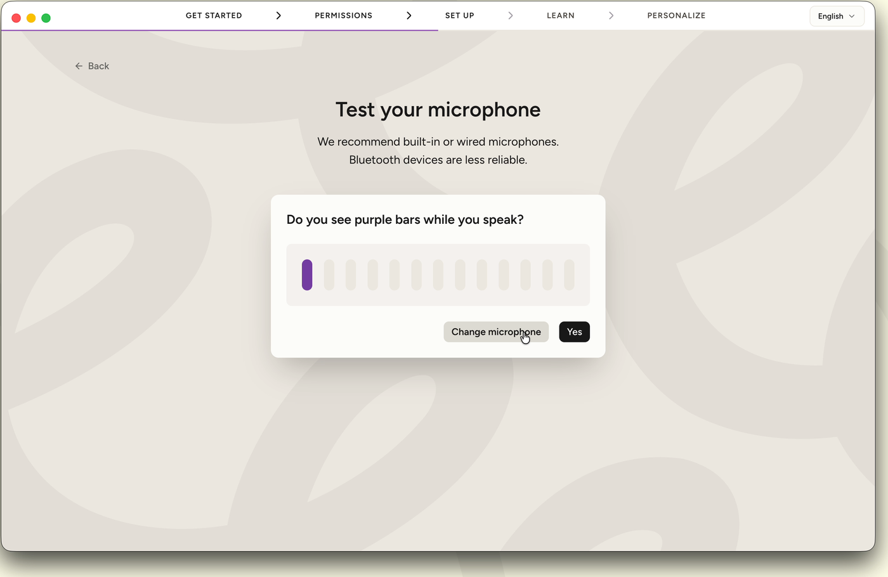

The hotkey check is the one we lack. “Does the button turn purple while pressing it?” A callout says “Press your shortcut button to continue!” Yes and No are both visible; No is how a wrong key gets fixed instead of looking like failure. Edit shortcut opens the real binding UI in place: push-to-talk, hands-free double-tap, and an extra chord, with reset to default.

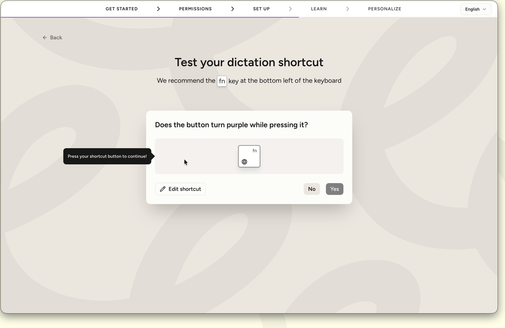

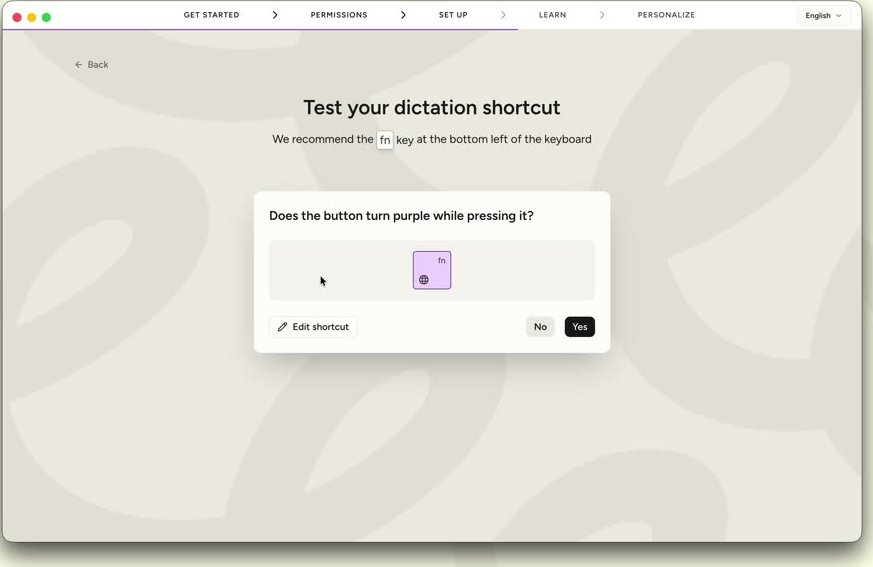

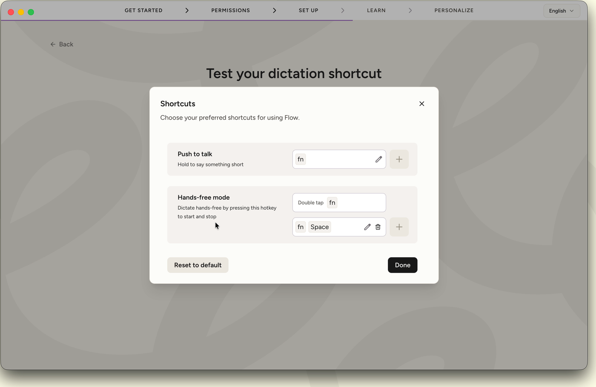

The current rehearsal is the wrong surface for this. `OnboardingHotkeyPreviewController` suspends the real hotkey and shows the production overlay, with a waveform and no transcript. Nothing in the onboarding card reacts. “Try it now” reads as a hint next to a static key drawing. Wispr’s card is the control: the key itself is the thing that changes color, and Edit shortcut is on that card.

Build it like this:

- Draw the hands-free and push-to-talk keys in the card. While the matching key is held, that key lights. On release, it returns to rest. The user should not have to look at a different overlay to know the press landed.
- Continue on this step stays disabled until one of those keys has lit once.
- Edit shortcut opens the real binding UI in this step: push-to-talk, hands-free, reset to default. Changing the binding updates the keys drawn in the card before the user tries again.
- The off-card overlay can stay as a faint extra, or go away. It is not the confirmation.
- This step still does not run speech recognition. Lighting the key only proves the grant and the binding. The dictation box is the next beat, and it waits until the model is actually ready.
- Keep Escape-to-cancel and the undo window as they are.

## 2. Land the first dictation in a field

After the key works, Wispr does not open the home screen. Learn is three short drills. Each one has a fake destination, a sentence to say, a control that tells you how to start and stop, and a result that stays on screen. Every drill has Skip.

The first drill is a message. The field placeholder is “Show what you might do.” The dictated line appears in the thread, then Continue.

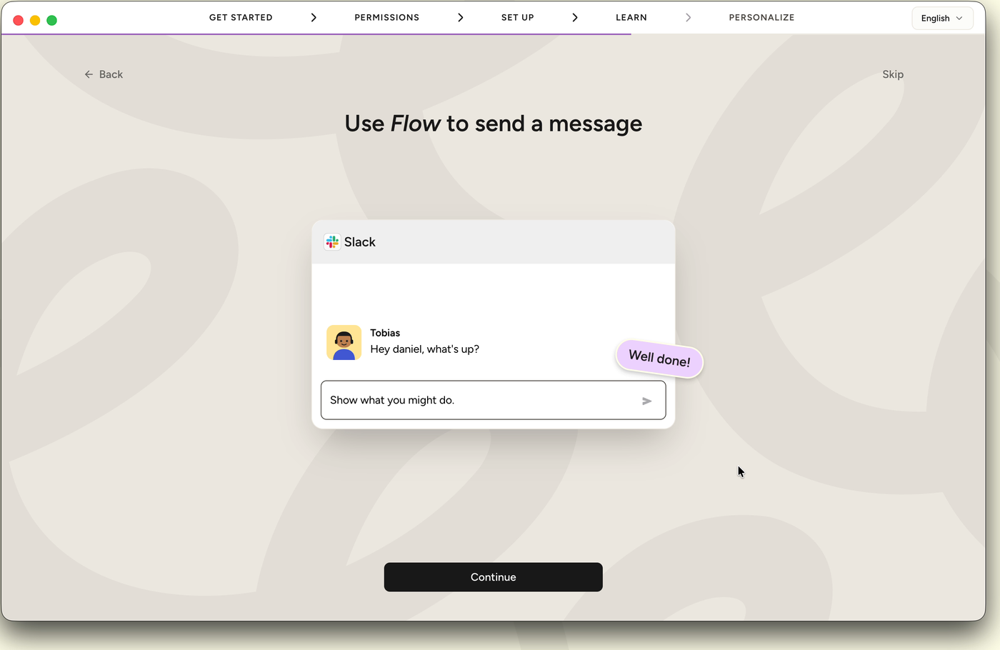

The second drill is the product claim: “Write an email hands free. Flow formats for you and fixes mistakes.” The prompt is a messy line, including “umm” and a self-correction, and it says to tap Fn to finish. When the line lands, the step offers Try again and Continue.

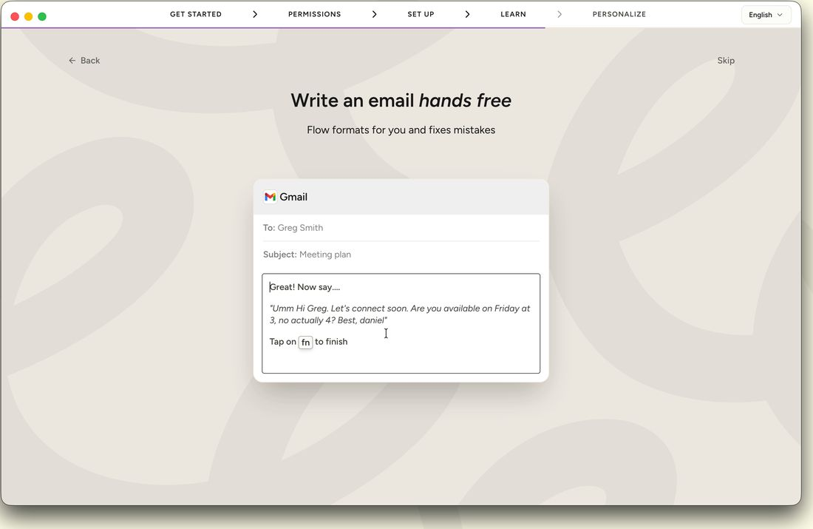

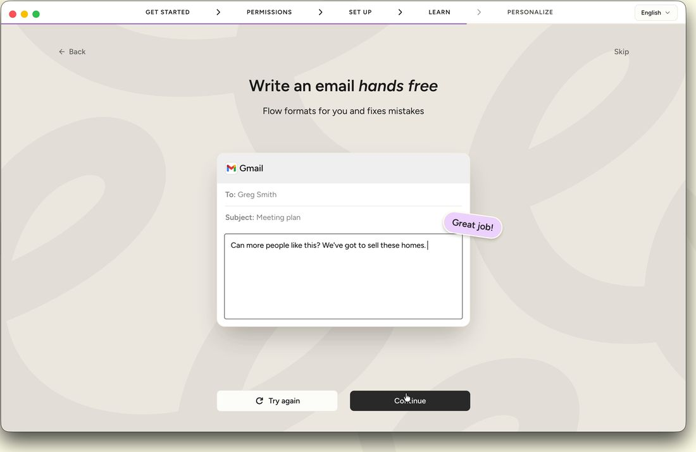

The third drill is “Try whispering a list,” aimed at a quiet microphone and a list shape. Same structure: a script, the key, a field.

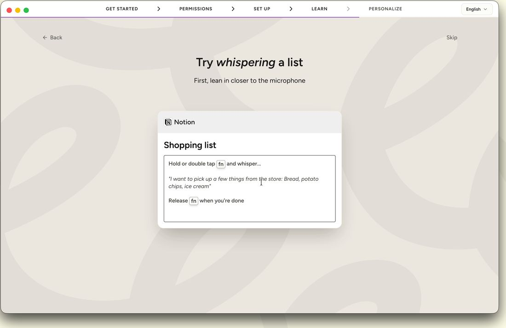

Then a dark screen says “Nice job” and compares “you just spoke” with average typing. That beat is the right shape for a payoff. The later “26 hours a week” card and the Pro referral are a pitch inserted before the user has left the lesson. Do not add those.

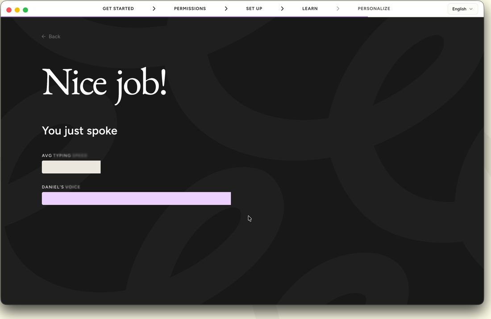

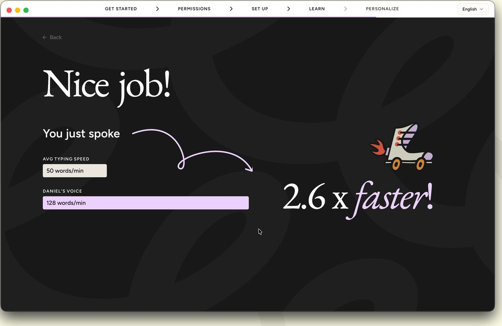

What matters is the structure, not the three brands. Slack, Gmail, and Notion are costumes. MacParakeet should not ship fake Slack or Gmail chrome.

The first dictation also has to wait. Parakeet’s model is hundreds of megabytes, and the engine still has to load after the file is on disk. Today that wait is its own step, and the user is invited to dictate only after All Set, which is when many of them leave. The download should keep running through the permission page and the key rehearsal, which is already how warm-up starts when onboarding opens. The dictation box should not ask for speech until that warm-up reports ready.

Pace it as three visible states of one box, inside onboarding:

1. **Still loading.** The box is there, not clickable as a dictation target. It shows model progress in the same place the text will appear. The hotkey card above it can already be used, because lighting the key does not need the engine. If the user finishes the key rehearsal while the download is still going, they stay on this screen and watch the box. They are not advanced into a dictate prompt that cannot hear them.
2. **Click here.** The engine is ready. The empty box asks for a click. Nothing starts recording on its own. Wispr’s list drill is the reference: the field says “Click into the text field here,” and Skip stays in the corner.

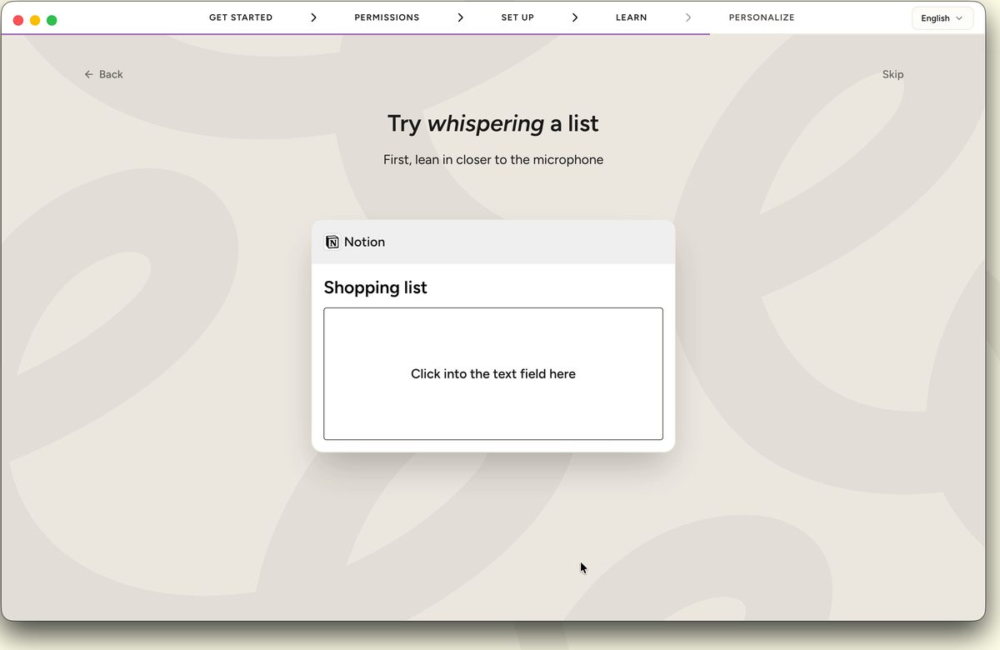

3. **Dictate into this box.** After the click, the box tells them to hold or tap the key they just proved. The email drill is the reference for this beat: the key cap inside the field lights (“Double tap fn”), then the recognized line stays in the field with Try again and Continue. See the two email stills above. Continue waits for one non-empty result. Skip remains, so a failed download can still leave onboarding instead of deadlocking it.

One box is enough. Teach the paste. A second drill that claims “we cleaned up your umms” waits until a real Transform is what that step runs.

This is the direct response to the leak. All Set today is a suggestion to go dictate. This box is the dictation, and it appears only when dictation can succeed.

## 3. One real job before Finish

Wispr then asks “How would you like to use Flow first?” The choices are jobs, not features: chat with AI, take a note, write a message, draft an email, write a post, write a document, prompt Cursor or Windsurf. Try it now opens that job. In the recording, Take a note showed a note with a short list already in it, inside the lesson, before the home screen.

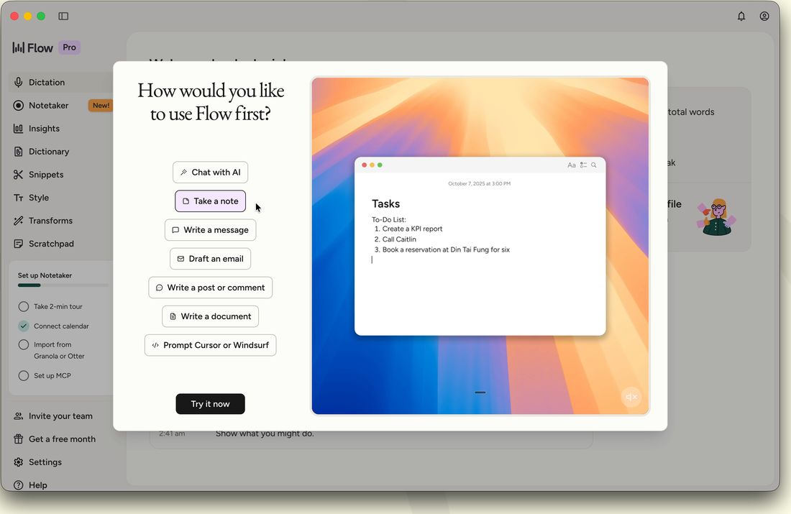

Home is “Try Flow in another app,” not a checklist of permissions. After the window is in the background, a tip remains: “Try using Flow in another app!”

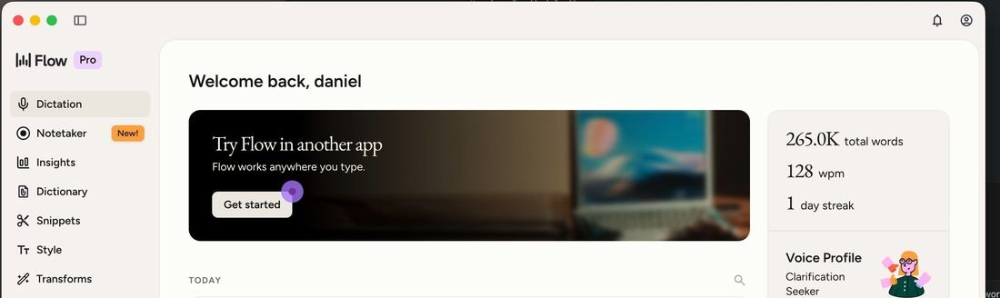

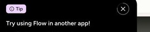

The job list is the useful idea. Opening Apple Notes specifically is not. Notes can be missing, unsynced, or the wrong window, and the recording also passed through the user’s real Notes library on the way. An onboarding step should not depend on another app’s document model.

Adapt it like this:

- After the in-window drill, offer two or three jobs we can actually support on the first run: dictate into the frontmost app, dictate a note into MacParakeet, or dictate a prompt. The frontmost-app path is the product. It should be the default.
- Finish stays available. The job is an invitation with a visible success, not a second permissions wall.
- The after-close tip is worth a single dismissible line near the menu bar or the existing preview pill. One appearance. If they dismiss it or dictate once, it is gone. A permanent coach mark is how this becomes nagging.

“Prompt Cursor or Windsurf” is interesting later, because it is dictation aimed at an agent. It is not the first-run gate. The first-run gate is one paste into a focused field.

## 4. One permissions page, system prompt in view

Wispr does not use a full screen per permission. One page lists three outcomes, each with its own Allow:

- Allow Wispr to recognize meetings
- Allow Wispr to use your microphone. “Capture your voice when Notetaker is active.”
- Allow Wispr to capture meeting audio

The right half of the window shows System Settings. The macOS prompt opens on top of that picture, so the user is not sent away and left to find the app in a list. When the grants are done, the headline becomes a privacy thank-you and Continue appears.

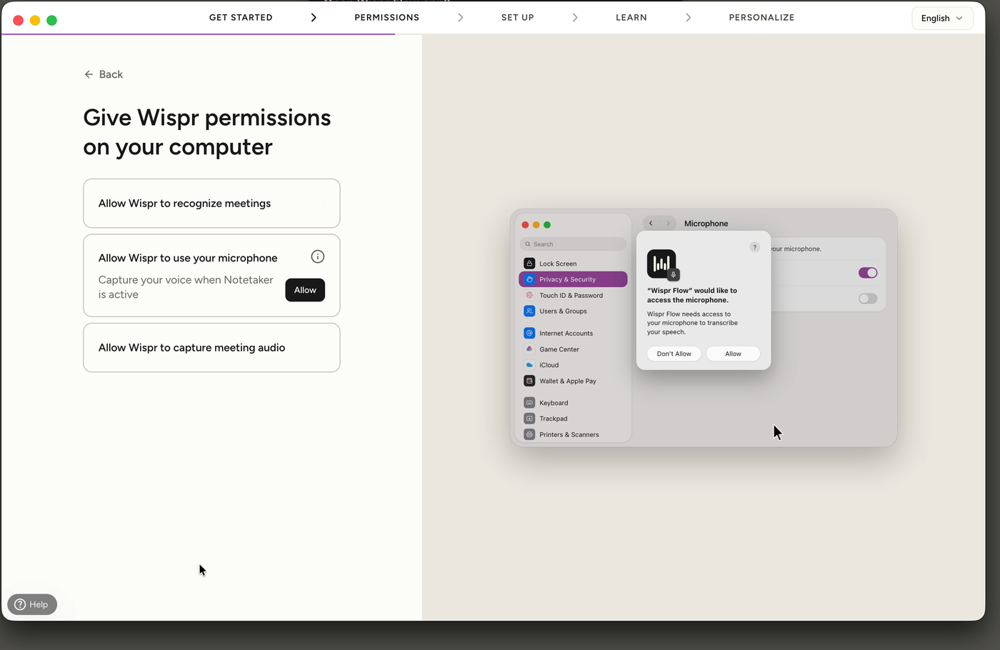

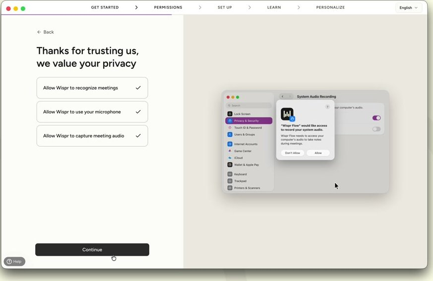

MacParakeet’s Microphone and Accessibility steps are separate, and the copy names the macOS privilege (“Enable Accessibility”) before it names the job. Accessibility’s real reason is already in the subtitle: the global hotkey and paste. That reason should be the title.

Adapt it like this:

- One step, two rows: microphone, and the hotkey/paste grant.
- Microphone stays skippable. The September 16, 2026 amendment to ADR 005 is unchanged: Continue is not gated on the mic, and capture asks again on first use.
- The hotkey grant stays required. Wispr can offer a weaker product without Accessibility. MacParakeet’s hotkey cannot.
- Requesting the grant should leave this window up. If we have to open System Settings, return the user to the same step and show the row flip to granted when the poll sees it. That poll already exists.
- Do not add meeting recognition, system-audio recording, or calendar to this page. Those were removed because the screen-recording step was the largest drop-off, about 24% of people who reached it, and about 90% skipped it.

## Skip, without skipping the essentials

Early in Wispr’s flow a dialog offers “Show me everything” or “Skip onboarding,” and says it will cover the essentials and skip parts already seen. The practice drills also have a Skip in the corner. That corner Skip is visible on the message, email, and list stills above.

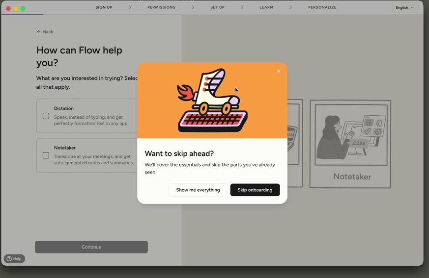

Use that split:

- Accessibility, and a ready speech model, stay on the required path. Skipping them is how dictation fails on the first real attempt.
- The practice field, the job picker, and the after-close tip are skippable.
- If someone has already completed onboarding on this Mac, do not replay the lesson. Wispr’s skip dialog is for people who already know the product. Our equivalent is the existing completion flag.

## Leave these out

These were in the recording. They are Wispr’s cloud product, or a pitch, and they do not repair the hotkey leak. The stills are here so a later change does not treat them as part of the MacParakeet flow.

**Sign-in before any dictation.** MacParakeet is local-first. An account is not required to dictate.

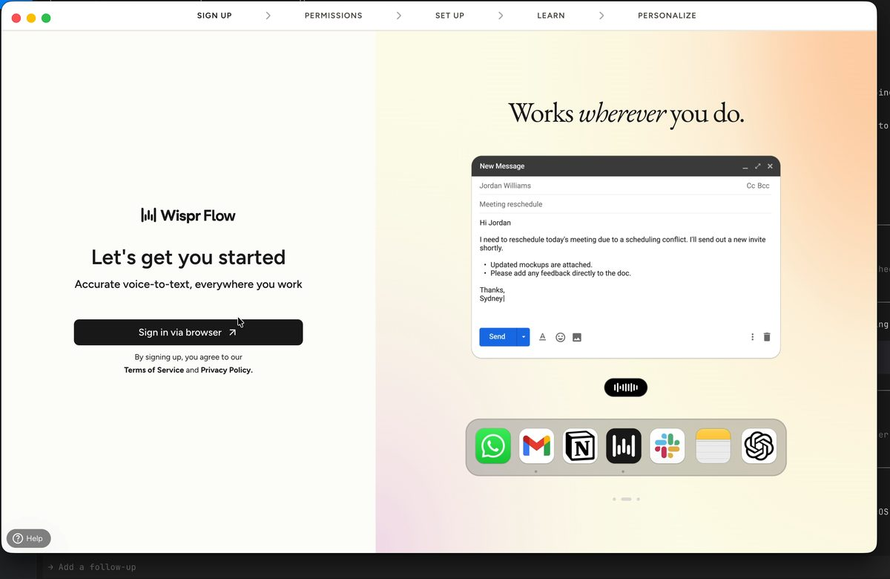

**A survey before the first success.** “How can Flow help you?” and the meeting questions personalize Notetaker. Meeting setup was removed from our first run on purpose.

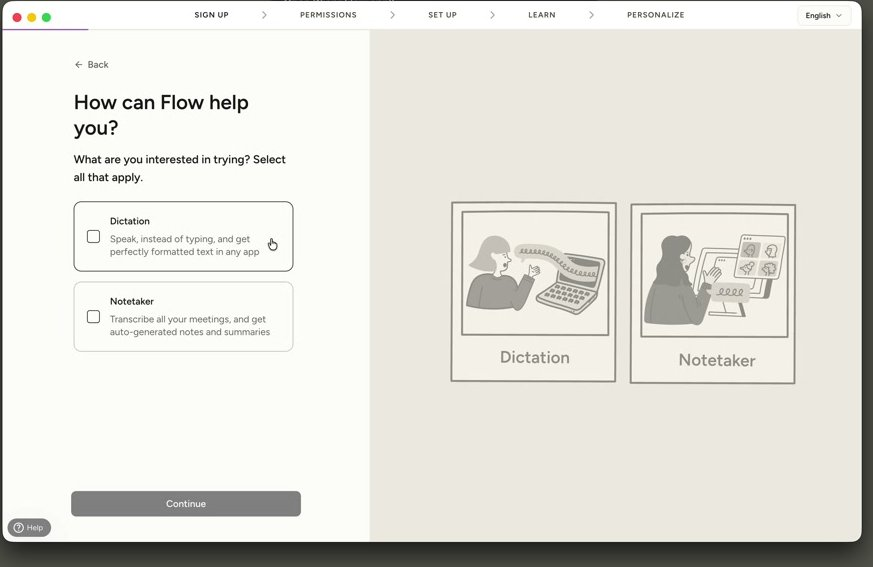

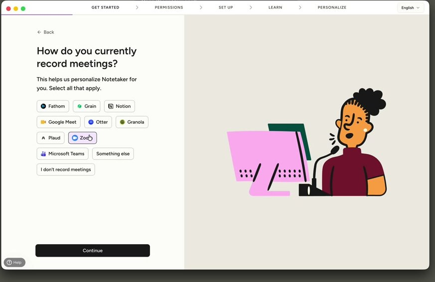

**Calendar connect.** Calendar permission stays on the calendar surface, per ADR 005.

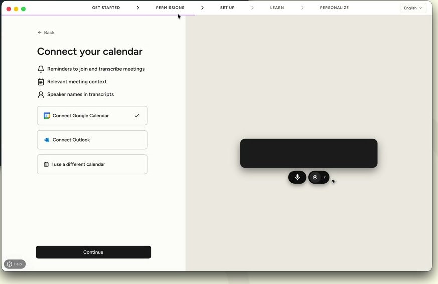

**The hours claim and the Pro referral.** These sit between the first success and the real-app trial. The “you just spoke” still above is the part worth keeping, and only with a number measured from that attempt. The invite link in the referral still is covered.

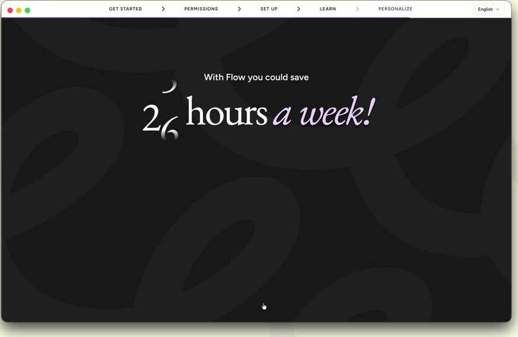

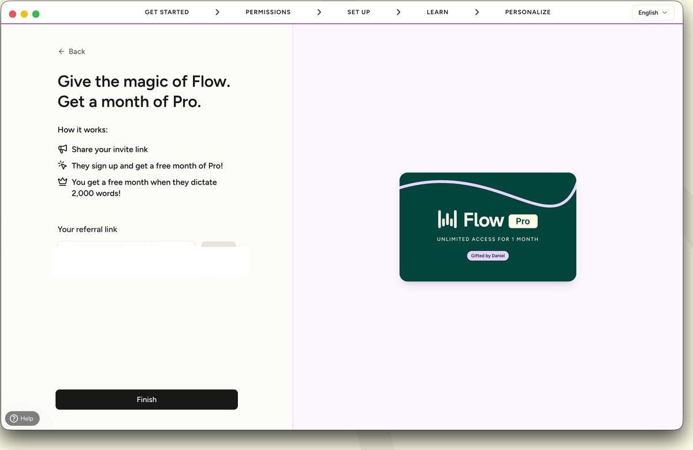

**Fake Slack, Gmail, and Notion windows.** The message, email, and list stills above are the costume. Our drill should look like MacParakeet and a plain text field. Copy the click, the lit key, and the text landing in the field. Do not copy the other apps’ logos.

## Order

1. Welcome. Keep the private-by-default line. Model warm-up starts when this window opens, as it does today.
2. Permissions. One page, two rows. Mic skippable. Hotkey grant required. The download keeps going behind this page.
3. Hotkey, on the same screen as the dictation box. The key lights on press. Edit shortcut is here. Continue for the key waits for one lit press. The box below shows download progress until the engine is ready, then “click here,” then the dictate prompt. Dictation text has to land in the box before All Set, unless the user skips.
4. All Set, after that text exists or the user skips. One line can point them at the frontmost app. Finish closes the window.

There is no separate speech-model step to sit and watch. The wait is the box they are about to type into with their voice. The June 14, 2026 head start still overlaps the download with welcome, permissions, and the key rehearsal.
