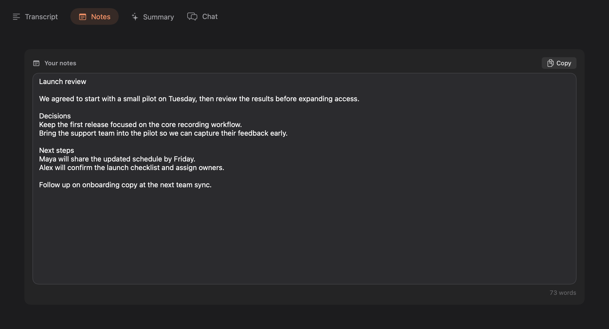
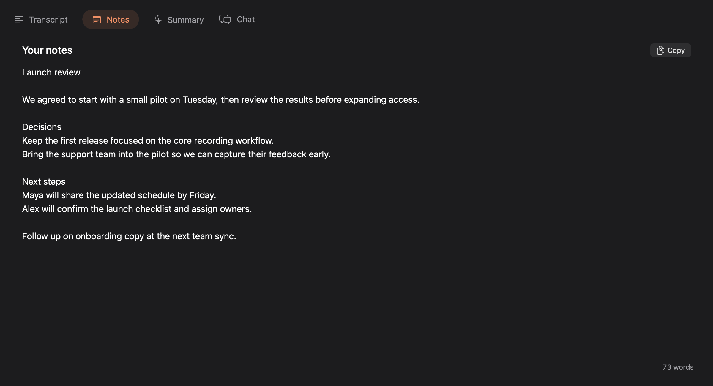

# Saved Notes: an open writing surface

The previous Notes pane nested a bordered editor inside a padded card, with
another 24 pt inset around that card. This made the primary content feel like
a small form field. The new layout removes both containers, recovers that
space, and uses the app’s 15 pt reading font with 5 pt line spacing. The heading,
writing prompt, and native text inset align; the Copy control stays in place
when the editor is empty. Word count now uses the more legible secondary color.

Scope is saved meeting Notes presentation. The meeting-scoped draft binding,
autosave, navigation flush, recovery, deletion guard, copy semantics, and
artifact refresh logic retain their existing ownership and behavior. No new
editor abstraction, text format, preference, or persistence path is introduced.

| Before | After |
| --- | --- |
|  |  |

## Native component verification

These are native SwiftUI component captures using synthetic notes. A temporary
macOS fixture compiled the actual `meetingNotesSection` and save-status view
bodies from the branch with the repository’s DesignSystem and action styles.
Data and persistence dependencies were fixture substitutes. The surrounding tab
strip is fixture chrome, not a capture of the running application.

- At 1200 × 650 pt, the native editor viewport grew from 1056 × 402 pt to
  1136 × 482 pt: 80 pt more in each direction.
- [Compact light appearance](compact.png): at 620 × 420 pt, the editor adapts
  to 556 × 252 pt and the word count stays visible.
- [Empty dark appearance](empty.png): the writing prompt aligns with the text
  insertion point; Copy is disabled and retains its position.
- The NSTextView reported 15 pt type and 5 pt paragraph line spacing.
- Typing through NSTextView updated the SwiftUI binding in populated, empty,
  compact, and 7,501-word states. Scroll-to-end completed in each case.
- At 500 × 300 pt, the soft-cap warning and failed-save Retry control remained
  visible while the editor compressed to 436 × 118 pt.
- Independent correctness and maintainability reviews found no actionable issues.

Full application build, database autosave, a VoiceOver pass, and integrated
navigation were not exercised by this fixture. Hint text, the writing prompt,
Copy eligibility, and Copied-confirmation reset are covered by
`SavedMeetingNotesEditorPresentationTests`. Local disk space was below 3 GB
when the fixture was captured, so the full dependency build and test suite are
delegated to PR CI. Existing notes persistence tests remain the regression
coverage for autosave.
