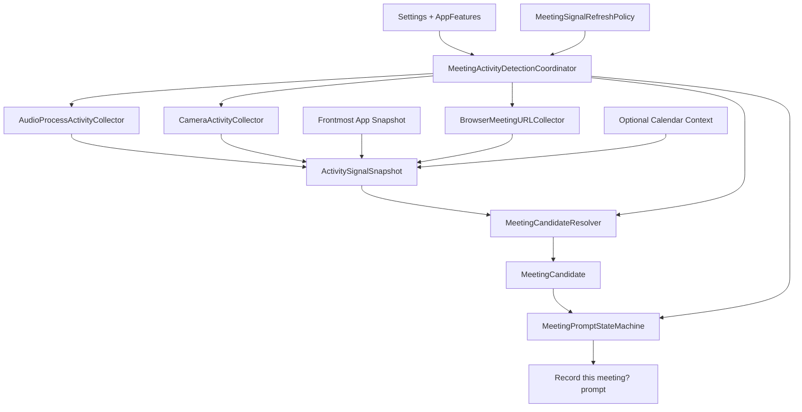
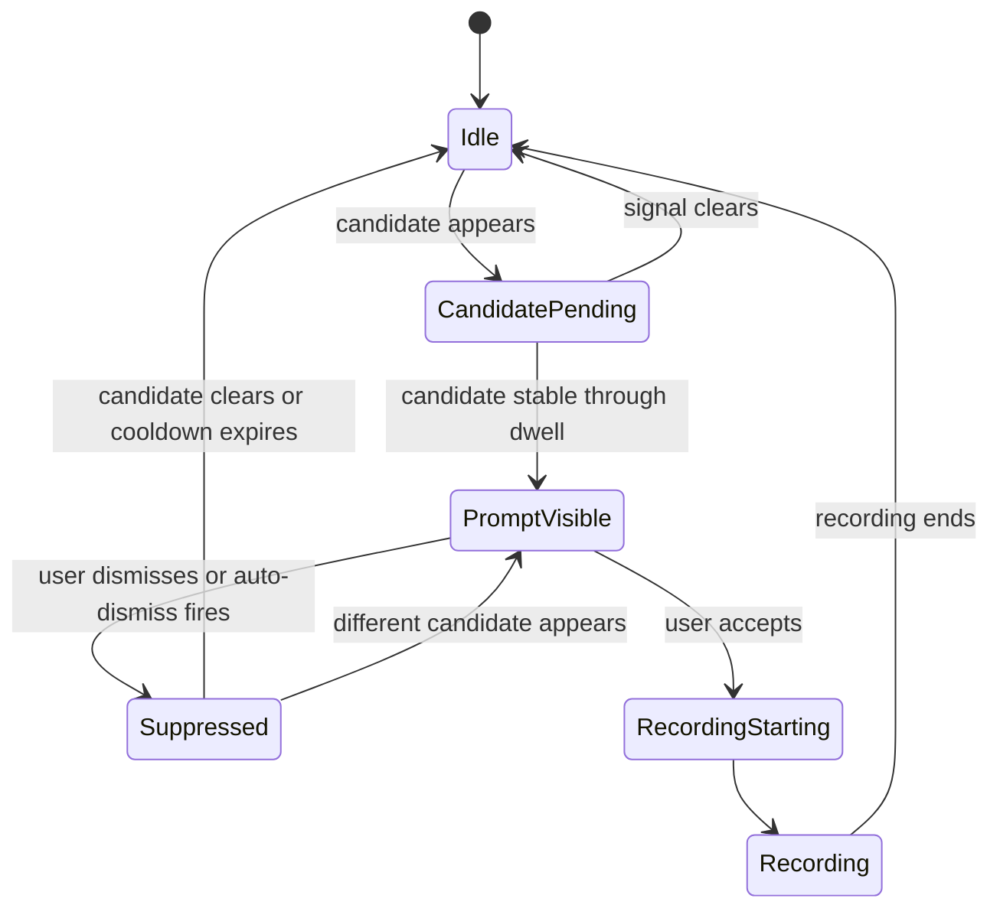

# Rich Meeting Activity Detection Plan

## Summary

Complete ADR-024 Phase C by upgrading meeting activity detection from a coarse
app/camera identity into a rich meeting-candidate pipeline. The shipped behavior
should know when possible: the platform, normalized meeting room identity,
source app/process, evidence used, and the suppression identity to avoid
re-prompting after "Not now".

This plan keeps the current default-off posture. It does not flip
`AppFeatures.meetingActivityDetectionEnabled`.

The implementation should be first-principles rather than purely additive. If
the current coarse detector shape becomes a worse foundation than replacing it
with candidate resolution, refactor it cleanly instead of preserving it for
compatibility that no runtime consumer depends on yet.

---

## Problem Frame

The current PR stack gives MacParakeet the right foundation: per-process audio
activity, global camera activity, a trust-tiered app registry, a pure detector,
auto-stop policy, and mic-health monitoring. That foundation is not enough for
the desired user experience.

The desired product behavior is not "Chrome seems active." It is closer to
"Google Meet in Chrome, room `abc-defg-hij`, with mic plus browser URL plus
source-process evidence; if dismissed, do not ask again for this same meeting."

That requires a richer domain model, browser URL collection, prompt/session
suppression, and a runtime refresh policy before the feature is exposed.

---

## Verified Baseline

- ADR-024 already defines the intended final shape: metadata-only detection,
  stabilization dwell, decline cooldown, browser URL recognition, coordinator
  wiring, prompt telemetry, and staged rollout.
- REQ-MEET-016 is active and explicitly says Phases A+B are only the
  default-off foundation.
- `Sources/MacParakeetCore/MeetingDetection/ActivitySignalSnapshot.swift`
  currently carries `hasRecognizedMeetingURL` as a boolean, not a room identity.
- `Sources/MacParakeetCore/MeetingDetection/MeetingActivityDetector.swift`
  currently returns `MeetingIdentity(source: .app/.camera, app: MeetingApp?)`,
  which is too coarse for same-session suppression or evidence explanations.
- No `MeetingActivityDetectionCoordinator`, prompt state machine, or browser
  URL collector exists yet.
- At plan creation on 2026-06-14, PRs #522, #523, #524, and #525 had all
  reached `main`.

---

## Requirements

**Architecture Quality**

- R1. The implementation must model the real domain boundary: signal collection,
  candidate resolution, prompt policy, and UI/runtime coordination are separate
  concerns.
- R2. Refactoring existing Phase A+B types is allowed when it produces a
  simpler candidate-centered base before the feature has runtime consumers.
- R3. The implementation must avoid speculative abstractions, background
  services, or tunables that are not needed for prompt-mode detection.

**Candidate Identity**

- R4. Detection must produce a rich `MeetingCandidate` with platform, display
  name, optional normalized URL identity, evidence, source bundle ID, source
  PID, and suppression ID.
- R5. Browser meetings must preserve room-level identity when the URL is known,
  including stable normalization that strips volatile query parameters.
- R6. App-only and browser-audio-only meetings must get stable session IDs for a
  contiguous audio session, then reset after an idle gap.

**Signal Quality**

- R7. Detection must continue to reject mic-only, camera-only, output-only, and
  self-owned signals.
- R8. Browser detection must use URL metadata only and degrade to no URL signal
  when permissions or platform APIs fail.
- R9. Expensive signal collection must be throttled by an idle/suspicious
  refresh policy so the feature adds near-zero idle work.

**Prompt Behavior**

- R10. Prompt visibility must be driven by a prompt state machine separate from
  signal resolution.
- R11. User dismissal must suppress the same meeting session without suppressing
  a later different meeting.
- R12. Auto-dismiss behavior must avoid immediate re-prompting and use a shorter
  cooldown for browser URL candidates than for stable app/audio sessions.
- R13. Active recording, recording-starting, and calendar prompt states must
  block activity prompts.

**Rollout and Privacy**

- R14. The feature remains hidden and inactive when
  `AppFeatures.meetingActivityDetectionEnabled` is false or the user mode is
  `.off`.
- R15. Telemetry must use only coarse enums and never emit raw URLs, bundle IDs,
  process IDs, titles, or transcript/audio content.
- R16. The implementation must preserve existing manual recording, calendar
  auto-start, auto-stop, and mic-health behavior.

---

## Key Technical Decisions

- KTD1. Introduce `MeetingCandidate` as the central contract: the coordinator,
  prompt state, telemetry, and tests need evidence and suppression identity, not
  just `MeetingIdentity`.
- KTD2. Refactor around the candidate model rather than adapting the old coarse
  identity shape: Phase A+B have no runtime consumer yet, so this is the right
  time to make the base correct.
- KTD3. Keep platform collectors separate from pure resolution: browser URL,
  audio process, camera, frontmost app, and calendar context are gathered by
  adapters; candidate resolution stays deterministic and unit-testable.
- KTD4. Normalize meeting URLs into stable IDs before they enter suppression or
  telemetry decisions: raw URLs are too noisy and can carry unnecessary query
  parameters.
- KTD5. Put browser URL collection in the app/platform layer, but keep its data
  model in Core: URL probing uses macOS APIs and permission-sensitive behavior,
  while candidate resolution should remain Core-testable.
- KTD6. Add an idle/suspicious refresh policy before starting runtime observers:
  rich detection requires more signals, and the policy is what keeps the feature
  cheap at rest.
- KTD7. Keep prompt state separate from candidate resolution: resolving "what is
  happening?" and deciding "should we ask now?" are different policies with
  different tests.
- KTD8. Treat browser active-tab probing as optional and throttled: AX document
  URL should be the first path; fallback probing must never relaunch browsers or
  block the main actor.
- KTD9. Do not parse private Control Center sensor logs in this phase: ADR-024
  chose public metadata APIs, and the current product need can be met without
  private log-stream dependencies.
- KTD10. Prefer fewer durable types over many knobs: if a setting, enum case, or
  protocol has no immediate runtime or test consumer, defer it.

---

## High-Level Technical Design

---

## Scope Boundaries

### In Scope

- Rich candidate data model and resolver.
- Stable meeting URL normalization for browser meetings.
- Browser URL collector with AX document URL and optional active-tab fallback.
- Prompt state machine with dwell and same-session suppression.
- Runtime coordinator for `.prompt` mode.
- Privacy-safe telemetry and debug logging.
- Focused test expansion around false positives, suppression, browser URLs, and
  runtime gating.

### Deferred to Follow-Up Work

- `.autoStart` mode for activity detection.
- Feeding rich activity candidates into ADR-023 auto-stop attribution.
- Any website telemetry allowlist deploy, if new emitted event names are added.
- Persisting detection debug history in the user database.
- Private or undocumented camera/mic attribution APIs.

### Out of Scope

- Screen capture, OCR, transcript inspection, or reading page content.
- Cloud calls for detection.
- Changing manual recording, calendar auto-start, or meeting finalization flows.
- Flipping the feature flag on for users.

---

## Implementation Units

### U1. Add Rich Candidate and URL Identity Types

- **Goal:** Create the Core data model needed to represent a real meeting
  candidate instead of a coarse app/camera identity.
- **Requirements:** R1, R2, R4, R5, R6, R15.
- **Dependencies:** None.
- **Files:**
  - `Sources/MacParakeetCore/MeetingDetection/MeetingCandidate.swift`
  - `Sources/MacParakeetCore/MeetingDetection/MeetingURLIdentity.swift`
  - `Sources/MacParakeetCore/MeetingDetection/ActivitySignalSnapshot.swift`
  - `Sources/MacParakeetCore/Calendar/MeetingLinkParser.swift`
  - `Tests/MacParakeetTests/MeetingDetection/MeetingURLIdentityTests.swift`
- **Approach:** Add `MeetingCandidate`, `MeetingCandidate.Evidence`,
  `BrowserMeetingContext`, and `MeetingURLIdentity`. Keep raw URL handling out
  of telemetry-facing types. Extend `ActivitySignalSnapshot` from a boolean
  `hasRecognizedMeetingURL` to optional browser meeting contexts while keeping
  a compatibility initializer if it reduces churn.
- **Patterns to follow:** Existing `Sendable` value types in
  `Sources/MacParakeetCore/MeetingDetection/ActivitySignalSnapshot.swift`;
  existing URL service detection in `Sources/MacParakeetCore/Calendar/MeetingLinkParser.swift`.
- **Test scenarios:**
  - Google Meet URL with query parameters normalizes to a stable room ID.
  - Google Meet landing pages and malformed paths return no meeting identity.
  - Zoom join URLs normalize without preserving `pwd` or tracking query params.
  - Teams and Webex URLs produce stable platform identities.
  - Raw URLs are not required to build telemetry-safe summaries.
- **Verification:** URL identity tests prove stable IDs and rejection cases
  without using browser or app APIs.

### U2. Replace Coarse Detection with Candidate Resolution

- **Goal:** Resolve the best current meeting candidate from the signal snapshot,
  including evidence, source attribution, and same-session suppression identity.
- **Requirements:** R1, R2, R4, R5, R6, R7.
- **Dependencies:** U1.
- **Files:**
  - `Sources/MacParakeetCore/MeetingDetection/MeetingCandidateResolver.swift`
  - `Sources/MacParakeetCore/MeetingDetection/MeetingActivityDetector.swift`
  - `Sources/MacParakeetCore/MeetingDetection/MeetingAppRegistry.swift`
  - `Tests/MacParakeetTests/MeetingDetection/MeetingCandidateResolverTests.swift`
  - `Tests/MacParakeetTests/MeetingDetection/MeetingActivityDetectorTests.swift`
- **Approach:** Move app/browser/camera fusion into a pure resolver. Keep
  `MeetingActivityDetector.evaluate(...)` as the policy facade, but make it
  operate on candidates. Preserve the conservative false-positive rules:
  mic required, camera alone rejected, output-only rejected, Slack requires
  full duplex, and browser requires a focused URL or attributed browser input.
- **Patterns to follow:** Current pure detector tests in
  `Tests/MacParakeetTests/MeetingDetection/MeetingActivityDetectorTests.swift`;
  app tiers in `MeetingAppRegistry`.
- **Test scenarios:**
  - Dedicated app holding mic resolves to an app candidate with source bundle ID
    and source PID when available.
  - Slack input-only does not resolve; Slack full-duplex resolves.
  - Browser helper process with mic input resolves to the parent browser and
    preserves the source PID.
  - Focused browser meeting URL resolves before mic/camera flips active.
  - Background browser URL without browser audio does not beat foreground Zoom.
  - Output-only browser or dedicated app process does not resolve.
  - Synthetic PID `0` is not exposed as a source PID.
  - Same browser/app audio session keeps the same suppression ID across a short
    gap and gets a new one after the idle timeout.
- **Verification:** Candidate resolver tests cover the full false-positive
  matrix before any runtime coordinator exists.

### U3. Add Browser Meeting URL Collector

- **Goal:** Populate browser meeting contexts from browser URL metadata so
  candidates can identify actual rooms instead of only "browser".
- **Requirements:** R5, R8, R9, R15.
- **Dependencies:** U1.
- **Files:**
  - `Sources/MacParakeet/App/MeetingActivity/BrowserMeetingURLCollector.swift`
  - `Sources/MacParakeet/App/MeetingActivity/RunningApplicationSnapshot.swift`
  - `Tests/MacParakeetTests/MeetingActivity/BrowserMeetingURLCollectorTests.swift`
  - `Tests/MacParakeetTests/Calendar/MeetingLinkParserTests.swift`
- **Approach:** Probe browser window document URLs via Accessibility metadata
  first. Add an optional, throttled active-tab fallback only for an allowlist of
  browsers that can be addressed by existing process ID without relaunching.
  Cache recent positive room identities with a short TTL, and clear cache on a
  focused non-meeting URL.
- **Patterns to follow:** `MeetingLinkParser` for service recognition;
  `MeetingAutoStartCoordinator` for app-layer macOS observer ownership; existing
  test injection style in calendar coordinator tests.
- **Test scenarios:**
  - AX document URL returns a focused browser meeting context.
  - Focused non-meeting document clears a cached meeting.
  - Inconclusive or timed-out fallback reuses a recent cache only within TTL.
  - Throttled fallback does not clear a known room unless a fresh non-meeting
    result is observed.
  - Permission/API failure produces no URL signal and no thrown error.
  - Fallback targets an existing process ID and never relaunches a browser.
  - Browser allowlist stays aligned with `MeetingAppRegistry.browserBundleIDs`.
- **Verification:** Collector tests use injected providers and do not require
  Accessibility permission in CI.

### U4. Add Signal Refresh Policy and Collector Hardening

- **Goal:** Control when expensive collectors run and harden existing listener
  lifecycle before runtime wiring.
- **Requirements:** R7, R8, R9, R14.
- **Dependencies:** U1, U2, U3.
- **Files:**
  - `Sources/MacParakeetCore/MeetingDetection/MeetingSignalRefreshPolicy.swift`
  - `Sources/MacParakeetCore/MeetingDetection/AudioProcessActivityCollector.swift`
  - `Sources/MacParakeetCore/MeetingDetection/CameraActivityCollector.swift`
  - `Tests/MacParakeetTests/MeetingDetection/MeetingSignalRefreshPolicyTests.swift`
  - `Tests/MacParakeetTests/MeetingDetection/AudioProcessActivityCollectorTests.swift`
  - `Tests/MacParakeetTests/MeetingDetection/CameraActivityCollectorTests.swift`
- **Approach:** Add an idle/suspicious policy that decides whether to refresh
  audio attribution and browser URLs on each trigger. Suspicious mode is entered
  by mic/camera changes, recent browser URL, active candidate, prompt visible,
  calendar context, or meeting-capable foreground app. Also add an audio
  collector lifecycle guard matching the camera collector generation pattern so
  late process-list callbacks cannot reinstall listeners after `stop()`.
- **Patterns to follow:** Generation and `stateHandler` guards in
  `CameraActivityCollector`; timer/coalescing patterns in app coordinators.
- **Test scenarios:**
  - Idle fallback skips audio and browser refresh.
  - Mic change enters suspicious mode and refreshes audio immediately.
  - Active candidate or prompt keeps suspicious mode alive.
  - Suspicion expires back to idle after TTL.
  - Browser fallback is throttled per browser bundle ID.
  - `AudioProcessActivityCollector.stop()` prevents late process-list callbacks
    from reinstalling per-process listeners.
  - Camera collector lifecycle tests remain green.
- **Verification:** Refresh policy is pure and covered by deterministic tests;
  collector tests cover stop/start races without relying on real devices.

### U5. Add Prompt State Machine and Suppression Semantics

- **Goal:** Decide when to show, hide, or suppress the activity prompt using
  candidate-level state rather than raw signal changes.
- **Requirements:** R10, R11, R12, R13.
- **Dependencies:** U1, U2.
- **Files:**
  - `Sources/MacParakeetCore/MeetingDetection/MeetingActivityPromptStateMachine.swift`
  - `Tests/MacParakeetTests/MeetingDetection/MeetingActivityPromptStateMachineTests.swift`
- **Approach:** Keep prompt policy pure. Track visible prompt ID, pending
  candidate dwell start, user-dismissed suppression IDs, and auto-dismiss
  suppression IDs with expiries. Block prompts while detection is disabled,
  recording is active, recording is starting, or a calendar meeting prompt is
  visible.
- **Patterns to follow:** Current pure `MeetingActivityDetector.evaluate(...)`
  style; `MeetingAutoStopPolicy` for side-effect-free state evaluation.
- **Test scenarios:**
  - Candidate must remain stable through dwell before prompt is shown.
  - Candidate change restarts dwell.
  - User dismissal suppresses the same suppression ID.
  - Dismissal of one URL candidate does not suppress a different room URL.
  - App/audio session suppression survives candidate dropout during the same
    session.
  - Browser URL auto-dismiss expires after cooldown.
  - Recording and starting-recording states hide or block prompts.
  - Calendar notification visibility blocks activity prompt without mutating
    suppression state.
- **Verification:** Prompt state machine tests prove non-nagging behavior
  without app UI.

### U6. Add Runtime Coordinator for Prompt Mode

- **Goal:** Wire collectors, refresh policy, candidate resolver, prompt state,
  and recording flow into a default-off app coordinator.
- **Requirements:** R8, R9, R10, R11, R13, R14, R16.
- **Dependencies:** U1, U2, U3, U4, U5.
- **Files:**
  - `Sources/MacParakeet/App/MeetingActivity/MeetingActivityDetectionCoordinator.swift`
  - `Sources/MacParakeet/App/AppEnvironmentConfigurer.swift`
  - `Sources/MacParakeet/App/MeetingRecordingFlowCoordinator.swift`
  - `Sources/MacParakeetCore/AppNotifications.swift`
  - `Tests/MacParakeetTests/MeetingActivity/MeetingActivityDetectionCoordinatorTests.swift`
- **Approach:** Add a `@MainActor` coordinator that starts only when the compile
  flag and user mode allow it. It owns event observers, coalesced evaluations,
  collector start/stop, and prompt callbacks. It does not own recording logic;
  accepting a prompt calls the existing recording flow through injected
  closures.
- **Patterns to follow:** `MeetingAutoStartCoordinator` for observer ownership
  and reentrancy coalescing; `MeetingAutoStopCoordinator` for recording-active
  observation gating and countdown integration.
- **Test scenarios:**
  - Compile flag false or mode `.off` constructs no collectors and registers no
    observers.
  - Switching mode to `.off` stops collectors and hides prompts.
  - Active recording stops or blocks detection observation.
  - Candidate accepted routes to recording flow once.
  - Candidate declined suppresses that candidate and keeps observation alive.
  - Duplicate signal bursts coalesce into one evaluation.
  - Calendar prompt visibility suppresses activity prompt.
  - Stop/deinit removes observers and timers.
- **Verification:** Coordinator tests use injected collectors/providers and do
  not require real browser, audio, camera, or UI resources.

### U7. Add Prompt UI, Settings, and Telemetry

- **Goal:** Make `.prompt` mode user-visible behind the existing feature flag
  with privacy-safe instrumentation.
- **Requirements:** R10, R11, R12, R13, R14, R15, R16.
- **Dependencies:** U5, U6.
- **Files:**
  - `Sources/MacParakeetCore/MeetingDetection/MeetingActivityDetectionMode.swift`
  - `Sources/MacParakeetCore/AppRuntimePreferences.swift`
  - `Sources/MacParakeetCore/Services/Telemetry/TelemetryEvent.swift`
  - `Sources/MacParakeetViewModels/SettingsViewModel.swift`
  - `Sources/MacParakeetViewModels/SettingsSearchIndex.swift`
  - `Sources/MacParakeet/Views/Settings/SettingsView.swift`
  - `Sources/MacParakeet/Views/MeetingRecording/MeetingActivityPromptController.swift`
  - `Sources/MacParakeet/Views/MeetingRecording/MeetingActivityPromptView.swift`
  - `Tests/MacParakeetTests/ViewModels/SettingsViewModelTests.swift`
  - `Tests/MacParakeetTests/ViewModels/SettingsSearchIndexTests.swift`
  - `Tests/MacParakeetTests/MeetingActivity/MeetingActivityPromptControllerTests.swift`
- **Approach:** Persist a user mode with default `.off`, hide controls when the
  compile flag is false, and keep `.autoStart` unavailable unless explicitly
  included in a later phase. Prompt UI should show service/app display name and
  a concise action, not raw URLs or PIDs. Telemetry should record only coarse
  source and category enums.
- **Patterns to follow:** Existing settings persistence for
  `meetingAutoStopEnabled`; `MeetingCountdownToastController` for non-activating
  floating surfaces; telemetry enum patterns in `TelemetryEvent`.
- **Test scenarios:**
  - Setting defaults to `.off` for fresh and existing defaults.
  - Setting posts the meeting activity settings notification when changed.
  - Settings UI/search index hides entries when feature flag is false.
  - Telemetry payload contains only coarse source/category enums.
  - Prompt UI accept and decline callbacks fire exactly once.
  - Prompt displays normalized service/app text without raw URL query params.
- **Verification:** Settings and UI tests prove default-off rollout and safe
  telemetry before feature exposure.

### U8. Add End-to-End False-Positive and Manual QA Matrix

- **Goal:** Prove the rich detector behaves safely in realistic meeting and
  non-meeting scenarios before considering a flag flip.
- **Requirements:** R7, R8, R9, R11, R13, R14, R15, R16.
- **Dependencies:** U1 through U7.
- **Files:**
  - `Tests/MacParakeetTests/MeetingActivity/MeetingActivityIntegrationTests.swift`
  - `spec/adr/024-activity-based-meeting-detection.md`
  - `docs/qa/meeting-activity-detection.md`
- **Approach:** Add a small integration-style test layer over fake collectors
  and document a manual QA matrix for real OS behavior. Update ADR-024 and
  the narrative specs only after implementation lands.
- **Patterns to follow:** Existing coordinator integration tests under
  `Tests/MacParakeetTests/Calendar` and
  `Tests/MacParakeetTests/MeetingRecordingFlow`.
- **Test scenarios:**
  - Zoom mic input prompts once after dwell; decline prevents re-prompt for the
    same session.
  - Google Meet in Chrome with known room URL prompts with room-level
    suppression.
  - Dismissing one Meet room does not suppress a different Meet room.
  - Slack idle/open does not prompt; Slack full-duplex call prompts.
  - Photo Booth camera-only does not prompt.
  - Browser microphone on a non-meeting page does not prompt.
  - Browser URL permission denied degrades to no URL signal and no crash.
  - Manual recording and calendar countdown suppress activity prompt.
  - Feature flag off produces no runtime observation.
- **Verification:** Full `swift test` passes; manual QA confirms no repeated
  prompt after dismissing the same meeting and no idle CPU regression at rest.

---

## Phased Delivery

1. Candidate core: U1 and U2.
2. Signal acquisition and cost control: U3 and U4.
3. Prompt policy and runtime: U5 and U6.
4. User surface and rollout safety: U7 and U8.

Do not flip the feature flag until all four phases are complete and the manual
QA matrix is clean.

---

## Risks and Mitigations

- **False positives erode trust.** Mitigate with conservative candidate
  resolution, same-session suppression, and explicit false-positive tests.
- **Browser APIs can be flaky or permission-sensitive.** Mitigate by treating
  browser URL as optional evidence and degrading to no URL signal.
- **Idle CPU can regress.** Mitigate with idle/suspicious refresh policy,
  listener teardown, and a manual idle measurement before flag-on.
- **Telemetry can accidentally leak sensitive identifiers.** Mitigate by using
  enum-only payloads and adding tests that reject raw URL, PID, bundle ID, and
  title fields.
- **Coordinator can duplicate prompts under bursty macOS events.** Mitigate
  with coalesced evaluation, prompt state reconciliation, and duplicate-burst
  tests.

---

## Documentation and Rollout Notes

- Update ADR-024 only after the implementation lands, not before.
- Update the narrative specs once Phase C is actually implemented.
- Add `docs/qa/meeting-activity-detection.md` with the real-device test matrix.
- Keep `AppFeatures.meetingActivityDetectionEnabled = false` until targeted
  tests, full `swift test`, and manual QA pass.
- If new telemetry event names are emitted, deploy the telemetry allowlist
  update before shipping an app build that can send those names.

---

## Sources and Local Patterns

- `spec/adr/024-activity-based-meeting-detection.md` defines the intended
  activity-detection architecture and staged rollout.
- The legacy `REQ-MEET-016` entry is historical; current status belongs in
  ADR-024 and the narrative specs.
- `Sources/MacParakeetCore/MeetingDetection/MeetingActivityDetector.swift`
  shows the current coarse detector contract that this plan replaces.
- `Sources/MacParakeetCore/MeetingDetection/CameraActivityCollector.swift`
  provides the listener lifecycle pattern to mirror for audio hardening.
- `Sources/MacParakeet/App/MeetingAutoStartCoordinator.swift` and
  `Sources/MacParakeet/App/MeetingAutoStopCoordinator.swift` provide the
  app-layer coordinator patterns to follow.
- `Sources/MacParakeetCore/Calendar/MeetingLinkParser.swift` provides the
  existing meeting URL recognition surface.
