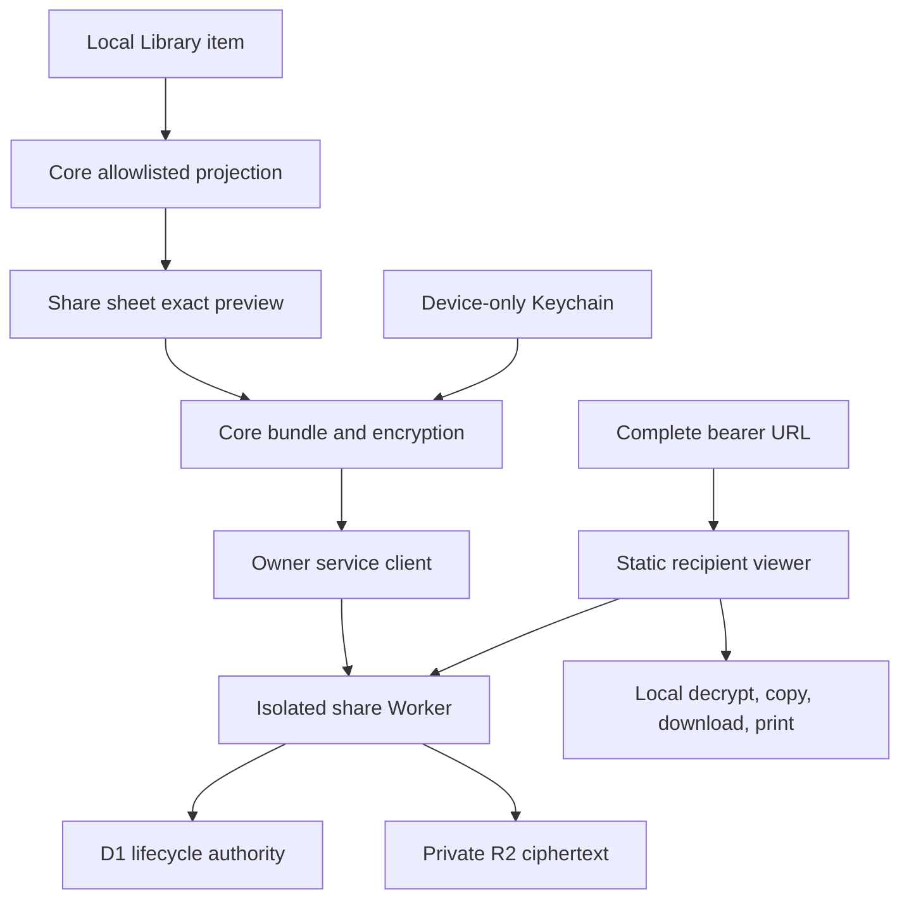
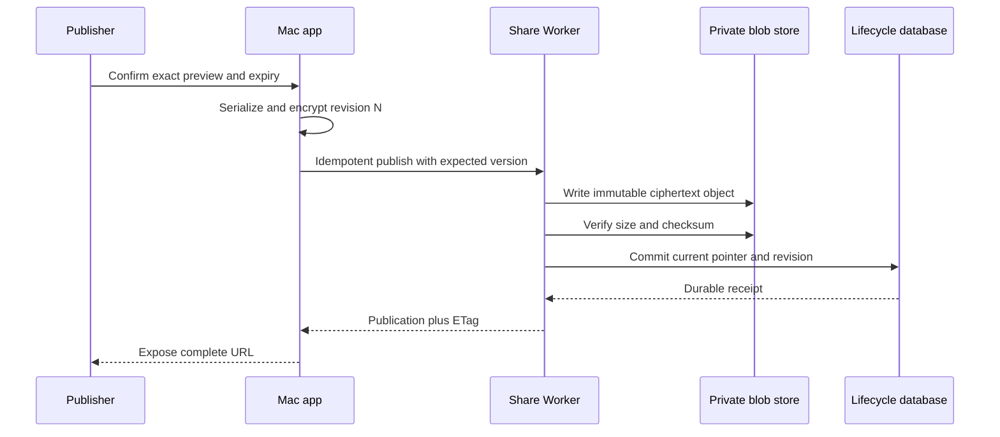
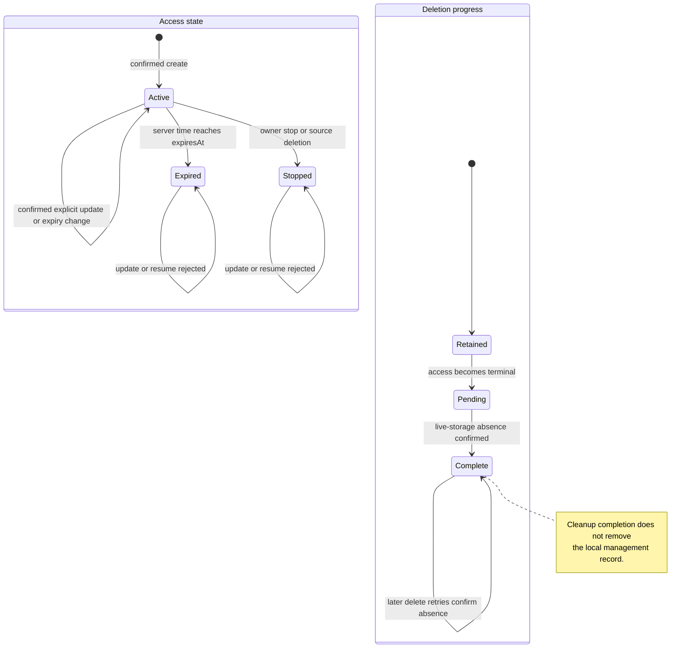

# Shareable Transcript Snapshots - Plan

## Goal Capsule

- **Objective:** A MacParakeet user can publish selected transcript-derived text as a private, expiring web page that is easy to send and remains under the publisher's control.
- **Means:** Add an explicit encrypted-snapshot sharing surface at `share.macparakeet.com` with anonymous owner management and accountless recipient access (KTD1-KTD7).
- **Product authority:** This plan governs the Mac app sharing flow, recipient viewer, anonymous owner lifecycle, and hosted share service required for read-only v1.
- **Execution profile:** Land coordinated app-repository and website-repository changes behind a default-off app flag; deploy and verify the service before enabling the app surface.
- **Finisher:** The implementing coding agent owns both coordinated pull requests through their verification contracts, but release enablement remains a separate evidence-based decision.
- **Open blockers:** None.

---

## Product Contract

### Summary

MacParakeet will publish an explicitly reviewed, text-only snapshot as an encrypted, expiring page at `share.macparakeet.com`.
Anyone with the complete link can read the snapshot, while its anonymous owner can update it deliberately or stop sharing permanently.

### Problem Frame

MacParakeet can already copy and export transcripts, notes, and summaries, but those actions make the recipient responsible for presentation and make later revocation impossible.
Users need a low-friction way to share only the useful text while preserving MacParakeet's local-first privacy position and avoiding a mandatory account system.

### Key Decisions

- **Encrypted hosted snapshots** (session-settled: user-approved — chosen over provider-readable pages: the hosting service should not receive plaintext or decryption keys during normal operation). Governs R4-R6, R26-R27.
- **Bearer-link recipient access** (session-settled: user-approved — chosen over passwords and recipient accounts: the complete URL should be the only access credential in v1). Governs R7-R8.
- **Explicit same-link updates** (session-settled: user-directed — chosen over immutable replacement links: recipients should keep a working URL without silent synchronization). Governs R12-R13.
- **Flexible but bounded expiration** (session-settled: user-directed — chosen over shorter fixed presets and year-long links: owners need hour and day choices without permanent shares). Governs R9-R11.
- **Anonymous recoverable ownership** (session-settled: user-approved — chosen over hardware fingerprints, unrecoverable installs, and optional accounts: management should remain private and prompt-free). Governs R14-R16, R29.
- **Permanent stop semantics** (session-settled: user-directed — chosen over pause and reactivation: Stop sharing should have one clear privacy meaning). Governs R17-R19, R28.
- **Privacy-conscious content defaults** (session-settled: user-directed — chosen over sharing the current section or all text automatically: the publisher should review the exact snapshot before upload). Governs R1-R3.
- **Full recipient convenience without tracking** (session-settled: user-directed — chosen over a minimal viewer, collaborative writes, and viewing analytics: useful local actions should not require recipient identity). Governs R20-R22.

### Actors

- A1. **Publisher:** A MacParakeet user who selects text, creates a link, manages its lifetime, and may revoke it.
- A2. **Recipient:** Anyone possessing the complete link who opens the read-only page without an account.
- A3. **Share service operator:** The party that serves the viewer, stores encrypted payloads and operational metadata, and enforces lifecycle and abuse controls without routine plaintext access.

### Requirements

**Content selection and publication**

- R1. The publisher must review the exact text and metadata included before MacParakeet uploads a share.
- R2. Meeting-like items initially select summaries and notes while leaving a full transcript off; transcript-only items initially select their transcript.
- R3. A selected transcript offers availability-aware timestamp and speaker-label options plus privacy-filtered metadata, consistent with the existing export vocabulary.
- R4. A v1 share may contain text and safe presentation metadata only; source audio, local paths, machine identifiers, model details, and hidden application metadata are ineligible.

**Confidentiality and recipient access**

- R5. MacParakeet must encrypt every share payload before any content leaves the Mac.
- R6. The hosted storage and management service must not receive the plaintext payload or its decryption key during normal operation.
- R7. A recipient must be able to open a share with the complete URL alone, without a password or account.
- R8. The product must explain that the URL is a bearer capability and that forwarding it forwards access.

**Expiration and updates**

- R9. Every share must have an absolute expiration time and may never be permanent.
- R10. The initial UI must offer 1 hour, 24 hours, 7 days, 30 days, and a custom expiration, with 30 days selected by default.
- R11. While a share is active, its owner may shorten or extend the exact expiration to a future instant, but the total lifetime must never exceed 90 days from original publication. Expired and stopped shares cannot change expiration.
- R12. Local edits must never change a published page automatically.
- R13. The publisher may explicitly replace the snapshot at the existing URL, and recipients must be able to see when it was last updated.

**Anonymous ownership and recovery**

- R14. MacParakeet must generate a random owner credential rather than deriving identity from hardware, network address, or user content.
- R15. Normal credential storage must not intentionally require biometric, application-password, or onboarding permission access; ordinary signed-app use follows the existing non-synchronizing, device-only Keychain pattern.
- R16. An optional recovery code may restore management access, but it must not decrypt shared content or reconstruct a lost complete recipient URL. A device may add recovery only when none exists; replacing or removing it requires proof of the current code.
- R29. First-share and recovery UI must explain that management is device-bound unless the recovery code is saved. Recovery invalidates prior credentials; a superseded installation stops retrying and marks its records as no longer manageable from that device. Losing a configured code leaves device management intact but provides no in-place recovery reset.

**Revocation and deletion**

- R17. Stop sharing or reaching the absolute expiration must permanently block future retrieval and begin bounded deletion of the remote encrypted payload.
- R18. A stopped, expired, or deleted share may not be reactivated, and its public locator may never be reassigned; sharing again creates a new capability URL.
- R19. Deleting a local source with active shares must also request permanent revocation, retaining only the opaque management state needed to finish an offline request.
- R28. The app must retain a persistent Shared pages management surface for active, detached, pending, expired, and stopped records after source-attached controls disappear. The owner may remove a terminal local record only after remote ciphertext deletion is confirmed.

**Recipient experience and privacy**

- R20. The recipient viewer must support reading, browser search, copy-all, section copy, Markdown download, plain-text download, and print or save-as-PDF.
- R21. Recipient conveniences must execute client-side without recipient accounts, cookies, read receipts, owner-facing viewing analytics, or third-party page assets.
- R22. Shared pages must not be indexed and must use generic previews that reveal no encrypted title or content.

**Service behavior and trust**

- R23. Create, content update, and expiration change must report success only after the service confirms the requested durable state.
- R24. Offline stop or delete requests must remain visibly pending until the service confirms that access is blocked.
- R25. Service-enforced limits must be discoverable and adjustable without encoding the current UI presets as protocol enums.
- R26. Privacy documentation must distinguish protection against storage or database disclosure from the trust placed in the first-party viewer code served to recipients.
- R27. Operational logging must exclude content, complete URLs, decryption keys, owner secrets, recovery secrets, and durable recipient identifiers.
- R30. A content-free public abuse report may open an operator case, but it must not include decrypted text or durable reporter identity and must never block a share automatically. A documented operator decision may permanently stop the share without requiring plaintext access.
- R31. Every owner read and mutation must authorize the target share against the presenting owner credential before revealing state or changing it.

### Key Flows

- F1. Publish a snapshot
  - **Trigger:** A1 chooses Share from an item containing eligible text.
  - **Steps:** MacParakeet applies safe defaults, A1 reviews the preview and expiration, the app encrypts locally, and the service confirms publication before the app exposes the complete URL.
  - **Outcome:** A1 receives a copyable and system-shareable URL plus an active management record.
  - **Covered by:** R1-R11, R14-R15, R23, R25-R27.

- F2. Read a snapshot
  - **Trigger:** A2 opens the complete URL.
  - **Steps:** The viewer retrieves the active encrypted payload, obtains the key only from the URL fragment, decrypts locally, and renders the allowed content safely.
  - **Outcome:** A2 can read and use the selected text without an account or recipient tracking.
  - **Covered by:** R4-R8, R20-R22, R26-R27.

- F3. Update an active snapshot
  - **Trigger:** A1 chooses Update shared page for a locally changed source.
  - **Steps:** MacParakeet shows the new explicit preview, encrypts a replacement revision, and waits for confirmed publication.
  - **Outcome:** The same complete URL reveals the new snapshot and updated time; a failed update leaves the last confirmed revision available.
  - **Covered by:** R1-R6, R9-R13, R23.

- F4. Stop or delete
  - **Trigger:** A1 stops a share directly or deletes a local source that has active shares.
  - **Steps:** MacParakeet requests permanent revocation, preserves only required pending-management state when offline, and records confirmation when the service blocks access.
  - **Outcome:** Future visits cannot retrieve the payload, and the encrypted remote object enters bounded deletion.
  - **Covered by:** R17-R19, R24, R27-R28.

- F5. Recover management
  - **Trigger:** A1 loses local share-management state and imports a previously saved recovery code.
  - **Steps:** The service replaces the prior management credential and returns only opaque share-management metadata.
  - **Outcome:** A1 can inspect lifecycle state and permanently stop shares without learning lost decryption keys or recipient URLs.
  - **Covered by:** R14-R19, R27, R29.

- F6. Change expiration
  - **Trigger:** A1 chooses a new expiration for an active share.
  - **Steps:** MacParakeet validates the future instant against the original 90-day ceiling and waits for the service to confirm the change.
  - **Outcome:** The viewer and Shared pages surface show the confirmed expiration; failure leaves the prior value in force.
  - **Covered by:** R9-R11, R23, R28.

### Acceptance Examples

- AE1. **Covers R1-R8.** Given a meeting with a summary, notes, transcript, and audio, when the publisher accepts the default Share sheet, then only the reviewed summary and notes are eligible for encryption and audio is absent from every upload boundary.
- AE2. **Covers R9-R11.** Given a new share, when the publisher leaves expiration unchanged, then the page expires 30 days after publication and the service rejects any lifetime beyond the original 90-day boundary.
- AE3. **Covers R12-R13, R23.** Given a published page and later local edits, when no explicit update occurs, then recipients still see the last confirmed snapshot; after a confirmed update, the same URL shows the new revision and update time.
- AE4. **Covers R17-R19, R24, R28.** Given an active share and an offline Mac, when the publisher deletes the local source, then local content is removed, remote revocation remains visible as pending in Shared pages, and the app retries until the service confirms permanent blocking.
- AE5. **Covers R16.** Given recovery on another installation, when the owner imports a valid recovery code, then the owner can stop listed shares but cannot open their content or recreate their lost complete links; new shares publish normally.
- AE6. **Covers R20-R22, R27.** Given a recipient who opens an active link, when they copy or download content, then the operation completes locally without a recipient account, tracking event, third-party asset request, or content-bearing preview.
- AE7. **Covers R17-R18.** Given a permanently stopped link, when any recipient opens it or the owner attempts reactivation, then the service returns a terminal unavailable state and the owner must create a new share.
- AE8. **Covers R31.** Given two anonymous owners, when either lists shares or targets the other's share ID, then the list contains only its own records and every targeted read or mutation is denied without revealing whether the other target exists.
- AE9. **Covers R30.** Given a recipient who submits a report, then only a bounded content-free case is created; access changes only after an auditable operator decision, never from the report alone.

### Success Criteria

- A publisher can complete create, copy, explicit update, expiry change, and permanent stop flows without creating an account or granting a new macOS permission.
- A recipient can use every supported viewing action without sending decrypted text back to MacParakeet.
- Database-only and object-storage-only disclosure tests recover no transcript plaintext, notes, summaries, fragment keys, owner secrets, or recovery secrets.
- Revocation tests prove that no ciphertext is served after the service acknowledges permanent stop.
- A future coding agent can implement the app, viewer, and service without inventing product behavior or weakening the documented privacy boundary.

### Scope Boundaries

**Deferred for later**

- Encrypted comments, correction requests, recipient invitations, and collaborative editing require a separate product decision and contract.
- Named recipients, recipient accounts, passwords, organization controls, and cross-device owner accounts are not part of v1.
- Rich social previews are deferred because the server does not possess decryptable content.
- Public CLI and agent share commands are deferred as a temporary interface-staging choice; future commands must reuse the Core operations and local ledger rather than automate SwiftUI or create a parallel protocol.

**Outside v1 behavior**

- Audio sharing, automatic cloud mirroring, live synchronization, permanent links, recipient surveillance, read receipts, and copy-prevention claims are excluded.
- IP addresses may be used only as short-lived abuse-rate signals; they are never reporter identity, recipient identity, or owner identity.

### Dependencies and Assumptions

- `share.macparakeet.com` can be configured as the public origin for the recipient viewer and service.
- The Mac app can reuse the existing export vocabulary for timestamps, speaker labels, and metadata availability.
- The existing Keychain wrapper establishes a prompt-free credential-storage pattern, though share credentials need their own service namespace and focused lifecycle tests.
- The hosted implementation may use current MacParakeet Cloudflare infrastructure, but deployment topology and vendor limits remain implementation choices unless fixed by an ADR.

### Sources and Research

- `spec/00-vision.md`
- `spec/adr/002-local-only.md`
- `spec/adr/027-product-north-star.md`
- `spec/contracts/README.md`
- `Sources/MacParakeetCore/Licensing/KeychainKeyValueStore.swift`
- `Sources/MacParakeetCore/Services/ExportService.swift`
- `docs/research/2026-09-11-shareable-transcripts/report.md`
- `docs/research/2026-09-11-shareable-transcripts/share-ui-prototype.html`

---

## Planning Contract

### Key Technical Decisions

- KTD1. **Keep content and service contracts separate.** `share-link-bundle-v1` owns link grammar, authenticated encryption, and the decrypted text shape; `share-service-v1` owns anonymous authority, HTTP resources, lifecycle, and retention. This keeps browser/native interoperability independent from service and UI evolution. (session-settled: user-approved — chosen over one UI-shaped backend contract: the backend must remain lean, flexible, and future-proof.)
- KTD2. **Use fragment-keyed AES-256-GCM.** The path contains a 128-bit random locator, the fragment contains a 256-bit random content key, and every explicit revision uses a fresh 96-bit nonce with locator and revision bound as authenticated data. This instantiates R5-R8 and R12-R13 without a server-readable key.
- KTD3. **Separate recipient and owner authority.** A random device bearer token authenticates owner operations, per-share content keys remain in a dedicated device-only Keychain namespace, and optional one-time recovery advances the owner's credential generation. Recovery setup is allowed only while absent; replacement or removal also proves and atomically invalidates the current recovery code. The recovered credential manages all old shares and can publish new ones, but it may replace content only on shares created in its own generation. This instantiates R14-R16 without content escrow, multiple simultaneous owner contexts, or multiple recovery artifacts.
- KTD4. **Persist an ordered local publication ledger and outbox.** GRDB owns remote identity, last confirmed revision, local projection digest, lifecycle receipts, and idempotent pending operations independently from the source row. This is required for R19, R23-R24 and for deletion while offline or during an uncertain create response.
- KTD5. **Use an isolated Cloudflare share deployment.** A dedicated Worker uses D1 as authoritative lifecycle metadata and private R2 for immutable ciphertext objects; object creation precedes an atomic metadata-pointer update, while stop commits denial before cleanup. A permanent owner-unlinked commitment reserves each accepted locator after ordinary terminal history expires. This follows the existing hosting ecosystem without reusing telemetry consent, storage, credentials, or logs.
- KTD6. **Serve a small first-party static viewer.** The viewer fetches an active envelope, decrypts and renders locally, and performs all recipient conveniences without third-party assets or telemetry. Deployment integrity remains an explicit trust boundary under R20-R22 and R26-R27.
- KTD7. **Keep v1 app-facing but Core-owned.** SwiftUI supplies the initial user surface, while bundle, crypto, transport, credentials, and lifecycle live in `MacParakeetCore` behind reusable protocols. The public CLI is deferred without making future agent access depend on UI code.

### High-Level Technical Design

The diagrams define component responsibilities and ordering; exact type and helper names remain implementation choices.

### Implementation Constraints

- The preview and encrypted bundle must derive from the same immutable projection so the uploaded bytes cannot drift from what the publisher approved.
- The share projection is an explicit allowlist and must not encode a `Transcription` or `PromptResult` model wholesale.
- Effective speaker labels must finish resolving before preview and serialization.
- New I/O is async/await and off `@MainActor`; view models own only testable presentation state.
- Share secrets and locator-bearing paths never enter telemetry, structured logs, diagnostics, crash reports, clipboard history owned by the app, or support bundles.
- The recipient payload path always consults authoritative access state and uses `no-store`; CDN invalidation is not an authorization mechanism.
- Per-share mutations execute in durable order, use stable idempotency keys across retries, and reconcile a lost response before issuing a contradictory operation.
- The feature remains behind a default-off release flag. A DEBUG-only launch argument may expose it for integration work, but a saved preference must not enable an unreleased surface.
- Test and DEBUG builds may inject a non-production share origin; release builds pin `https://share.macparakeet.com` and ignore development-origin overrides.
- The service publishes capabilities and operational limits independently from the app's expiry preset presentation.

### Cross-Repository Sequencing

The app work belongs in this repository.
The hosted Worker, viewer, database migration, DNS binding, public privacy copy, and deployment configuration belong in the companion `macparakeet-website` repository.

Build the shared fixture and service contract first, then land the service and viewer while the app flag remains off.
Before durable credential, deletion, and app-integration work depends on the hosted surface, use a disposable synthetic share to verify that representative browsers and sharing channels preserve the fragment and that the planned privacy explanation is understood.
The app may merge after it passes against a disposable or staging service, but public enablement waits for a deployed compatible service and every release gate in `docs/share-service-privacy-and-operations.md`.

### Risks and Mitigations

| Risk | Mitigation |
|---|---|
| A full link leaks through logs, referrers, diagnostics, or support | Central secret redaction, `no-referrer`, locator-free logging, packet/log tests, and no third-party page requests. |
| Same-key updates reuse a nonce or publish incompatible authenticated data | CSPRNG nonces, a shared fixed interop fixture, per-share nonce-history assertions, and fail-closed version checks. |
| A local delete loses the only revocation authority | A non-cascading share ledger and transactional ordered outbox precede source deletion. |
| R2 and D1 publication diverge | Write and verify the immutable object first, commit the pointer second, retain the prior pointer on failure, and clean unreachable objects within 24 hours. |
| Revoked ciphertext remains accessible through a cache | Authoritative state gates every payload read and payload responses are `no-store`; access denial commits before cleanup. |
| Anonymous storage creates a denial-of-wallet path | Text-only schemas, hard payload limits, per-owner quotas, transient rate controls, spend ceilings, a creation kill switch, and read-only mode. |
| Viewer deployment compromise defeats fragment confidentiality | Isolated deployment credentials, self-hosted minimal code, strict CSP, independent review, incident response, and precise non-zero-knowledge claims. |
| Provider behavior invalidates deletion or privacy copy | Verify deployed logging, cache, D1 recovery, R2 deletion, and network behavior before beta and on material provider changes. |
| A terminal locator is deliberately reclaimed after its tombstone expires | Permanently reserve a one-way, owner-unlinked locator commitment and reject reuse without retaining content or management history. |

---

## Implementation Units

### U1. Implement the share projection, link, and cryptographic contract

- **Goal:** Produce exactly previewable text bundles and interoperable encrypted envelopes without exposing ineligible local data.
- **Requirements:** R1-R8, R12-R13, R25-R27; F1-F3; AE1, AE3, AE6; KTD1-KTD2.
- **Dependencies:** None.
- **Files:** `Sources/MacParakeetCore/Services/Sharing/ShareBundle.swift`, `Sources/MacParakeetCore/Services/Sharing/ShareProjection.swift`, `Sources/MacParakeetCore/Services/Sharing/ShareLink.swift`, `Sources/MacParakeetCore/Services/Sharing/ShareCryptography.swift`, `spec/contracts/share-link-bundle-v1.md`, `spec/contracts/share-service-v1.md`, `spec/contracts/fixtures/share-crypto-v1.json`, `Tests/MacParakeetTests/Services/Sharing/ShareProjectionTests.swift`, `Tests/MacParakeetTests/Services/Sharing/ShareLinkContractTests.swift`, `Tests/MacParakeetTests/Services/Sharing/ShareCryptoEnvelopeTests.swift`, `Tests/MacParakeetTests/Services/Sharing/ShareBundleV1Tests.swift`.
- **Approach:**
  1. Build a sharing-specific allowlisted projection from resolved display data and make the preview render that immutable value.
  2. Finalize the two normative contracts, then serialize the v1 bundle, enforce its size and structural rules, generate locator/key/nonce values, and construct the complete URL from them.
  3. Commit one synthetic fixture containing the exact Swift-produced plaintext, authenticated data, envelope, and negative mutations for browser tests.
- **Patterns to follow:** `TranscriptExportOptions.resolved(...)` for availability-aware options and `ExportService` only as a display-behavior precedent; do not reuse its broad metadata projection automatically.
- **Test scenarios:**
  - Covers AE1. A meeting with summary, notes, transcript, audio paths, source URL, and model metadata produces a default projection containing only the selected summary and notes.
  - A transcript-only item selects transcript segments and omits timestamp or speaker fields when unavailable or disabled.
  - A highlighted passage action projects only that passage and its explicitly selected presentation fields.
  - Empty content, invalid times, unknown bundle kinds, oversized UTF-8 input, malformed links, and unsupported versions fail before network I/O.
  - The fixture decrypts in Web Crypto, while a wrong key, locator, revision, mutated byte, and truncated tag fail closed.
  - Every explicit content update refreshes `publishedAt`, and the viewer presents that value as the snapshot's updated time.
  - Repeated updates never reuse a nonce for the retained content key.
- **Verification:** The preview and decoded fixture are byte-for-byte consistent with the approved projection, privacy exclusion tests cover every sensitive source field, and no generated request URL contains a fragment.

### U2. Add anonymous credentials, local publication state, and the owner client

- **Goal:** Give the app durable accountless management, exact lifecycle receipts, and safe retry behavior across restarts and lost responses.
- **Requirements:** R9-R19, R23-R29, R31; F1, F3-F6; AE2-AE5, AE7-AE8; KTD3-KTD4.
- **Dependencies:** U1.
- **Files:** `Sources/MacParakeetCore/Models/SharePublication.swift`, `Sources/MacParakeetCore/Database/SharePublicationRepository.swift`, `Sources/MacParakeetCore/Database/DatabaseManager.swift`, `Sources/MacParakeetCore/Services/Sharing/ShareCredentialStore.swift`, `Sources/MacParakeetCore/Services/Sharing/ShareRemoteClient.swift`, `Sources/MacParakeetCore/Services/Sharing/ShareCoordinator.swift`, `Sources/MacParakeetCore/Database/README.md`, `Tests/MacParakeetTests/Database/SharePublicationRepositoryTests.swift`, `Tests/MacParakeetTests/Services/Sharing/ShareCredentialStoreTests.swift`, `Tests/MacParakeetTests/Services/Sharing/ShareRemoteClientTests.swift`, `Tests/MacParakeetTests/Services/Sharing/ShareCoordinatorTests.swift`.
- **Approach:**
  1. Add non-cascading share and ordered-outbox persistence with the next migration after the implementation branch's current schema.
  2. Wrap the existing Keychain primitive with a dedicated sharing namespace for owner, recovery, and per-share content keys; do not couple sharing to licensing identifiers.
  3. Implement a transport adapter for capabilities, owner enrollment, absence-guarded later recovery-code setup, proof-backed replacement or removal, recovery, reconciliation, create, update, expiry, and terminal delete.
  4. Make the coordinator retain idempotency keys, reconcile uncertain outcomes, serialize operations per share, and expose confirmed versus pending state.
- **Execution note:** Start with repository and coordinator failure-path tests because deletion and lost-response ordering are the durable safety boundary.
- **Test scenarios:**
  - A first publish creates one random owner credential without biometric or application-password access flags and stores no secret in GRDB or UserDefaults.
  - A 30-day default succeeds, the exact 90-day boundary succeeds, a later instant fails, and content updates never move `maxExpiresAt`.
  - Retrying create or update with the same idempotency key returns one publication; a stale ETag keeps the prior confirmed revision.
  - A create response lost after server commit reconciles the existing share rather than creating a second link.
  - Recovery can be added after first publication only when none exists; replacing or removing it requires the current recovery token and atomically invalidates that verifier. A lost response reconciles against the intended verifier state.
  - With recovery configured, a stolen device token cannot displace it; without recovery, device-token possession is full owner compromise and may install a verifier.
  - A device that loses a configured recovery code retains ordinary management but cannot reset recovery in place; after all shares are terminal it can discard that owner and enroll a fresh one for future shares.
  - Recovery invalidates prior credentials; the new generation permits list, expiry, and stop for old shares while rejecting their content replacement.
  - The same recovered owner can create and update shares in its new credential generation, and a second recovery cycle keeps every older share manageable without creating a second recovery artifact.
  - A superseded installation stops retrying with its invalid credential and reports that management moved; a stolen full owner token has no exclusive invalidation path without a saved recovery code.
  - A per-share content key remains available for same-link updates until terminal intent or local key loss; key loss leaves stop available but disables update.
  - A stopped or expired share rejects update, extension, and resume and requires a new share.
  - Secret-bearing inputs and errors produce only sterile local diagnostics.
- **Verification:** Migration round trips, restart tests preserve ordered work, service receipts alone drive confirmed states, and Core remains Swift 6 concurrency clean.

### U3. Build the isolated hosted service and recipient viewer

- **Goal:** Publish and read encrypted snapshots at `share.macparakeet.com` with authoritative lifecycle enforcement and no recipient tracking.
- **Requirements:** R5-R9, R11-R13, R16-R18, R20-R27, R30-R31; F1-F6; AE2-AE3, AE5-AE9; KTD1-KTD3, KTD5-KTD6.
- **Dependencies:** U1 for the shared fixture and both v1 contracts.
- **Target repo:** `macparakeet-website`.
- **Files:** `wrangler.share.toml`, `workers/share-service.ts`, `workers/share-service-core.mjs`, `scripts/migrations/2026-09-share-service.sql`, `public/share/index.html`, `public/share/viewer.js`, `public/share/viewer.css`, `scripts/sync-share-fixture.mjs`, `test-fixtures/share-crypto-v1.json`, `test-fixtures/share-crypto-v1.provenance.json`, `tests/share-api-v1.test.mjs`, `tests/share-idempotency-v1.test.mjs`, `tests/share-expiry-retention-v1.test.mjs`, `tests/share-redaction-v1.test.mjs`, `tests/share-viewer-v1.test.mjs`, `package.json`.
- **Approach:**
  1. Create a deployment isolated from telemetry with dedicated D1, private R2, secrets, routes, logs, quotas, kill switch, and read-only mode.
  2. Implement the exact owner and public resources, including absence-guarded recovery setup, proof-backed replacement or removal, owner/share authorization, immutable object publication order, terminal deletion receipts, bounded cleanup, and content-free abuse cases with operator-only terminal enforcement.
  3. Vendor the canonical synthetic fixture through a digest-checked sync from a pinned app-repository commit; serve a generic viewer shell that parses the fragment locally, renders untrusted content safely, and implements local copy, downloads, search, and print.
  4. Configure CSP, `noindex`, `no-referrer`, generic previews, no payload caching, and no third-party or automatic external requests.
- **Execution note:** Use synthetic fixtures through staging; do not upload real transcripts during implementation or verification.
- **Test scenarios:**
  - A Swift fixture creates one active share and decrypts in the browser with no fragment or plaintext in the service request record.
  - Public requests for malformed, missing, expired, stopped, deleted, or restricted locators return the same unavailable response.
  - Exact expiry equality denies access even when the ciphertext object still exists.
  - Object write failure leaves metadata unchanged; metadata failure leaves an unreachable object that cleanup removes; a conflicting update leaves the prior revision public.
  - Permanent delete wins over racing content or expiry mutations and every subsequent fetch fails before blob cleanup completes.
  - Recreating a stopped or expired locator is rejected with `locator_conflict` after owner-linked tombstone retention has elapsed.
  - Idempotency digest conflicts, quota limits, oversized envelopes, wrong versions, report floods, and rate limits return stable contract errors without secret-bearing logs.
  - An owner list cannot include another owner's records; a credential for one owner cannot update, expire, stop, or delete another owner's share, and wrong-owner targets are indistinguishable from unknown targets.
  - A recovered owner can stop a live listed share using its opaque locator commitment, while correct-owner, wrong-owner, unknown, and post-tombstone deletion requests preserve the contracted response boundaries.
  - A recovered credential cannot replace pre-recovery content but can create and update shares in its new generation.
  - A device token can add recovery only while none exists; it cannot replace or remove a configured verifier without the current recovery token, and a successful replacement or removal consumes that verifier atomically.
  - Recovery tokens have the contracted entropy, verifier-only storage, and bounded guess-rate controls; unknown and incorrect recovery attempts are indistinguishable.
  - Tombstone retention is bounded from confirmed ciphertext deletion, abuse-case retention from case creation, and sterile operator-decision audit retention from the decision; no clock extends another.
  - Script tags, event handlers, executable URLs, malformed structures, and oversized hostile text remain inert, with CSP blocking inline and external execution.
  - Viewer states distinguish loading, retryable network failure, missing fragment, decryption or version failure, generic unavailability, and success without revealing terminal causes.
  - Viewer search, section copy, copy-all, Markdown/text download, print, keyboard navigation, and screen-reader labels operate without network calls beyond the first-party shell and ciphertext fetch.
- **Verification:** Service and browser contract suites pass, deployed staging headers and logs match the privacy contract, D1 never points to a missing object, and every terminal or orphan object is absent within the configured bound.

### U4. Add the publisher and management UI behind a release flag

- **Goal:** Let a publisher preview, create, copy, update, expire, recover, and permanently stop links with honest pending and privacy states.
- **Requirements:** R1-R3, R7-R18, R20, R23-R26, R28-R29; F1, F3, F5-F6; AE1-AE5, AE7; KTD4, KTD7.
- **Dependencies:** U1-U2 and a contract-compatible U3 staging service.
- **Files:** `Sources/MacParakeetCore/AppFeatures.swift`, `Sources/MacParakeetViewModels/ShareDraftViewModel.swift`, `Sources/MacParakeetViewModels/ShareManagementViewModel.swift`, `Sources/MacParakeet/Views/Transcription/ShareTranscriptSheet.swift`, `Sources/MacParakeet/Views/Transcription/SharedSharesView.swift`, `Sources/MacParakeet/Views/Transcription/TranscriptResultView.swift`, `Sources/MacParakeet/AppEnvironment.swift`, `Sources/MacParakeet/AppEnvironmentConfigurer.swift`, `Tests/MacParakeetTests/ViewModels/ShareDraftViewModelTests.swift`, `Tests/MacParakeetTests/ViewModels/ShareManagementViewModelTests.swift`, `Tests/MacParakeetTests/Views/ShareTranscriptPresentationTests.swift`.
- **Approach:**
  1. Add a release-safe feature gate and app environment dependencies without constructing network work while the gate is unavailable.
  2. Implement contextual selection, exact preview, availability-aware transcript options, expiry choices, bearer-link explanation, and publish success with copy and `.parakeetAction(...)` system sharing.
  3. Implement Shared by me management for active, stale, detached, pending, expired, and stopped records with explicit same-link update and irreversible-stop confirmation.
  4. Offer optional recovery-code creation and import without blocking first publish or implying that it restores content keys.
- **Patterns to follow:** Existing export option availability, stale notes/action gating, app-environment injection, testable `@Observable` state, and `.parakeetAction(...)` button styling.
- **Test scenarios:**
  - Covers AE1. Meeting and transcript-only defaults select the agreed sections, and changing toggles updates the exact immutable preview.
  - The UI rejects an empty selection, unavailable transcript options, past custom dates, and dates beyond the original 90-day ceiling without silently clamping.
  - Publish success exposes the full link to copy and the macOS share sheet while displaying only a shortened safe representation.
  - Publishing and updating states prevent duplicate submission, preserve the draft, move uncertain results to Shared pages for reconciliation, expose no new link before confirmation, and retain the prior revision after a failed update.
  - Local edits mark a share stale but never enqueue an update; explicit update requires a fresh preview and preserves the URL after confirmation.
  - Offline or retryable mutations show pending state and never claim the page changed until a receipt arrives.
  - A detached record remains visible with its pending or terminal lifecycle state after its source-attached controls disappear.
  - Stop confirmation explains permanence and recipient copies; stopped and expired records offer create-new, not resume.
  - Recovery import is available from empty and populated Shared pages states; first-publish success offers a dismissible Save recovery code action, and the UI explains the consequence of declining it.
  - Recovery setup is optional, import copy explains that old shares are management-only while new publication still works, a superseded installation becomes visibly unmanageable, and a recovered record without a local key cannot open or update the link.
  - Test and DEBUG configurations can select a disposable origin, while a release configuration cannot be redirected to staging through preferences or launch arguments.
- **Verification:** View-model tests pin defaults and state transitions, accessibility labels describe disclosure and destructive actions, and the disabled feature adds no visible or network surface.

### U5. Coordinate local deletion with permanent remote stop

- **Goal:** Preserve the user's local deletion intent while guaranteeing that active remote links are durably queued for terminal deletion.
- **Requirements:** R17-R19, R24, R27-R28; F4; AE4, AE7; KTD4.
- **Dependencies:** U2 and U4.
- **Files:** `Sources/MacParakeetCore/Services/Sharing/TranscriptionDeletionCoordinator.swift`, `Sources/MacParakeetViewModels/TranscriptionDeletionCleanup.swift`, `Sources/MacParakeetViewModels/TranscriptionViewModel.swift`, `Sources/MacParakeetViewModels/TranscriptionLibraryViewModel.swift`, `Sources/MacParakeetCore/Database/TranscriptionRepository.swift`, `Tests/MacParakeetTests/ViewModels/TranscriptionDeletionCleanupTests.swift`, `Tests/MacParakeetTests/Database/ShareDeletionPropagationTests.swift`.
- **Approach:** Route single-item and bulk deletion through one coordinator that records terminal share operations and detaches share associations in the same transaction that authorizes source deletion, then lets the existing local artifact cleanup continue independently.
- **Execution note:** Add characterization coverage for every current deletion entry point before replacing direct repository calls.
- **Test scenarios:**
  - Covers AE4. Offline single deletion removes local content, retains share/outbox state, and reports that the link may still work.
  - Source detachment clears projection metadata, the stale-detection digest, and the per-share content key while preserving only opaque stop authority; restart cleanup removes an interrupted Keychain orphan.
  - Bulk deletion queues every active or uncertain share exactly once without retaining transcript text.
  - Deletion during an in-flight create preserves operation order, reconciles the create, and then stops the remote resource.
  - Restart resumes pending deletion with the original idempotency key and locator commitment, then transitions only on a service receipt; after owner-linked tombstone retention elapses, only a matching retired-locator commitment can produce the terminal-absence receipt.
  - Already expired, stopped, or deletion-complete records remain idempotent and do not block local cleanup.
  - A database failure to preserve the terminal operation prevents source deletion and returns a recoverable error rather than losing revocation authority.
- **Verification:** Every current transcription deletion path reaches the coordinator, no source cascade removes pending share work, and direct repository deletion cannot bypass the invariant.

### U6. Complete staging, privacy, and release evidence

- **Goal:** Prove the implementation matches its privacy claims and leave public enablement as an explicit, reversible release decision.
- **Requirements:** R4-R8, R17-R27, R30-R31; AE6-AE9; KTD5-KTD7.
- **Dependencies:** U1-U5.
- **Files:** `docs/share-service-privacy-and-operations.md`, `spec/15-shareable-transcripts.md`, `spec/adr/002-local-only.md`, `spec/adr/029-encrypted-shareable-transcript-snapshots.md`, `spec/contracts/share-link-bundle-v1.md`, `spec/contracts/share-service-v1.md`, `spec/contracts/telemetry-v1.md`, `spec/README.md`, `spec/contracts/README.md`, `Sources/MacParakeet/Views/Settings/SettingsView.swift`; in `macparakeet-website`: `src/pages/privacy.astro`, share deployment and incident runbooks.
- **Approach:** Reconcile governing docs with observed staging behavior, complete synthetic cross-browser and network/log evidence, conduct an independent security review, and keep the app flag off until a separate release decision accepts every documented gate.
- **Test scenarios:**
  - Packet and application-log capture across create, read, update, expiry, recovery, report, and delete contains no prohibited secret or content.
  - Safari, Chrome, Firefox, common mobile browsers, and representative in-app webviews retain the fragment and exercise every recipient action.
  - Provider cache, request-log, object-versioning, D1 recovery, and R2 deletion settings match the documented retention boundaries.
  - A compromised-viewer tabletop exercise, owner-token theft, Keychain loss, creation kill switch, read-only mode, and deletion-backlog alert each follow a documented recovery path.
  - Publishers and recipients in a small comprehension check accurately describe disclosure, bearer forwarding, updates, stop limits, audio exclusion, and recovery limits.
- **Verification:** Both repositories' contract suites and final gates pass, the deployed staging behavior matches all privacy copy, review findings are resolved or explicitly declined, and public enablement remains a separate flag change backed by recorded evidence.

---

## Verification Contract

| Gate | Scope | Required outcome |
|---|---|---|
| Native focused tests | Run the sharing projection, link, cryptography, credential, repository, coordinator, view-model, and deletion test classes during their units. | Each unit's happy, boundary, failure, restart, and privacy scenarios pass before integration. |
| Native build | `swift build` in the app worktree after integration. | All first-party sharing code compiles with Swift 6 concurrency checks and the default-off configuration. |
| Native final suite | `swift test` once as the final app-repository code gate. | The full suite passes; do not infer browser, service, or deployment correctness from it. |
| Native formatting | `xcrun swift-format lint --recursive --configuration .swift-format Sources Tests` as a report-only gate matching repository policy. | No new sharing-file formatting warnings; existing unrelated warnings are reported, not rewritten. |
| Service contract suite | Add and run `pnpm test:share` in `macparakeet-website`. | API, auth, lifecycle, idempotency, concurrency, retention, redaction, and abuse semantics match `share-service-v1`. |
| Viewer browser suite | Add and run `pnpm test:share-viewer` against a disposable environment. | The committed Swift fixture decrypts and every recipient convenience, accessibility, CSP, and no-external-request scenario passes. |
| Website build | `pnpm build` in `macparakeet-website`. | Existing site output and the isolated share deployment build without regression. |
| Cross-repo fixture | The app repository owns `share-crypto-v1.json`; the website vendors it only through a sync command pinned to an app commit and records the source digest. | Native, service, and browser tests consume byte-identical data, and CI fails on a provenance or digest mismatch. |
| Staging lifecycle | Exercise create, explicit update, exact expiry, permanent stop, recovery, offline retry, and deletion with synthetic data. | Receipts, cache behavior, object cleanup, and UI states match the contracts under lost responses and concurrency. |
| Privacy capture | Inspect app, browser, Worker, edge, D1, R2, APM, crash, and support evidence for all flows. | No plaintext, fragment, complete URL, content-derived metadata, or owner/recovery secret appears outside its allowed boundary. |
| Independent review | Review the exact app and website diffs with correctness, API-contract, privacy/security, data-integrity, reliability, and maintainability lenses. | Findings converge to trivial or explicitly resolved outcomes before merge. |

Real user transcript content is not required for implementation verification.
Use synthetic fixtures until the privacy, deletion, legal, and staging gates permit a feature-flagged beta.

---

## Definition of Done

- U1 is done when one immutable projection drives both preview and encryption, the v1 fixture passes in Swift and a browser, and exclusion tests prove source audio and hidden metadata cannot enter the bundle.
- U2 is done when anonymous credentials, exact lifetime rules, ETag/idempotency handling, device-loss and recovery scope, content-key lifecycle, and ordered outbox behavior survive restart and lost-response tests without storing secrets outside Keychain.
- U3 is done when the isolated service and viewer implement both contracts, authoritative access denial precedes cleanup, recipient actions remain first-party and local, and deployed staging logs and headers satisfy the privacy contract.
- U4 is done when every agreed publisher and management flow works behind a release-safe default-off flag, with exact preview and honest bearer, pending, recovery, and irreversible-stop copy.
- U5 is done when all local deletion entry points preserve remote terminal work transactionally, including offline, bulk, restart, and in-flight-create cases.
- U6 is done when the two coordinated PRs pass their repository workflows, contract and privacy documentation matches observed behavior, all retained review findings are resolved, and the implementation is merged without enabling an unverified public surface.
- The implementation contains no audio upload path, password or account system, recipient analytics, comments, automatic sync, link rotation, speculative collaboration fields, unused provider abstraction, or abandoned experimental code.
- Public release remains incomplete until the separate release decision records every gate in `docs/share-service-privacy-and-operations.md` and deliberately changes the feature flag.
