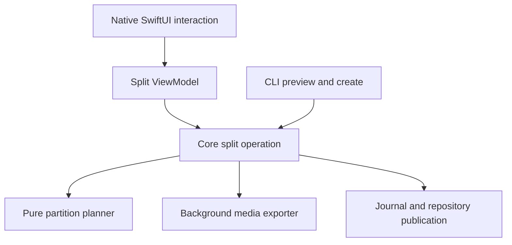
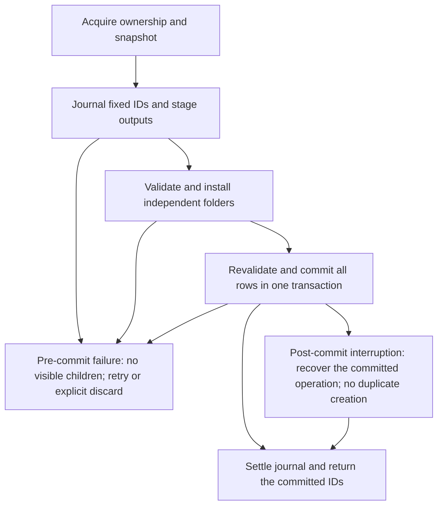

# Saved Meeting Splitting - Plan

## Goal Capsule

- **Objective:** Users can separate accidentally combined meetings after recording and use each part independently in their local library.
- **Means:** Manual partitioning into ordinary saved meetings through one shared Core operation (KTD1).
- **Authority:** The implementing user's current instructions and governing contracts take precedence. This plan carries the research recommendation; the [report](../research/2026-09-11-issue-895-meeting-split/report.md) supplies evidence and rationale. The HTML and provisional investigator notes are not specifications.
- **Execution:** A future implementation task owns code, tests, native validation and any separately authorized shipping. This documentation change implements no app feature and does not authorize a release or access to personal recordings.
- **Stop conditions:** Escalate a required change to source preservation, privacy, retention policy or first-release scope. Choose ordinary implementation details and UI/UX within those constraints; document evidence-backed changes to the proposed internals.

Baseline: `aaf3dc261536e5fc5158c4b1ca714bd3f4cece19`, inspected September 11, 2026. Refresh [issue #895](https://github.com/moona3k/macparakeet/issues/895), affected code and contracts before starting; do not restart work that has since landed.

---

## Product Contract

### Summary

Offer a manual post-recording split with a preview of boundaries, titles and resulting durations. Create independent meetings together and retain the original. A user with valid timing but no usable retained audio can explicitly choose text-only results.

### Problem Frame

Issue #895 describes leaving recording on across two, three or four successive meetings. Prevention does not repair those existing recordings, and a combined transcript is inconvenient to search, summarize or share by conversation.

### Requirements

**Selection and interaction**

- R1. Split a completed saved meeting at one or more approved boundaries into contiguous parts covering its full recording timeline. Retain pauses; reject duplicate, zero, end, non-finite and out-of-range cuts. Do not hardcode a four-part limit.
- R2. Admit the fast path only when displayed text and word timing agree and no conflicting capture, finalization, recovery or source mutation owns the recording. Explain unavailable states; uncertain timing or unmatched text edits must not silently lose content.
- R3. A boundary must not cross any word interval, including overlapping speakers. An unsafe selection may propose a safe gap, but requires explicit approval before moving the cut.
- R4. Before creation, show part titles, source ranges, durations, audio/text-only mode, source preservation and additional storage/retention consequences. Provide progress, safe pre-publication cancellation, actionable errors and discoverable original/part relationships. The optimal native presentation is decided during implementation; the HTML is reference only.

**Content and ownership**

- R5. Preserve the original ID, title, text, audio, corrections and citations. Each child has independent identity/artifact ownership, rebased timestamps and fresh passage/search identities; source words appear exactly once across the children. Deleting the source or one child must not damage the others.
- R6. Preserve effective speaker assignments, including explicit unassigned spans and relevant labels, separately from automatic source provenance. Whole-recording notes, summaries, prompt results, knowledge cards, tasks and Ask conversations remain on the original. Children do not inherit calendar identity, classification or favorite state by default. Carry transcription-engine provenance and inherited capture warnings without asserting measured per-child capture coverage.
- R7. Preserve the source retention clock and recording-date grouping, with split-created time and part order separate. Reject audio-producing creation at or beyond the source's cutoff; offer explicit text-only creation or an explicit change to the existing retention setting. Never renew old audio's lifetime implicitly.

**Reliability and parity**

- R8. Publish all children together or none. Interrupted operations are retryable without duplicates; conflicting GUI/CLI delete, retention and retranscription operations cannot race publication. No hidden AI/provider calls, recording-completion hooks or voice-profile enrollment/matching result from splitting. GUI and CLI share eligibility, preview and creation semantics.

### Scope Boundaries

The first release requires trustworthy word timing. Text-only results are included when that timing remains trustworthy, including an explicitly selected text-only split of expired audio. A missing optional track does not imply missing canonical playback; determine capability from validated artifacts.

Deferred follow-up work: passage-only timing after a separate text-consistency proof, edited-text reconciliation, per-part STT for untimed recordings, suggested silence/calendar/semantic boundaries, break exclusion and original archiving. A general editor, redaction guarantee, automatic destructive Undo and voice-profile enrollment are outside this feature.

### Acceptance Examples

- A 1:48:00 recording cut at 36:20 and 1:12:10 yields three parts of 36:20, 35:50 and 35:50; content timestamps are child-local and source ranges remain available (R1, R5).
- A selected boundary crosses the second of two overlapping speakers. Creation remains unavailable until a safe alternative is approved (R3).
- Audio has been removed but the timed transcript is valid. An explicit text-only preview produces usable transcript-only meetings, with no playback promise (R2, R4).
- A speaker correction changes after preview, or part three fails to export. Creation reports no published children; the original remains usable (R5, R8).

---

## Planning Contract

### Key Technical Decisions

- KTD1. **One Core operation with three internal responsibilities.** A proposed `MeetingSplitService` owns planning, audio preparation and group persistence. GUI ViewModels and CLI call preview/create; neither sequences persistence. Keep helpers internal unless a demonstrated testing or caller seam warrants exposure (R8).
- KTD2. **Snapshot, then revalidate.** Snapshot source content identity, effective correction revision, media identity and eligibility. Build the pure plan from supplied values; perform coherent database reads and final revision checks in the service/repository boundary. `updatedAt` alone is insufficient. Reject unresolved attribution or stale previews rather than silently substituting different content (R2, R6, R8).
- KTD3. **Independent media on one timeline.** Use AVFoundation and shared rational/integer boundary endpoints at each track's sample rate. Intersect each child range with the source track's offset/duration and retain the resulting child-relative offset. Decode/probe outputs; validate cleaned-mic alignment and legacy filename resolution. Passthrough is an optimization to validate, not a promise of decoded-sample equivalence (R5).
- KTD4. **Derived provenance without destructive parent dependency.** Record operation/source IDs, source fingerprint/revision, source range, ordinal and split-created time. Use the source `createdAt` as the initial retention/date anchor; pause-elided offsets are not exact wall-clock starts. Map speaker corrections to fresh child baselines while retaining automatic word provenance; do not clone undo chains, correction IDs or full-recording embeddings (R5–R7).
- KTD5. **Durable operation journal plus a shared mutation gate.** Persist intent and fixed child IDs before export, keep staging outside normal recording recovery enumeration, and install validated folders before one GRDB transaction publishes rows, provenance and derived search state. Integrate cross-process ownership with all relevant mutators; a split-specific file nobody checks is not a lock. Revalidate source/corrections/retention at publication (R8).

Names and file layout below are starting points, not a framework specification. Reuse existing transaction-level derivation instead of independently committing children through `save`. Do not broaden this work into general recording-service or database refactors.

### High-Level Technical Design

The D-to-F edge represents transaction rollback, not an error after commit. Cancellation after the commit boundary returns the committed result; it cannot promise that nothing was created. Stop writers before releasing ownership or discarding operation-owned files. Recovery must distinguish pre-commit staged files from committed children and must never delete unfamiliar folders. A repeated idempotency key with a different source, boundaries, mode or titles is a conflict, not permission to reuse an unrelated result.

### Implementation-Time Decisions

U1 decides layout, entry points, boundary controls, keyboard/VoiceOver behavior and long-transcript navigation. U3 establishes the supported codec/alignment matrix and bounded resource behavior on long recordings. U4 chooses the smallest durable journal/lease representation and migration consistent with existing contracts, including process-death recovery and concurrent mutation coverage. U5 chooses exact CLI naming and result schema. These do not block starting the plan; evidence that would weaken R1–R8 requires a scope decision.

---

## Implementation Units

### U1. Choose and validate the native interaction

**Goal:** Resolve R4 without treating the HTML as an approved design. **Dependencies:** none; U2 can proceed independently.

**Files:** Inspect `Sources/MacParakeet/Views/Meetings/MeetingsView.swift`, `Sources/MacParakeet/Views/Transcription/TranscriptionLibraryView.swift`, `Sources/MacParakeet/Views/Transcription/MeetingArtifactActions.swift` and `spec/04-ui-patterns.md`. Proposed decision note: `docs/design/issue-895-meeting-split.md`.

**Approach:** Compare at least two suitable native approaches, such as a focused sheet and an in-detail mode. Choose based on boundary-finding effort, long-transcript navigation, part review and accessibility. Explain the choice briefly; do not add a permanent editor or WebView merely because the prototype resembles one.

**Verification:** Demonstrate two-, three- and four-part review, unsafe-cut confirmation, original/child navigation and text-only/blocked states. Native keyboard focus, VoiceOver labels and cancellation must be validated when wired in U5. Test expectation for this decision-only unit: no runtime test; U5 owns implementation tests.

### U2. Build the pure split planner and content projection

**Goal:** Establish R1–R3 and R5–R6 deterministically under KTD1–KTD4. **Dependencies:** none.

**Files:** Proposed `Sources/MacParakeetCore/Services/MeetingSplit/MeetingSplitPlanner.swift` and `Tests/MacParakeetTests/Services/MeetingSplit/MeetingSplitPlannerTests.swift`. Existing patterns: `Sources/MacParakeetCore/Models/Transcription.swift`, `Sources/MacParakeetCore/Services/Diarization/SpeakerAttributionResolver.swift`, `Sources/MacParakeetCore/Services/Diarization/SpeakerAttributionReadService.swift` and `Sources/MacParakeetCore/Database/SpeakerTranscriptionPersistence.swift`.

**Approach:** Keep partition calculation free of I/O. Define a source snapshot and preview result containing capability/reasons, approved ranges and source identity. Rebuild word-index ranges and language-aware passage text. Preserve automatic provenance separately from the effective correction projection.

**Tests and completion:**

- Partition 2/3/4 parts and randomized valid boundaries; every source word appears exactly once, with correct rebasing and fresh passage IDs.
- Reject duplicate, zero, terminal, negative, non-finite, out-of-order and inside-word cuts; include overlapping-speaker intervals and zero-duration/malformed input.
- Preserve punctuation, CJK text, renamed/manual speakers and explicit unassigned spans; reject text/timing mismatch and unresolved correction state.
- Derive the same preview from identical snapshots; no database, media or voice-profile service access is needed by the planner.

### U3. Export independently owned, aligned media

**Goal:** Prove KTD3 against realistic media, not only container metadata. **Dependencies:** U2 range model.

**Files:** Proposed `Sources/MacParakeetCore/Services/MeetingSplit/MeetingSplitAudioExporter.swift` and `Tests/MacParakeetTests/Services/MeetingSplit/MeetingSplitAudioExporterTests.swift`. Existing references: `Sources/MacParakeetCore/Services/MeetingRecording/MeetingRecordingMetadata.swift`, `MeetingArtifactAudioFileNames.swift`, `MeetingPlaybackArtifactBuilder.swift` and `MeetingCleanedMicRenderer.swift` in that same directory.

**Approach:** Read the Audio subsystem README. Export canonical playback and available aligned raw/cleaned tracks off MainActor. Preflight storage using actual artifacts plus staging overhead; check read failures/file changes, cancellation and unsupported alignment explicitly. Use APIs compatible with the deployment floor, currently macOS 14.2.

**Tests and completion:**

- Cover asymmetric starts/ends, mixed rates, a track absent from one part, legacy names, cleaned mic and canonical single-source playback.
- Check decoded sample content around boundaries, durations and offsets; assert the source hash never changes. Do not equate export success with lossless equivalence.
- Inject disk-full, malformed media, permission/read failures and cancellation; no success with invalid media or continuing writers.
- Measure duration, memory, disk overhead and UI responsiveness on hour-scale fixtures and minimum supported macOS. Define observed limits before exposure; the eight-second research timing is not the target benchmark.

### U4. Implement durable group publication and lifecycle integration

**Goal:** Enforce R5–R8 under KTD4–KTD5. **Dependencies:** U2 and U3.

**Files:** Proposed `Sources/MacParakeetCore/Services/MeetingSplit/MeetingSplitService.swift`, `MeetingSplitOperationStore.swift` in that directory, and `Tests/MacParakeetTests/Services/MeetingSplit/MeetingSplitRecoveryTests.swift`. Existing integration points: `Sources/MacParakeetCore/Database/DatabaseManager.swift`, `TranscriptionRepository.swift` in that directory; `Sources/MacParakeetCore/Services/MeetingRecording/MeetingAudioRetentionSweeper.swift`, `MeetingRecordingLockFileStore.swift`, `MeetingArtifactStore.swift` in that directory; `Sources/MacParakeetCore/Utilities/TranscriptionAssetCleanup.swift`; `Sources/MacParakeetViewModels/TranscriptionDeletionCleanup.swift`; `Sources/CLI/Commands/MeetingsCommand.swift`; `Sources/MacParakeet/App/MeetingRecoveryCoordinator.swift`.

**Approach:** Read the Database README and trace all source mutation paths, including edits/corrections and retranscription, before choosing the lease integration. Add fresh-insert transaction support and operation identity; no generic upsert replacement. Update `spec/contracts/meeting-artifacts-v1.md` and `spec/contracts/meeting-recovery-retention.md` with the new provenance, ownership, retention and recovery behavior.

**Tests and completion:**

- Inject failures before/after journal, export, folder installation and commit; an ordinary last-row insertion failure publishes no children.
- Restart after commit but before receipt settlement and return the same child IDs. Reject mismatched payload reuse; deletion of a committed child must not make retry resurrect it.
- Exercise second-process split/delete/retention/retranscription and correction changes between preview and commit. Prove exclusion or stale rejection without deadlock; an in-memory mock alone is insufficient.
- Check pre-publication cancellation versus committed completion, disk-full and missing journal/sidecars; discard only identified operation-owned output after writers stop.
- Verify source/child independent deletion, FTS and exports, original citations, explicit-unassigned correction baselines, original date grouping, expired-audio rejection and text-only creation.
- Assert no hook/summary/provider calls or voice-profile reads/writes when disabled; children receive no whole-source derived results or invented capture coverage.

### U5. Connect native state and public CLI to Core

**Goal:** Deliver the U1 interaction and R4/R8 parity without leaking lifecycle ordering into callers. **Dependencies:** U1 and U4.

**Files:** Proposed `Sources/MacParakeetViewModels/MeetingSplitViewModel.swift`, `Sources/MacParakeet/Views/Meetings/MeetingSplitView.swift`, `Tests/MacParakeetTests/ViewModels/MeetingSplitViewModelTests.swift`, `Sources/CLI/Commands/MeetingSplitCommand.swift` and `Tests/CLITests/MeetingSplitCommandTests.swift`. Existing integration: U1 views, `Sources/CLI/Commands/MeetingsCommand.swift`, `Tests/CLITests/MeetingsCommandTests.swift`, `integrations/README.md` and `spec/contracts/cli-json-v1.md`.

**Approach:** Provide CLI preview/dry-run, expected snapshot identity, explicit mode and idempotency key with a documented result/error contract. CLI calls Core directly, not through ViewModels. Update CLI help/spec discovery and changelog. Use testable observable state and `.parakeetAction(...)` for native controls.

**Tests and completion:**

- GUI and CLI produce identical plans/results; preview never writes, and successful create returns the actual committed IDs.
- Cover title editing, boundary removal/reapproval, stale previews, audio loss/expiry between preview and create, double submission and cancellation races.
- Validate noninteractive errors, text-only disclosure, original/part links and retention messaging. Exercise source deletion after creation and retry after partial child deletion without recreation.
- Run native long-transcript and keyboard/VoiceOver QA; verify progress remains responsive and focus/dismissal does not accidentally submit or imply rollback after commit.

---

## Verification Contract

Characterize affected persistence/lifecycle behavior before changing it. Run focused `swift test --filter <AreaTests>` checks during implementation, including the proposed split suites and existing speaker attribution, artifact, retention, deletion and CLI regressions. Run the full `swift test` suite at most once as the final code gate, following `AGENTS.md`; do not run competing builds in the owning worktree.

Use `swift build` and the repository's Swift 6 concurrency checks for first-party code, `scripts/dev/run_app.sh` for native launch, and `swift run macparakeet-cli --help` plus split help/spec/JSON checks for discoverability. Follow `docs/pr-review-workflow.md` with independent data-integrity, concurrency and API review for the implementation. Record actual commands, counts, source SHA, macOS versions and fixture characteristics.

The existing evidence covers six exports from an eight-second synthetic mono AAC source, exact requested decoded frame counts after integer-endpoint correction, and unchanged source SHA. It does **not** prove waveform equivalence, real multi-track alignment, hour-scale performance, minimum-OS support, crash recovery or native UI usability. HTML browser checks exercise fictional state only; screenshots are not native acceptance criteria. Use synthetic/approved fixtures, never personal meeting data by assumption.

---

## Definition of Done

- All unit completion scenarios and R1–R8 are verified against the implementation, with no unresolved source-loss, partial-publication, retention or mutation-race defects.
- The chosen native experience is documented and validated independently of HTML fidelity; GUI and CLI use the same Core semantics.
- Schema, artifacts, recovery/retention, CLI and user-facing documentation reflect actual behavior; proposed names do not masquerade as already shipped APIs.
- Remove abandoned experimental code and unused abstractions from the implementation diff. Preserve original recordings, databases, lock files and unrelated work.
- The future implementation handoff distinguishes local verification, merged code and stable release. Keep #895 open for this research PR; close it only when the implemented scope genuinely resolves the request.
