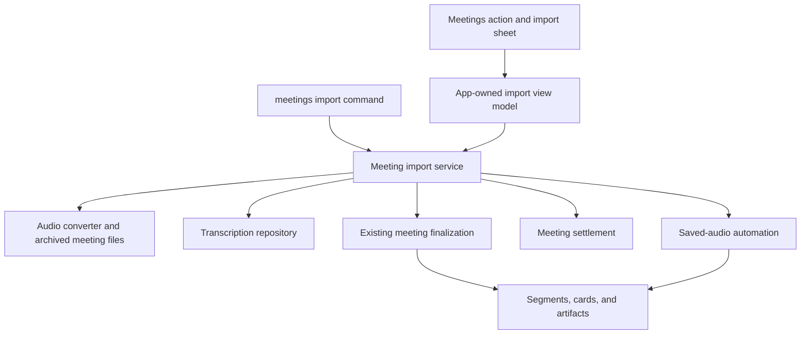
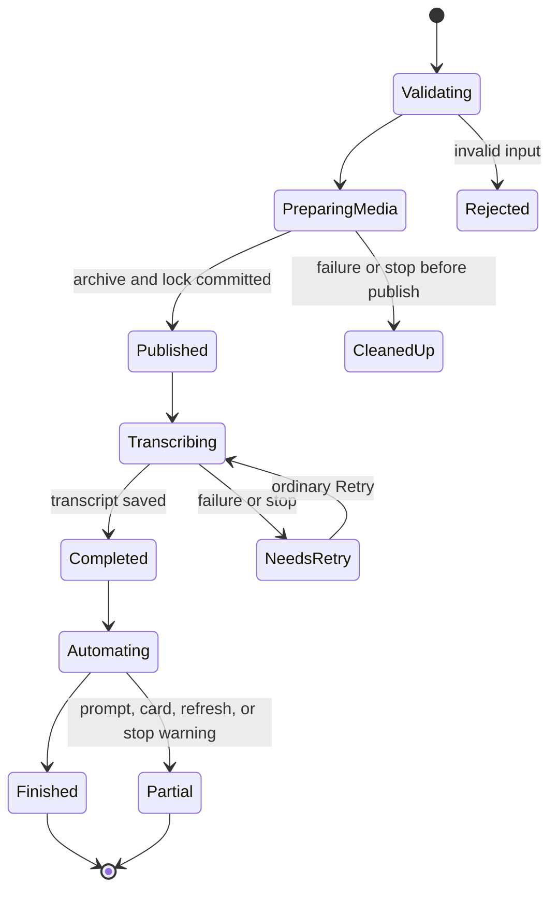
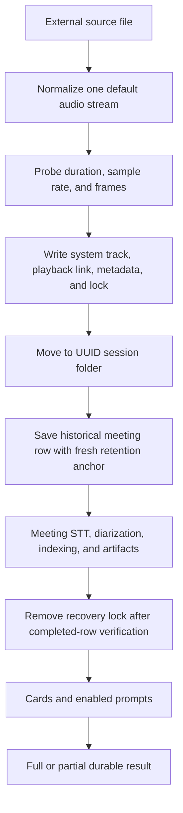

# Import existing recordings as meetings

## Goal Capsule

- **Objective:** A person can bring a historical audio or video recording into MacParakeet and receive the same searchable, playable, speaker-aware meeting record that a live capture produces, while the source file remains unchanged.
- **Means:** Normalize one selected file into a managed system-only meeting recording, then use the existing meeting finalization and saved-audio automation services (KTD1, KTD5).
- **Authority:** The issue and current user direction define product intent; MacParakeet's specs and contracts define privacy, storage, recovery, and CLI behavior; current code defines implementation patterns where the documents are silent.
- **Execution profile:** Code changes across Core, GRDB persistence, app-owned observable state, SwiftUI, and the public CLI. Work proceeds through focused tests, one final full `swift test`, independent review, and meaningful commits.
- **Stop conditions:** Stop only if implementation evidence shows that a source format cannot be normalized without modifying the source, historical chronology cannot be separated safely from retention, or existing meeting recovery cannot protect an interrupted import.
- **Finisher:** The implementing agent owns documentation, code, tests, review fixes, meaningful commits, pushing the isolated branch, and opening a review-ready pull request.

---

## Product Contract

### Summary

MacParakeet will import one existing audio or video file from the Meetings workspace or `macparakeet-cli meetings import`. The import creates an ordinary saved meeting with managed playback audio, the chosen historical date and title, transcription, configured diarization, retrieval segments, meeting artifacts, a knowledge card when configured, and enabled after-meeting prompts.

### Problem Frame

People often have useful meeting recordings from before they installed MacParakeet or from another recorder. Generic file transcription can recover words, but it does not create the meeting semantics needed for speaker-aware playback, meeting artifacts, normal retry, the Meetings workspace, or agent-facing meeting commands. Import must therefore enter the meeting lifecycle without pretending the file was captured live and without putting the external source under MacParakeet's deletion or retention authority.

### Key Decisions

- **Import creates a managed meeting copy.** The external source remains outside MacParakeet ownership; the app owns only its normalized copy. Governs R2, R5.
- **Historical chronology and storage retention use separate dates.** The chosen meeting date controls the library record, while the managed copy receives a fresh retention window. Governs R3, R6.
- **Initial delivery supports one file through a picker and CLI.** Batch import, drag and drop, duplicate detection, and linked-in-place media remain outside this change. Governs R1, R10.

### Requirements

**Entry points and input**

- R1. The Meetings workspace exposes a native `Import Recording...` action, and the public CLI exposes `macparakeet-cli meetings import <path>`.
- R2. One local file with an extension already supported by `AudioFileConverter` is accepted per operation; a missing, non-file, unsupported, corrupt, or audio-less input fails before a library row is exposed, and the source file is never modified, moved, renamed, or deleted.
- R3. The title defaults to the source filename without its extension and the meeting date defaults to the file creation date, then modification date, then the current date; both are editable before import. A valid CLI `--title` or `--started-at` overrides the same defaults, and an explicitly supplied title is not replaced by automatic meeting-title generation.

**Meeting behavior**

- R4. A successful import is a normal `.meeting` row and receives the configured final speech engine, meeting diarization, deterministic text processing, speaker-aware transcript data, retrieval indexing, and meeting artifacts through existing services. After the transcript is durable, the importer attempts knowledge-card generation and enabled after-meeting prompts with the same best-effort durability boundary as the existing saved-audio flow.
- R5. MacParakeet stores a verified normalized system track, canonical playback file, recording metadata, and recovery lock in the configured meeting-recordings root. The external source path is not stored as owned meeting audio.
- R6. `createdAt` records the chosen historical meeting date. A separate optional `audioRetentionStartedAt` records when the managed audio entered MacParakeet; retention uses it when present and falls back to `createdAt` for existing rows. Keep-forever and timed retention apply normally. Delete-immediately removes managed audio after successful transcription and completion of the automation attempt, including a stopped or failed attempt, but preserves it while a published import still needs Retry.
- R7. An import interrupted after its meeting row is published but before successful transcription and settlement leaves that row in `.error` or `.cancelled` with its managed audio and `awaitingTranscription` lock intact, so ordinary Meeting Retry and crash recovery continue the same record instead of creating a duplicate.
- R8. Successful transcription makes the meeting available even when a later prompt, card, artifact refresh, or lock-settlement step reports a warning. The app and CLI distinguish complete success, transcript-saved partial success, and transcription-needs-retry.

**Interaction and automation**

- R9. The app shows truthful preparation, transcription, and automation progress in app-owned state. Closing the sheet does not stop processing. An explicit Stop action cancels work, removes unpublished media, leaves a published meeting retryable according to R7, or preserves an already completed transcript and reports stopped automation as a warning. An unacknowledged terminal result remains available when the import sheet is reopened.
- R10. Re-importing the same source intentionally creates another meeting. Batch selection, drag and drop, embedded-audio-track selection, duplicate detection, source bookmarks, and link-in-place storage are outside the initial contract.
- R11. The CLI accepts date-only local calendar dates and ISO-8601 instants, writes progress to stderr, reserves stdout for the final human or JSON result, supports `--json` and `--envelope`, and exits nonzero for validation failure or transcription-needs-retry after printing any durable result. A transcript-saved partial result exits zero and carries its warnings in human or JSON output so ordinary command retries cannot create a duplicate meeting.

### Key Flows

- F1. App import
  - **Trigger:** The person chooses `Import Recording...` from Meetings.
  - **Steps:** A single-file open panel filters supported audio/video types; a sheet presents the source filename, title, and meeting date; Import starts app-owned processing; the sheet may close and reopen against the same task.
  - **Outcome:** The new meeting appears in Meetings and can be opened, or a recoverable failure is shown with a direct path to the saved record.
  - **Covered by:** R1-R9.
- F2. CLI import
  - **Trigger:** An agent or person runs `meetings import` with a local path.
  - **Steps:** The command resolves defaults and overrides, invokes the same Core service, streams progress to stderr, then prints one stable result object or human summary.
  - **Outcome:** Exit status and output distinguish full completion, durable partial completion, and failure.
  - **Covered by:** R1-R8, R11.
- F3. Interrupted import
  - **Trigger:** STT fails, the task is stopped before successful transcription, or the process exits after managed media publication.
  - **Steps:** The recovery lock preserves ownership and import metadata; startup reconciliation respects a live owner; Retry claims the ordinary finalization lease and reuses the existing row and archived audio.
  - **Outcome:** No published meeting is duplicated and retention cannot remove audio required for recovery.
  - **Covered by:** R5-R9.

### Acceptance Examples

- AE1. Given a valid historical `.m4a`, when it is imported with title `Partnership discussion` and a 2026-05-14 date, then the source checksum is unchanged and a completed meeting with that title/date is playable, searchable, diarized according to preferences, and present in CLI meeting output.
- AE2. Given a recording dated ten years ago and a 30-day audio-retention setting, when it is imported today, then the meeting is ordered under its historical date but its managed audio is not immediately retention-eligible.
- AE3. Given successful managed-media publication followed by an STT failure, when the import returns, then one error meeting exists with its lock and audio; ordinary Retry completes that same row and settlement removes the lock.
- AE4. Given successful STT and one failed auto-run prompt, when import finishes, then the meeting remains completed and usable while the app and CLI report a partial result and the CLI exits zero.
- AE5. Given cancellation during normalization, no row or managed folder remains. Given cancellation during STT, the published row is cancelled and retryable. Given cancellation during automation, the completed transcript remains and only automation is reported stopped.
- AE6. Given process termination after a complete archived folder and lock are published but before a row is saved, when recovery runs, then it reconstructs a meeting using the historical date and retention anchor carried by the lock.
- AE7. Given an unsupported extension or a supported extension containing no decodable audio, when import is attempted, then the user receives a specific error and no library row is created.
- AE8. Given the same source is imported twice, when both operations finish, then each has a distinct meeting id and managed folder; neither import mutates or reuses the other record.

### Scope Boundaries

The initial feature intentionally handles one file at a time. Folder/archive migration, batch progress, drag and drop, content hashing, duplicate review, embedded track choice, calendar matching, note ingestion, and source-file bookmarks can build on the same Core boundary later. Cloud upload and collaborative storage are outside MacParakeet's local-first product boundary.

### Success Criteria

- The app and CLI produce equivalent durable meeting records from the same request.
- Source preservation, historical chronology, fresh retention age, retry identity, and partial-completion semantics are pinned by focused tests.
- UI copy explains ownership and continuation without exposing lock files, staging folders, or other implementation terms.

---

## Planning Contract

### Key Technical Decisions

- KTD1. **Use a system-only archived meeting.** Normalize the selected file to `system-raw.m4a`, point `meeting-playback.m4a` at the same bytes through a hard link with copy fallback, and persist zero-offset system alignment. This enables existing meeting diarization and avoids labeling all imported speakers as the local microphone speaker.
- KTD2. **Add a nullable retention clock.** Persist `Transcription.audioRetentionStartedAt`; new imports set it to import time, existing rows fall back to `createdAt`, and retention selection, in-memory policy, and split eligibility all use the same coalesced value.
- KTD3. **Use ordinary finalization ownership.** Publish an additive `awaitingTranscription` lock carrying `audioRetentionStartedAt` and optional explicit-title intent. Existing retry, startup reconciliation, destructive-cleanup barriers, and `MeetingRecordingSettlement` remain the owners of the lifecycle.
- KTD4. **Publish from importer-owned staging.** Build and verify media in a hidden, uniquely named folder under the destination root while holding the root media-mutation lease, write metadata and the recovery lock, then move it to its UUID session path before saving the stub. Orderly pre-row failures remove only the exact importer-owned staging or just-published final path. Before creating new staging, the importer removes stale hidden folders carrying its reserved prefix under the same lease; published rows and locks are retained after downstream failure.
- KTD5. **Separate transcription from automation.** Prepare one row, finalize it through `TranscriptionService`, settle its completion lock, release media ownership, then run `SavedAudioAutoPromptCompletionService`. That service returns typed prompt, card, and artifact-refresh warnings rather than swallowing them or rewriting a completed transcript as failed. Its crash durability intentionally matches the existing saved-audio path: no new automation receipt or scheduler is introduced.
- KTD6. **Keep one Core import boundary.** App and CLI construct the same `MeetingImportService`; a narrow transcription protocol and the existing audio-converter protocol keep tests small without adding a generic job framework or import receipt table.
- KTD7. **Use existing title metadata for user intent.** A non-nil normalized `titleOverride` marks an explicitly supplied import title and suppresses automatic title replacement. Meeting rename writes also set that marker; generated/default meeting titles remain eligible for normal generation.
- KTD8. **Keep the UI a native utility flow.** Place a neutral secondary import action in the Meetings header and reserve the coral primary action for the sheet's Import button. Use the existing warm adaptive palette, rounded page title, system controls, and one compact information hierarchy rather than adding a dashboard card.

### High-Level Technical Design

The diagrams describe responsibilities and ordering. Exact APIs remain implementation details.

### UI Design Direction

The surface uses existing adaptive design tokens: coral accent `#E86B3B` light / `#FF8A5C` dark, warm elevated surface `#F5F5F0` / `#3B3B3D`, primary text `#1A1A1A` / `#FFFFFF`, secondary text `#6B6B6B` / `#A1A1A6`, success `#33A854` / `#4ADE80`, and error `#E64D42` / `#F77070`. Typography uses the existing 22-point rounded page title, 17-point section title, 15-point primary body, and 13-point supporting text.

The 520- to 600-point sheet has a plain header, a single form region for source/title/date and time, one ownership explanation, and a fixed footer. The date field uses a native local date-and-time control and persists the selected instant. During work, the form becomes a stage-led progress view with the source title kept visible. The visual signature is a quiet Finder-like import utility embedded in the warm Meetings workspace: semantic icons, generous 24-point outer padding, native fields, no gradients, and exactly one prominent coral action.

Closing the sheet or pressing Escape dismisses it without stopping work; Return starts Import only while the form is valid. Stop is a separate, explicitly labeled action during active processing. Progress stages and the terminal result produce VoiceOver announcements, focus moves to the first validation error or terminal summary, and reopening the action shows any unacknowledged result with its classification, warnings, Open Meeting, Dismiss, and Import Another actions.

### Assumptions

- The user instruction to proceed through planning and implementation authorizes the initial one-file app-and-CLI scope without another scoping pause.
- The first/default audio stream chosen by FFmpeg is sufficient for the initial video-import contract.
- Date-only CLI input means local midnight in the current calendar and time zone; ISO-8601 input preserves its instant. Future dates are accepted as explicit metadata.
- The source filename stem is a default, not explicit title intent. A user-edited app title or CLI `--title` is explicit intent.
- Duplicate imports are independent records because no content-identity contract exists in this scope.
- The Core service reports completed-transcript warnings without attempting a new general-purpose automation-retry subsystem.
- Video import uses the first/default audio stream selected by the existing converter. Choosing among embedded tracks remains explicit later scope, and the import form identifies the source so the result can be checked before the external file is discarded.

### System-Wide Impact

The schema gains one nullable timestamp and lock JSON gains backward-compatible optional fields. Library ordering, daily attribution, search dates, and meeting display continue to use `createdAt`; only managed meeting-audio retention consults the new clock. App and CLI share media ownership, recovery, and result semantics, while current live-capture rows remain behaviorally unchanged through the fallback.

### Risks and Mitigations

- A process can die between filesystem and database publication. The complete archive and ordinary lock make the folder recoverable, and lock-carried import metadata preserves its chronology and retention clock.
- Long normalization can overlap destructive meeting cleanup. The existing nonblocking media-mutation lease serializes the destination phase and produces a retryable busy error rather than torn files.
- SwiftUI sheet dismissal can destroy view-local tasks. AppDelegate-owned observable state owns the Task and sheet presentation only observes it.
- A public CLI command can drift from app preferences. A small shared CLI construction helper uses `AppPaths.appDefaults()` and the configured meeting root for both split and import.
- Adding an optional model field can be overwritten by whole-row saves. Coding, GRDB migration, mock repositories, and `savePreservingUserMetadata` are updated together and covered by migration/persistence tests.
- A process can exit after transcript settlement and before best-effort automation finishes. This matches existing saved-audio behavior; the completed transcript remains authoritative, and this version does not add a general automation receipt or scheduler.

---

## Implementation Units

### U1. Define import, title, and retention persistence contracts

- **Goal:** Establish the durable fields and governing documentation required before importer behavior depends on them.
- **Requirements:** R3, R6-R8.
- **Files:** `Sources/MacParakeetCore/Models/Transcription.swift`, `Sources/MacParakeetCore/Database/DatabaseManager.swift`, `Sources/MacParakeetCore/Database/TranscriptionRepository.swift`, `Sources/MacParakeetCore/Services/MeetingRecording/MeetingAudioRetentionSweeper.swift`, `Sources/MacParakeetCore/Services/MeetingSplit/MeetingSplitService.swift`, `spec/01-data-model.md`, `spec/05-audio-pipeline.md`, `spec/contracts/meeting-recovery-retention.md`, `spec/adr/030-external-meeting-import.md`, `spec/contracts/meeting-import-v1.md`, `spec/README.md`.
- **Approach:** Add the nullable retention clock with fallback SQL/policy semantics, preserve it across completion saves, and use `titleOverride` as the durable marker for an intentional meeting name. Document source ownership, lifecycle, and partial completion in a focused import contract and ADR.
- **Execution note:** Write or strengthen migration, repository, title, and retention tests first and observe the relevant failure before production changes.
- **Test scenarios:** A new database exposes a nullable retention column; an upgraded database preserves rows; legacy meetings age by `createdAt`; a ten-year-old meeting with a current retention clock is neither selected for deletion nor rejected for splitting; a meeting rename sets explicit-title intent; completion cannot overwrite either field.
- **Verification:** `swift test --filter DatabaseManagerTests`, `swift test --filter TranscriptionRepositoryTests`, and `swift test --filter MeetingAudioRetentionSweeperTests`.

### U2. Preserve import metadata through ordinary recovery

- **Goal:** Make an interrupted import compatible with existing meeting retry and crash recovery without a parallel ownership model.
- **Requirements:** R3, R5-R7.
- **Dependencies:** U1.
- **Files:** `Sources/MacParakeetCore/Services/MeetingRecording/MeetingRecordingLockFileStore.swift`, `Sources/MacParakeetCore/Services/TranscriptionService.swift`, `Sources/MacParakeetCore/Services/MeetingRecording/MeetingRecordingRecoveryService.swift`, corresponding lock, transcription-service, queue, reconciler, and recovery tests, `spec/contracts/meeting-recovery-retention.md`.
- **Approach:** Add optional retention/title metadata to the current lock schema, let meeting-stub preparation accept explicit chronology and title intent, and have missing-row recovery prepare then finalize from lock metadata. Keep settlement and ownership claims unchanged.
- **Execution note:** Add decoding-compatibility, missing-row recovery, same-row Retry, and live-owner characterization tests before changing the production path.
- **Test scenarios:** Older locks decode with nil import metadata; a new import lock round-trips it; a lock with no row recovers the historical date and retention clock; a failed row retries under the same id; a live lock prevents startup reconciliation; successful settlement alone removes the lock.
- **Verification:** `swift test --filter MeetingRecordingLockFileStoreTests`, `swift test --filter MeetingRecordingRecoveryServiceTests`, `swift test --filter MeetingTranscriptionQueueTests`, and `swift test --filter MeetingFinalizationReconcilerTests`.

### U3. Implement the Core meeting importer

- **Goal:** Convert one external recording into a durable meeting and return truthful full, partial, or retryable outcomes.
- **Requirements:** R2-R9.
- **Dependencies:** U1, U2.
- **Files:** `Sources/MacParakeetCore/Services/MeetingImport/MeetingImportService.swift`, `Sources/MacParakeetCore/Services/MeetingImport/MeetingImportResult.swift`, `Sources/MacParakeetCore/Services/SavedAudioAutoPromptCompletionService.swift`, corresponding importer and saved-audio automation tests, and narrowly reused meeting/audio helpers.
- **Approach:** Validate the source, acquire destination media ownership, remove only stale importer staging folders with the reserved prefix, normalize into a system-only archived meeting, publish the lock and folder, prepare the row, release root ownership, finalize STT, settle success, and run saved-audio automation. Return the persisted row with typed prompt, card, and artifact warnings after publication; throw only before there is a durable meeting result.
- **Execution note:** Build the service in proof-first slices: validation/cleanup, media publication, real repository plus fake STT integration, then failure/cancellation/retry behavior.
- **Test scenarios:** Valid audio and video use system-only zero-offset alignment; source bytes and timestamps remain unchanged; hard-link fallback still produces playback; unsupported/corrupt/empty input leaves no row; media-lease contention writes nothing; a stale reserved staging folder is removed before a new import; cancellation removes the exact staging or final folder when no row exists; STT failure/cancellation retains one retryable row and lock; successful STT settles the lock; automation failure/cancellation returns a completed row with typed prompt, card, or artifact warnings; importing the same source twice creates two independent ids and folders; a real in-memory database plus actual `TranscriptionService` exercises indexing/artifact integration with only low-level STT/conversion faked.
- **Verification:** `swift test --filter MeetingImportServiceTests` and focused `TranscriptionServiceTests` coverage for imported system-only meetings.

### U4. Add app-owned import state and native Meetings UI

- **Goal:** Provide a polished macOS flow that survives sheet dismissal and makes ownership, progress, stopping, and results clear.
- **Requirements:** R1, R3, R8-R9.
- **Dependencies:** U3.
- **Files:** `Sources/MacParakeetViewModels/MeetingImportViewModel.swift`, `Sources/MacParakeet/Views/Meetings/MeetingImportSheetView.swift`, `Sources/MacParakeet/Views/Meetings/MeetingsView.swift`, `Sources/MacParakeet/App/AppEnvironment.swift`, `Sources/MacParakeet/AppDelegate.swift`, `Sources/MacParakeet/App/AppEnvironmentConfigurer.swift`, `Sources/MacParakeet/App/AppWindowCoordinator.swift`, `Sources/MacParakeet/Views/MainWindowView.swift`, and view-model tests.
- **Approach:** AppDelegate owns one observable import model configured from AppEnvironment. The Meetings header opens a single-file panel when idle or reopens active progress or an unacknowledged terminal result. The sheet uses native title and local date-time controls, concise ownership copy, a primary Import action, a secondary Stop action during work, and Open Meeting for any durable result. Dismiss acknowledges the terminal result; Import Another resets it deliberately. Refresh the Meetings list after publication and navigate through the existing selection callback.
- **Execution note:** Write view-model state-transition tests first. Treat pure SwiftUI layout as a code-review and runtime-inspection surface instead of mirroring view structure in brittle tests.
- **Test scenarios:** File defaults resolve in the specified order; edited date and time persist as the chosen instant; blank title blocks import and receives focus; double submit is ignored; closing/reopening observes the same task; completion while dismissed reopens to the unacknowledged result; Stop before publication returns to an editable state; Stop or STT failure after publication exposes the retryable row; Stop during automation preserves the completed result; successful and partial outcomes refresh once and can open the saved meeting; stale callbacks from a prior task cannot overwrite a new selection.
- **Verification:** `swift test --filter MeetingImportViewModelTests`, `swift build`, and a launched-app inspection of idle, form, progress, full-success, partial, and retryable-failure states in light and dark appearance when feasible.

### U5. Add public CLI parity and integration documentation

- **Goal:** Make the same import capability safe and scriptable through the public CLI.
- **Requirements:** R1-R8, R11.
- **Dependencies:** U3.
- **Files:** `Sources/CLI/Commands/MeetingsCommand.swift`, `Sources/CLI/Commands/MeetingImportCommand.swift`, `Sources/CLI/Commands/MeetingSplitCommand.swift`, `Sources/CLI/Commands/SpecCommand.swift`, CLI tests, `spec/contracts/cli-json-v1.md`, `integrations/README.md`, `Sources/CLI/README.md`, and `Sources/CLI/CHANGELOG.md`.
- **Approach:** Extract the existing saved-meeting processing construction into a small CLI helper used by split and import. Parse strict date-only/ISO-8601 input, map Core progress to stderr, emit a stable import result projection, register the command in the machine-readable spec, and return nonzero after printing a retryable durable result while returning zero for a transcript-saved partial result.
- **Execution note:** Add parse/validation/spec/output tests before command implementation, then run one command-level integration against a temporary database and recordings root with injected processing dependencies where needed.
- **Test scenarios:** Command registration and help are stable; blank title, bad date, missing file, and conflicting JSON flags fail validation; date-only and ISO-8601 values round-trip; human output is readable; JSON/envelope stdout contains the saved id, status, historical date, managed audio path, warnings, and completion classification; stderr progress never corrupts JSON; partial results print and exit zero; retryable results print and exit nonzero; custom app defaults resolve the configured recordings root.
- **Verification:** `swift test --filter MeetingImportCommandTests`, `swift test --filter MeetingsCommandTests`, `swift test --filter SpecCommandTests`, and `swift run macparakeet-cli meetings import --help`.

---

## Verification Contract

| Gate | Command or evidence | Proves |
|---|---|---|
| Persistence and retention | `swift test --filter DatabaseManagerTests`; `swift test --filter TranscriptionRepositoryTests`; `swift test --filter MeetingAudioRetentionSweeperTests` | Migration safety and separate chronology/retention clocks |
| Recovery ownership | Focused lock, recovery, queue, settlement, and reconciler tests from U2 | One-row retry, lock barriers, and crash reconstruction |
| Core import | `swift test --filter MeetingImportServiceTests` | Source preservation, archive correctness, failure boundaries, and partial results |
| App state | `swift test --filter MeetingImportViewModelTests` | Long-lived task, validation, cancellation, refresh, and stale-callback safety |
| CLI contract | CLI focused tests plus `swift run macparakeet-cli meetings import --help` | Registration, parsing, output separation, exit behavior, and documented interface |
| Build | `swift build` | Swift 6 target integration across Core, view models, app, and CLI |
| Final suite | `swift test` once, after all focused gates | Repository-wide regression gate required by project instructions |
| Independent review | Run the substantial-change code review workflow against the final diff and resolve all confirmed findings | Correctness, maintainability, project standards, public contract, and UI quality |
| UI inspection | Launch through `scripts/dev/run_app.sh`; inspect the reachable states and keyboard/VoiceOver labels where the local environment permits | Native layout, hierarchy, copy, focus, and no overflow |

The build and automated tests cannot prove visual polish, hardware speech-engine availability, provider success, or performance on a large real archive. Report those as separate observed or unverified evidence.

---

## Definition of Done

- Every R1-R11 requirement is implemented or explicitly reported as blocked with evidence.
- Imported source bytes remain unchanged in automated coverage, while the managed folder contains a decodable system track, playback file, metadata, and the correct lock lifecycle.
- Historical meeting dates do not shorten the new managed copy's configured retention window.
- Full success, retryable transcription failure, cancellation, and post-transcription partial success are distinct in Core, app, and CLI behavior.
- The app entry point and sheet follow the UI design direction, existing `.parakeetAction(...)` roles, accessibility labels, and app-owned task lifetime.
- The public CLI spec and written contracts match implemented arguments, JSON fields, stdout/stderr rules, and exit codes.
- Focused tests, `swift build`, the single final `swift test`, and independent review pass at the final committed head.
- Abandoned experiments, unused abstractions, temporary fixtures, and importer staging data created by tests are removed; unrelated checkout state remains untouched.
