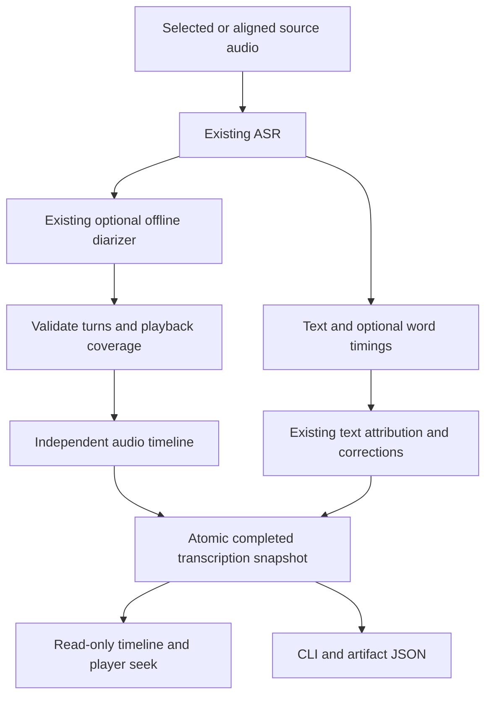
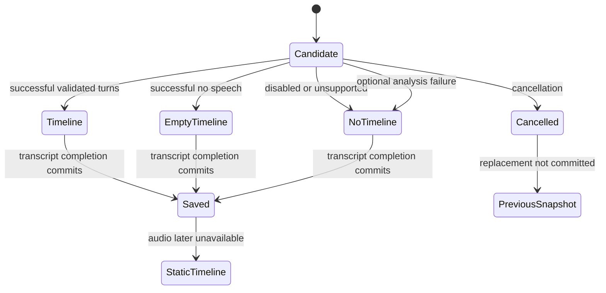

# Audio Speaker Timeline - Plan

This is an implementation plan for [issue #836](https://github.com/moona3k/macparakeet/issues/836).
The accompanying documentation establishes the direction; it does not implement the feature or close the issue.

## Goal Capsule

- **Objective:** Users can find and replay detected speaker turns in recordings transcribed with Cohere, even though their transcript has no word timings.
- **Means:** Preserve independent audio analysis and expose it through existing app and CLI surfaces (KTD1).
- **Authority:** [Audio Speaker Timeline v1](../../spec/contracts/audio-speaker-timeline-v1.md) owns the proposed behavior and payload; [ADR-010](../../spec/adr/010-speaker-diarization.md) owns the diarizer choice. Existing capture, retention, correction, and privacy contracts constrain implementation.
- **Execution:** The next implementation owner carries U1–U5 through focused verification, independent review, and the repository's final code gate. This docs PR authorizes no app implementation or release by itself.
- **Stop conditions:** Revisit the design if preserving legacy data requires a destructive migration, if source-to-playback alignment cannot be established, or if any proposed path needs a new model/runtime or changes text attribution.
- **Qualification gate:** Do not call the feature qualified or make it generally available if U5's clear two-speaker recording fails to distinguish both speakers with playback-confirmed turns. Investigate and resolve that failure before shipping.

---

## Product Contract

### Summary

Add a read-only audio speaker timeline for file/URL transcription and finalized meetings.
Users can inspect detected turns and seek compatible retained audio without assigning untimed text to those turns.

### Problem Frame

Cohere returns text without word timestamps.
The file pipeline consequently skips speaker analysis, while archived-source meetings can analyze speakers but lose audio-only turns when the finalizer reconstructs speaker metadata from words.
Users lose useful audio navigation even though the diarizer does not require ASR timestamps.

### Key Decisions

- **Audio timeline first** (session-settled: user-approved — chosen over immediate speaker-labeled text: timing audio turns does not establish which untimed words belong to each turn). Governs R1, R2.

### Requirements

**Evidence and scope**

- R1. Produce an audio timeline independently of ASR word availability, under the existing speaker-detection preferences and constraints; follow the contract's Producers and coverage section.
- R2. Preserve the boundary between detected audio turns and attributed text, including all exclusions in the contract's CLI, artifacts, and text consumers section.
- R3. Preserve legacy records, successful snapshots, corrections, split sources, and audio-retention behavior according to the contract's Persistence and lifecycle section.

**Access and trust**

- R4. Provide read-only turn navigation, coverage labels, empty/unavailable states, and accessible playback interactions as specified in App experience.
- R5. Expose the same saved payload through the named JSON and meeting-artifact surfaces, retaining existing compatibility behavior.
- R6. Validate intervals and qualify playback and detection behavior on real recordings before describing the feature as reliable or released.

### Scope Boundaries

The milestone covers existing file/URL, archived-source meeting, and canonical-only meeting processing paths.
It adds no dictation diarization, live timeline, automatic library backfill, audio retention extension, or timeline-specific export format.

#### Deferred to Follow-Up Work

Text alignment, timeline corrections/renaming, microphone speech activity, speaker-duration analytics, and new identity matching remain separate work.
Issue #836's broader speaker-labeled-text request remains open after this milestone unless explicitly narrowed by its owner.

### Acceptance Examples

- AE1. Covers R1, R2, R4: Cohere returns a paragraph and zero words; two detected audio turns remain visible and seekable, while the paragraph remains untimed and unattributed.
- AE2. Covers R1, R4: an isolated system track starts 2 seconds after meeting playback begins; its 3–5 second turn appears at 5–7 seconds with `System audio only` coverage. No microphone turn is synthesized.
- AE3. Covers R3, R4: retained audio is removed; saved turns remain readable and seeking is unavailable.
- AE4. Covers R3: a failed or cancelled retranscription preserves the previous snapshot; a successful replacement with detection off has no stale timeline.
- AE5. Covers R2, R5: app presentation, CLI JSON, and meeting artifact JSON show the same analysis ID and turns; text exports and AI context acquire no speaker-attributed sentences.

---

## Planning Contract

### Investigation evidence

Inspected development baseline: `bb72542c7359c2061d1309457847ee864378e2d3` on 2026-09-14.
These are source observations, not runtime measurements.

| Finding | Source and consequence |
|---|---|
| File path skips analysis, not just merging | `Sources/MacParakeetCore/Services/TranscriptionService.swift`, `transcribeAudio`; replace the guard and the existing `testTranscribeFileSkipsDiarizationWhenSTTProvidesNoWordTimings` expectation. |
| Existing interval field has mixed meanings | File completion stores audio segments; `MeetingTranscriptFinalizer` and `SpeakerAttributionResolver` derive segments from words. Preserve this compatibility field. |
| Raw meeting turns are already shifted | `diarizeMeetingSystemIfNeeded` prefixes system IDs and adds the stored system offset; the new materializer must not add that offset again. |
| Empty analysis is distinguishable in the producer | `DiarizationService` returns empty arrays for no speech; retain this outcome before the meeting helper's empty-result guard discards it. |
| Text correction identity is unsuitable for audio edits | `SpeakerAttributionResolver.FingerprintPayload` hashes words and durable text segments, not raw turns; no-word replacements can share a fingerprint. Do not add timeline edits to that journal. |
| Text speaker UI is word-gated | `Sources/MacParakeet/Views/Transcription/TranscriptResultView.swift` nests speaker overview under timed mode/nonempty words; add an independent presentation path. |
| JSON coverage is uneven | `Sources/CLI/Commands/MeetingsCommand.swift` has explicit DTOs; `MeetingTranscriptRecord` omits even legacy diarization segments. Adding a model property alone is insufficient. |
| Split children already reprocess their own media | `Sources/MacParakeetCore/Services/MeetingSplit/MeetingSplitService.swift`; use that path to produce new child analyses. |

The issue's “after each pause” dictation premise differs from the current Cohere stop-time behavior in `spec/06-stt-engine.md`.
Its referenced Obsidian plugin emits one utterance-wide Cohere segment, then chooses a speaker by overlap; it does not split an untimed paragraph into reliable dialogue.
Primary-source references: [Cohere adapter](https://github.com/brittain9/speech-kit-obsidian-plugin/blob/6b27587816094e4f4d51a434a0beeb2b313dab18/native/src/adapters/cohere_transcribe.rs#L161) and [worker](https://github.com/brittain9/speech-kit-obsidian-plugin/blob/6b27587816094e4f4d51a434a0beeb2b313dab18/native/src/worker.rs#L932).
These observations support R2 and the decision to defer text alignment.

### Key Technical Decisions

- KTD1. **Add independent optional audio evidence.** Implement the contract's `audioSpeakerTimeline` object with its own roster and analysis ID. Reusing `diarizationSegments` would misrepresent legacy meeting/correction projections and expose audio-only speakers to text-based identity paths. Supports R1–R3, R5.
- KTD2. **Normalize at the audio boundary.** A small Core materializer validates source-relative intervals and projects them onto playback time. Preserve the already-normalized archived-system path or move its offset into this boundary, but keep a single owner and characterize it before refactoring. Supports R1, R6.
- KTD3. **Use existing completion and reprocessing transactions.** Extend the candidate/reset/save and explicit DTO paths rather than adding a separate timeline job, mutable cache, or backfill. Supports R3, R5.
- KTD4. **Keep audio evidence read-only and separately labeled.** A small ViewModels presentation type supplies a lazy turn list to the app and delegates seeking to the existing player. No full speaker editor or existing word-count statistics on timeline-only results. Supports R2, R4.
- KTD5. **Preserve optional JSON without lossy writes.** Keep the raw stored timeline value available for unrelated saves when decoding fails or a future schema is unsupported. Only an explicit successful transcript replacement may supersede it. Supports R3, R5.

### High-Level Technical Design

An initial cancelled job follows the existing cancelled/error status path; `PreviousSnapshot` applies to retranscription.
Persistence failures also retain the prior snapshot and must not publish the candidate timeline.

### Assumptions and implementation-time checks

Read-only rows, collapsed initial presentation, and no duration statistics are bounded defaults chosen for this plan.
The feature does not require a new model or signal-processing algorithm.
Inspection of actual media duration and selected-track playback compatibility must be verified during implementation; the current code's word-derived duration is insufficient evidence.
Measure long-list responsiveness and resource cost on real audio before release; no timing or diarization-error-rate target is claimed by this document.

---

## Implementation Units

### U1. Persist and validate independent audio evidence

**Goal:** Establish the additive payload and its compatibility rules. **Requirements:** R2, R3, R5, R6. **Dependencies:** none.

**Files:** new `Sources/MacParakeetCore/Models/AudioSpeakerTimeline.swift`; `Sources/MacParakeetCore/Models/Transcription.swift`; `Sources/MacParakeetCore/Database/DatabaseManager.swift`; `Sources/MacParakeetCore/Database/TranscriptionRepository.swift`; new `Tests/MacParakeetTests/Models/AudioSpeakerTimelineTests.swift`; existing `Tests/MacParakeetTests/Models/TranscriptionModelTests.swift`, `Tests/MacParakeetTests/Database/DatabaseManagerTests.swift`, and `Tests/MacParakeetTests/Database/TranscriptionRepositoryTests.swift`.

**Approach:** Implement KTD1, KTD2, KTD5 using the existing nullable-JSON migration and repository conventions. Read the Database subsystem README first. Allocate the migration number from the implementation branch, not this baseline.

**Test scenarios:**

1. Current and supported old schemas decode absent timeline without changing ordinary transcript reads.
2. Valid and explicitly empty analyses round-trip with the same analysis ID.
3. Negative, nonfinite, overflow, zero-length, out-of-coverage, duplicate-ID, and dangling-ID inputs follow the validation contract.
4. Unknown-version or malformed optional data cannot disappear during title/notes updates and does not hide transcript text.
5. Interval sorting preserves valid overlap and does not derive a duration from words.

**Verification:** Focused model/database coverage proves optional-field compatibility and safe completion persistence.

### U2. Materialize timelines from existing processing paths

**Goal:** Retain audio analysis regardless of word availability. **Requirements:** R1–R3, R6. **Dependencies:** U1.

**Files:** `Sources/MacParakeetCore/Services/TranscriptionService.swift`; `Sources/MacParakeetCore/Services/Diarization/DiarizationService.swift`; `Sources/MacParakeetCore/Services/MeetingRecording/MeetingTranscriptFinalizer.swift`; `Tests/MacParakeetTests/Services/TranscriptionServiceTests.swift`; `Tests/MacParakeetTests/Services/Diarization/DiarizationServiceTests.swift`.

**Approach:** Implement KTD2–KTD3. Characterize existing timed file/meeting behavior first, then change only the word guard for audio analysis and carry raw meeting evidence through finalization. Preserve no-speech results before they become nil. Audit telemetry wording without redefining word-attribution counters.

**Test scenarios:**

1. Covers AE1: replace the test locking in the Cohere skip with persisted two-speaker audio evidence and unchanged empty words/untimed text.
2. Covers AE2: source offsets apply once; delayed or shortened system audio reports its actual analyzed envelope.
3. Disabled detection, explicit speaker-count overrides, archived microphone-only input, and canonical-only meetings follow existing workflow policy and correct source provenance.
4. Empty/no-speech and optional failure produce distinct payload presence; cancellation never completes a partial candidate.
5. Covers AE4: failed/cancelled replacement preserves old evidence; successful detection-off/failed-analysis replacement clears stale evidence.
6. Timed engines retain existing word assignments, legacy roster, speaker counts, and transcript segments.
7. Deletion during processing does not recreate a row; concurrent user metadata survives completion.

**Verification:** Stubbed pipeline tests prove behavior without downloading models; real-audio qualification remains U5.

### U3. Preserve evidence across projections, splits, and public JSON

**Goal:** Make saved evidence available consistently without altering text semantics. **Requirements:** R2, R3, R5. **Dependencies:** U2.

**Files:** `Sources/MacParakeetCore/Services/Diarization/SpeakerAttributionReadService.swift`; `Sources/MacParakeetCore/Services/MeetingRecording/MeetingArtifactStore.swift`; `Sources/CLI/Commands/MeetingsCommand.swift`; `Sources/CLI/Commands/SpecCommand.swift`; `Sources/CLI/CHANGELOG.md`; `spec/contracts/cli-json-v1.md`; `spec/contracts/meeting-artifacts-v1.md`; `integrations/README.md`.

**Test files:** `Tests/MacParakeetTests/Services/Diarization/SpeakerAttributionResolverTests.swift`; `Tests/MacParakeetTests/Services/Diarization/SpeakerAttributionReadServiceTests.swift`; `Tests/MacParakeetTests/Services/MeetingRecording/MeetingArtifactStoreTests.swift`; `Tests/MacParakeetTests/Services/MeetingSplit/MeetingSplitServiceTests.swift`; `Tests/CLITests/TranscribeCommandTests.swift`; `Tests/CLITests/ExportCommandTests.swift`; `Tests/CLITests/MeetingsCommandTests.swift`.

**Approach:** Implement KTD1 and KTD3 across explicit DTOs; retain the original payload through effective attribution. Existing split fresh-processing paths should need no new inheritance mechanism. Update boundary documents and CLI discovery together when the fields become real.

**Test scenarios:**

1. Covers AE5: all named JSON surfaces carry equal saved analysis ID, source, coverage, roster, and turns.
2. Text speaker rename/merge/remove, text edits, Undo/Redo, and reset leave the independent payload unchanged.
3. Child analysis uses child-relative timing and a fresh analysis ID; parent evidence and retry receipts remain intact.
4. Untimed export/search/AI paths do not gain speaker text or invented subtitle/citation boundaries.
5. New payload does not broaden voiceprint observations or enter public share bundles.

**Verification:** Contract and parity fixtures pass; verify old optional JSON conventions and envelope behavior remain unchanged.

### U4. Add accessible turn navigation

**Goal:** Make audio turns useful alongside untimed text. **Requirements:** R2, R4. **Dependencies:** U3.

**Files:** new `Sources/MacParakeetViewModels/AudioSpeakerTimelinePresentation.swift`; new `Sources/MacParakeet/Views/Transcription/AudioSpeakerTimelineView.swift`; `Sources/MacParakeet/Views/Transcription/TranscriptResultView.swift`; `Sources/MacParakeetViewModels/MediaPlayerViewModel.swift` if required for existing seek integration; new `Tests/MacParakeetTests/ViewModels/AudioSpeakerTimelinePresentationTests.swift`.

**Approach:** Implement KTD4 and the App experience contract. Use `.parakeetAction(...)`, existing audio availability checks, and existing seek semantics. Snapshot presentation by transcription identity and analysis ID so late work cannot replace a newly selected recording.

**Test scenarios:**

1. Covers AE1–AE3: timeline availability is independent of words/display mode; coverage label and disabled seek are correct.
2. Successful empty, absent, and unsupported payloads show distinct, honest presentation states.
3. A turn seeks its start on the correct source clock while preserving paused/playing state; incompatible track playback is unavailable.
4. Selection changes and same-recording retranscription invalidate stale presentation/seek targets.
5. Keyboard and VoiceOver can discover and activate each available turn without color, including a long lazily rendered list.

**Verification:** Presentation tests plus native accessibility/playback QA; no browser screenshot is a substitute for native interaction evidence.

### U5. Qualify the feature and reconcile documentation

**Goal:** Demonstrate functional reliability and state remaining model limits honestly. **Requirements:** R1–R6. **Dependencies:** U4.

**Files:** `spec/contracts/audio-speaker-timeline-v1.md`; `spec/01-data-model.md`; `spec/02-features.md`; `spec/06-stt-engine.md`; `spec/README.md`; `spec/adr/010-speaker-diarization.md`; planned `docs/qa/issue-836-speaker-timeline.md` evidence report.

**Approach:** Run focused regression coverage for affected consumers, then the single final app suite and exact-candidate review. Record runtime evidence separately from deterministic fixture results. Remove planned-only labels only for behavior actually implemented and verified.

**Test scenarios:**

1. Clear two-speaker file, overlapping/interrupted conversation, noisy/short turns, silence, and a long recording using Cohere.
2. Archived meeting with delayed system source, canonical-only imported meeting, split child, and retained transcript after audio removal.
3. At least one timestamped-engine regression, including transcript correction and text/JSON export parity.
4. Record hardware/macOS, model/pipeline versions, audio duration/source, processing time, observed missed/merged/split speakers, and seek behavior. Use licensed/consented local fixtures; do not commit private recordings.

**Verification:** No incorrect clock, stale analysis, data loss, or fabricated text attribution in the qualification set. With automatic speaker detection, the clear two-speaker fixture must produce two distinct speaker clusters with representative turns checked against audible speaker changes and playback seeking. Failure blocks qualification and general availability until investigated and resolved. Document detection mistakes on difficult recordings as model limits; this gate is not a universal accuracy percentage.

---

## Verification Contract

During implementation, iterate with `swift test --filter <AreaTests>` for the suites named above, from the owning worktree.
Run the full `swift test` suite at most once as the final code gate, with a single owner, under `AGENTS.md` and `docs/pr-review-workflow.md`.
Model/download and native playback checks are separate from fixture tests and hosted CI.
This documentation-only PR checks source accuracy, local links, frontmatter, and diff integrity; it does not run the app suite or qualify speaker accuracy.

## Definition of Done

The implementation satisfies R1–R6 and AE1–AE5, with current-candidate evidence for U1–U5.
All named app/CLI/artifact surfaces agree on saved audio evidence while text consumers retain their prior semantics.
Legacy data and correction histories are preserved, and no abandoned experiments or model/runtime replacements remain in the change.
Docs distinguish implementation on development `main`, real-audio qualification, and stable release availability.
Merging this plan alone meets none of the feature's runtime acceptance criteria.
