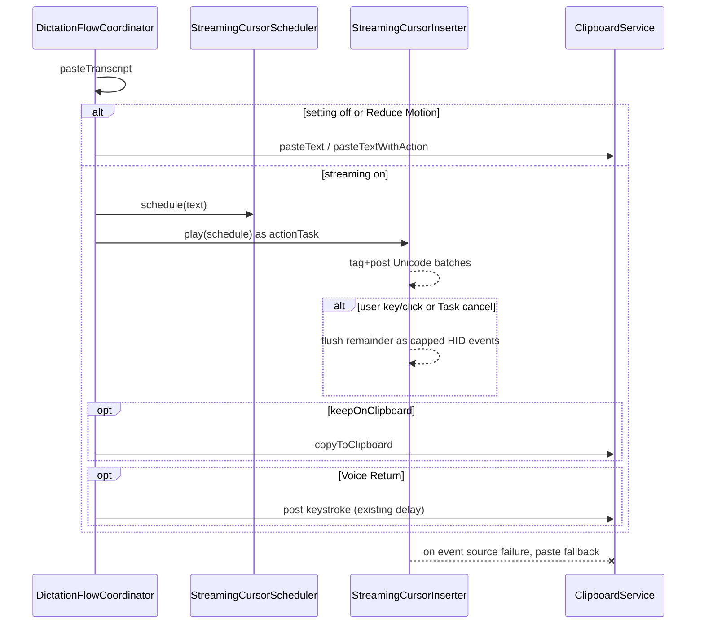

# Streaming cursor dictation insertion — #449

Implementation plan for [issue #449](https://github.com/moona3k/macparakeet/issues/449). Research: [docs/research/2026-09-17-issue-449-streaming-cursor.md](../research/2026-09-17-issue-449-streaming-cursor.md).

## Goal Capsule

- **Objective:** Optional, default-off insertion that types the already-finished transcript into the focused app with a short eased caret race, without slowing the default paste path.
- **Means:** Pure schedule planner + injectable Unicode event player; coordinator uses it only when the setting is on and Reduce Motion is off.
- **Authority:** This plan plus [spec/02-features.md](../../spec/02-features.md) Text insertion. `ClipboardService` remains the paste primitive.
- **Stop conditions:** If streaming cannot honor interrupt-flush (no truncated transcripts) or if the off path gains any sleep/monitor, stop and keep paste-only.

## Context zone

**In scope**

- Settings → Dictation toggle, default off: “Streaming cursor”
- `StreamingCursorScheduler` (pure, tested) and `StreamingCursorInserter` (AppKit player)
- `DictationFlowCoordinator` paste path: stream when enabled; store the insert `Task` as `actionTask` so finishing restarts cancel/flush it
- Fallback to existing `pasteText` / `pasteTextWithAction` on Reduce Motion, event failure, empty skip (unchanged), or setting off
- Spec, telemetry `setting_changed`, Settings search, focused tests

**Must not change**

- Default-off paste latency, clipboard snapshot/restore, layout-aware Cmd+V
- Sentence vs inline `DictationInsertionStyle`
- Recording undo window (Esc during capture)
- Live transcript preview
- Transforms replacement
- Privacy: no transcript text in logs or telemetry values

**Out of scope**

- Overlay HUD caret, live-as-you-speak field typing, per-character 10ms loops, CLI config key (GUI-only, like insertion style)

## Product contract

### User-visible

| State | Behavior |
|---|---|
| Toggle off (default) | Today’s paste. No extra delay. |
| Toggle on, Reduce Motion off | After transcription, text appears at the system caret in short batches over **180–420ms**, ease-out, ≤80ms caret settle. Then success dwell as today. |
| Toggle on, Reduce Motion on | Instant paste. |
| User key / click / new dictation / dismiss during stream | Remaining text inserts as **back-to-back capped Unicode events** (flush), then the user event proceeds. Never drop remainder. Scroll does **not** interrupt (trackpad inertia). |
| Keep on clipboard | After successful insert (stream or paste), same retain/restore rules as today. Stream itself does not Cmd+V. |
| Voice Return snippet | Stream (or paste) the transcript, then the existing post-insert keystroke. |
| Failure to create event source | Paste fallback; user still gets text. |

Copy (Settings, sentence case):

- Title: `Streaming cursor`
- Detail: `Types the finished transcript into the app, like a fast caret. Off keeps instant paste. Reduce Motion always pastes. ⌘Z may undo one character at a time.`

### Feel knobs (fixed, not user-facing)

```
minDuration        = 180ms
maxDuration        = 420ms
settle             = 80ms   // after last batch, streaming path only
targetHz           = 120
maxBatches         = 48
easing             = easeOutCubic on [0,1] progress
atom               = String extended grapheme cluster
```

Duration for `n` graphemes: `clamp(180ms, 12ms * n, 420ms)` then pack graphemes into `min(n, maxBatches, ceil(duration * 120))` batches so a paragraph does not take longer than a sentence.

Empty / whitespace-only without a post-insert action: skip insert (today).

### Telemetry

- `setting_changed` with `setting=streaming_cursor`, `value=true|false`
- Existing `dictation_insert.paste_ms` includes stream time when this path ran (honest). Do not add transcript length or text.

## How it works



## Fable 5.1 medium (spec review)

MUST-FIX folded into this plan before coding:

1. Each Unicode HID event is capped at **20 UTF-16 units**. Flush is a tight loop of those events, no sleep. A grapheme that exceeds 20 UTF-16 units is not streamable (paste).
2. Text containing `\n`, `\r`, or `\t` uses **paste**. Streaming is single-paragraph only (chat apps treat Return as send).
3. Interrupt uses an **active** `.headInsertEventTap`, not a global monitor, so remainder is posted **before** the user key/click is delivered. Scroll is not an interrupt (trackpad inertia).
4. Posted events set `flags = []`, paired keyUp, and `eventSourceUserData` cookie.
5. Paste fallback only if **zero** events were committed. Partial failure flushes remainder; never Cmd+V the full string on top of typed text.
6. Assign `actionTask` **only on the streaming branch** so the off path (including Voice Return’s 200ms keystroke) is unchanged.

SHOULD folded in: skip our cookie in existing hotkey taps; IME that is not ASCII-capable pastes; settings copy says undo may land in pieces; ease-out inter-batch gaps **grow**; 1–3 graphemes are instant, 4+ use the 180–420ms budget. `insert_mode` telemetry left out (website allowlist pairing).

## Implementation sketch

1. `Sources/MacParakeetCore/Services/System/StreamingCursorScheduler.swift`  
   Pure `schedule(text:)` → `[StreamingCursorBatch]` (`String` + `Duration` delay before that batch). `remainingText(from:)` concatenates unplayed batches.

2. `StreamingCursorInserter` (MainActor)  
   Inject `StreamingEventPosting` (`typeUnicode(_:)`), `InterruptMonitoring`, `Clock`. Tag events with a private `eventSourceUserData` cookie. `insert` is async, checks `Task.isCancelled` between batches, flushes on cancel/interrupt. Does not sleep when schedule is a single immediate batch (Reduce Motion / one grapheme still uses one event, no 180ms pad if we decide single-batch is instant — **rule:** if `batches.count == 1`, post once and skip settle, so a one-letter “OK” is not artificially slow).

   Correction to the duration floor: apply minDuration only when `graphemeCount >= 4`. 1–3 graphemes: one batch, no settle.

3. Wire `ClipboardServiceProtocol` **unchanged** for paste. Coordinator branches. Assign the insert `Task` to `actionTask`.

4. Preference: `dictationStreamingCursorEnabled` UserDefaults key, default `false` via `object as? Bool ?? false`. `AppRuntimePreferencesProtocol`, SettingsViewModel, SettingsView (Dictation card, after Keep on clipboard), SettingsSearchIndex.

5. Docs: spec/02-features Text insertion; spec/04-ui-patterns Dictation settings row; docs/telemetry.md setting list; System README one line.

## Tests (vertical)

- Scheduler: empty; one emoji cluster; 2 graphemes → 1 batch; 12 graphemes → duration in [180,420]ms and batch count ≤48; 2000 graphemes → duration ≤420ms; remainder concat; ease-out delays are non-increasing.
- Inserter (fakes): plays batches in order; interrupt concatenates rest into one `typeUnicode`; cancel flushes; Reduce Motion / setting off never calls typeUnicode (coordinator/wrapper test); event failure → paste fallback; off path paste call count 1 and no delay hook.
- Settings: default false; persist; telemetry setting name; search keyword `streaming cursor` / `typewriter`.
- Coordinator: finishing `startRequested` cancels `actionTask` (existing effect) and inserter observes cancel.

Do not add HID integration tests.

## Proof

```
swift test --filter StreamingCursor
swift test --filter ClipboardServiceTests
swift test --filter SettingsViewModelTests
swift test --filter SettingsSearchIndexTests
swift test --filter DictationFlow
```

Full `swift test` once before merge-ready.

## Manual smoke (author)

Notes + Safari text field + Slack/Electron if available: off = instant; on = short race; type during stream = rest appears at once then the typed character; Escape during stream = flush not discard; Reduce Motion = instant; keep-on-clipboard still copyable.
