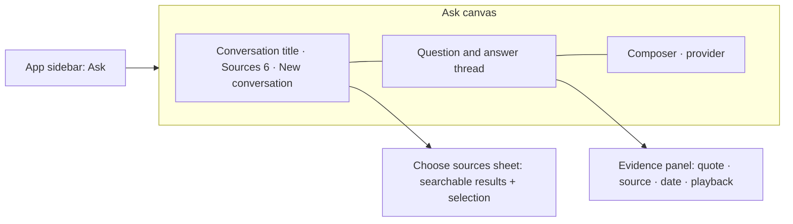
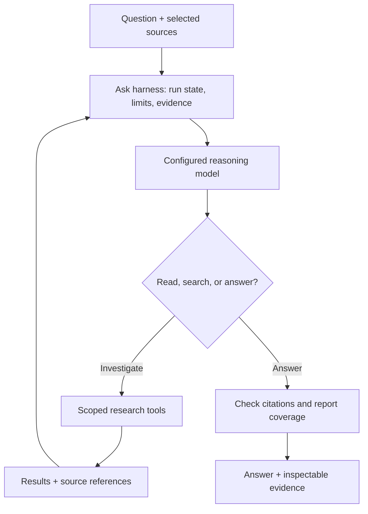
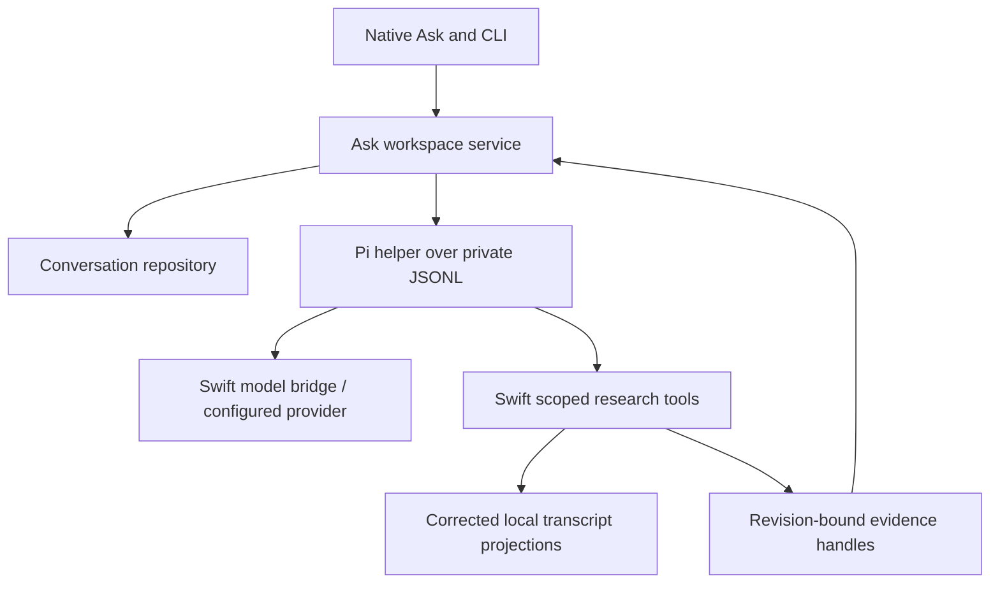
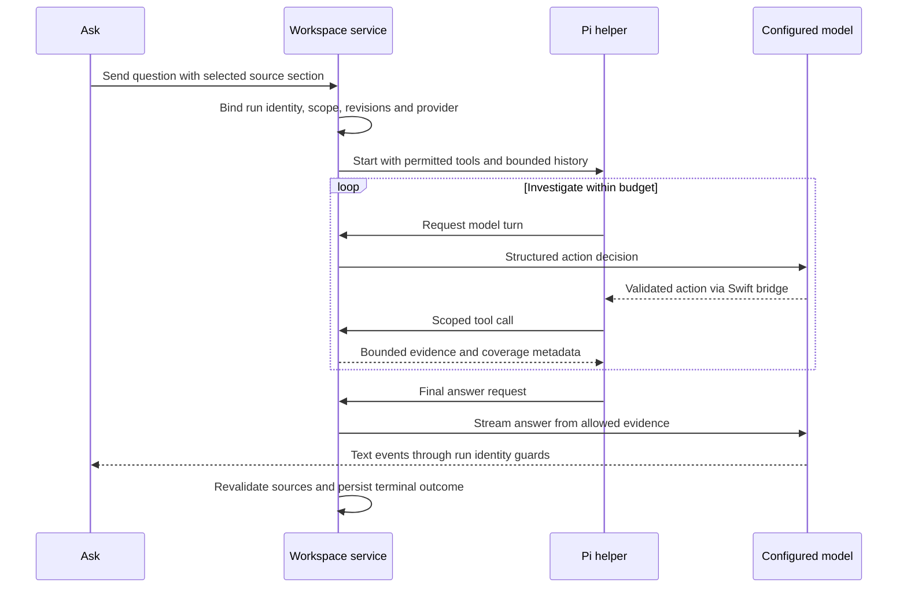
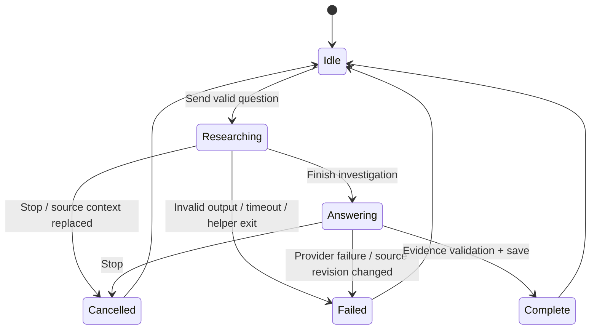

# Meeting Chat Workspace - Plan

## Goal Capsule

**Objective:** Help a MacParakeet user answer questions across a chosen set of meetings and other retained transcripts, verify the evidence, and resume that work later.

**Means:** A top-level Ask destination with a full conversation canvas, a searchable source picker, and a small agent harness for investigating the selected material.

**Product authority:** The user endorsed the overall direction and requested dedicated research, then suggested Pi as the harness. Explore Pi first while preserving the model-agnostic and app-owned source/evidence boundaries described in the [research folder](../research/2026-09-25-meeting-chat-workspace/README.md). The user subsequently authorized the focused first version below, including implementation and verification. Runtime and model claims must reflect the checks actually completed; stable-release publication is separate. [ADR-027](../../spec/adr/027-product-north-star.md), the existing privacy boundaries, and the current contracts remain authoritative.

**Execution authority:** The user authorized end-to-end planning, implementation, verification, and PR creation. Use the decision-change, commitments, and disagreement questions as the initial evaluation jobs. Implement a fresh context section when selected sources change. Preserve unrelated work and user data; no release publication is part of this task.

---

## Product Contract

### Summary

Add **Ask** beside Library as an agentic workspace for investigating selected recordings. Give the assistant a bounded loop to search, inspect, compare, and verify material before answering. Keep the main canvas focused on the conversation, with an expanded source picker and inspectable passage evidence.

### Problem frame

The existing chat is useful when the user already knows which transcript contains the answer. The user's proposed workflow crosses those boundaries: compare several discussions, follow a decision over time, or bring a selected set of meetings into one conversation.

Today, saved conversations belong to individual transcripts. Multiple saved chats for one transcript do not solve questions spanning several transcripts. Reopening recordings one by one leaves the user to assemble the context and reconcile the answers.

The strongest initial jobs are hypotheses to validate with the user:

- Before a recurring meeting: “What did we leave unresolved in the last four sessions?”
- When a decision changes: “How did the launch date change, and what explanation was given?”
- Across customer interviews: “Which objections came up repeatedly, and where did people disagree?”
- Across source types: “Compare this workshop recording with our follow-up meeting.”

The product should distinguish what was said from what happened outside the recordings. “No completion was recorded” is supportable; “the task is still unfinished” may not be.

### What exists today

Source inspection used working-tree HEAD `779e9b30f` on 2026-09-25. The checkout contains unrelated edits. These are source-level observations, not runtime or stable-release verification.

| Existing capability | Evidence | Consequence for this proposal |
| --- | --- | --- |
| Several saved chats per transcript | [ChatConversation](../../Sources/MacParakeetCore/Models/ChatConversation.swift), [chat view model](../../Sources/MacParakeetViewModels/TranscriptChatViewModel.swift), [feature scope](../../spec/02-features.md#f10c-transcript-chat-gui-mvp) | Reuse the familiar chat experience, but broaden ownership deliberately. |
| Required single-transcript ownership with cascading deletion | [DatabaseManager](../../Sources/MacParakeetCore/Database/DatabaseManager.swift), `chat_conversations` migration; [repository tests](../../Tests/MacParakeetTests/Database/ChatConversationRepositoryTests.swift) | A workspace cannot simply belong to its first selected transcript. |
| Search, source filters, labels, and multiple selection in Library | [Library view model](../../Sources/MacParakeetViewModels/TranscriptionLibraryViewModel.swift), [label UX](../../spec/04-ui-patterns.md#transcription-labels-popover) | Extend existing organization instead of adding a second tag system. |
| Bounded chat input with middle truncation of long transcripts | [LLMService](../../Sources/MacParakeetCore/Services/LLM/LLMService.swift), `buildChatSystemPrompt` / `truncateMiddle` | Concatenating many transcripts into today's input would hide missing evidence. |
| Corrected transcript projections, durable segments, and summary freshness receipts | [AI context formatter](../../Sources/MacParakeetCore/TextProcessing/TranscriptAIContextFormatter.swift), [PromptResult](../../Sources/MacParakeetCore/Models/PromptResult.swift), [CLI segment contract](../../spec/contracts/cli-json-v1.md) | There are useful foundations for accurate citations and stale-result handling. |
| Calendar occurrence and meeting identity in live calendar handling | [Calendar README](../../Sources/MacParakeetCore/Calendar/README.md), [saved snapshot](../../Sources/MacParakeetCore/Models/MeetingCalendarSnapshot.swift) | Saved snapshots retain identifiers but omit explicit recurrence and calendar identifier fields. Durable series grouping needs validation. |
| Segment search and file/stdin CLI chat | [SegmentRepository](../../Sources/MacParakeetCore/Database/SegmentRepository.swift), [LLMChatCommand](../../Sources/CLI/Commands/LLMChatCommand.swift) | Current query fields lack selected-transcript-ID restriction; workspace scope and structured citations need matching automation semantics. |

The current [ChatMessage](../../Sources/MacParakeetCore/Models/LLMTypes.swift) record does not supply a structured evidence receipt. Displaying a model-written timestamp is not sufficient to establish that the cited passage supports a claim.

### Approaches considered

| Approach | Best use | Tradeoff |
| --- | --- | --- |
| Add “Ask selected” to Library and keep chat as a contextual panel | Occasional questions about a few already-visible recordings | Smallest navigation change, but little room for sustained comparison or returning to a conversation. |
| A top-level Ask workspace with explicit sources | Repeated research, comparisons, and questions spanning recordings | Adds a destination and conversation lifecycle, but gives the user's proposed workflow a clear home. |
| Always search the whole Library and let the question imply scope | Discovery when the user cannot remember the meeting | Lowest selection effort, but selection mistakes and scope expansion are harder to notice. Better as a later, explicit scope option. |

**Recommendation: the second approach, with “Ask selected” as its Library entry point.** This examines the cost of another sidebar item rather than assuming every new capability needs one. Here the separate destination earns its place through persistence, space, and cross-recording work. Library remains the archive; Ask operates on references to that archive.

An alternative to making users organize first is to let them select a few recordings, ask immediately, and return to the saved conversation. The conversation itself remembers the source set. A separate collection or folder object is unnecessary for the first useful version.

### Proposed experience

**Navigation and canvas.** Use the plain name **Ask**, matching the existing live-meeting vocabulary. Place it adjacent to Library in the primary navigation. A conversation picker in the workspace header provides New conversation, recent conversations, and rename. Do not add a permanent history sidebar inside the app sidebar for the first version.

The header contains the conversation title and **Sources · 6**. The center contains a readable-width answer column with generous space around it. The composer stays at the bottom and shows the active local model or remote provider in quiet text. A compact source strip can name two selections and collapse the rest into “+4”; it must remain usable with long titles.

Selecting a citation opens an evidence panel to the right. At narrow window widths, show the same evidence as a sheet. Closing it returns focus and scroll position to the conversation. These regions describe the proposed composition, not a validated visual design:

**Expanded source picker.** A roomy sheet is appropriate for deliberate curation. Use a searchable list with checkboxes, source-kind and date filters, and the existing Labels vocabulary. Open on Meetings initially, with an obvious All sources option. A selected-items area remains visible as filters change; on smaller windows it can become a Selected tab with a persistent count.

Each row shows the title, date/time, duration when known, source kind, labels, and a short preview where useful. The date is essential for repeated titles. Avoid a cover-art grid: finding the right week matters more than recognizing artwork here. Preview a transcript or available summary without opening the full detail page.

Checkboxes and keyboard selection are primary. Internal drag-and-drop may add a recording to the selection, but must never move the original or be the only way to select. Use **Add sources** on initial selection and **Apply changes** on later edits. Cancel leaves the current source set intact. Label filtering changes the results, not the selection; choosing a label alone must not silently enroll its recordings.

Bulk selection must name its reach. An initial **Select visible results** can follow the existing loaded-row behavior. Do not label that action “Select all” when more matching rows are unloaded. A future **Select all 84 matches** needs to resolve the whole result set and show the resulting count before applying.

**Empty and unavailable states.** An empty conversation offers Choose sources and a small set of task-oriented example questions. Do not silently select recent meetings. With sources selected, replace generic prompts with a few relevant starting points, such as comparing discussions. Missing AI setup should link to existing settings and preserve the draft. Processing, empty, or failed transcripts remain recognizable in the picker with their availability explained; they cannot silently contribute an empty record as evidence.

**Visual finish.** Follow native typography, existing surfaces, and the project's action hierarchy. Reserve coral for the primary action. Prefer separators and restrained hover states over nested cards and gradients. Keep citations compact until inspected. Support light/dark mode, keyboard navigation, VoiceOver names that include source date, reduced motion, and stable scrolling during streaming. Curation should never erase a draft or unexpectedly jump the thread to the bottom.

### Context and answer behavior

**Selection is permission to use a source, not proof that every word was examined.** Expose three distinct facts in ordinary language: what is selected, what could be searched for this answer, and what actually supports its claims. An answer can cite three recordings from a selected set of twelve without implying that the other nine do not discuss the topic.

For a small source set, using complete corrected transcripts may be appropriate when they fit. For larger sets, find relevant passages within the selected records. Preserve source boundaries and dates throughout. Do not drop a meeting or the middle of its transcript without surfacing the limitation.

“What did we say about pricing?” and “List every pricing commitment across these twelve calls” impose different coverage requirements. The latter needs examination across each eligible source and explicit reporting of missing or incomplete material. A handful of relevant passages cannot support an exhaustive claim. If the configured model cannot complete the requested coverage, offer a narrower question or source set.

**Use summaries to orient, transcripts to substantiate.** Existing summaries can speed an overview or help locate material, but may omit disagreements, late decisions, or details that did not fit their prompt. Only compatible, current summaries should be treated as useful derived context; custom outputs such as translations or extracted tasks are not interchangeable summaries. User-edited results and personal notes remain labeled as such.

Recommend one default **Auto** experience rather than an obligatory Transcript/Summary selector. A later explicit **Summaries only** option could help with quick overviews, but its limitations must be visible and a follow-up must not quietly switch it to full transcripts. Transcript-level citations cannot be invented from a summary-only answer. If only a summary survives, identify it as the available source and say that the underlying transcript cannot be checked.

**Citations should explain the answer.** Prefer “Product sync · Sep 18 · 24:10” over opaque source numbers alone. Opening it shows the supporting passage and nearby context, plus playback if audio remains. Imported or edited text without reliable timing receives a text anchor, never a guessed timestamp. Mark a synthesis as an inference when it combines evidence rather than quoting an explicit decision.

**Changing scope must also change conversational context.** Simply unchecking a source while resending earlier assistant messages can leak its contents back into the answer. Proposed behavior: applying a changed source set starts a clearly marked section in the same visible conversation, with fresh model context. Earlier sections remain readable under their original source counts, but their answers and excerpts are not automatically fed into the new section. If “compare that with this” depends on excluded context, ask for clarification. Validate this behavior in a prototype; it is more consequential than the picker layout.

Each send freezes its source set and evidence versions. While an answer is streaming, source edits are staged for the next section. A late response remains attached to its originating question. Corrections or deletion during a request require revalidation before presenting an answer as current; preserve the user's question and explain when it needs to be run again.

### A small agent harness for Ask

**Recommendation: own Ask's research contracts and evaluate Pi's agent core as the first reusable runtime.** The user wants an assistant that can investigate a question, choose its next operation from the evidence, and revise its approach. A fixed search-then-answer pipeline does not fully express that intent. The harness is the code that maintains a run, executes permitted operations, feeds results back to the model, and decides when work must stop. MacParakeet must own the product rules around that loop; the loop's implementation may be reused.

Code Mode and RLM describe complementary mechanisms. [Code Mode](https://developers.cloudflare.com/agents/tools/codemode/) lets a model compose tool operations in executable code. The [RLM approach](https://alexzhang13.github.io/blog/2025/rlm/) keeps the corpus in an external environment that the model can inspect and partition, with model subcalls for selected portions. An agent loop can use ordinary tools without a REPL; an RLM-style REPL adds programmable working memory and context decomposition. Neither requires multiple named agents or unlimited recursion.

For Ask, prefer one lead reasoning model with a small set of capabilities: list selected source metadata, search selected material, read bounded passages, inspect current summaries, and retain findings with source references. A later restricted REPL could compose those capabilities, sort and compare results, and request bounded analysis of source subsets if evaluation demonstrates a benefit. Retrieval remains a capability inside the investigation. Simple questions should finish after a few useful steps, while comparative questions may examine each source and revisit contradictions.

| Harness responsibility | What MacParakeet should own |
| --- | --- |
| Source access | A fixed source selection and revisions for the run; enforce R5 and R9 on every read, including reads from generated code. |
| Execution loop | Validated operations, bounded iteration and model subcalls, failure handling, and cancellation. |
| Working memory | Source-tagged findings and computation results outside the prompt; invalidate excluded or stale material under R7–R9. |
| Evidence | Real source references and coverage records; validate reference existence separately from whether a passage supports a claim. |
| Product lifecycle | Save questions, answers, and user-meaningful progress without making a live interpreter necessary to reopen a conversation. |
| Provider boundary | Apply R10 to the lead model and every auxiliary call; a local execution runtime does not make remote reasoning local. |

The existing [LLM client](../../Sources/MacParakeetCore/Services/LLM/LLMClient.swift) already exposes completion, streaming, execution context, and structured-output capability. The inspected [chat service interface](../../Sources/MacParakeetCore/Services/LLM/LLMService.swift) accepts transcript text and returns answer text; it is not itself this investigation loop. The current `ChatMessage` roles are system, user, and assistant, so a portable tool-event protocol cannot be assumed to exist in that type. Reuse provider infrastructure, while qualifying each intended model's ability to choose operations and write reliable code. Successful text chat alone is insufficient qualification.

Own the source/evidence contracts and run lifecycle; evaluate reusable execution infrastructure before implementing a sandbox. A REPL must expose only explicitly supplied capabilities. Prompt instructions are not an isolation boundary. Filesystem, network, credentials, and process access should be unavailable except through approved application operations. The exact runtime and provider-adapter design remain implementation choices.

For example, “How did our launch plan change across these twelve meetings?” could lead to metadata inspection, per-meeting evidence extraction, chronological comparison, and targeted rereading of conflicting passages. The app can show “Reviewed 8 of 12 recordings” based on actual operations, with Stop and an expandable activity view. Display actions and source evidence, not private model reasoning. Source inspection counts describe activity, not proof of exhaustive understanding.

The first evaluation should establish a scoped-tool baseline using Pi; compare a REPL/subcall approach on the same questions only where the baseline exposes a relevant limitation. Measure missed evidence, unsupported claims, scope escapes, completion rate, latency, and total model usage across the run. If subcalls are later evaluated, start shallow and capped; increase flexibility only where it improves the measured task. This is agentic research over the user's recordings; permission to modify recordings or send results to other applications remains outside this proposal.

### Pi-first, model-agnostic runtime investigation

The user's follow-up makes Pi the first candidate to prototype. The dedicated [open-source harness comparison](../research/2026-09-25-meeting-chat-workspace/opensource-harnesses.md) examines its agent core separately from its coding-agent CLI and higher-level persistence facilities. The [model-agnostic design](../research/2026-09-25-meeting-chat-workspace/model-agnostic-design.md) defines the proposed Swift/provider bridge, capability checks, scoped tools, and adoption gates. Prefer reusable orchestration when it fits; source identity, evidence, privacy, and conversation ownership remain app responsibilities. No runtime has been adopted or integrated.

### Build versus reuse: OpenCode assessment

This earlier assessment is retained as an alternative. Pi is now the lead experiment.

**Verdict: OpenCode is a credible reuse candidate to compare with a small product-specific loop; production adoption is undecided.** Reusing an agent runtime could avoid rebuilding session handling, tool execution, streaming events, cancellation, and provider integration. The existing Swift LLM client is useful infrastructure, but its presence does not make a dependable agent runtime trivial to build. Conversely, adopting OpenCode does not supply meeting-specific scope, evidence, or data-lifecycle semantics.

Reviewed official documentation and upstream source on 2026-09-25. Code observations below use commit [`adee738d1e4597a2d0d317ca61a1625eff289efa`](https://github.com/anomalyco/opencode/tree/adee738d1e4597a2d0d317ca61a1625eff289efa), a development-branch snapshot, not a qualified release.

| Evidence | Implication for MacParakeet |
| --- | --- |
| OpenCode documents a headless HTTP/OpenAPI server, sessions, abort, and event streaming. [Server](https://opencode.ai/docs/server/), [SDK](https://opencode.ai/docs/sdk/) | Keep the native Ask UI and drive the runtime programmatically. No terminal UI is required. |
| Custom tools and MCP integrations are supported. [Custom tools](https://opencode.ai/docs/custom-tools/), [MCP](https://opencode.ai/docs/mcp-servers/) | Expose selected-recording operations through a narrow bridge; whole-Library filesystem access is unnecessary for the proposed tools. |
| The JS SDK launcher starts an `opencode` process; the inspected `@opencode-ai/core` package is marked private. [Launcher](https://github.com/anomalyco/opencode/blob/adee738d1e4597a2d0d317ca61a1625eff289efa/packages/sdk/js/src/server.ts), [core manifest](https://github.com/anomalyco/opencode/blob/adee738d1e4597a2d0d317ca61a1625eff289efa/packages/core/package.json) | The documented server is the practical first integration path. Do not assume an internal package is a supported embeddable Swift library. |
| OpenCode supports configurable providers and local models. [Models](https://opencode.ai/docs/models/) | A local endpoint is possible. Reusing MacParakeet's in-process Swift model requires a bridge or another explicit integration; it is not established by this provider support. |
| Configuration merges multiple locations, retaining non-conflicting settings. [Config](https://opencode.ai/docs/config/) | Test that unrelated user/project tools, plugins, and instructions cannot enter the managed Ask runtime. An override file alone is not proof of isolation. |
| OpenCode explicitly states that its permission system is not a sandbox. [Security model](https://github.com/anomalyco/opencode/blob/adee738d1e4597a2d0d317ca61a1625eff289efa/SECURITY.md) | Tool permissions are useful controls, but generated-code isolation remains a separate responsibility. |
| The inspected repository license is MIT. [License](https://github.com/anomalyco/opencode/blob/adee738d1e4597a2d0d317ca61a1625eff289efa/LICENSE) | Record the pinned distribution's license and dependency notices during packaging; source availability is not packaging qualification. |

**Alternative experiment if Pi proves unsuitable:** native Ask interface → a thin MacParakeet run adapter → a managed OpenCode process → scoped recording tools. OpenCode would handle orchestration and its model calls. MacParakeet would remain authoritative for selected sources, corrected text, source references, conversation ownership, and deletion. Session history retained by OpenCode must obey the same source-change and deletion semantics; it cannot become an untracked second copy of meeting data.

Use the documented API and a pinned runtime without forking core. Disable unrelated coding, shell, web, sharing, and plugin behavior in the managed configuration and verify the resulting behavior. Give any experimental code execution a separately isolated, bounded environment. OpenCode's shell and subagent support do not by themselves establish the persistent, source-aware REPL and controlled model-subcall interface proposed here.

Swift can call the documented HTTP API directly; a Node client layer is not intrinsically required. This is an architectural inference from the HTTP boundary, not a tested MacParakeet integration. A distributable version would need a managed executable, authenticated loopback transport, reliable child-process cleanup, and qualification with the app's signing/update flow. No startup, memory, bundle-size, or latency measurements have been made.

If evaluating this alternative, compare it with the Pi baseline using the same source operations and questions. The decision should turn on demonstrated integration cost and user behavior:

1. A cross-meeting question causes adaptive research and returns supporting passages with stable source identity.
2. Removing or deleting a source prevents reuse through tools, saved session history, compaction, or REPL variables.
3. Stop, window closure, app termination, and restart do not leave uncontrolled work or lose the saved conversation.
4. The selected local and remote model paths work without unexpected credential duplication or provider changes.
5. Managed configuration and code execution remain within the intended boundaries even when unrelated OpenCode configuration exists on the Mac.
6. A packaged prototype has acceptable startup, memory, and capture responsiveness, without user installation or setup of a developer runtime.

Consider adopting OpenCode if those checks pass with a thin adapter and it offers a concrete advantage over the Pi candidate. Prefer a smaller runtime or native loop if meeting semantics require invasive core changes, data ownership cannot be reconciled, or the extra process/provider boundary creates more work than it removes. Start with the scoped recording tools and evidence contract needed by either option, then compare execution approaches on the same tasks. No OpenCode runtime was installed or executed for this assessment, and no meeting data was sent to it.

### What current competitor evidence establishes

The follow-up [Circleback and Wispr Flow investigation](../research/2026-09-25-meeting-chat-workspace/competitor-evidence.md) materially sharpens the harness choice. Wispr Flow 1.6.937's shipped Notetaker code contains an explicit bounded model/tool loop over virtual meeting files, with saved trajectories and a remote agent-response service. It also has a separate Claude CLI extension integration; the inspected Notetaker path does not establish that this CLI integration powers meeting chat. A tool loop over virtual files is concrete agentic behavior, but does not itself prove arbitrary code execution or recursive model calls.

Circleback's freshly fetched public client supplies structured context, consumes tool-action and citation events, and calls a hosted assistant API. This establishes a product-specific assistant protocol; it does not expose the server's orchestration framework. Neither observation establishes that adopting OpenCode is necessary, nor that building everything ourselves is preferable. They support testing a small domain-tool loop before assuming a general REPL is required for good cross-meeting answers. Preserve the user's intended agentic capability while treating runtime and REPL selection as engineering questions.

### Recurring meetings, mentions, and graphs

**Recurring meetings are a valuable selection shortcut.** Offer chronological groups with counts and date ranges: “Product sync · 8 recordings · Aug–Sep.” Let users expand the group and include particular occurrences. Choosing a group adds its current recordings as an explicit snapshot; next week's meeting is not silently included.

The code has calendar identity primitives, but saved recordings do not yet establish a fully validated series model. Verify the calendar association's confidence, recurrence, and identity behavior before offering automatic series grouping. Similar or identical titles can supply a **Same title** candidate group for review. They must not merge unrelated 1:1s or imply a verified recurring series. Imported recordings can participate through explicit selection and existing labels.

A future saved rule such as “last six Product syncs” differs from a saved fixed set. If added later, show “2 new recordings available” or an explicit refresh before broadening a conversation. That gives recurring use a path forward without introducing automatic context drift now.

**Mentions are a shortcut, not the foundation.** Users should not have to memorize unique meeting names. A future `@` menu can search titles and show date, source kind, and a preview; the resulting token refers to a specific record. Within a conversation, default suggestions to already-selected sources. Adding an outside source should visibly update scope through the same curation flow. Mentions should not silently mean “replace the source set with this one recording.”

**A timeline is more useful than a graph for the first version.** “How did this decision change?” has a natural chronological answer with cited milestones. A node-link graph adds questions about what an edge means, how it was inferred, and how to correct it. ADR-027 explicitly excludes knowledge graphs. A simple timeline within an answer fits the current scope; an entity or relationship graph would need a separate product decision. Neither graphic proves causality or that a newer discussion supersedes an older decision.

### Recommended requirements

These requirements govern the focused first version authorized for implementation. Calendar grouping, mentions, drag-and-drop, a REPL, and semantic indexing remain later work.

**Workspace and selection**

- R1. Provide a persistent top-level Ask destination and an Ask selected entry from Library, while preserving existing single-transcript and live-meeting chat.
- R2. Let users select saved meetings and other existing Library transcripts by search, source kind, dates, and existing labels, with explicit source counts and an empty initial scope.
- R3. Preserve picker selections across filtering, apply edits together, and provide equivalent checkbox and keyboard controls for any drag operation.
- R4. Save conversation history, its source membership, and drafts across navigation without duplicating Library recordings or requiring a separate collection.

**Evidence and scope**

- R5. Bound every answer to the selected records and distinguish selected, available/searched, and cited material without claiming exhaustive coverage from retrieval alone.
- R6. Ground factual claims in inspectable supporting passages, with honest uncertainty, conflicts, and text anchors when accurate timing is unavailable.
- R7. Prefer current corrected transcript evidence, identify derived or user-authored context, and disclose incomplete source coverage instead of silently truncating it.
- R8. On source-set changes, create a visible context boundary that excludes earlier sections' source-derived material from subsequent model input.
- R9. Bind each request to its originating question, source set, and evidence versions; changes during generation must not attach an answer to the wrong context.

**Ownership and continuity**

- R10. Keep selection and retrieval local, identify the configured answer provider, and require an explicit external-context boundary for any remote reasoning or auxiliary model.
- R11. Keep removing a source from Ask, deleting a conversation, deleting a Library recording, and deleting audio as distinct actions with their consequences explained.
- R12. Provide local-agent access to equivalent source scope and evidence semantics through the established CLI contract, and preserve citations in answer copy/export where the format allows.

**Agentic investigation**

- R13. Let the assistant choose and revise a sequence of scoped research operations based on observed results, retaining inspectable source references through the investigation.
- R14. Bound each run's execution and model usage, support cancellation across nested work, and report useful progress or incomplete results when work cannot finish.

### Key decisions and rationale

- **A conversation remembers a fixed source set.** This avoids asking users to manage both conversations and collections before they get value. Governs R2, R4.
- **Expanded curation, compact everyday controls.** Space goes to selection when selecting and to answers when reading. Governs R2, R3.
- **One automatic answer strategy with visible evidence.** The app should absorb context-management work while remaining honest about coverage. Governs R5–R7.
- **Source changes start a new context section.** Preserving a visual thread must not reintroduce excluded material through its history. Governs R8, R9.
- **Meetings first, shared Library sources alongside them.** Existing labels already span these sources; artificially excluding imports would obstruct the stated comparison job. Governs R1, R2.
- **Application-owned research contracts with Pi as the first runtime candidate.** Prototype Pi agent core with only scoped recording tools and a provider bridge; MacParakeet retains authority over scope and evidence. OpenCode and a native loop remain alternatives. Governs R5, R9, R10, R13, R14; production adoption depends on qualification.

### Privacy and lifecycle details

Under R10, entering Ask or selecting a recording does not authorize uploading it. Before the first remote send, explain that the question, applicable conversation context, and selected-source excerpts go to the named provider. Keep the provider visible afterward; changes of provider or the addition of an auxiliary processor need their own clear context boundary. Remote failure must not cause an undisclosed provider switch. Local-only operation cannot depend on a remote reranker.

Under R11, removing a source changes future answer context; it does not erase historical messages. Make this visible in the source-change flow. Deleting only the audio leaves usable transcript evidence and removes playback. Deleting a recording removes it from future retrieval and marks its historical citations unavailable; it must not delete the entire conversation containing other sources. Existing chat text can still contain quotations or derived facts, so source-deletion UI must disclose that and offer a separate explicit way to delete affected conversations. Do not retain hidden full-transcript copies merely to make old citations look valid.

Old answers stay historical after a correction. Show that their source has changed, and offer to rerun the question; do not rewrite the old answer silently or highlight an unrelated current passage as if it were its original evidence.

### Key flows

- F1. **Start from Library.** Select four recordings, choose Ask selected, review the four-source scope, and ask a question. A citation opens evidence without losing the thread. Covers R1–R7.
- F2. **Curate from Ask.** Create a conversation, search and filter in Choose sources, preview an ambiguous repeated title, apply the selection, and send. Canceling the picker preserves the composer. Covers R2–R4.
- F3. **Change the comparison.** Remove one meeting and add an imported interview. Apply changes, see the new context section, and ask a question grounded in the new set. Earlier answers retain their old scope. Covers R8, R9.
- F4. **Resume later.** Reopen a saved conversation, inspect its selected sources and any missing/changed status, and continue without rebuilding the selection. Covers R4, R7, R11.
- F5. **Investigate across meetings.** The assistant inspects selected sources, searches and reads evidence, revisits a contradiction, and returns a cited comparison; the user can inspect activity or stop the run. Covers R5–R7, R13, R14.

### Acceptance examples

| Example | Expected result | Covers |
| --- | --- | --- |
| AE1. Three recordings share the title “Weekly sync” | Picker shows their dates; every citation identifies the intended recording. | R2, R6 |
| AE2. Filtering hides two already-selected recordings | They remain selected and reachable in the selected-items area. | R3 |
| AE3. A relevant reversal occurs near the end of a long meeting | The workflow can find that passage; an earlier summary alone cannot establish the final answer. | R5–R7 |
| AE4. The user asks for every commitment across twelve recordings, but one is unavailable | The answer identifies the gap and cannot claim complete coverage. | R5, R7 |
| AE5. A source is removed after its facts appeared in the thread | The next section does not resend those answers or excerpts automatically. | R8 |
| AE6. Sources change while an answer streams | The response remains under the question and scope that started it. | R9 |
| AE7. Audio has been deleted but transcript text remains | Citation opens the passage and explains why playback is unavailable. | R6, R11 |
| AE8. A cited transcript is corrected or deleted | The old answer is marked historical or its source unavailable; new answers cannot retrieve stale/deleted evidence. | R7, R9, R11 |
| AE9. A user selects sources with a remote provider configured | Selection alone sends nothing; the send boundary identifies the recipient and context categories. | R10 |
| AE10. A transcript contains instructions to ignore scope or upload other meetings | Its text remains evidence, with no authority to expand selection or invoke actions. | R5, R10 |
| AE11. An imported transcript has no timing data | Citation uses a source text location rather than a fabricated playback time. | R6 |
| AE12. A run reaches its limit or the user stops it during a subcall | Further work stops and late results cannot revive the run; the UI preserves the question and accurately marks any partial answer. | R9, R14 |
| AE13. The assistant's initial search misses the answer but finds a conflicting passage | It can inspect surrounding material or change its query within the same selected scope before answering. | R5, R13 |

### First version and later options

The first coherent slice is a saved Ask conversation with explicit multi-source selection, a bounded research loop, reliable scope enforcement, passage evidence, and a way to resume it. Source selection alone is not a complete feature if answer context still silently loses relevant material. Demonstrate those behaviors on a bounded set before promising whole-Library intelligence. A restricted REPL and model subcalls are not required for this slice; evaluate them later if the scoped-tool baseline exposes a relevant limitation.

Follow with calendar series grouping once identity is qualified, internal drag-and-drop if it helps observed workflows, and `@` shortcuts. Reusable selection rules, all-Library discovery, and a summaries-only mode are later options, not first-version requirements. A chronological comparison can initially be ordinary cited answer content rather than a separately maintained visualization system.

Saved dictations remain deferred: their shorter records and separate history surface deserve an explicit inclusion/privacy decision. The source picker can accommodate them later without making them part of the initial default. Arbitrary document upload, web research, live multi-meeting capture, team collaboration, automated sending, task management, and knowledge graphs are outside this proposal.

### Engineering implications to preserve in planning

This exploration does not choose storage schemas, an embedding model, or a UI component architecture. It does establish the boundaries that a plan must account for:

- Generalize conversation ownership without breaking existing transcript chat or its live-to-saved handoff. Audit deletion and migration behavior explicitly.
- Enforce the selected-source boundary before candidate retrieval and again when assembling model context. A result-limit followed by post-filtering can miss selected evidence.
- Preserve current transcript corrections and durable passage identities. Track answer evidence freshness without inventing timings or retaining deleted source bodies.
- Budget source material, history, instructions, and response capacity together. Exhaustive comparisons need source-by-source coverage, not just the top search hits.
- Keep capture and UI responsiveness ahead of indexing, retrieval, and generation. Do not load many full recordings just to open the picker.
- Update the governing feature, privacy, and CLI contracts with implementation. Verify keyboard and native-window behavior in the app; a browser sketch cannot prove it.

The TypeSafe skill applies to future bounded judgments. Candidate uses are passage relevance ranking, question-coverage classification, and checking whether evidence supports a claim. Prefer Jev when evaluating those judgments within the authorized provider/privacy boundary; code owns source membership, identity, budgets, freshness, and execution. Open-ended synthesis belongs to the answer model. TypeSafe's [reranking](https://docs.typesafe.ai/cookbooks/rerank_typesafe) and [citation-checking](https://docs.typesafe.ai/cookbooks/citation_check) cookbooks provide patterns to evaluate, not accuracy guarantees for meetings. No Jev inference was used in this exploration.

### Success criteria

Use representative, consented or synthetic libraries to compare this flow with opening transcripts individually. Measure time to assemble context and answer the question, mistakes selecting repeated titles, ability to inspect evidence, unsupported claims, missed late passages, and scope leakage. Include contradictory meetings, missing summaries, corrected transcripts, mixed sources, and evidence in more than one language.

A usability session should establish that users can find and select the intended recordings, understand what the next question will use, inspect a claim, and resume a conversation without instruction. Evaluate an empty library, a small set, and a long history at both compact and wide native window sizes. Numerical speed, source-count, and model-quality targets should follow baseline measurements rather than appear as unsupported promises here.

### Outstanding questions

**Resolved for this implementation**

- Use the decision-change, commitments, and disagreement questions with synthetic fixtures. The user accepted these evaluation jobs.
- Applying source changes creates a visible context section; older sections remain readable but do not enter later model input. Verify this through the real UI and persistence path.

**Qualification and future research**

- What source counts, transcript lengths, supported local models, and Mac configurations can meet an acceptable answer-quality and responsiveness baseline?
- Current summaries must match current source hashes and correction revisions; legacy or stale outputs do not qualify. Measure useful coverage with fixtures.
- How can calendar series identity be qualified for existing and newly recorded meetings without guessing from titles?
- U1 and U3 define the additive persistence and CLI contracts, including explicit conversation deletion and unavailable historical evidence.
- U2 qualifies Pi packaging, cancellation, source lifecycle, and resource constraints. REPL execution remains out of scope.
- OpenCode remains comparative research; Pi is the chosen implementation dependency.
- U2 enforces finite turns, frame sizes, input and answer budgets, and a deadline. U3 rebuilds each turn from the active section only; there are no nested model calls.

### External patterns and research boundaries

Google's current [NotebookLM/Gemini Notebook chat documentation](https://support.google.com/gemininotebook/answer/16179559?hl=en) describes per-source inclusion controls and citations that open the supporting context. Those are useful patterns for explicit selection and verification; its broader notebook feature set is not proposed here.

Granola's current [meeting-chat documentation](https://docs.granola.ai/help-center/getting-more-from-your-notes/chatting-with-your-meetings) describes chat scoped by an individual meeting, selected meetings, folders, or the home view. The fetched current page says next-generation chat does not require manually toggling transcripts. Older indexed text described manual summaries/transcript limits; those older limits are not treated as current product facts here.

These sources establish that the interaction patterns exist, not that they will work well in MacParakeet or that either product's answer quality was evaluated. The recommendation starts from MacParakeet's user-controlled local corpus and [private speech memory direction](../../spec/adr/027-product-north-star.md). Source review, documentation, and link checks are the evidence from this exploration; native UX, retrieval quality, model performance, and migration safety remain untested.

---

## Planning Contract

Product Contract unchanged in scope. The execution authority and previously open evaluation questions above now reflect the user's implementation request.

### Key technical decisions

- KTD1. **Reuse published Pi agent core 0.87.1 through a private helper.** Lock npm versions and integrity, bundle JavaScript, and reuse the official Node runtime already packaged by `scripts/dist/build_app_bundle.sh`. Pi owns the adaptive loop; no coding-agent CLI, shell tools, web tools, plugins, or provider credentials enter the helper. This implements R13–R14. (session-settled: user-approved — chosen over writing a new native loop first: reuse orchestration while retaining app-owned meeting semantics.)
- KTD2. **Bridge the existing model clients through validated structured actions.** The current `ChatMessage` is text-only. Request a bounded JSON operation decision through `RoutingLLMClient`, translate it to Pi tool calls, and stream the final answer through the existing detailed-stream interface. This compatibility adapter adds a decision request before final generation; it is not native provider tool calling. Reject malformed operations, cap retries/turns/output and deadline, and propagate cancellation through every boundary. Do not fall back to another provider. Implements R10, R13–R14.
- KTD3. **Give Ask independent persistence.** Add an `ask_conversations` domain separate from transcription-owned chats. Preserve ordered source sections and messages with revision-aware writes, draft persistence, and explicit deletion. Store citation references and bounded quoted evidence rather than full transcript copies. Source membership has historical identity, so deleting a recording must not cascade the whole conversation. Concurrent GUI/CLI writes must fail safely instead of silently replacing newer state. Implements R4, R8–R12.
- KTD4. **Enforce scope in Swift tools.** Source metadata, lexical passage search, bounded passage reads, and current-summary reads operate only within the run's fixed source IDs and content fingerprints. Read current corrected projections and derive segments with `KnowledgeSegmenter`; legacy edited transcripts use the edited clean text and untimed pseudo-segmentation, never old word timestamps. No stale derived index can widen scope. Validate citation handles and source versions before completing an answer and again when opening evidence. Search is lexical in this version, with no claim of semantic or exhaustive coverage. Implements R5–R9.
- KTD5. **Native restrained workspace.** Use the existing app sidebar and action/Markdown components. Center the reading column; keep history in the header; put source curation in a large sheet with results and selected items; use an evidence inspector or compact-width sheet. Preserve draft, focus, selection, and scroll position. Design with system typography and existing semantic surfaces, reserving coral for primary actions. Implements R1–R4, R6.
- KTD6. **One service for GUI and CLI.** Share conversation, selection, run, evidence, and cancellation behavior in Core. Add `macparakeet-cli ask` commands and document the additive JSON contract. Remote inference needs explicit context permission in both surfaces; local operation never invokes a remote helper model. Implements R10–R12. Jev may later rank candidates or check claim support, but no external semantic helper is required for this implementation.

### High-level technical design

These sketches express ownership and lifecycle, not prescribed class signatures.

### Integration and risk decisions

The current base is `origin/main` at `dd7945459`; unrelated working-tree changes remain outside this branch. Existing single-transcript/live Ask, recording, and library data must retain their behavior. Additive migrations must work for new and existing databases. Use deterministic synthetic fixtures for routine tests; inspect private recordings only if needed, and do not transmit them as part of qualification.

Source changes create fresh model context, including removal of old assistant answers and tool results. A provider change must not replay opaque provider state. Keep a model run's input within an explicit budget; report a bounded-context failure rather than silently dropping selected meetings. Reopening a conversation does not restart tools. Errors and interrupted responses stay distinguishable from completed answers.

The helper is a bundled dependency, not an arbitrary execution feature. Use a minimal process environment, private pipes, frame-size limits, request matching, an absolute runtime path, and reliable terminate/kill cleanup. Packaging must include the helper and Node in the app and CLI distribution paths. No npm install occurs on end-user launch. Published package APIs were checked against npm 0.87.1, whose `gitHead` differs from the earlier research snapshot; the lockfile is the dependency authority.

### Scope and sequencing

Implement the focused version described in the Product Contract. Recurring-series rules, `@` mentions, drag/drop, embeddings, code execution, recursive submodels, and actions in external apps are out of this implementation. One feature branch and one reviewable PR with logical commits is the initial delivery strategy. Split only if implementation reveals independently useful, verifiable landing boundaries.

---

## Implementation Units

### U1. Durable workspace and scoped evidence

- **Goal:** Persist independent Ask conversations and expose correct, bounded source tools. Covers R2, R4–R9, R11; F2–F4; KTD3–KTD4.
- **Files:** new `Sources/MacParakeetCore/Models/AskWorkspace.swift`, `Database/AskConversationRepository.swift`, `Services/Ask/AskSourceService.swift`; additive `Database/DatabaseManager.swift` migration; tests under `Tests/MacParakeetTests/Ask/`.
- **Approach:** Define shared value contracts first. Reuse corrected projections, source metadata, existing labels, and segment derivation. Keep synchronous GRDB work behind an async service boundary. Prevent deleted conversations from being recreated by late writes.
- **Test scenarios:** database round-trip, empty/duplicate selections, ordered sections, concurrent stale writes, deleted sources, corrected/retranscribed evidence, repeated titles, untimed imported text, long passages, malformed/out-of-scope source and evidence IDs, and stale summaries.

### U2. Pi helper and provider bridge

- **Goal:** Execute the actual Pi loop with only application tools and existing model configuration. Covers R10, R13–R14; F5; KTD1–KTD2.
- **Files:** new `Sources/AskAgentHelper/` package, lockfile, bundle and behavior tests; new `Sources/MacParakeetCore/Services/Ask/PiAskAgent.swift` and supporting bridge files; `scripts/dist/build_app_bundle.sh`, `scripts/dev/run_app.sh`, helper build script, standalone CLI package layout and Homebrew scaffold; tests under `Tests/MacParakeetTests/Ask/`.
- **Approach:** Build a bundle with reproducible npm dependencies and register a small fixed tool schema. Use private versioned JSONL between Pi and Swift. Pi's injected model stream requests model work through Swift; all provider calls keep credentials outside the helper. Expose genuine final text streaming.
- **Test scenarios:** actual Pi tool/result continuation using a scripted host; malformed JSON action, unknown tool, oversized frame, wrong request/run ID, helper exit, deadlines, max turns, cancellation during both model and tool work, no silent cloud switch, and unknown usage accounting, and a standalone installed CLI package smoke check without repository-relative helper lookup.
- **Execution note:** Prove the published package and actual IPC smoke path before depending on the helper in the UI.

### U3. Shared run orchestration and CLI

- **Goal:** Bind runs to source sections and expose the same lifecycle through GUI and automation. Depends on U1–U2. Covers R5–R14; F3–F5; KTD2–KTD4, KTD6.
- **Files:** new `Services/Ask/AskWorkspaceService.swift`; `Sources/CLI/Commands/AskCommand.swift` and command registration; `Tests/MacParakeetTests/Ask/AskWorkspaceServiceTests.swift`, CLI contract tests.
- **Approach:** Freeze provider/source revisions, obtain remote-context permission, emit source activity and text events, validate completion, and persist completed/failed/cancelled outcomes. Rebuild active context from only the current section. Enforce one active run per conversation and safe conflicts across processes.
- **Test scenarios:** real in-memory DB + source tools + scripted agent flow; source removal excludes prior assistant facts; correction/deletion during generation; empty source set; late responses after Stop; retry without lost history; independent simultaneous conversations; GUI-equivalent CLI scope and citations.

### U4. Native workspace and source picker

- **Goal:** Deliver the polished daily workflow. Depends on U1 contracts and U3 service contract. Covers R1–R4, R6, R8, R10–R11, R14; F1–F5; KTD5.
- **Files:** new `Sources/MacParakeetViewModels/AskWorkspaceViewModel.swift`, `Sources/MacParakeet/Views/Ask/`; update `MainWindowView.swift`, `MainWindowState.swift`, app composition, and Library selection action; `Tests/MacParakeetTests/Ask/AskWorkspaceViewModelTests.swift`.
- **Approach:** Header conversation menu, source control, readable-width stream, compact composer and provider disclosure. Expanded source sheet uses existing labels plus search/type/date filters, retained selection and preview. Evidence opens with source/date and appropriate timed or text anchor. Empty, unavailable, loading, error, remote consent, streaming and cancellation states must be designed.
- **Test scenarios:** source selection survives filters/cancel; applying scope changes preserves draft and marks history; navigation/reopen restores state; stale async loads cannot replace a new selection; Stop is immediate; dark/light and compact/wide layouts; keyboard and accessible control labels; no scroll jumps while reading old messages.

### U5. Contracts, architecture, and distribution documentation

- **Goal:** Keep current documentation aligned with implemented behavior. Depends on U1–U4. Covers R10–R12; KTD1–KTD6.
- **Files:** new `spec/contracts/ask-workspace.md` and next available ADR; relevant sections of `spec/01-data-model.md`, `02-features.md`, `03-architecture.md`, `04-ui-patterns.md`, `11-llm-integration.md`, `spec/README.md`, CLI README/changelog and `integrations/README.md`; helper and database README updates; research index.
- **Approach:** Record runtime pin and compatibility adapter, local/cloud boundary, source lifecycle, evidence semantics, additive CLI fields, packaging and verification limitations. Preserve release-channel distinctions.
- **Verification:** Cross-check every claimed behavior against implementation and tests; validate local links. Documentation alone does not qualify a model or release.

### U6. Integrated verification and review

- **Goal:** Prove the user workflow and prepare a reviewable PR. Depends on U1–U5.
- **Files:** focused Ask fixtures/tests, native QA evidence, and PR description. No production-only diagnostic scaffolding.
- **Approach:** Run deterministic tests against real Pi plus a scripted model transport; exercise synthetic decision-change, commitments and disagreement questions. Build the native app in an isolated state directory and inspect actual rendered screens with Accessibility/screenshots. Test configured remote/local models only with synthetic inputs. Record unavailable model/runtime qualification explicitly.
- **Verification:** Focused tests during iteration, Swift build/native build, formatting, independent correctness/privacy/lifecycle/design reviews, no-mistakes gate, and one final full `swift test` run. Review actual PR CI/comments after pushing. Do not publish a stable release.

---

## Verification Contract

| Boundary | Required evidence |
| --- | --- |
| Persistence/source scope | Focused `swift test --filter Ask` suite using real in-memory GRDB, including stale writes and source changes |
| Pi runtime | Helper package behavior tests using installed pinned Pi; IPC integration with scripted host and cancellation |
| Provider adapter | Captured emitted structured-action and final-stream interfaces, malformed-action failures, configured-provider preservation; synthetic live qualification where available |
| UI | Native dev build through `scripts/dev/run_app.sh`; screenshots at compact/wide sizes and light/dark, source selection, citation inspector, streaming/Stop, saved conversation |
| CLI | Additive help/JSON contract checks through the executable or command parser and shared service |
| Final gate | Independent reviews, `no-mistakes` where available, full `swift test` at most once, CI and review-thread inspection on final PR head |

## Definition of Done

The focused Ask workflow is implemented in the native app and CLI with a real pinned Pi loop, explicit model adapters, durable scope sections, inspectable revision-aware evidence, cancellation, and honest incomplete outcomes. Relevant docs/specs/ADR and focused regression tests are updated. The native app builds and the implemented screens are visually inspected. Verification results and any unavailable live-model qualification are recorded accurately. A PR is opened with logical commits and review findings addressed; stable release publication is outside this task.

## Implementation Status and Accepted Decisions (2026-09-25)

The implementation units above have been delivered in the `feat/meeting-ask-workspace` development branch. This status records implementation scope only; it does not claim that every verification gate in the table above has passed. The parent task records current build, test, GUI, and live-model evidence separately.

- Persistence is a dedicated Ask conversation row with bounded JSON payload, integer compare-and-swap revision, and a 45-second run lease renewed every 15 seconds. The conversation is independent of source rows, so source deletion does not delete research history.
- A source change starts a fresh context section. Later runs include only completed question-and-answer pairs from the active section with the matching source revision map; prior sections and incomplete, failed, cancelled, or stale messages are not replayed.
- A run snapshots at most 32 selected completed recordings. Retrieval uses canonical effective transcript passages, including untimed legacy edited text and long derived chunks. Search is lexical and interleaves sources round-robin; it is not a semantic or exhaustive search guarantee. Only current linked result-category summaries are eligible, and used summary receipts are revalidated with source revisions in the final write transaction.
- Citation records store source UUID, revision, canonical passage index, and optional title/date display snapshots, not copied quotations. The evidence panel opens the source in Library and may show a timecode; existing Library playback controls remain the playback surface, with no programmatic seek handoff.
- A private Node helper runs pinned Pi `runAgentLoop` 0.87.1 with four read-only source tools. A structured one-action JSON bridge drives model decisions and final text streams through the configured Swift client; this is not provider-native function calling. The helper has no credentials or general-purpose shell, filesystem, web, or plugin tools.
- Ask supports direct model providers and rejects Local CLI. In-process/Apple Intelligence and Ollama/LM Studio loopback are the local consent-free routes. Other endpoints, including generic OpenAI-compatible loopback URLs, need exact-provider consent. Provider choice is frozen and there is no fallback. CLI Ask is additive at version 4.7.0 in this development source; this does not change a stable app release.
- Before helper work, the user question and durable `incomplete` assistant placeholder are written. Complete, failed, and cancelled results remain distinct; an interrupted process can leave the placeholder incomplete for recovery/inspection.
- Deferred work remains `@` mentions, graph views, a REPL, embeddings, calendar-series grouping, and implicit whole-Library search.
