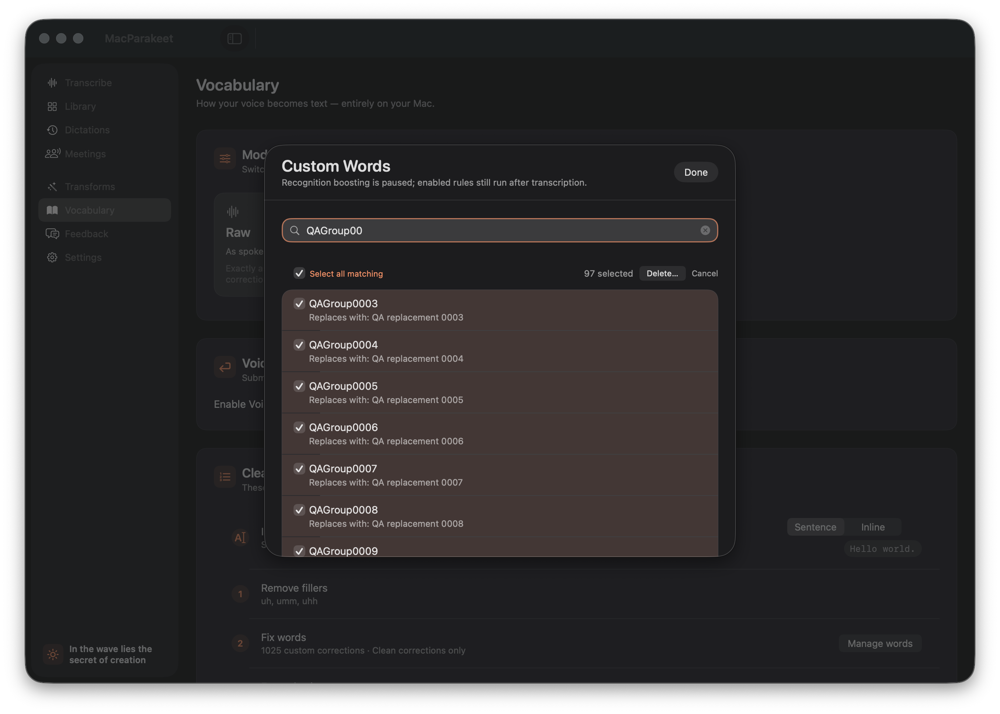
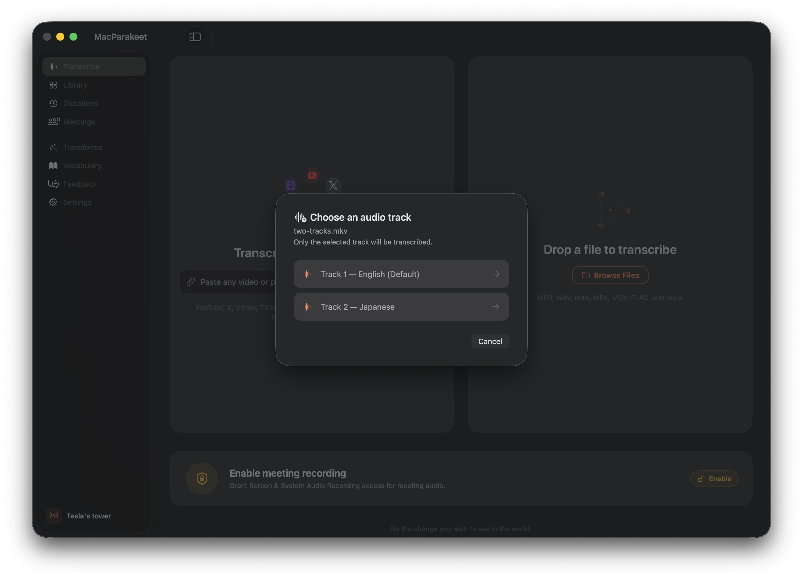
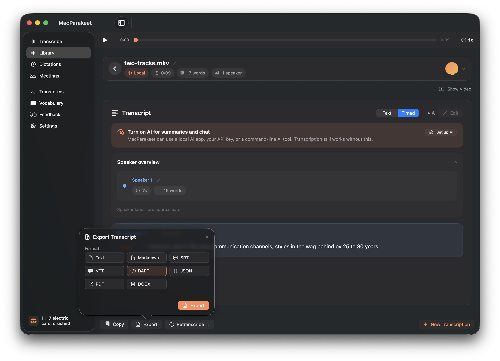
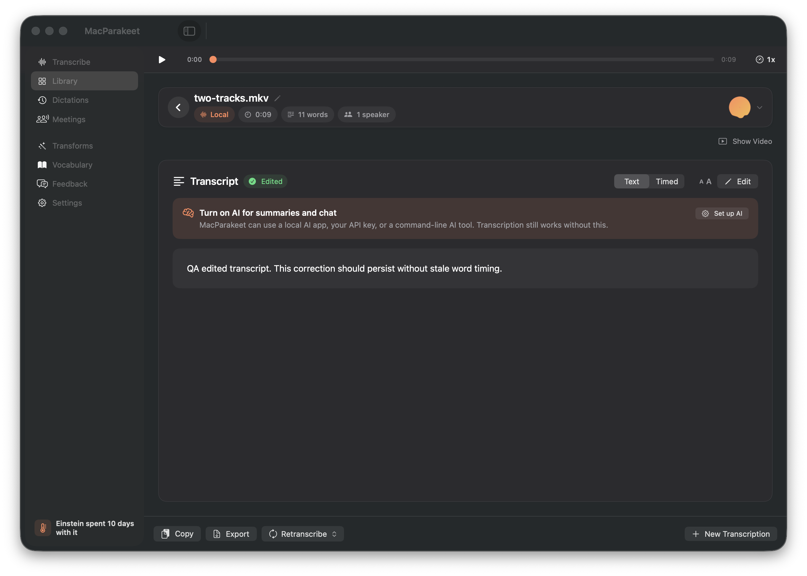

# GUI runtime verification

The baseline GUI passed the observed vocabulary bulk-deletion, track-selection, transcript-editing, DAPT-export, and library-layout scenarios below. **These results apply to source `8548c099af5ee2ab0ed4dd9efe757d85c498cca0`, before the release QA fixes.** They do not establish GUI verification of the final release candidate.

## Candidate, isolation, and evidence

- Root performed the live interactions and database checks. This report was assembled from those contemporaneous observations, inspected screenshots, and saved persistence/validator outputs; the documenting agent performed no GUI actions.
- The GUI was a copied Xcode Release dev product with unique bundle ID `com.macparakeet.qa.release080`, displayed version `0.8.0`, and observed PID `98237`. It was a QA copy, not the notarized distribution artifact.
- Root verified the redirected Foundation home and actual open SQLite path under `/tmp/macparakeet-080-qa/isolated-home`. The unique bundle ID isolated ordinary GUI preferences. Fixed named preference suites and shared Keychain services were not assumed isolated; no saved provider credentials were changed.
- Telemetry was disabled. Fixtures were synthetic vocabulary/snippets and a local two-track media fixture containing public audio. Personal databases, recordings, and transcripts were not copied into the QA environment.
- [Curated evidence manifest](evidence/gui/manifest.json) records SHA-256 hashes, dimensions, and source filenames for 13 individually inspected app-window screenshots and four reviewed log/JSON copies. All were copied unchanged. File-panel screenshots, Apple Recents metadata, and raw AX trees are excluded.

The earlier [runtime log](runtime-log.md) records setup and initial attempts. This report records the later completed interactions without treating those earlier tool failures as application failures.

## Vocabulary selection and deletion

Setup used a CLI-imported synthetic vocabulary fixture plus an earlier GUI-created word: **1,025 word rules, including 102 disabled rules, and one separate snippet**. Bulk deletion itself used the actual GUI. This does not claim that the GUI import dialog imported the large fixture.

| Scenario | Expected outcome | Observed outcome | Verdict |
| --- | --- | --- | --- |
| Open the large words manager | Show the word-rule count and selection entry point | Manager displayed `1025 · 102 off` and `Select…`; ordinary rows retained their individual controls | PASS |
| Select two words; request deletion; cancel | Confirmation names the selected count; cancellation preserves data | `Delete 2 Words?` appeared; cancelling preserved the rules | PASS |
| Confirm deletion of those two words | Delete only the selected words | Manager then displayed 1,023 word rules, still 102 disabled; the first remaining fixture word was `QAGroup0003` | PASS |
| Filter `QAGroup00`; select all matching; cancel deletion | Select only the 97 matching words; cancellation preserves the database | UI showed `Select all matching` and `97 selected`; root's database check remained at 1,023 word rules | PASS |
| Confirm deletion of those 97 matches | Remove matching words and preserve the remaining vocabulary | Root's database count became 926; the filtered manager showed `0 of 926` and `No matches` | PASS |
| Clear search; select all 926; confirm deletion | Delete remaining word rules, including disabled ones, while preserving the snippet | Confirmation read `Delete 926 Words?`; database ended with zero word rules and one untouched snippet | PASS |
| Close and reopen the words manager | Show the persisted empty word state | The manager remained empty | PASS |

The observed word-count sequence was `1025 → 1023 → 926 → 0`; cancelling the two confirmation scenarios did not advance that sequence. Closing and reopening the manager is the observed UI persistence check; a fresh process launch after the final deletion is not claimed here.



Further screenshots: [initial 1,025 words](evidence/gui/vocabulary-1025-ordinary.png), [two-word confirmation](evidence/gui/vocabulary-delete-confirmation.png), [1,023 words remaining](evidence/gui/vocabulary-deleted-two.png), [no matches with 926 retained](evidence/gui/vocabulary-filter-deleted.png), [926-word confirmation](evidence/gui/vocabulary-delete-all-confirmation.png), and [empty words manager](evidence/gui/vocabulary-empty-after-delete.png).

## File track selection and timed transcript

Root opened `two-tracks.mkv` through the actual native file picker. The app presented `Track 1 — English (Default)` and `Track 2 — Japanese`. Cancelling the track chooser left **zero transcription records**. Reopening the fixture and selecting English completed one transcription.

The [database receipt](evidence/gui/gui-track-persistence.json) contains exactly one completed row with `fileName: two-tracks.mkv`, `audioTrackOrdinal: 0`, and `durationMs: 9600`. The zero-based persisted ordinal matches the first displayed audio track. The result opened in the library, and switching to Timed displayed a speaker overview and a timed transcript row.

**PASS:** visible language/default labels, cancellation without a record, selected-English completion and persistence, and timed presentation. This does not certify Japanese selection through the GUI, recognition accuracy, playback/seek behavior, or the later cache fix. Separate CLI selection and inference evidence is in [file-audio-runtime.md](file-audio-runtime.md).



[Timed result screenshot](evidence/gui/transcribe-timed-result.png).

## DAPT export from the GUI

Root selected DAPT in the export popover and used the native save flow. The first attempt failed because the redirected fixture home lacked a `Downloads` directory. Root created that owned directory and repeated the export; the app showed a success toast and wrote `/tmp/macparakeet-080-qa/isolated-home/Downloads/two-tracks.dapt.xml`.

The actual exported file was passed to the local BBC TTML validator in DAPT mode. Root recorded **exit 0**. The [validation log](evidence/gui/gui-dapt-validation.log) reports a valid DAPT document; the [structured result](evidence/gui/gui-dapt-bbc.json) contains 19 passes, three informational results, and one optional missing-copyright warning. Its `xml_xsd` result explicitly reports that DAPT XSD validation passed. Validator provenance and the separate three-fixture validation matrix are documented in [dapt-runtime.md](dapt-runtime.md).

**PASS after fixture setup correction:** GUI selection, file creation, and BBC validation of the actual GUI export. The absent fake-home directory was an environment setup failure. The toast is a root observation, not supported by the saved `transcribe-export-dapt-success.png`: that image is only 4×4 pixels and was excluded. The inspected screenshot below establishes format selection; the file-validation output establishes the export result. An additional standalone XSD command against this same GUI file is not claimed.



## Transcript editing and library layouts

The first PID-targeted edit input did not change the bound editor text. Saving that attempt left the original transcript visible; the filename `transcribe-edited-saved.png` does not prove a successful edit. Root subsequently clicked the editor and sent Unicode input through the active session, verified the intended text appeared, and pressed Save.

The [saved database receipt](evidence/gui/gui-edited-persistence.json) shows:

```json
{
  "clean": "QA edited transcript. This correction should persist without stale word timing.",
  "isTranscriptEdited": 1,
  "audioTrackOrdinal": 0
}
```

The same receipt retains the original `raw` transcript. The later screenshot shows the new text and the `Edited` badge. **PASS:** the actual GUI edit persisted as clean text, preserved raw text and the selected-track ordinal, and displayed its edited state. The wording of the fixture text is not proof that timing metadata was deleted or that every post-edit timed action was exercised.



Root also used the library's grid/list controls and observed both layouts with the fixture record: [grid](evidence/gui/library-grid.png) and [list](evidence/gui/library-list.png). **PASS for layout switching with this record.** Those captures are not evidence that a large library was exercised or that the list preview refreshed after the final successful edit.

## Computer-use methodology and pitfalls

| Observation | Working method or implication |
| --- | --- |
| Synchronous `AXPress` on a button entering `runModal` returned error `25204` even when the panel opened | Discover the current windows and inspect the actual panel before retrying. An AX timeout alone is not an app failure. |
| File-panel keyboard delivery initially missed its target | Raising the actual open panel with `AXRaise`, then sending session-level Command-Shift-G, enabled direct navigation to the owned fixture path. |
| Direct AX value-setting changed a visible field without updating the SwiftUI binding | Treat the save result and database as the assertion. Do not equate an AX value-set success with user typing. |
| PID-targeted event delivery worked in an earlier word-add flow but did not change the later transcript editor | Verify each field's visible value after input. The successful editor retry used a real click followed by Unicode input through the active session. |
| Separate terminal calls could change the frontmost app | Keep activation, focus verification, and input within one guarded operation. Reserve GUI input for a period when the user is not using the desktop. |
| The redirected home lacked `Downloads` | Prepare ordinary destination directories in the owned fixture home before export; keep the initial failure recorded. |
| A screenshot captured a 4×4 dark surface instead of the desired app state | Rediscover the intended app window and inspect screenshot dimensions/content. Filenames and successful capture exit codes are not visual proof. |
| Raw AX/file-panel evidence can contain unrelated macOS recent items and real-home metadata | Retain raw material locally. Copy only individually inspected app-window screenshots and narrowly reviewed result logs. |

The [QA overview](README.md) records the built-in computer runtime limitation and the native AX/window-capture fallback. No runtime protection was bypassed. This documentation pass only read existing evidence and wrote this report and its curated evidence directory.

## Remaining GUI verification

- Repeat the relevant scenarios on the rebuilt final candidate and record its exact source/binary provenance. The baseline screenshots above predate the recovery and timed-cache fixes.
- Exercise the fixed cache with rapid switching between different timed records, delayed preparation, and record-specific actions; the single timed baseline result does not cover that regression.
- Keep microphone, system-audio, meeting capture, and recovery runtime outcomes in their separately owned reports. This document makes no claims about those flows.
- Complete packaged app verification separately from the isolated QA copy. Displayed `0.8.0` metadata alone is not proof of the final release artifact.

Further verified runs should append a dated section with their exact candidate rather than relabel these baseline observations.
