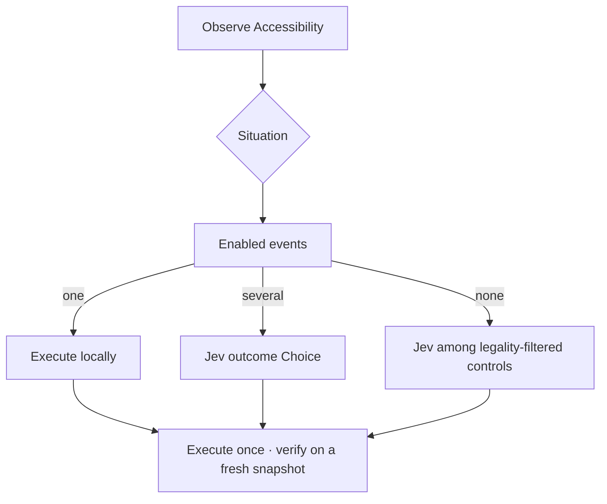

<!-- Local draft for the GitHub PR. Links are relative to the repository root. -->

## Summary

This PR adds a DEBUG-only Voice Control experiment to MacParakeet: ordinary speech or a typed inbox command drives the app already in front of you through native macOS Accessibility. Jev is the judge of competing landings. MacParakeet owns observation, legality, execution, and verification.

It is not a stable-release claim. Live Google Flights results and the integrated microphone are still unproven. Enable with `--enable-voice-control` in a DEBUG build.

---

## What Jev is

Jev (TypeSafe, pinned here at `jev-1.13.0`) is **System One judgment**, not an agent. It does not browse. It does not write AppleScript, JavaScript, or selectors. It does not observe the Mac.

It **can** choose among observed landings given the labels we send it. That is a verification-shaped Choice: after the host acts, which of these named states holds? It does not issue receipts. `finished` from Jev is a judgment over that text, not proof the user’s goal succeeded. Confidence is concentration of the distribution, not P(the search completed).

One request is `state` plus named `questions`. The questions share that state, run **independently**, and cannot read each other’s answers. The primitive that matters for us is **Choice**: a closed map of options, each with criteria, returning a distribution and a confidence.

Jev is strong at picking among named options given evidence. It is weak at arithmetic, dates, counting, generation, huge irrelevant trees, and **simulating a multi-step transition function**. That last weakness is the whole product question.

A practitioner put it cleanly: *predict outcomes, not steps toward an outcome.* Tetris makes the granularity obvious:

| Ask Jev | What you are really asking |
| --- | --- |
| “Play Tetris” | Plan and execute. This fails. |
| “Which button to press” | The next micro-step. Better, still a simulation. |
| “Where should this piece land” | An observed landing. The host compiles left/rotate/drop. |
| “Should you win or lose” | Unbounded completion. If we could compile the goal to a check, we would run the check. Jev picking `finished` over truncated labels is not that check. |

The unsolved “tree where one outcome changes the next” is not a Jev feature. Execute one compiled landing, re-observe, offer a new independent Choice. The graph lives in the host.

Canonical write-up: [architecture](docs/research/2026-09-19-jev-voice-control/architecture.md) and [product](docs/research/2026-09-19-jev-voice-control/product.md).

What we refused to build: a seven-state universal Mac graph, Score-ranking every widget, a generative worker in the click loop, CDP, or treating Jev `finished` as a receipt.

---

## How MacParakeet uses it

Voice Control is a deliberate mode, not always-on listening. Hold Control–Option–Space or type in the inbox. Ordinary dictation keeps its current meaning. Speech stays local. Jev is cloud text-only, explicit consent, BYO key in Keychain.

**Observation and effects are native Accessibility** on the user’s existing apps and browser. No required extension, no Chrome DevTools Protocol, no special profile. An optional connected-tab DOM adapter may supply page candidates later; AX remains the fallback and the Flights acceptance path. Browser chrome (tabs, URL bar) stays AX either way.

Jev Ultrafast’s Flights demo is CDP: it owns a tab, keeps DOM nodes, clicks `[role=option]`. We keep its *policy* — code-owned URLs and values, consume a decision once, do not retry an uncertain mutation — and throw away the transport.

The host does this every turn:



`VoiceControlSituation` is recomputed from the snapshot: `plain`, `suggestionPicker`, or `datePicker`. Code lists **legal events**. Unique events skip the model. Several become one Jev `outcome` Choice over those ids, plus `insufficient_evidence` / `clarify`. Zero (no domain machine) is unconstrained Jev on legality-filtered page controls — still not allowed to pick Return or Search while a picker is open.

Return is not a landing. Escape is how the host dismisses an overlay. Confirm only pay, delete, or send. Accessibility postconditions are receipts. `finished` from Jev is a judgment over the text we sent, not one of those.

### What stays local

Allowlisted site opens (`role=url` never reaches Jev), running-app activation, exact **or uniquely named** click / type / replace / scroll / keys, YouTube / Maps / Wikipedia / Google search-box filling, unique Gmail Compose, Flights trip type / origin / destination / date, unique city or calendar match, overlay Escape, Search.

Saying `Save` presses unique Save. `press return` is a key. `click Return` is a button. Repeat type into an already-correct field skips.

`"replace with X"` asks which words to replace; it does not crash on an invalid range.

### What Jev decides

Competing unfocused city rows — London, United Kingdom vs London, Ontario — are landings: *after the host acts, this label is the selected result.* Unique `Zürich` vs typed `Zurich` stays local. Generic footer links are not landings; their post-state is unknown.

The unconstrained leftover still asks operation / target on generic pages. Keystrokes are host-owned. That leftover is documented, not pretended away.

### Google Flights, honestly

Typed goal: `Find one-way flights from Zurich to London on September 20 2026.`

A live turn opened Flights, filled Zurich/London/date, committed the Zürich suggestion, then stalled: Return ran while the origin overlay was still open (`duplicate_blocked`). The machine now classifies that overlay as `suggestionPicker` and **does not enable Return**. A second stall class — airport names on a results-like page classified as the overlay, which hid Search — is also illegal: overlay detection requires a focused suggestion or `Where else?` chrome.

**ZRH→LON results have not been demonstrated.** The architecture makes those stalls illegal instead of hoping Jev will avoid them.

Interactive walkthrough: [walkthrough.html](https://github.com/moona3k/macparakeet/blob/feat/jev-voice-control/docs/research/2026-09-19-jev-voice-control/walkthrough.html).

### Privacy and traces

Speech never leaves the Mac for Jev. The request is the goal plus bounded visible control text, after consent. Selected text is redacted from the Jev wire; writing uses a separate provider. Field values, audio, screenshots, and remote response bodies stay out of shareable diagnostics. Local `latest.md` may include the instruction and labels so a turn can be debugged; Copy diagnostics strips them.

Stop revokes in-flight authority. Manual mouse/keyboard pauses automation; Continue reobserves. Unknown effects do not retry.

Governing spec: [ADR-033](spec/adr/033-explicit-voice-control.md), [contract](spec/contracts/voice-control.md), [native Accessibility direction](docs/research/2026-09-19-jev-voice-control/native-accessibility-direction.md).

---

## Risk surface

- Foreground AX mutation races with dictation and Transforms (`GUIMutationArbiter`).
- Situation heuristics are still Flights-shaped. Explicit “press return” still routes locally.
- Duplicate-effect protection can stall a turn that needs a *different* dismissal if the snapshot does not change.
- Unconstrained Jev is still `operation` + `target_*` on generic pages. It no longer offers keystrokes.
- Out of scope: TTS, Jev CLI, numbered overlays, OCR, autonomous send/book, stable DMG enablement.

---

## Test evidence

```
swift test --filter VoiceControl
swift test --filter 'VoiceControl|DictationFlowCoordinator|TransformRunSerializer'
```

| Check | Result |
| --- | --- |
| `swift test --filter VoiceControl` (2026-09-20 local, tools-first) | **136 tests, 0 failures** |
| Dictation / Transform admission gate | **191 tests, 0 failures** on the combined filter |
| Overlay never enables Return; Search omitted from overlay Jev targets | covered |
| Competing cities are an `outcome` Choice; unique Zürich stays local | covered |
| Unconstrained Jev omits `key`; YouTube does not infer Return | covered |
| Stale AX IDs rematch by unique label; origin field does not refill after ID refresh | covered |
| `.selectedLabel` postcondition promotes a transition receipt | covered |
| Results-page airport names stay `.plain` so Search can run | covered |
| Date picker does not enable Return | covered |
| `"replace with X"` clarifies instead of an invalid string range | covered |
| Shareable traces omit labels; Jev wire omits `selectedText` | covered |
| Hosted CI `swift-test` on earlier commits | succeeded ([run](https://github.com/moona3k/macparakeet/actions/runs/35494449095/job/106034862243)) |
| Hosted CI on `aae51715` | pending |
| Live Flights **results list** | not done |
| Integrated microphone | not done |
| Full Swift suite | not run; once, as the final merge gate |

Five earlier synthetic Jev text-only calls took **216–293 ms** (median **238 ms**). That excludes speech, Accessibility, and verification. No p95 voice-to-action claim.

[Evidence](docs/research/2026-09-19-jev-voice-control/evidence.md) · [qualification](docs/research/2026-09-19-jev-voice-control/testing-handoff.md) · [capability matrix](docs/research/2026-09-19-jev-voice-control/release-scope.md)

---

## Author's Notes

The overlay and results-page fixes reconstruct stalls from fixtures and a recorded session. They are not a second live results run. Numbered picks are a **panel text list**, not Apple “show numbers” overlays. Native AX tools compile unique names and reserved keys before Jev. Follow-ups, not merge blockers: replace unconstrained `operation`/`target_*` with outcome kinds on generic pages; spoken-tool `.unknown` completion; live ZRH→LON and mic qualification.
