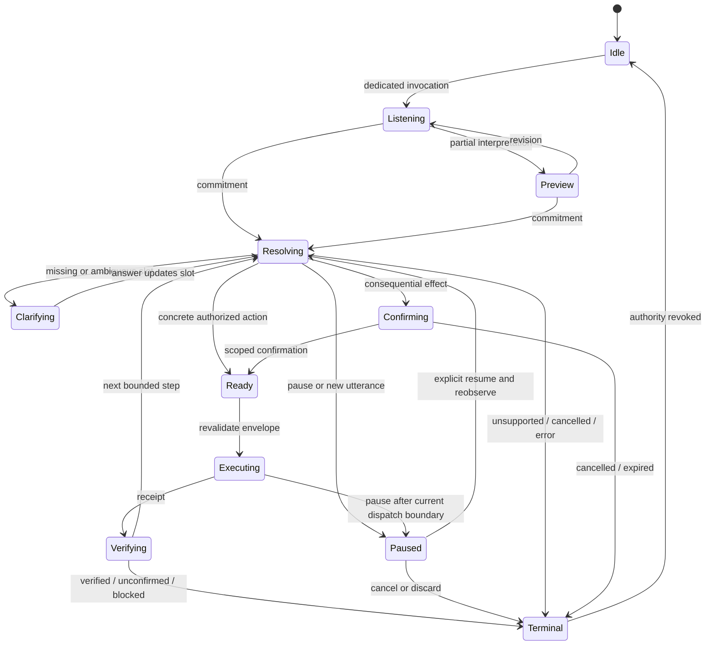

# Proposed Jev voice-control routing and use-case catalog

Status: **full-feature proposal**. Date: 2026-09-19. Example commands are design cases, not measured usage. What is actually implemented is in [release-scope](release-scope.md) and [tools](tools.md).

## Proposed product contract

Ordinary dictation never executes computer commands. Command control has a dedicated hold invocation and an explicitly enabled hands-free session toggle with persistent visible status. The hold release commits the current command; hands-free commitment follows endpointing and the current transcript revision. In the first release, partial speech may prepare candidates and preview a target but cannot execute actions. Cancellation revokes action authority locally, without waiting for Jev.

Jev supplies semantic decisions. Local code owns candidate discovery, literal spans, arithmetic, authorization, execution, and outcome evidence. Cloud use is opt-in and text-only: local STT produces the command; filtered UI labels and necessary contextual text go to Jev. Native Accessibility is the observation and execution adapter. Production does not require a browser extension, CDP, a debugging profile, or browser restart. An optional connected-tab DOM adapter and local OCR are later, separately permissioned, and not the Flights path.

The full vision includes native/browser/system actions, precise text edits, spoken rewrites through the existing LLM infrastructure, cross-app tasks, and bounded multi-step goals. These are staged capabilities below, not claims of present support.

## Evidence informing the proposal

Prior systems motivate the catalog: speculative questions and spatial clarification, with stronger transactions against stale partials; missing-slot questions kept separate from approval; operation-specific targets, focus checks, and repeat suppression, with evidence-backed outcomes instead of a misleading Done. See [references](references.md).

TypeSafe’s [fan-out pattern](https://docs.typesafe.ai/patterns/fan-out) supports independent speculative heads; [function calling](https://docs.typesafe.ai/cookbooks/function_calling) supports typed operation/argument selection; [pre-parsed extraction](https://docs.typesafe.ai/cookbooks/pre_parsed_value_extraction_cookbook) supports choosing source values before local normalization. [Confidence](https://docs.typesafe.ai/confidence) is concentration of a distribution, not correctness. [State](https://docs.typesafe.ai/concepts/state) is explicit identities and relationships.

## Proposed decision envelope and state lifecycle

Every request/action carries a revocable envelope: session ID, invocation mode, utterance ID/revision, commitment state, task/step ID, context revision, app/process/window identity, browser profile/tab/frame/document identity when applicable, focused control/selection revision, candidate-set version, requested effect, policy version, and expiry. Local handles stay local; Jev receives opaque candidate IDs and only necessary descriptions.

A candidate includes accessible name, role, enabled/selected/expanded state, supported operations, source provenance, concise parent/row/section context, visual order, and visibility. Repeated names remain separate candidates. Search retrieval may rank/reduce candidates, but its coverage status must remain visible to policy. Every selectable domain reserves `none`; uncertainty becomes a clarification outcome; observed disabled/unsupported controls produce `unavailable`, not fabricated alternatives.

Proposed lifecycle:

Bare Stop revokes pending effects and pauses the task while leaving an explicitly enabled session available for repair; Cancel terminates/discards the task. Task pause is a distinct nonterminal checkpoint state: revoke actions and approval, preserve progress, and resume only after fresh observation. Stopping listening turns the microphone off and pauses the task; cancelling the task terminates it. Terminal revocation precedes UI completion. Cancellation cannot reverse an already committed external effect; UI reports that boundary and preserves its receipt. A held/open hands-free session can remain enabled while the individual command terminates, but no task silently resumes.

Transcript revision invalidates uncommitted decisions; app/window/document/focus/selection changes invalidate affected action envelopes. Browser navigation revokes document-scoped candidates even if the tab ID persists. Planned cross-app transitions explicitly obtain a new context; an unexpected user app switch pauses the task. Resize/scroll updates geometry and invalidates coordinate targets; semantic handles still require revalidation. Confirmation and clarification expire visibly and cannot survive changed target/payload/account identity.

### Defined interaction defaults

The canonical plan governs mode semantics. One-shot “type <payload>” owns the rest of that utterance literally; the next utterance is a new command. Persistent literal/spelling mode reserves the isolated full utterances “command mode” (exit) and “command stop” (local stop); “type literally <reserved phrase>” or spelling inserts the reserved words without interpreting them. Physical cancel is always available; spoken cancel necessarily includes local recognition latency.

Hold invocations retain typed referents/clarification for a proposed 30 seconds with microphone off. A pending confirmation expires at 20 seconds or immediately on relevant context/payload change. Explicit session end clears all. New ordinary speech during execution pauses further dispatch; after accounting for the current effect, resolve only the newest pending committed turn. No unbounded queue or replay. Within an already-listening session, a committed “Resume task” suffices; if capture is off, resume requires a fresh invocation. “End Voice Control” cancels all and clears ephemeral context. Initial task limits match the plan/evaluation: 12 dispatched actions, 30 model requests, 60 seconds, 2 consecutive no-progress attempts, then explicit continuation with fresh context.

Command text entry checks revocable authority per queued chunk/event; do not reuse the existing dictation inserter's cancellation-drain behavior. The already-posted OS effect may finish and must be reported as partial/unknown if not verified.

## Proposed classifier heads and composition

| Head | Primitive and candidates | Explicit premise / use |
| --- | --- | --- |
| H01 interpretation | Choice: direct action, correction, task continuation, literal insertion, rewrite, bounded goal, help, out-of-scope, none | Interpret only a committed command-session utterance, never ambient dictation |
| H02 operation | Choice among currently offered capabilities plus none | Choose requested effect from observed availability; preserve missing capability as unsupported |
| H03 target.activate | Choice among app/window/tab candidates plus none | **Assuming the requested operation is activation**, select its target |
| H04 target.press | Choice among enabled pressable controls plus none | **Assuming a control press**, select the target; independent of H02's answer |
| H05 target.edit | Choice among permitted editable controls plus none | **Assuming text editing**, select field/editor; never infer search-box fallback |
| H06 target.scroll | Choice among observed scroll regions plus none | **Assuming scrolling**, select region |
| H07 target.value | Choice among compatible option/slider/toggle candidates plus none | **Assuming setting a value**, select control |
| H08 payload/range | Choice over source span IDs, local text ranges or structured parsed values plus none | Ask separately for each explicit hypothetical operation requiring a different slot meaning |
| H09 relation | Choice: same target, alternative target, previous result, named context, none | Resolve “that/other one” against explicit recent referents |
| H10 addressed/complete | Separate Nouls for directedness and linguistic completeness | May support preview or ask for more; cannot grant invocation authority or override commitment |
| H11 contextual consequence | Separate Nouls for sending, deletion, purchase, publication, sensitive disclosure | Supplement local effect metadata; uncertainty never lowers deterministic risk |
| H12 amount/style | Score for graded scroll amount; Choice for discrete direction/edit style | Numeric quantities and exact repeated counts are locally parsed; Score does not supply arithmetic |
| H13 missing slot | Choice over operation-specific required slots plus none | Only where concrete local slot validation cannot settle what is missing |
| H14 outcome relevance | Noul on observed evidence against a declared goal | Supplements adapter postconditions for semantic goals; cannot turn absent evidence into verified success |

Independent heads share one request. They cannot read one another's answers, so each conditional head states its own hypothetical premise and code consumes only heads belonging to the selected operation. Do not phrase a target head as “for the chosen action” unless that action was selected in an earlier request. A second request is justified when the first answer determines new evidence or candidates: app activation, section narrowing, clarified recipient, or newly opened menu. [Fan-out](https://docs.typesafe.ai/patterns/fan-out)

Do not ask every possible head for every app. Build a bounded question set from available capabilities and context, retaining escape outcomes. Reserve option capacity for sentinels; official extraction documentation currently describes 255 Choice options, so candidate narrowing must precede overflow. Thresholds must be evaluated by route/model/version/consequence; prototype constants are not acceptance criteria. Conflicting or low-confidence relevant heads yield clarification or abstention. Unused-head uncertainty is ignored. [Extraction limits](https://docs.typesafe.ai/cookbooks/pre_parsed_value_extraction_cookbook), [confidence](https://docs.typesafe.ai/confidence)

## Proposed route catalog

All routes share envelope validation, consequence policy, cancellation and truthful terminal outcomes. `D` means deterministic local routing; `C/N/S` mean Choice/Noul/Score. These are proposed stable planning IDs.

| ID | Inputs / candidate construction | Decision and fallback | Completion evidence |
| --- | --- | --- | --- |
| R00 invoke | Dedicated hold/session control; local permission state | D enter session or setup-needed; dictation remains separate | HUD and capture state agree |
| R01 stop/cancel/pause | Exact isolated control grammar in active command session; literal mode has explicit escape | D Stop revokes effects and pauses; Cancel discards; stop listening disables capture and pauses; never wait on cloud | Executor acknowledges revoked input authority; explicit Resume requires reobservation |
| R02 confirm | One visible pending action, exact action/payload/account digest | D explicit scoped approval; semantic paraphrase C/N only after commitment; ambiguity asks | Same action passes fresh policy; confirmation alone is not success |
| R03 clarify target | Current numbered candidates or replacement description | D exact valid label; C semantic target refinement; none keeps question open | Concrete selected candidate re-enters ordinary policy |
| R04 repair/referent | Recent target/result ledger and rejected alternatives | C relation + contextual target; “other” excludes previous choice; multiple alternatives ask | Corrected plan/target preview; no implicit execution of old action |
| R05 app activation | Installed/running app names and bundle identities | C target or D unique exact known alias; missing app reports unavailable | Expected process becomes frontmost |
| R06 window activation | Windows belonging to selected app, titles and identities | C window; ambiguity shows numbered previews | Expected window focused |
| R07 tab operations | Authorized browser profile + live tabs/titles/URLs | C title/relative selection; D next/previous/new/close within bound window; closing edits follows policy | Expected active tab or created/closed tab identity observed |
| R08 navigation/search | User URL spans, reviewed bookmarks/search adapters, current search capability | C operation/site/scope/payload; D URL validation/template; absent scope asks | Requested document or visible search state observed |
| R09 press control | Pressable AX/DOM targets with parent/row context | C target; D label shortcut; hidden target requires observe/reveal; none asks | Operation-specific changed control/dialog/navigation state |
| R10 pointer interaction | Observed context-menu, double-click, drag endpoints or local OCR regions | C operation/targets; unsupported adapter stops; coordinate fallback previews | Intended menu/open/move state observed |
| R11 scroll | Focused/visible scroll containers | C region/direction; S qualitative amount; D exact count/page/end | Region offset changes, or confirmed already at boundary |
| R12 key/shortcut | Allowlisted named key/chord, exact focused control | D exact phrase; C semantic “move to next field”; reject unoffered chords | Focus/caret/menu state; unknown effect remains unconfirmed |
| R13 set state/value | Toggles, sliders, select options; current state; parsed number/unit | C compatible target/desired option; D bounds/conversion; desired state already true => no-op | Readback matches desired value/state |
| R14 insert/append/replace | Exact source spans plus validated editor range/value revision | C edit kind/target/span; D copy original bytes and apply defined edit; missing span asks | Readback/range delta matches requested edit |
| R15 select/navigate text | Accessible text ranges, exact matches, sentences/paragraphs and local offsets | C semantic referent; D exact range/count; duplicates clarify | Verified selection/caret range |
| R16 literal spelling | Explicit literal/spelling submode, character vocabulary | D characters/punctuation/newlines; ordinary words stay payload | Exact inserted text verified |
| R17 undo/redo/repeat | Recent action receipts, reversibility metadata and context | C which action; D inverse/redo if valid; repeat needs renewed policy | Prior state restored or precise unsupported message |
| R18 rewrite | Selection identity/text + user instruction and configured LLM | C route/style; generative rewrite through existing Transform boundary; preview diff | Accepted replacement matches generated revision; rejected draft discarded |
| R19 system/media | Reviewed volume/brightness/media/window-management capabilities and actual state | C capability/target; D numeric handling/no-op | Native state readback; playback evidence |
| R20 files/library/content | User-selected permitted roots, observed file/library/document/selection candidates | C entity/action; typed bounded read snapshot with source identity, time, exact spans and sensitivity; no arbitrary path invention; rename/move/delete policy | Read provenance or repository/filesystem receipt; extra provider disclosure for sending source bodies to a planner/rewrite model |
| R21 communication/form | Observed account, recipient, draft and submit controls | C slots/target; exact text preserved; sensitive commit confirmation | Draft saved or send/submit acknowledgement; no blanket Done |
| R22 sequence / multi-step goal | Explicit command-clause source spans or user objective, constraints, capabilities, success predicate | D supported 2–3-clause sequence outside quoted/literal payload; C ambiguous decomposition/goal; optional planner only when needed; missing slots asks | Fresh candidates and policy after every step, receipts + final declared outcome evidence |
| R23 help/status | Offered capabilities, active task/last receipt | D current status/list; C semantic help lookup | Accurate local explanation; no desktop mutation |
| R24 recovery/terminal | Permission, transport, adapter, parser, stale-context and verification errors | D bounded observe/retry/ask/stop using cases below | Explicit stopped state with retained completed effects |

## Proposed action policy, confirmations and escalation

Policy judges the **concrete effect**, not simply the command verb. A click may send a message; Enter may run a shell command; a checkbox may immediately publish. Semantic risk heads supplement reviewed adapter contracts and observed control context. Unknown side effects require clarification/preview or an unsupported outcome.

Navigation, focus and bounded reading actions may execute after commitment and revalidation. Reversible edits need defined ranges and receipts; replacing nonempty content must be explicit. Sending, publishing, purchasing, deleting user data, executing terminal commands, or disclosing selected private content requires an action-specific confirmation showing destination/account and payload/consequence. A number chooses a target; it is never consent to the target's consequences. “Yes” is meaningful only within a live, singular confirmation state. Corrections revise the action and revoke earlier approval.

“Already muted” or “already checked” is a verified no-op, not another toggle. For uncertain observed state, gather evidence or ask. A timeout after dispatch is an unknown outcome: observe before retrying, especially for send/delete/purchase. No model confidence can authorize a duplicate consequential action.

Jev does not generate rewritten prose or arbitrary plans. Route R18 uses the user's configured generative Transform provider, with its existing local/cloud disclosure. R22 may use a separately enabled planner to propose a bounded sequence of typed capabilities; local validation rejects unknown actions, changed scope, invented recipients/paths or open-ended loops. Jev resolves each step against fresh observed candidates. No runtime-generated scripts, shell code or new tools enter the executor automatically. A planner's success claim is not outcome evidence.

## Proposed fast paths and their exclusions

| Fast path | Allowed scope | Must not fast-path when |
| --- | --- | --- |
| Stop/cancel | Isolated control phrase in active command session, outside literal payload | Dictation/quoted text says “stop”; cancellation cannot pretend to undo completed effects |
| Spoken number/label | Visible live clarification set and exact positive label | “Not two”, “two or three”, stale labels, partial revisions, or no clarification context |
| Key names | Explicit key command, allowlisted chord, freshly validated focus | Words occur inside dictated text; Terminal/Send consequences are unresolved |
| Exact app alias | Unique registered app alias from local catalog | Duplicate app names, profile/window ambiguity or compound clauses |
| Desired state | Reviewed native capability, unambiguous numeric/unit parse | Unknown state, out-of-range value, unsupported unit or unclear target |
| Literal payload | Explicit insertion/spelling grammar and known target/range | Uncertain span boundary, pronoun target, revised text or ambiguous editor semantics |
| URL/date/number parsing | Typed slot with locale/time zone/reference date fixed locally | Ambiguous relative dates, units, account-sensitive destination or multiple candidates |

All shortcuts use the same admission, authorization, verification and cancellation layer. “Model-free” never means “policy-free.” Dates are resolved locally from the captured reference date/time zone; “next Friday” ambiguity is shown as a calendar date before a consequential task. Amounts use exact decimal arithmetic and declared units. Original source spans remain intact; normalization is field-specific and visible.

### Latency and request accounting

Begin scoped observation at invocation; exact unique visible labels, reviewed scroll/media phrases and explicit literal grammar may use the local tier. Model-free paths still run full local policy. Jev resolves paraphrases and semantic ambiguity. One committed decision request is the target; at most two extra speculative requests per short utterance are a proposed initial cap, counted in tokens/cost. Compare route-specific canonical decision inputs for reuse, never remove negations/numeric changes or alter literal bytes. Measure local-route share and its false-match rate. Offline retains only supported local routes, not a claim of full offline Jev capability.

## Proposed everyday evaluation utterances

These examples define breadth and ambiguity tests; they do not establish frequency or current support.

| Family / routes | Natural utterances and variants |
| --- | --- |
| Invocation / R00–01 | Hold the command shortcut; enable the hands-free session in the UI; “Stop”; “Cancel this task”; “Pause listening” |
| Apps/windows / R05–06 | “Open Notes”; “Switch to Safari”; “The other Notes window”; “Bring the budget spreadsheet forward” |
| Tabs / R07 | “Go to the GitHub tab”; “Previous tab”; “The work account's calendar tab”; “Close this tab” |
| Navigate/search / R08 | “Open example dot com”; “Search this site for audio drivers”; “Search the web for the same phrase”; “Find that in my meeting library” |
| Targets / R03–04,09 | “Click Save”; “The second Delete button”; “No, the one under Billing”; “The other one”; “Show me the choices again” |
| Scrolling/pointer / R10–11 | “Scroll the sidebar down”; “A little more”; “To the bottom”; “Open the context menu on that file”; “Drag this card into Done” |
| Controls / R12–13 | “Press Escape”; “Move to the next field”; “Check Remember me”; “Turn subtitles off”; “Set the volume to thirty percent” |
| Exact text / R14–16 | “Type please call now”; “Append thanks, Maya”; “Replace the selected words with next Tuesday”; “Type the words click send”; “Spell capital A hyphen seven”; “Insert a new line” |
| Editing / R15–18 | “Select the second paragraph”; “Select the word budget”; “Replace only that occurrence”; “Undo that typing”; “Make this friendlier”; “Keep the names and dates unchanged” |
| Media/files / R19–20 | “Pause the music”; “Skip this track”; “Move this window to the left”; “Rename this file meeting notes”; “Move it to the selected folder” |
| Communication / R21 | “Draft a reply saying I can make Thursday”; “Change the recipient to Maya”; “Send this draft”; “Cancel, don't send”; “Save the draft instead” |
| Goals / R22 | “Open the calendar and find a free half hour tomorrow”; “Copy this meeting's action items into a new note”; “Find flights to Tokyo, leaving Friday and returning Monday”; “Use Oakland, not San Francisco” |
| Repair/status / R04,17,23 | “What are you about to do?”; “That didn't work”; “Do the same in the next row”; “Go back to the result I just opened”; “What can I say here?” |

Follow-ups are bound to an explicit task/referent ledger: entity, source context, last observed generation, recent action and expiry. “That” never silently means whatever is now under the cursor. Cross-app clipboard/text transfer is explicit and scoped; private content is not automatically included in subsequent model context. Repeating an action recomputes targets and policy rather than replaying coordinates.

## Proposed terminal, unavailable and error behavior

| Condition | Required behavior |
| --- | --- |
| Verified success / already satisfied | Show exact completed effect or no-op, retain undo when meaningful, revoke step authority |
| Action dispatched but result unclear | Show “Result unconfirmed”; preserve receipt; observe or let user take over; never auto-repeat side effects |
| Missing/ambiguous target or payload | Ask one specific question; keep exact unresolved slot; no default guess |
| Disabled/unsupported control | Explain observed limitation; offer supported alternate only as a new validated action |
| Missing Accessibility, mic or conditional Screen Recording permission | Explain specific required permission; open setup only on user action; resume via fresh invocation/context |
| Extension absent or site denied | Native AX fallback only where capability is actually available; otherwise offer extension setup/manual step |
| Cloud consent absent/key unavailable | Explain command intelligence unavailable; ordinary local dictation remains usable; no silent provider switch |
| Offline/auth/rate limit/service timeout | Bounded retry only before dispatch and while envelope valid; visible retry/cancel; no offline claim for semantic routing |
| Malformed model answer/unoffered ID | Reject; at most bounded fresh observation; never substitute first candidate |
| App crash/navigation/focus change/expired context | Revoke pending action; re-observe or pause with target explanation |
| Secure field or denied app/domain | Exclude before request assembly; offer manual entry; never copy protected values into logs/model state |
| No progress/repeated action/budget exhausted | Pause with completed steps and unmet condition; revoke effects; explicit continuation reobserves with renewed bounded budget; no false Done |
| Manual user takeover / Stop | Revoke effects, account for in-flight dispatch, and pause task; do not steal focus back |
| Stop listening | Turn capture off and pause task; new invocation required before resume |
| Cancel task / End Voice Control | Terminally discard task or close session respectively; revoke authority and acknowledge completed effects |
| Partial completion/verification service unavailable | Report completed verified effects separately from remaining/unconfirmed work |

## Proposed delivery stages and evaluation boundary

**Stage A:** dedicated invocation, truthful lifecycle, native AX target discovery, optional authorized browser observation, app/window/tab navigation, clicks, bounded scroll, exact insertion, numbered clarification, basic “other one” repair, contextual help, accessible session-toggle invocation, local cancel, 2–3-clause explicit sequences and action-specific verification. No partial execution.

**Stage B:** precise ranges and editor adapters, richer correction/referents, scoped undo, spoken rewrites, system/media controls and context-specific help. Every route needs negative examples for quote-vs-command, wrong focus and same-label targets.

**Stage C:** cross-app tasks, richer file/form workflows, bounded planner-assisted goals and explicit handoffs. Add per-step policy, account identity and confirmed consequential effects before expanding capability breadth.

Release evidence must cover candidate recall, exact span preservation, incorrect actions, successful repairs, zero input after terminal revocation, and end-of-speech-to-preview/action/verified-result distributions. Model-choice accuracy alone does not qualify a route. Full-vision commands remain visibly unsupported until their adapter, policy, recovery and evidence requirements are met.
