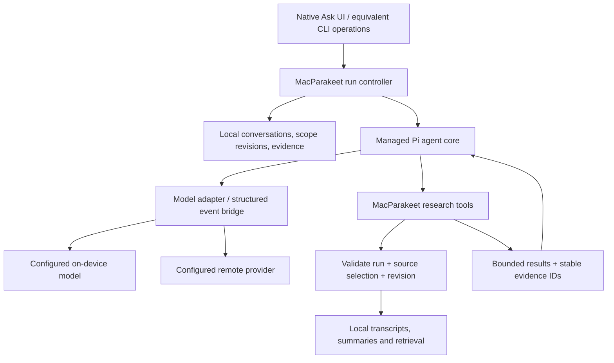

# Model-agnostic Ask harness

Date: 2026-09-25. Status: proposed architecture, informed by the user's preference to investigate Pi. No runtime integration has been implemented or qualified.

## The decision

**Make Ask independent of a particular model provider. Evaluate Pi's agent core as the execution engine, with MacParakeet owning meeting access, evidence, and durable conversations.** Use the [upstream comparison](opensource-harnesses.md) for the inspected Pi revision and precise API/package identities; development-source names are not a distribution commitment.

Model agnostic means the application can change its reasoning model through an adapter without changing its source-selection or evidence rules. It does not mean every model can reliably operate the same tools, fit the same context, or deliver equivalent answers. Provider API compatibility and task competence require separate qualification.

Keep these three choices separate:

| Choice | Recommended ownership |
| --- | --- |
| What the assistant may access and what an answer means | MacParakeet: selected recordings, corrected text, citations, coverage, deletion and privacy |
| How the assistant alternates model calls and tools | Reusable execution engine, with Pi the first candidate |
| Which model produces the next action or answer | A configured provider adapter with tested capabilities |

This preserves the accepted [private speech memory direction](../../../spec/adr/027-product-north-star.md). It also lets us replace an unsuitable runtime without redesigning the Library or saved conversation semantics.

## Proposed boundaries

The Pi-to-Swift transport and packaging remain prototype questions. A managed child process with a narrow message protocol is a candidate, not a requirement to install a developer CLI. Do not assume that a TypeScript dependency can be imported directly into Swift, that JavaScriptCore can execute a Node-dependent package unchanged, or that a command-line coding agent's RPC is the same integration as its agent-core library.

Prefer the smallest Pi layer that supplies the needed loop. Review its higher-level context-management facilities before rebuilding those facilities. Add only the meeting tools we expose; a reusable agent engine does not require shipping shell, filesystem browsing, web search, extensions, or coding prompts.

## App-owned run and tools

The following are conceptual contracts, not final Swift types or a new public API. Start with a run identity, question, source-set revision, per-source content revision, configured provider identity, deadline, usage limits, and a cancellation handle. Treat source text as data: instructions contained in a transcript cannot authorize new tools or broader access.

| Operation | Input and behavior | Evidence returned |
| --- | --- | --- |
| List selected sources | Page through the current run's eligible recordings | Stable IDs, dates, availability, revision, summary status |
| Search selected sources | Query and optional narrowing within that selection | Bounded passage candidates, source/segment IDs, retrieval completeness limits |
| Read passages | Read an allowed source or passage range, with pagination | Corrected text, adjacent context, revision, reliable timing or text anchors |
| Read summary | Read a qualifying existing summary for an allowed source | Summary identity, source revision/freshness, whether user edited |

The selected-source allowlist belongs to the tool implementation, not a model-generated filter. A model can narrow the selection; it cannot broaden it. Validate opaque passage IDs against the run as well as validating explicit source IDs. Apply the same restriction before ranking candidates, on reads, and when resolving citations. A later retrieval index remains derived data; the canonical local record determines whether a result is usable.

Keep result payloads bounded and expose continuation information. For exhaustive questions, the harness needs a record of which source ranges were examined and which were missing. A search hit count or one read per meeting does not establish complete coverage. Existing summaries can orient the investigation, but cannot support claims about every detail in the original recording.

Give evidence an app-issued identity associated with source ID, revision, passage/segment range, and source kind. The model refers to those IDs; code resolves the actual title, date, excerpt, and playback anchor. Checking that an ID exists and belongs to scope is deterministic. Checking whether the passage supports the claim is a separate semantic judgment. Never treat either check alone as proof of factual completeness.

The first scope is read-only research. Editing notes, sending email, calendar changes, and arbitrary code execution are separate product decisions.

## Model adapter and capability qualification

Current MacParakeet source at working-tree HEAD `779e9b30fa084e9f56c9a68b2e69ab9e3fdd62b3` provides useful infrastructure:

- [LLMClientProtocol](../../../Sources/MacParakeetCore/Services/LLM/LLMClient.swift) supplies completion, streaming, execution context, and structured-output capability.
- [LLMExecutionContext](../../../Sources/MacParakeetCore/Services/LLM/LLMExecutionContext.swift) resolves configured providers and task overrides.
- [ChatMessage](../../../Sources/MacParakeetCore/Models/LLMTypes.swift) has system/user/assistant roles with string content. It does not itself represent a complete tool-call/result conversation.

Consequently, reusing provider configuration is plausible; plugging today's string stream directly into Pi is not a complete implementation. A model bridge must translate tool definitions, call identities, arguments, results, terminal states, and errors. Keep canonical app state separate from provider-specific request bodies. Provider-specific reasoning tokens or signed blocks must not be blindly replayed to another model.

| Capability to qualify | Why Ask needs it | Behavior when unavailable |
| --- | --- | --- |
| Reliable operation selection and arguments | Drives the investigation | Do not label the model agent-capable based on ordinary chat success |
| Native tool calls or validated structured action output | Makes operations executable | Consider a bounded structured-output compatibility adapter; reject malformed output before any operation |
| Context and output limits | Fits instructions, history, tool definitions, evidence, and answer | Reserve headroom; bound results; report inability to cover the requested scope |
| Stream termination and cancellation | Makes Stop dependable | Cancel generation and pending tools; suppress late events from the old run |
| Usage accounting | Keeps repeated calls within limits | Enforce hard turn/tool/deadline limits even if token usage or prices are unavailable |
| Local vs remote execution | Preserves the chosen privacy boundary | No silent cloud fallback or remote auxiliary model |

A compatibility adapter for structured JSON actions is an experiment, not a promise of universal tool use. Permit a small repair budget for malformed output; repeated invalid calls should end with an understandable failure. Models that only qualify for single-pass answers can remain available for their existing tasks without pretending to satisfy the new agentic contract.

Freeze provider selection for a run. Between turns, a provider change needs valid history translation and a visible privacy boundary. Reconstruct model context from app-owned records where necessary; do not depend on transferring opaque provider session state. Local embedding, reranking, and generation models can be separate capabilities, each with its own lifecycle and approved data boundary.

## Pi integration options to compare

| Option | Benefit | Cost or unresolved question |
| --- | --- | --- |
| Pi core with model calls bridged through MacParakeet | Preserves existing provider settings, credential ownership, and in-process local generation path | Must build and qualify structured model events and process transport |
| Pi core with its own provider layer | Uses upstream provider integrations directly | Must reconcile credentials, model configuration, privacy behavior, and in-process local models |
| Small native Swift loop | Direct fit with app lifecycle and local inference | We own tool-loop correctness, event handling, and future context-management maintenance |

**Prototype the first option as the target architecture.** If a direct Pi provider is used temporarily to isolate loop behavior in a synthetic-data experiment, label that limitation: it does not prove compatibility with MacParakeet's existing providers. Adopt the second option only if its configuration and lifecycle costs are demonstrably smaller. Retain the native loop as a fallback if the bridge costs more than the reusable engine saves. OpenCode remains a broader alternative, documented in the comparison.

Do not run two independently authoritative harnesses. MacParakeet owns the run and allowed operations; Pi executes the model/tool cycle. A transport bridge should not quietly become a second planner or a parallel conversation database.

## Context, persistence, and cancellation

Save conversation messages, source-set sections, evidence references, and enough completed run status to resume the user workflow. Do not require a live interpreter or replay tools merely to display a saved answer. Persist private provider artifacts only when necessary and with a deliberate retention policy.

On removing a source, construct fresh model context for the new section. Filtering the next search is insufficient: earlier answers, tool results, compacted summaries, caches, and any REPL variables can retain excluded content. A runtime's generic compaction is not automatically source-aware. Scope and revision checks also apply to restored sessions and subcalls.

Bind every event to a run and scope revision. Stop propagates through the runtime, model transport, retrieval, and any nested work. A late callback cannot revive a cancelled answer. Source correction/deletion invalidates affected evidence and requires revalidation before presenting it as current. Historical answers remain visibly historical under the proposal's deletion rules.

Apply one aggregate budget across retries, model turns, tool calls, and optional subcalls. Add individual timeouts and output caps. Failed tools should return classified, bounded errors so a model can recover where useful; repeated no-progress actions must terminate. The app remains responsive to recording while the agent works. These properties need integration tests and profiling, not only an abort method in an upstream API.

## Optional semantic helpers and REPL

The repo's TypeSafe guidance favors Jev for bounded relevance and claim-support judgments. The official [reranking](https://docs.typesafe.ai/cookbooks/rerank_typesafe) and [citation-check](https://docs.typesafe.ai/cookbooks/citation_check) cookbooks provide patterns to evaluate. Keep those behind an optional capability, with explicit remote-context permission where applicable. They must not become a mandatory cloud dependency for local Ask. No Jev inference was used in this research; only documentation was read.

A REPL or recursive model subcalls can be added later if they improve measured comparisons, long-corpus coverage, or aggregation. Pi adoption does not itself establish an RLM implementation. Generated-code execution requires a real isolation boundary and bounded resources; tool permissions and a restricted prompt are insufficient. See [retrieval and RLM source research](opensource-retrieval-and-rlm.md).

## Evaluation before production adoption

Use synthetic or explicitly approved fixtures first. Run the same jobs through the same domain tools and compare correctness and integration burden before benchmarking frameworks broadly.

1. Find a decision near the end of a long transcript; distinguish a proposal from a later agreement.
2. Compare conflicting statements across repeated-title meetings with correct dates and citations.
3. Enumerate commitments across every selected source, including an unavailable transcript and a stale summary; report incomplete coverage.
4. Remove a source after an answer or compaction, then ask a follow-up that tempts reuse of excluded facts.
5. Supply an out-of-scope passage ID and transcript-embedded instructions to read unrelated data; neither may grant access.
6. Stop during generation and tool execution; restart; verify no stale writes, orphan work, or event attachment to the wrong question.
7. Repeat with qualified models across distinct provider APIs and an in-process local path. Compare missing evidence, unsupported claims, malformed calls, completion rate, total usage, latency, and capture responsiveness.
8. Package the managed runtime and verify launch, signing, updates, shutdown, configuration isolation, and acceptable memory use on supported Macs.

Hard gates are source-scope enforcement, correct evidence identity, provider/privacy boundaries, cancellation, and durable lifecycle behavior. Set answer-quality and performance thresholds from representative baseline measurements. A successful cloud demo alone does not qualify local support or production packaging.
