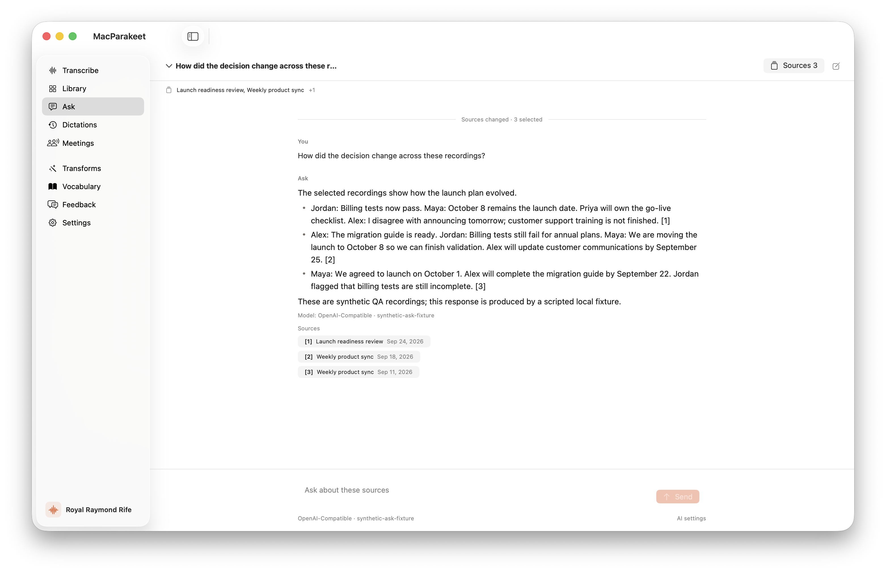
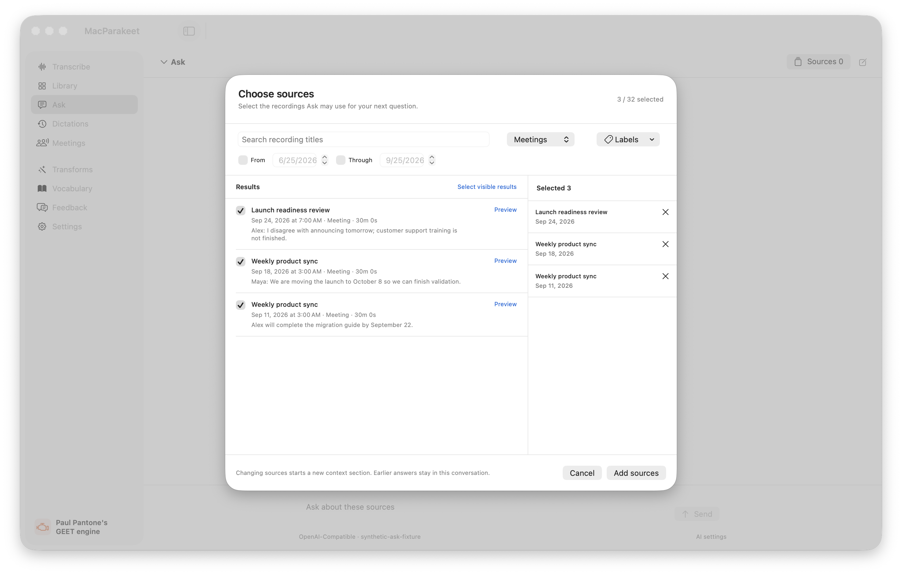

# Ask workspace verification and open qualification issues

Status: **Implemented candidate; not runtime-qualified.** Updated 2026-09-26.
The feature implementation is commit `991d1ed79`; the CLI catalog expectation
is corrected in `2b74a9e73`. Later review commits must retain these boundaries.

## Open blockers

1. During native QA, the user reported that the app froze their keyboard and
   computer, and quit the app. Local UI automation, model requests, and the
   synthetic server were stopped. The cause has not been established. The
   observed successful UI actions below do not qualify system-wide input
   stability. Do not reopen the app or resume intensive local QA without
   coordinating a controlled follow-up with the user.
2. Real local-model Ask investigation is not qualified. LM Studio exposed
   `qwen/qwen3-4b-2507` and returned HTTP 200 with a valid JSON tool decision to
   a small direct synthetic request. Through Ask, a three-meeting decision
   question failed after 31.56 seconds before activity/text, and a simpler
   question failed after 7.40 seconds after “Checking selected recordings.”
   Both stored a failed assistant message with no citations and a sanitized
   error. Later CLI probes below isolate malformed actions and inadequate retrieval,
   despite successful model transport. Both tested local models remain
   unqualified for Ask.

These issues block enabling/releasing Ask. As of the 2026-09-26 default-off
decision, dormant integration on main is allowed after flag-off behavior and
CI pass; it does not establish runtime qualification.
No stable release, notarized distribution, or update publication was performed.

## CLI hardening follow-up (2026-09-26)

The user authorized a bounded CLI qualification and fixes. No native app,
Accessibility automation, microphone, or existing user database was used in this
follow-up. Native responsiveness remains a separate open gate.

The shared service now preserves unsaved drafts on failed navigation/save,
preflights a serialized UTF-8 initial-context budget before persistence, and
leaves space for retrieved evidence. Agent requests disable local chunking.
The decision bridge uses typed fields with constrained action names and makes
at most one validated correction attempt for malformed action JSON. Cancellation, provider errors,
and truncated responses are not retried by that correction path.

The repeatable runner creates a fresh database with two synthetic recordings:

```bash
python3 scripts/dev/ask_workspace_qualification.py \
  --cli /path/to/extracted/macparakeet-cli \
  --output-dir /tmp/ask-scripted-new

python3 scripts/dev/ask_workspace_qualification.py \
  --cli /path/to/extracted/macparakeet-cli \
  --output-dir /tmp/ask-model-new --real-only \
  --provider lmstudio --endpoint http://127.0.0.1:1234/v1 \
  --model qwen/qwen3-4b-2507
```

Before the feature gate, focused validation passed 121 Swift tests (including the actual helper with
bundled Node), 14 helper tests, and 8 Python harness tests. Changed Swift lint,
workflow YAML parsing, subsystem README references, and diff checks passed.
The final scripted runner passed all seven groups against CLI SHA-256
`7d8dbafea4aa73419f2ac751d61544cc9410ccda2644deb60b13e1d7565693b8`.
CI runs the opted-in runner against a standalone package built from the Debug CLI
and separately verifies that the Release CLI refuses both normal and developer-opt-in access
and retains its synthetic reports in the uploaded CI logs.

Output directories must be new or empty. They retain a JSON report, CLI binary
SHA-256, raw synthetic CLI output, and an isolated SQLite database. Scripted
runs also retain provider requests. Credentials, if required, are accepted
through a named environment variable and redacted from retained output.

A packaged Debug CLI with official Node 24.13.1 and the actual Pi helper passed
all seven scripted groups: durable drafts/answers and follow-ups, a late
reversal beyond the first read page, source exclusion, stale citations,
consent rejection before mutation/network, provider failure, uncited-answer
incompletion, bounded action repair, competing-writer rejection, and recovery
after killing the CLI process and waiting for its real lease to expire.
Real Qwen probes reproduced two separate failures: inadequate retrieval despite
valid citations, and malformed action arguments. Model decisions no longer
encode JSON inside a string; typed scalar fields avoid that failure surface.
A nullable-schema experiment was rejected by this LM Studio backend with HTTP
400. Optional plain properties were accepted but both Qwen and Gemma omitted
required read arguments. The final schema requires six plain scalar fields,
using empty strings and zeros for unused arguments. Qwen still chose an invalid
read action twice and failed safely (15.79 seconds). Gemma also failed after
an invalid read action and one correction attempt (11.80 seconds). Neither
local model passed this regression; no successful real-model quality claim
is made.

Process interruption is not a test of the native Stop control. Initial fixture
failures were corrected: GRDB UUID keys use BLOB storage and UUID-keyed JSON
maps may reorder pairs without changing their values.

## Default-off integration checks (2026-09-26)

The flag change keeps Ask off in normal launches and all Release builds.
Debug app/CLI evaluation requires `--enable-ask-workspace`. Normal app startup
constructs no Ask service; all CLI commands reject before database or provider
access. Sidebar, Library actions, and direct navigation are gated. Existing
transcript and live meeting chat remain separate.

The focused post-gate run passed 201 tests (one unrelated skip), including
workspace behavior, CLI gating, navigation, and existing chat coverage. The
subsequent 38-test contract/navigation rerun passed (one unrelated skip); all
12 Python harness tests passed.
Compiling the actual `AppFeatures.swift` in both modes proved Debug requires
opt-in and Release ignores it. An actual default-off CLI invocation returned
validation exit 2 and created no database. CI separately checks the complete
Release executable with and without opt-in, and tests the opted-in Debug
package through the full scripted qualification runner. The post-gate packaged
Debug run also passed all seven groups locally, including natural lease-expiry
recovery, with CLI SHA-256
`723f133f0c71d93c2db49b94f18e7955a36c1b2dceafd91e3931e10654c83d8c`.

## Automated evidence

The default-off candidate's hosted review found eleven issues. Follow-up fixes
align picker availability with usable text/timing data, make title searches
literal, bound summary output by serialized bytes, and preserve complete
summary receipts. Failed Library handoffs stay in Library with an error;
deleting a conflicted conversation clears its stale UI state. Helper pipe writes
now suppress `SIGPIPE` per descriptor. Ask rejects in-process responses without
completion evidence; the shared runtime and existing chat are unchanged.
The dev launcher builds the helper only for explicit Debug opt-in, and the
runtime-limit, exit-status, and historical-evidence documentation is corrected.

The combined focused rerun passed 174 tests (one unrelated skip), including an
isolated child-process regression that closes helper stdin with default signal
handling. Four dev-launch configurations also verified the helper build gate
with Node/npm absent from PATH. Full hosted CI must validate the committed
review-fix revision before merge.

- The real pinned Pi helper passes 10 JavaScript behavior tests. Swift tests
  exercise the actual helper and official bundled Node runtime with a scripted
  model transport, including tool continuation and text before terminal output.
- After review fixes, the focused service/view-model/Pi run passed 34 tests,
  including delayed draft writes, external draft conflicts/deletion, history
  isolation, evidence freshness, and model/tool boundaries.
- The sole full local `swift test --jobs 6` run executed 7,587 XCTest cases,
  with 28 skips and one failure: the curated CLI root-command expectation
  omitted `ask`. All 30 Swift Testing cases also passed. The expectation was
  corrected and the affected `SpecCommandTests|AskCommandTests` run passed
  all 21 tests. The full local suite was not repeated, following AGENTS.md.
- Native Debug builds succeeded through `scripts/dev/run_app.sh`, including
  the final UI fixes. Bundle-local Pi/Node executed a complete synthetic run.
- Shell syntax, Homebrew scaffold Ruby syntax, subsystem README references,
  local documentation links, and `git diff --check` passed.
- Dev-launcher behavior tests and AppKit fixtures passed, including registered
  applications whose executable was unlinked. Unrelated app instances were
  preserved by the build launcher.
- Independent code reviews found and drove fixes for scoped citation handling,
  provider authority/consent, mutable summaries, source search fairness, draft
  races, Library navigation, evidence state, and CLI streaming.
- Local Greptile review was attempted against committed changes but could not
  authenticate: the installed CLI is signed out. This is not a review pass.

## Native observations

All recordings and questions were synthetic, in an isolated database and
separate app preference domain. No private meeting content was used.

Observed in the actual native app using macOS Accessibility and window captures:

- Ask sidebar destination, new conversation, source curator, searchable meeting
  titles, selection retained across filters, bulk selection, and Apply.
- Explicit provider consent, progress, text streaming, saved answer with three
  citation controls, passage inspection, and Open in Library selecting the
  matching synthetic transcript.
- Answer persistence after app restart; Stop settling to an explicitly
  incomplete/stopped answer.
- Narrow-window evidence sheet and wide-window evidence inspector. Light and
  dark appearances were inspected; final light-mode screenshots are below.
- Visual fixes removed a duplicated menu indicator, constrained long titles so
  Sources/New stay available, widened the source-type popup, and removed the
  empty-state suggestions once the first question starts.

The native tests used a **scripted loopback model fixture**. They establish
application flow and transport behavior, not model reasoning quality. The
subsequent user-reported freeze remains an open blocker.





## Standalone CLI package

A generated arm64 CLI archive was extracted and run outside the checkout. It
included CLI 4.7.0, official Node v24.13.1, the bundled helper, and dependency
notices. With a copied synthetic database, `new`, `select`, `send`, `evidence`,
`draft`, `show`, and `list` worked across separate processes. Three source
citations resolved. Draft and history survived a source-section change.

In a timed stream, activity arrived at 0.864 seconds, text at 0.973 seconds,
and the final conversation at 4.416 seconds. The process was still running
when the early events arrived. Omitting remote consent rejected the same
OpenAI-compatible loopback endpoint and left the conversation revision intact.
This used the debug CLI build and scripted provider, not a notarized release.

## Remaining verification

- Diagnose the system-wide freeze in a coordinated, isolated native session.
- Qualify the three research jobs with a capable real model. Synthetic model
  exchanges now distinguish transport success from invalid actions and poor
  evidence coverage; neither tested local model passed the regression.
- Compare a Pi-native provider/tool-call path against the same CLI fixtures
  before expanding the custom decision bridge further. Keep Swift's persistence,
  source scope, consent, and evidence validation at the product boundary. A
  passing model action is necessary but not sufficient: the answer must retrieve
  the late reversal, cite both sources, survive follow-ups, and exclude removed
  context. This architecture work is deferred; current real-model failures
  continue to block enabling the feature.
- Complete the PR gate and hosted CI, recording their exact result separately.
- Qualify signed distribution/upgrade behavior before any release work.
