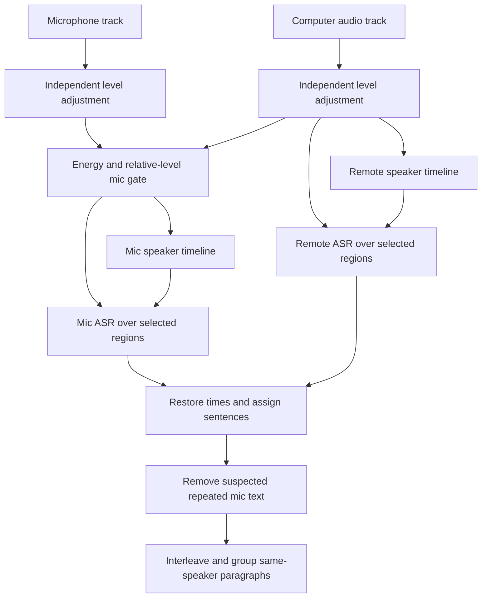

# Omarchy Meeting Recorder: lessons for MacParakeet diarization

> Research snapshot before implementation. Subsequent matched runs, integration and the adoption decision are recorded in [the evaluation report](../../benchmarks/diarization/2026-09-25-nemotron-evaluation.md). Historical present-tense statements below describe the reviewed baseline.

Date: 2026-09-25. Scope: source review, upstream benchmark evidence, and small isolated algorithm probes for [issue #1046](https://github.com/moona3k/macparakeet/issues/1046). This is research, not an implementation or a model accuracy comparison.

## Recommendation

**Yes: this is a useful reference, especially for its meeting-shaped test fixtures and separation of audio-source attribution from speaker identity. Its new diarization backend merits a controlled experiment. Its aggressive speaker suppression and sentence assignment rules should not be copied into MacParakeet.**

**Follow-up scope, settled with the user:** keep microphone audio as **Me**, prioritize Nemotron for saved system audio and imported recordings, and consider a switch only after matched evaluation. Shared-microphone diarization is excluded. New research also found native Nemotron support already released in FluidAudio 0.17.4. The [published-evidence comparison](2026-09-25-nemotron-diarization-evaluation.md) and [next-agent plan](../plans/2026-09-25-nemotron-diarization-evaluation-plan.md) govern the next work; this report preserves the reference inspection and algorithm probes.

For #1046, success means fewer false speaker changes **and** retaining genuine short replies. A transcript with fewer speaker labels can be less correct. Both Omarchy and MacParakeet contain rules that trade short-turn recall for visual continuity; neither screenshots nor speaker-count accuracy establish that the trade is worthwhile.

The highest-value next work is to extend our existing benchmark with short-turn and overlap scoring, retain intermediate speaker evidence in a local evaluation runner, and then compare narrowly scoped changes. Keep FluidAudio as the production baseline while doing this.

| Reference idea | MacParakeet comparison | Decision |
| --- | --- | --- |
| Scripted calls, echo, shared microphone, music, silence, plus real meeting audio in CI | Existing #1046 gate measures rosters and isolated assignment artifacts, not full diarization error | **Adopt the test design; strengthen the metrics** |
| Separate mic and system ASR, then source-scoped speaker labels | Already fundamental to our final meeting pipeline | **Preserve; do not reimplement** |
| Diarize both sides, including several people sharing the mic | Finalized MacParakeet mic words currently share one microphone identity | **Excluded from the agreed scope; retain Me** |
| Nemotron-3-Diarization with a native host and pinned ONNX weights | Different hypothesis from our current embedding/clustering pipeline; newer FluidAudio now implements Nemotron natively | **Benchmark the native SDK candidate outside production first** |
| Whole-sentence speaker assignment and paragraph grouping | We already group turns; our one-word smoothing is narrower but still removes real A/B/A replies | **Do not copy whole-sentence reassignment; audit our smoothing** |
| Absorb speakers below four seconds or 4% of speech | Could conceal over-splitting by deleting legitimate minority speakers | **Reject as an automatic identity rule** |
| Amplitude and text heuristics to suppress mic echo | We already have source reconciliation and an optional acoustic processing path | **Borrow failure fixtures, not their thresholds** |
| Preserve source tracks separately from the listening/export mix | Already present, with richer alignment/recovery metadata | **Preserve our architecture** |
| Explicit timeline mapping when silence is removed | Useful whenever an ASR-specific compaction path is evaluated | **Conditional experiment, not a new generic preprocessing layer** |

## Evidence and version boundaries

The reviewed reference is the clean local checkout at `references/omarchy-meeting-recorder`, version **1.3.0**, commit [`3950f486803b2e5f6d8b514b5bebb847885f2496`](https://github.com/jankeesvw/omarchy-meeting-recorder/commit/3950f486803b2e5f6d8b514b5bebb847885f2496). Reference code links below are pinned to that revision.

MacParakeet's local checkout is `779e9b30fa084e9f56c9a68b2e69ab9e3fdd62b3`; fetched `origin/main` is `7ad569afae560266b37a0003e9e2b9f17a2dfa47`. The diarization service, merger, finalizer, segmenter, and FluidAudio package pin compared here are unchanged between those revisions. The later `MeetingRecordingOutput` change factors archive engine metadata lookup/validation; it does not change the attribution conclusions. Unrelated working-tree changes were preserved. MacParakeet implementation links identify the inspected local files; the analysis concerns development code, not qualification of a distributed DMG.

The issue and its comments were read live. `k1n0b0n` reports both false one-word speaker switches and short stretches from different people being merged, and recommended this repository on September 25. The recording behind the screenshot was not available for this review, so the report does not claim its root cause. [Issue and recommendation](https://github.com/moona3k/macparakeet/issues/1046#issuecomment-5831424112).

Verification performed: source tracing in both repositories, inspection of the exact-reference upstream CI run and public transcript artifact, direct Python scorer probes, and isolated executions of actual Rust/Swift helper code. **No local diarization model inference, model download, app build, physical recording test, or head-to-head audio benchmark was performed.** The follow-up comparison and plan are linked above.

## 1. What Omarchy actually does

### Recorded calls

The actual `transcribe()` path processes mic and computer audio independently through Whisper, with a diarization pass on each non-silent side. Mic diarization receives a full-length buffer with rejected regions zeroed, preserving its clock. Local and remote identities remain separate (`You 1`, `Remote 1`, etc.). ASR is sequential, not parallel; language auto-detection from the side with most selected audio is reused for the other side. This helps explain architecture, but does not prove bilingual-call behavior. [Call pipeline](https://github.com/jankeesvw/omarchy-meeting-recorder/blob/3950f486803b2e5f6d8b514b5bebb847885f2496/src/transcribe.rs#L529-L721).

This source trace matters because the README's “Transcription” bullet still describes a mixed-track single ASR pass, while the following bullet describes separate passes. The `diarize.rs` header also retains an older louder-track description. The functions, not those comments, establish the reviewed design.

### Imported files

An imported file is decoded to mono, checked for activity, diarized, and transcribed. Explicit one-speaker mode bypasses diarization. Unlike the recorded-call `voices()` helper, which degrades a failed diarizer to one identity for that side, ordinary import propagates a diarizer failure. This is a fallback difference, not a uniformly non-fatal diarization contract. [Import implementation](https://github.com/jankeesvw/omarchy-meeting-recorder/blob/3950f486803b2e5f6d8b514b5bebb847885f2496/src/transcribe.rs#L704-L803).

### The diarization algorithm

There is no new speaker-embedding clustering algorithm to transplant. The reference wraps **Nemotron-3-Diarization**, a Streaming Sortformer model, and implements important inference and postprocessing logic around it:

1. Convert 16 kHz mono audio to 128-bin log-mel features: 25 ms window, 10 ms hop, 512-point FFT, pre-emphasis 0.97.
2. Run a pinned quantized ONNX graph. The host owns preprocessing, chunk iteration, recent-frame FIFO, and the speaker cache.
3. Use the offline-style chunk configuration: 340 frames plus 40 right-context frames at the 80 ms internal stride, a 40-frame FIFO, and a 264-frame speaker cache. This implies 30.4 seconds of buffered context, not 30.4 seconds of compute.
4. Turn each of eight output activity channels into intervals independently. A probability above 0.5 activates a channel; gaps below 500 ms are bridged; resulting runs shorter than 300 ms are discarded. Overlapping activity can survive this stage.
5. Apply the requested count cap or automatic small-speaker absorption, then number surviving speakers by first occurrence.

[Model host and pin](https://github.com/jankeesvw/omarchy-meeting-recorder/blob/3950f486803b2e5f6d8b514b5bebb847885f2496/src/nemotron.rs#L23-L75), [host inference](https://github.com/jankeesvw/omarchy-meeting-recorder/blob/3950f486803b2e5f6d8b514b5bebb847885f2496/src/nemotron.rs#L127), [turn postprocessing](https://github.com/jankeesvw/omarchy-meeting-recorder/blob/3950f486803b2e5f6d8b514b5bebb847885f2496/src/diarize.rs#L22-L149).

NVIDIA's model card dates the release to September 23, describes up to eight speakers and both streaming/offline use, and reports an arrival-order speaker cache. This is a new candidate relative to ADR-010's older four-speaker Sortformer rejection. The eight-speaker limit still matters. Vendor benchmark results are not measurements of Omarchy's quantized host or MacParakeet on Apple Silicon. [NVIDIA model card](https://huggingface.co/nvidia/Nemotron-3-Diarization).

The distinction from **Nemotron ASR** is important: these are different models and jobs. Adding an ASR engine does not implicitly add this diarizer. Omarchy does not expose the WeSpeaker/VBx speaker embeddings that our experimental voice-profile matcher consumes, so swapping diarizers also affects that boundary. Its bounded speaker cache is within-recording model context, not a database of recognizable people across meetings.

The host computes spectral features in blocks, limiting spectrogram allocation, but retains the recording samples and accumulated outputs. Bounded model context does not mean constant memory for the whole application. Its offline settings agree with the pinned export metadata; a port must preserve the offline overrides rather than accidentally mixing them with the nested low-latency defaults. Numerical frontend/cache parity was not tested here. [Feature and cache implementation](https://github.com/jankeesvw/omarchy-meeting-recorder/blob/3950f486803b2e5f6d8b514b5bebb847885f2496/src/nemotron.rs#L197-L532), [pinned configuration](https://huggingface.co/onnx-community/Nemotron-3-Diarization-ONNX/blob/353b6f8ad2cac3580e982d7fbdf0a010786b0406/config.json).

## 2. What can meaningfully help

### A. Test realistic meeting situations as separate failure classes

Omarchy's strongest immediately reusable contribution is the fixture matrix: a headset call, that call with delayed loudspeaker echo, multiple people sharing one microphone, music under speech, a mixed-file import, silence, and a real AMI meeting represented as both one mix and separate sides. Scripted negative gaps generate interruptions. These are intelligible product scenarios, not just model benchmark names. [Fixture design and generation](https://github.com/jankeesvw/omarchy-meeting-recorder/blob/3950f486803b2e5f6d8b514b5bebb847885f2496/bench/README.md#L17-L61).

MacParakeet already has a reproducible seven-file VoxConverse slice, frozen hashes, roster scoring, and tests for assignment smoothing. Extend that harness rather than introducing another competing framework. The missing categories are especially relevant to #1046: real one-word acknowledgements, rare participants, short interruptions, same-source overlap, source echo, and source recovery. [Our frozen baseline](../../benchmarks/diarization/2026-09-15-issue-1046-baseline.md), [current plan](../../plans/active/2026-09-15-issue-1046-speaker-over-split.md).

Keep synthetic audio for deterministic regression and real speech for quality decisions. Synthetic voices and one meeting prefix do not establish coverage of accents, languages, far-field rooms, Bluetooth processing, reverberation, or long meetings.

### B. Multiple people on the microphone: understood, excluded from this work

MacParakeet's final meeting pipeline already transcribes each retained source and applies source offsets. It reconciles likely mic duplicates against system words, diarizes the system words, and combines the results. Microphone words retain the shared microphone identity. Omarchy additionally diarizes the local side. [MacParakeet finalizer](../../Sources/MacParakeetCore/Services/MeetingRecording/MeetingTranscriptFinalizer.swift), [Omarchy two-side diarization](https://github.com/jankeesvw/omarchy-meeting-recorder/blob/3950f486803b2e5f6d8b514b5bebb847885f2496/src/transcribe.rs#L551-L577).

Multiple local people would require additional identity attribution, but the user has chosen the ordinary single-user microphone case for this effort. Keep **Me** and do not add a second diarization pass. Two remote participants sharing a room microphone are still part of the system-audio diarization problem; several people in an imported mixed recording remain in scope as well.

Echo and double-talk fixtures remain useful because reconciliation can confuse remote leakage with real user speech. They do not require microphone speaker clustering. Diarization labels who spoke when; overlapping-waveform separation and recovery of unrecognized words are different problems.

### C. Keep an audio timeline independent of display grouping

Omarchy has a useful separation between diarization intervals and later transcript phrase assembly. MacParakeet needs that separation in evaluation as well. Our file transcription path retains diarizer intervals, but finalized meeting `diarizationSegments` are rebuilt from the final words; they do not necessarily preserve the original acoustic decisions. The finalizer explicitly calls `buildDiarizationSegments(from: mergedWords)`. [Finalizer](../../Sources/MacParakeetCore/Services/MeetingRecording/MeetingTranscriptFinalizer.swift), [transcription persistence paths](../../Sources/MacParakeetCore/Services/TranscriptionService.swift).

For a local test runner, capture these distinct outputs before losing information:

- Raw model intervals and the configuration/model identity.
- ASR words and times before speaker assignment.
- Words after direct interval assignment and after smoothing.
- Source-reconciliation removals and final rendered turns.

Then a bad “Yes” can be traced to missed activity, wrong clustering, bad timestamp alignment, smoothing, echo removal, or presentation. Do this in a bounded evaluation artifact first; a new production database format or telemetry payload is unnecessary for the experiment. Private audio, transcript text, names, and embeddings should stay local.

### D. Evaluate Nemotron as an independent hypothesis

The useful hypothesis is that end-to-end speaker activity prediction plus a speaker cache may avoid some embedding/VBx fragmentation. That is a reason to compare outputs, not evidence that it does so on our failures.

Start with the same audio, original timebase, unconstrained speaker count, and the same scoring. Evaluate raw activity, interval postprocessing, and transcript assignment separately. An apparent win caused by suppressing rare speakers or assigning every sentence to one person should be visible in the metrics.

Do not begin by porting the entire host. Follow-up research found FluidAudio 0.17.4 already supplies a native Swift/CoreML Nemotron implementation; use an isolated runner through that SDK first. A later app integration still needs measured CPU/memory/latency, frontend and cache parity, quantization checks, cancellation, model packaging, speaker-cap behavior, and a plan for the separate voice-profile embedding contract. The reviewed Omarchy ONNX session setup selects thread counts but does not configure a CoreML execution provider; this source is not proof of ANE acceleration. [Session setup](https://github.com/jankeesvw/omarchy-meeting-recorder/blob/3950f486803b2e5f6d8b514b5bebb847885f2496/src/nemotron.rs#L110-L124), [native candidate evidence](2026-09-25-nemotron-diarization-evaluation.md#why-the-native-sdk-route-is-the-first-choice).

### E. Borrow timebase discipline, not approximate timestamps

Omarchy removes long inactive regions before Whisper, inserts 700 ms separator silence, and retains an explicit map back to the original recording. That mapping is the useful design whenever silence compaction is considered. [Region mapping](https://github.com/jankeesvw/omarchy-meeting-recorder/blob/3950f486803b2e5f6d8b514b5bebb847885f2496/src/transcribe.rs#L392-L451).

However, it also stretches phrase duration to at least 250 ms per word and can move a phrase start to a diarizer onset within 1.5 seconds. Those are presentation heuristics, not newly measured word timings. Do not overwrite MacParakeet's timestamp evidence with them. Evaluate alignment error directly before adding ASR-specific compaction or boundary adjustment. [Phrase timing](https://github.com/jankeesvw/omarchy-meeting-recorder/blob/3950f486803b2e5f6d8b514b5bebb847885f2496/src/transcribe.rs#L1048-L1105).

## 3. Approaches to avoid copying

### Automatic deletion of minority identities

`absorb_small_clusters` keeps a speaker only if its accumulated interval duration reaches `max(4 seconds, 4% of all speaker interval duration)`, provided at least one speaker survives. It reassigns rejected turns to the temporally nearest surviving turn. There is no embedding similarity or acoustic identity check. Bridged gaps and overlapping speaker intervals contribute to that duration total. [Actual rule](https://github.com/jankeesvw/omarchy-meeting-recorder/blob/3950f486803b2e5f6d8b514b5bebb847885f2496/src/diarize.rs#L91-L129).

For 30 minutes of summed speaker interval duration, the floor is 72 seconds. A genuine participant who speaks for a minute can disappear. On a short clip where nobody clears the floor, the function retains everyone instead, making behavior depend on recording length and the presence of a dominant speaker.

The explicit count setting is also a **cap on the largest existing channels**, not an exact-N inference guarantee: selecting four cannot create a fourth missing speaker. MacParakeet already passes explicit constraints into FluidAudio clustering, which can recluster upward as well as constrain excess clusters; its target count is not an absolute downstream guarantee either. Replacing that behavior with a post-hoc cap would weaken the contract. [Count cap](https://github.com/jankeesvw/omarchy-meeting-recorder/blob/3950f486803b2e5f6d8b514b5bebb847885f2496/src/diarize.rs#L78-L89), [our constraint handling](../../Sources/MacParakeetCore/Services/Diarization/DiarizationService.swift).

### One speaker per sentence

Omarchy initially cuts a phrase at a speaker-changing pause of at least 250 ms, but a later pass rejoins unfinished sentences within three seconds without checking the speaker. It then assigns the entire resulting sentence to the speaker with greatest total interval overlap. If no interval overlaps, it picks the nearest turn without a maximum distance; if no turns exist, the lookup defaults to speaker zero. [Phrase construction](https://github.com/jankeesvw/omarchy-meeting-recorder/blob/3950f486803b2e5f6d8b514b5bebb847885f2496/src/transcribe.rs#L1012-L1127), [speaker lookup](https://github.com/jankeesvw/omarchy-meeting-recorder/blob/3950f486803b2e5f6d8b514b5bebb847885f2496/src/diarize.rs#L160-L197).

For example, A says “I think we should”, B says “yes”, then A continues “ship Friday.” Without intervening sentence punctuation and with short gaps, this can reassign B's words to A. That is the class of short-turn regression #1046 also describes. The model's ability to output overlapping intervals does not mean the final transcript preserves overlapping speech or same-track interruptions.

Keep same-speaker paragraph grouping as a rendering concern. Use genuine turn evidence when deciding attribution. Punctuation is useful for readability, but is insufficient evidence that one person spoke an entire sentence.

### Relative loudness is not echo identification

The mic gate compares 30 ms frame RMS levels against the loudest system frame within approximately ±90 ms, requires the mic RMS level to be at least half that value, and removes active runs shorter than 90 ms. Both tracks have first been independently level-adjusted. A later pass deletes local sentences whose text resembles nearby remote speech: at least half of local trigrams match, or an exact short phrase occurs remotely, within a two-second-expanded interval. [Audio gate](https://github.com/jankeesvw/omarchy-meeting-recorder/blob/3950f486803b2e5f6d8b514b5bebb847885f2496/src/transcribe.rs#L315-L389), [text gate](https://github.com/jankeesvw/omarchy-meeting-recorder/blob/3950f486803b2e5f6d8b514b5bebb847885f2496/src/transcribe.rs#L625-L690).

Two concrete risks follow:

- Independent level adjustment can remove the amplitude difference that was supposed to distinguish echo. Executing the extracted Rust helpers on a five-second synthetic signal with three seconds of remote tone and a mic copy at 20% amplitude produced **zero** selected mic regions before normalization and **one** afterward. This verifies a stage-level counterexample; the later text pass could still remove the duplicate.
- A real local “yes” or verbatim repetition can satisfy the short-text echo rule. Cross-track agreement must be balanced against local speech recall, especially during interruptions.

MacParakeet already has `MeetingTranscriptSourceReconciler`, optional acoustic suppression, and a retained-audio finalization path. These deserve the same adversarial fixtures; Omarchy's shorter implementation is not evidence of better echo cancellation. [Our source reconciler](../../Sources/MacParakeetCore/Services/MeetingRecording/MeetingTranscriptSourceReconciler.swift), [cleaned mic renderer](../../Sources/MacParakeetCore/Services/MeetingRecording/MeetingCleanedMicRenderer.swift).

The energy detector is also not a learned voice activity detector. It uses four times the tenth-percentile frame RMS level with an absolute floor. A synthetic constant-level input produces zero active frames because its inferred noise floor is the signal itself. This mathematical probe does not measure real speech accuracy; it identifies a condition to include when testing uninterrupted speech and stationary noise.

### Simpler recording storage is not necessarily stronger evidence

The reference records sources through separate `parec` processes, writes raw samples, retries a lost source after a delay, and pads the shorter file at its end. The reviewed capture loop does not encode a missing interval at its actual time. Tail padding cannot reconstruct where a mid-call outage occurred. MacParakeet already records host-time alignment, real written frames versus padded timeline frames, and source offsets. Preserve that richer source truth. [Capture loop](https://github.com/jankeesvw/omarchy-meeting-recorder/blob/3950f486803b2e5f6d8b514b5bebb847885f2496/src/audio.rs#L33-L137), [tail padding](https://github.com/jankeesvw/omarchy-meeting-recorder/blob/3950f486803b2e5f6d8b514b5bebb847885f2496/src/export.rs#L53-L67), [our alignment metadata](../../Sources/MacParakeetCore/Services/MeetingRecording/MeetingRecordingMetadata.swift).

Omarchy's hidden retained tracks are encoded independently from the user-facing levelled mix, allowing retranscription without losing side separation. This is sound design, but MacParakeet already has retained per-source artifacts. [Retained-track export](https://github.com/jankeesvw/omarchy-meeting-recorder/blob/3950f486803b2e5f6d8b514b5bebb847885f2496/src/export.rs#L207-L246).

## 4. What the benchmark proves—and what it does not

The exact reviewed commit has a successful [upstream CI run, 36144595014](https://github.com/jankeesvw/omarchy-meeting-recorder/actions/runs/36144595014). It passed 36 Rust tests and ran the benchmark with Whisper `small.en`, not the app's default `large-v3-turbo`. Selected observed results:

| Case | Words found | Person score | Speakers | Reported speaker error | Transcription seconds |
| --- | ---: | ---: | ---: | ---: | ---: |
| Synthetic call | 96.6% | 94.1% | 4/4 | — | 56.9 |
| Call with speaker echo | 96.6% | 94.1% | 4/4 | — | 56.2 |
| Mixed import | 94.4% | 90.7% | 4/4 | 0.0% | 46.8 |
| Shared-mic room | 96.6% | 96.6% | 4/4 | — | 34.6 |
| AMI import, first five minutes | Not scored | 97.6% | 3/3 | 0.1% | 93.3 |
| AMI call, first five minutes | Not scored | 99.2% | 3/3 | — | 131.2 |

These are upstream Linux CI observations, not Mac performance measurements or a comparison against FluidAudio. Times include transcription's own diarization, but exclude the extra diarize-only scoring pass for imports. The AMI prefix contains three annotated speakers; describing it as a successful four-person meeting evaluation would overstate the tested case. The AMI call is constructed from headset tracks, not a captured conferencing channel. [CI configuration](https://github.com/jankeesvw/omarchy-meeting-recorder/blob/3950f486803b2e5f6d8b514b5bebb847885f2496/.github/workflows/bench.yml), [AMI preparation](https://github.com/jankeesvw/omarchy-meeting-recorder/blob/3950f486803b2e5f6d8b514b5bebb847885f2496/bench/run.py#L209-L249).

The scorer has significant limits:

1. **“Speaker error” is not DER.** It excludes reference silence and overlapping reference speech, and subtracts missed speech from the error numerator. Direct calls to the checked-in Python helper returned `0.0` for an empty hypothesis, and also for a hypothesis covering only 0.1 seconds of each of two five-second speakers while reporting `2/2` speakers. Other transcript/count checks provide additional gates; these probes demonstrate this metric's blind spots, not that empty output passes the whole benchmark. The combined import result ultimately uses the transcript-derived speaker count. [Formula](https://github.com/jankeesvw/omarchy-meeting-recorder/blob/3950f486803b2e5f6d8b514b5bebb847885f2496/bench/run.py#L152-L179), [combined scoring](https://github.com/jankeesvw/omarchy-meeting-recorder/blob/3950f486803b2e5f6d8b514b5bebb847885f2496/bench/run.py#L287-L301).
2. **“Found” is bag-of-words coverage near estimated line times, not WER.** Word order and insertions are not penalized like edit-distance scoring. Shuffling a small reference sentence's word order still scored 100% found/person in a direct helper probe. [Text scorer](https://github.com/jankeesvw/omarchy-meeting-recorder/blob/3950f486803b2e5f6d8b514b5bebb847885f2496/bench/run.py#L83-L117).
3. **AMI “person” measures emitted lines, not transcript completeness.** It compares the dominant annotated speaker over each estimated line interval, weighted by the words emitted. Line ends are inferred from subsequent Markdown start times rather than exported word boundaries. Missing speech is not tested with a reference transcript. [Timing scorer](https://github.com/jankeesvw/omarchy-meeting-recorder/blob/3950f486803b2e5f6d8b514b5bebb847885f2496/bench/run.py#L120-L149).
4. **An ASR model change can affect attribution.** Word times, punctuation, phrase breaks, and recognized text feed speaker assignment and echo suppression. The workflow comment that the speaker benchmark does not depend on the speech model is too strong for this implementation.

A further inspection of the published import intervals illustrates the first limitation: at 100 ms resolution, 7.9 of 100.8 seconds of non-overlapping reference activity had no prediction, and only 3.0 of 5.4 seconds of reference overlap had two or more predicted speakers, despite the displayed 0.0% speaker error. This is an occupancy check against generated utterance boundaries, **not** calibrated DER or proof of missed intelligible words. It shows why the omitted terms matter.

Borrow the understandable fixtures, repeatable CLI, and per-case CI reporting. Add metrics that make deletion and incorrect merging expensive; do not copy these scores as our acceptance criteria.

## 5. Reconcile the findings with our existing #1046 work

Our September 15 experiment already rejected centroid-only consolidation at frozen cosine-distance tau 0.25: it changed **zero of seven rosters**. The over-split one-person `wibky` case had centroid distance 0.474, overlapping the separately observed different-person distance range. That is recorded historical evidence, not a benchmark rerun during this review. Do not raise the threshold to fit that fixture or turn voice-profile matching into a clustering feedback loop. [Recorded A/B](../../benchmarks/diarization/2026-09-15-issue-1046-baseline.md), [decision note](../audits/2026-09-15-issue-1046-speaker-detection.md).

What already exists should remain explicit:

- FluidAudio is pinned to 0.15.7; high-accuracy configuration uses a finer segmentation hop and permits short embeddings. Explicit speaker counts and the calendar-derived maximum are already plumbed through. [Diarization service](../../Sources/MacParakeetCore/Services/Diarization/DiarizationService.swift), [meeting prior](../../Sources/MacParakeetCore/Services/Diarization/MeetingSpeakerPrior.swift).
- `SpeakerMerger` assigns by direct overlap, then smooths one-word A/B/A runs and nil runs bounded by matching identities. It does not merge acoustic clusters, and the previous seven-file result preserved all rosters. [Merger](../../Sources/MacParakeetCore/Services/Diarization/SpeakerMerger.swift).
- `TranscriptSegmenter` already handles punctuation, gaps, and speaker changes, and groups consecutive same-speaker segments. A renderer replacement does not solve misattribution. Nil words may inherit the current identity for presentation even when they lack assigned word evidence. [Segmenter](../../Sources/MacParakeetCore/Utilities/TranscriptSegmenter.swift).
- Speaker corrections are a reversible overlay; voice profiles are a separate identity layer. A profile cannot repair an acoustically mixed cluster. [Voice-profile contract](../../spec/contracts/speaker-voiceprints.md), [ADR-010](../../spec/adr/010-speaker-diarization.md).

**Newly verified risk: our smoothing rule is not restricted by elapsed time or acoustic confidence.** An isolated execution of the actual Swift merger, using minimal value-type stubs instead of loading the package, assigned perfectly aligned `S1 / S2 / S1` input to `S1 / S1 / S1`. This synthetic fixture represented a genuine “Yes” reply: S1 at 0–500 ms, S2 at 600–1100 ms, then S1 at 1200–1700 ms. A second fixture placed the S2 word at 5000–7000 ms, between S1 ending at 500 ms and S1 starting at 12000 ms; it was also reassigned to S1. This proves the rule's behavior, not that it caused the reporter's recording error.

There is also a **file-versus-meeting roster distinction**: file transcription retains the acoustic roster, while the meeting finalizer filters its roster to identities still used by finalized words. Smoothing away a person's only word can therefore remove that person from the final meeting roster. The previous seven-file roster-safety result should not be generalized to all meeting outputs. [Meeting roster filtering](../../Sources/MacParakeetCore/Services/MeetingRecording/MeetingTranscriptFinalizer.swift).

Consequently, preserve the original goal of conservative smoothing but test its negative cases before broadening it. Compare no smoothing, current smoothing, and narrowly bounded alternatives. Time bounds alone cannot distinguish all real acknowledgements from false flips; retained acoustic evidence and short-turn recall must determine whether an alternative is better.

Also distinguish absent attribution by path: the merger retains the incoming ID when there is no positive overlap. File words commonly arrive without an ID; meeting system words arrive labelled `system`. A generic source label and an unknown person are not identical evidence. Inspect both in evaluations instead of relying on the merger's simplified no-overlap comment. [Merger assignment](../../Sources/MacParakeetCore/Services/Diarization/SpeakerMerger.swift), [meeting word initialization](../../Sources/MacParakeetCore/Services/MeetingRecording/MeetingTranscriptFinalizer.swift).

The follow-up decision is to prioritize Nemotron evaluation without requiring another round of clustering-threshold tuning first. This can now happen inside FluidAudio rather than by replacing the SDK. Keep the current algorithm as the measured baseline, and ensure the evaluation detects short-turn loss and overlap failures.

### Same-track overlap is different from two-track overlap

The pinned FluidAudio default makes output intervals exclusive: later overlapping intervals are trimmed or dropped. A brief remote interjection can therefore disappear before word assignment, even when separate mic/system speech remains represented. Turning exclusivity off alone would not recover words missing from ASR, define multiple identities per word, or preserve current duration assumptions. An overlap experiment needs both the original acoustic timeline and explicit scoring of recognized content. [Pinned postprocessing default](https://github.com/FluidInference/FluidAudio/blob/41540ea237350afe5117a082b5c28eda642d0612/Sources/FluidAudio/Diarizer/Offline/Core/OfflineDiarizerTypes.swift#L203-L247), [reconstruction](https://github.com/FluidInference/FluidAudio/blob/41540ea237350afe5117a082b5c28eda642d0612/Sources/FluidAudio/Diarizer/Offline/Utils/OfflineReconstruction.swift).

## 6. Recommended next sequence

The [follow-up plan](../plans/2026-09-25-nemotron-diarization-evaluation-plan.md) is the actionable sequence. It prioritizes the model comparison, keeps assignment diagnostics separate, and excludes mic diarization.

### First: make the existing benchmark diagnostic

Extend `benchmarks/diarization/` with an opt-in local runner that emits the intermediate layers listed above. Keep the frozen VoxConverse cases as regressions. Nemotron trained on VoxConverse development and test, so use other documented test partitions, initially AMI and AliMeeting, for quality decisions. Freeze local development choices before scoring final test cases.

Use a scorecard that measures different failure modes separately:

| Question | Required evidence |
| --- | --- |
| Did we find who spoke when? | DER with miss, false alarm, and confusion reported separately; record scoring collar and overlap policy; report overlap-included and overlap-excluded results |
| Did we retain brief participants? | Speaker recall, short-turn recall, and error by turn-duration bucket; rare-participant cases below four seconds and below 4% share |
| Did we label recognized words correctly? | Reference word attribution or time-constrained speaker-aware WER, with documented label matching and denominator |
| Did words disappear? | WER/CER and per-source speech/text coverage, including overlap and echoed speech |
| Is the transcript easier to use? | False singleton changes, real singleton turns retained, fragmentation, and corrections needed during a blinded listening pass |
| Is it practical on a Mac? | Wall time, peak memory, cancellation, model/runtime revisions, cold/warm conditions, and actual hardware |

Use proper optimal speaker-label matching rather than the reference scorer's factorial enumeration when expanding to larger rosters. Test the scorer itself against empty, perfect, all-overlap, duplicate, time-shifted, and shuffled-label hypotheses. No single scalar should allow a shorter, incomplete transcript to win.

### Alongside the model comparison: isolate assignment effects

On the same acoustic intervals and ASR words, compare current assignment/smoothing to small conservative alternatives. Include genuine A/B/A acknowledgements, long pauses, unlabeled boundaries, and inaccurate ASR word times. Review whether low-support labels should remain uncertain instead of being forcibly assigned. Keep immutable recognized text/timing and user corrections intact.

If the raw acoustic intervals are already wrong, phrase grouping cannot repair the underlying identity evidence. Move that case into the model/clustering comparison rather than celebrating fewer visible bubbles.

An optional diagnostic for the existing algorithm is that FluidAudio exposes reusable preparation plus clustering, per-chunk embeddings, and segment quality scores that our simplified adapter does not retain. Clean representative spans and evidence that two speakers occur together may help explain failures better than a contaminated global centroid. This is a secondary hypothesis, not a prerequisite for the Nemotron trial or an established repair. Segment quality is not a calibrated identity probability. Preparation reuse requires compatible model identity/settings; clustering may still perform zero-vote re-embedding and must respect the inference gate. [Pinned preparation/clustering implementation](https://github.com/FluidInference/FluidAudio/blob/41540ea237350afe5117a082b5c28eda642d0612/Sources/FluidAudio/Diarizer/Offline/Core/OfflineDiarizerManager.swift#L320-L483).

### Priority experiment: run the Nemotron comparison

Compare the pinned current FluidAudio algorithm with native Nemotron on the same corpus and common scorer. Keep Omarchy's 300 ms filtering, 500 ms bridging, minority absorption, and sentence-level attribution out of the initial candidate. Include long speaker re-entry and more than eight speakers as capability-limit cases. Preserve the established automatic-ID/correction/voice-profile boundaries throughout.

Only consider integration if the held-out results improve the relevant speaker errors without unacceptable speech loss or hardware cost. Otherwise retain the experiment as evidence and keep the baseline.

### Then: conditional adoption

If the comparison supports Nemotron, integrate through the existing diarization service, retain a reversible baseline during qualification, and resolve count/embedding contracts explicitly. Keep microphone audio as **Me** and current live capture behavior intact. The linked plan defines the evidence and integration boundaries.

## 7. Limits and handoff

This review establishes implemented designs, specific deterministic helper behaviors, and the contents of one upstream CI run. It does **not** establish superior diarization quality, Apple Silicon speed, real-microphone reliability, or the cause of the issue screenshot. The isolated probes did not execute the full applications. Upstream benchmark results should remain labelled as upstream and interpreted with their scoring limitations.

No production code, ADR decision, feature flag, user audio, database, or existing plan was changed. No GitHub comment, PR, or publication was made. Jev was not used: this task was source analysis and research, not a new bounded product judgment implementation.

The practical decision is to adopt the reference's fixture discipline and prioritize a matched Nemotron evaluation. Preserve MacParakeet's native capture, source alignment, durable evidence, correction model, and single **Me** microphone identity; do not buy cleaner-looking transcripts by making brief speakers disappear.
