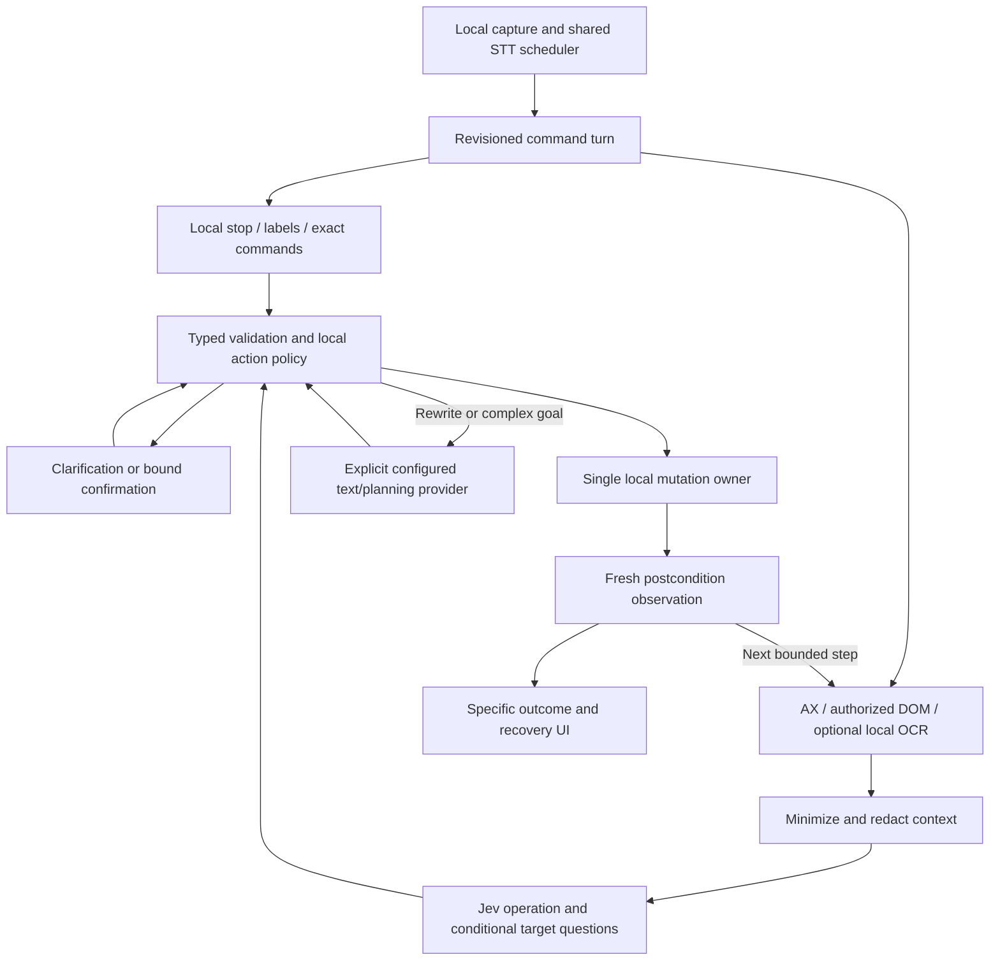

# Jev-powered Voice Control for MacParakeet

> **Governing implementation update — 2026-09-19:** The user's
> [native Accessibility direction](../../docs/research/2026-09-19-jev-voice-control/native-accessibility-direction.md)
> and [product](../../docs/research/2026-09-19-jev-voice-control/product.md)
> supersede conflicting proposals below. Native AX owns browser and app control;
> no extension setup, registration or packaging is required. Retain the experimental
> panel, BYO Jev key and spoken Transform integration. Ordinary authorized goal
> steps run without repeated approval; actual payment/destructive/external
> commitments remain deliberate boundaries. Contextual revisions preserve task
> history, manual input pauses without discarding the goal, and local bounded
> traces explain observed execution. Broader route proposals below are a research
> envelope; current implementation/evidence is in the capability matrix.

**Status:** IMPLEMENTED behind `--enable-voice-control` (DEBUG). Native Flights results and microphone qualification remain open.  
**Date:** 2026-09-19, updated 2026-09-20. **Owner:** MacParakeet product/core app.  
**Origin:** User request for a full voice-control feature, deep source research, classifier/router mapping and excellent everyday UI/UX. Jev is the requested semantic decision engine.  
**Evidence:** [Research index](../../docs/research/2026-09-19-jev-voice-control/README.md), [evidence](../../docs/research/2026-09-19-jev-voice-control/evidence.md), [route catalog](../../docs/research/2026-09-19-jev-voice-control/routing-catalog.md), [evaluation](../../docs/research/2026-09-19-jev-voice-control/evaluation.md).

## Product decision

Build a native **Voice Control** mode that lets a person act on their Mac using ordinary speech: navigate apps and browser tabs, click controls, enter and edit text, speak rewrites, and complete bounded workflows across apps. Keep simple actions fast enough to feel like direct manipulation. Make longer tasks visible, interruptible and verifiable.

The central interaction is **say what you want, see what will happen, correct it naturally**. Jev supplies fast semantic choices over the actual available controls; local code owns speech capture, permissions, target binding, execution and verification. Generative models are an explicit secondary capability for rewriting and planning where selection alone cannot provide the requested result.

This is a proposal for the full feature, with staged delivery. The first useful release is not the final scope. Direct native/browser control, text manipulation, hands-free sessions, correction and bounded multi-step tasks all belong in the full design. Always-on ambient listening, unrestricted shell execution and unattended remote agents do not.

### Relationship to existing plans and product direction

- Existing Transforms are implemented; spoken instruction capture is not. Reuse their selection/LLM/replacement primitives and absorb the spoken-transforms experience into this feature's text branch, rather than add competing command hotkeys and overlays.
- `plans/active/2026-06-21-spoken-transforms.md` remains an unimplemented historical input until this proposal is accepted; its narrow text-only scope must not accidentally constrain this broader request.
- `plans/active/2026-05-voice-command-agent-mode.md` is the preceding exploration. This proposal supplies the missing interaction, routing and execution design; do not mark that work complete merely because a new plan exists.
- General desktop control extends ADR-027's current speech-memory focus. Record an explicit accepted amendment/new ADR during implementation planning: user-invoked voice action is a deliberate additional product surface. Preserve session-based capture and local audio. ADR-011 needs the new cloud decision-context boundary; ADR-022 needs spoken-transform integration and targeting semantics. This research does not silently edit accepted decisions.

## Desired everyday experience

A person invokes Voice Control while working normally. A small nonactivating pill shows **Listening · Safari**. They say “open the second result.” A subtle outline identifies the intended link while speech is forming. On commitment, the link opens; the pill briefly says **Opened Wikipedia** after the destination is observed. No chat transcript or confidence dashboard occupies the screen.

They say “no, the other one.” The system knows which candidate set and prior action that refers to. If the first navigation can be safely reversed, it offers/executes the appropriate contextual repair and selects the alternative; if not, it says exactly what already happened. It never interprets “undo” as browser Back in every context.

Across short hold-to-talk invocations, a 30-second local continuation window retains typed referents (last selection, last opened result, last edited field, and rejected alternatives) while the microphone is off. This remembers context, never execution authority. Explicit session end, an excluded app, or incompatible context clears it.

In Notes, “replace tomorrow with Friday” produces a precise edit. “Make this paragraph shorter” uses the configured rewrite provider and shows a replacement preview when the change is substantial. “Type the words delete everything” inserts those words; quoted/dictated content never becomes a command.

For “find the latest design note and draft a reply in Mail,” the UI expands into a compact task card with the current step, scope and Stop. The task can search, read relevant content and draft, but a send action presents its recipient and final content before a distinct confirmation. If a step cannot be verified, the status says **Couldn’t confirm** or **Needs your help**, not Done.

## Scope and everyday task families

These are proposed high-value families, inferred from reference capabilities and common desktop workflows; they are not usage-ranked telemetry.

| Family | Representative requests | Full-feature behavior |
|---|---|---|
| App/window/tab navigation | “Go to Safari”; “the tab about pricing”; “the other Notes window” | Enumerate available targets, preserve profile/account identity, clarify duplicates. |
| Controls and menus | “Click Continue”; “turn dark mode on”; “open File, then Export” | Match observed affordance; no-op if requested state is already true; menu path steps reobserve. |
| Scrolling and reading | “Down a little”; “scroll the sidebar”; “keep going”; “stop” | Select scroll region, use bounded or locally stoppable continuous motion, verify progress. |
| Browser search/navigation | “Search this page for latency”; “look up train times”; “back to the results” | Distinguish page find, site search, URL navigation and history; maintain tab identity. |
| Text entry and editing | “Put hello there”; “replace the last sentence”; “spell Q W E R T Y” | Exact span/selection targeting, literal/spelling submodes, no accidental submit or whole-field overwrite. |
| Spoken transforms | “Make this clearer”; “translate this selection into Spanish” | Snapshot selected input, route to configured text model, preview/replace with target verification. |
| Forms | “Choose next Tuesday”; “set quantity to three”; “fill these two fields” | Parse exact quantities/dates locally; fill only supplied or explicitly approved values; validate field state. |
| Files and system controls | “Open Downloads”; “rename this draft”; “volume down a little” | Named typed capabilities, bounded changes and identity checks; separate destructive confirmation. |
| MacParakeet library actions | “Find yesterday’s meeting”; “copy that quote”; “export this transcript” | Prefer existing repositories/CLI-compatible domain operations to driving our own UI with clicks. |
| Cross-app transfer | “Copy this paragraph into that Notes window” | Explicit source and destination; preserve clipboard; stop on target mismatch. |
| Bounded tasks | “Find a one-way flight and stop at the options”; “draft a reply using this note” | Stateful plan, one verified effect at a time, bounded budget, no hidden escalation. |
| Recovery and control | “Not that”; “the second one”; “undo”; “pause”; “cancel” | Context-scoped repair, reversible-action receipts, immediate cancellation and honest state. |

The [route catalog](../../docs/research/2026-09-19-jev-voice-control/routing-catalog.md) expands these into classifiers, arguments, alternate phrasings and fallback behavior.

## Interaction contract

### Invocation and modes

Offer a dedicated configurable hold-to-talk gesture and an accessible session-toggle action. A toggle begins an explicit hands-free command session; it is not an ambient wake-word listener. Expose start/stop in the menu bar and keyboard-accessible UI. First use explains microphone, Accessibility and text sent to Jev; optional screen/OCR and browser integration have separate explanations when used.

Ordinary dictation remains ordinary dictation. Never run a hidden classifier that turns an existing dictation into app actions. Within Voice Control, an explicit “type…” intent or literal-entry submode owns text until its boundary; reserved emergency controls need clear escape semantics so “type stop” is possible. “Stop listening” ends capture and revokes pending execution; “pause task” halts workflow advancement; “cancel task” terminates it. These must not be conflated.

### UI states and exact promises

| State | What the person sees | Permitted transition |
|---|---|---|
| Off | Existing idle UI; no command capture/context requests | Explicit invocation only |
| Preparing | “Getting ready” and active app | Ready acknowledgment after microphone/STT readiness; cancel available |
| Listening | Live utterance, app identity, subtle waveform | Partial hypotheses can prepare/highlight; no mutation |
| Target preview | One outline and concise intent, e.g. “Open Settings” | Retract freely on transcript revision; does not indicate committed execution |
| Clarifying | Up to three labeled choices; “Which Delete button?” | Scoped answer replaces missing slot, then runs normal policy |
| Confirming | Concrete effect, target/account and supplied content | Distinct confirmation bound to exact action; edits invalidate it |
| Acting | Brief action label; Stop remains reachable | Consume action once; input starts only after fresh validation |
| Checking | Usually invisible for fast checks; “Checking…” if delayed | Observed success, observed failure, or unknown outcome |
| Succeeded | Brief specific receipt, optional relevant Undo | Return to listening for active session or dismiss for hold mode |
| Paused / Needs help | Exact completed step and next unresolved issue | Resume with fresh observation, revise, or cancel |
| Failed / Unknown | “Couldn’t click that control” / “Couldn’t confirm it was sent” | No automatic replay of a possibly completed effect |
| Paused after Stop | “Paused after <last verified step>”; report any in-flight effect | Resume reobserves; no pending effect retains authority |
| Cancelled / session ended | “Cancelled” after quiescence; report any in-flight completed effect | No later callback can reactivate task or show success |

Keep visual feedback compact and near the active work. Target outlines must not cover labels. Numbered hints appear on ambiguity or “show choices”; users may opt into persistent hints. Labels remain stable for their snapshot and are visibly refreshed after navigation. Support multiple displays, full-screen apps, high contrast, reduced motion, VoiceOver announcements and optional short spoken feedback. Do not rely on color alone. Audio feedback must not feed back into command recognition; use local output gating/echo handling.

Show contextual examples when idle (“You can say ‘scroll down’ or ‘open a tab’”), not a giant global list. Teach three commands in a first-run playground and offer “What can I say here?” at any time. The playground uses disposable local content and demonstrates selection, correction and stopping before real app control.

### Literal entry, stopping and continuation

Two text flows have deliberately different boundaries:

- **One-shot insertion:** “type <payload>” treats everything after the recognized insertion boundary through final ASR as payload, including “stop” and “click send.” No speech inside that payload dispatches another action. On the next utterance, normal command interpretation resumes. Physical Stop/Escape remains available throughout.
- **Persistent literal/spelling mode:** entered explicitly and shown as **Typing words** / **Spelling**. A complete isolated utterance “command mode” exits back to commands; “command stop” invokes the local emergency stop. To insert a reserved phrase, say “type literally command mode” (or spell it); the literal introducer disables reserved-phrase matching for that utterance. This small local grammar must be taught in the UI and evaluated across accents. It is a proposed default grammar, not a shipped command set.

While an action is executing, ordinary new speech pauses advancement before the next dispatch and becomes a new pending turn; isolated stop/cancel has priority. Never append a fresh utterance to the previous literal payload after its commitment. A speech stop still includes recognition delay; physical cancellation supplies the fastest path. The local stop detector must operate through the shared capture/STT architecture without a competing microphone/model owner.

**Bare “Stop” has one default:** immediately revoke queued effects, halt continuous motion and pause the current task, leaving an explicitly enabled command session available for repair. In literal mode, use its displayed reserved escape (“command stop”) or physical Stop so text remains literal. “Cancel” discards the pending task. “Pause task” is an optional synonym, not a distinction a distressed user must remember.

“Pause task” preserves a task checkpoint but revokes pending actions and confirmations. “Resume task” reobserves and validates remaining work; it never resumes an old action token. “Stop listening” turns capture off and pauses any task. If the command session is still listening, a committed “Resume task” is sufficient. If capture is off, resuming first requires a fresh hold/toggle invocation. “End Voice Control” cancels tasks, closes the session and clears its ephemeral context; this differs from temporarily stopping listening. “Cancel task” is terminal and clears its checkpoint. The compact paused card may remain visible with Resume/Cancel; it must not imply listening when the mic is off. After 60 seconds of inactive listening, the proposed default ends capture and pauses pending work, with a visible notice; tune this timeout with hands-free users and make it configurable.

Clarifications and pending confirmations can continue across hold invocations, shown in a small nonactivating card without leaving the microphone running. Initial expiry is 30 seconds for clarification/reference context and 20 seconds for confirmation, subject to usability validation; offer renewed preview after expiry. A confirmed target or payload change always revokes approval regardless of elapsed time.

### Speech commitment and correction

Use authoritative raw/revised ASR events and finalization status. `LiveTranscriptStabilizer` is display-only and cannot authorize an action. Hold release supplies an explicit commitment boundary after final ASR reconciliation. Hands-free sessions use acoustic endpointing plus revised-text stability, with completeness as one signal; a stalled transcript timer alone is not silence.

Launch behavior: speculative model requests and target previews are allowed while speaking, but mutations wait for commitment. If the final utterance exactly matches the hypothesis behind a fresh valid decision, reuse it. Otherwise reevaluate. A later experimental fast-commit mode for closed commands requires separate evidence; the promise of responsiveness must not depend on irreversible guesses before a correction can arrive.

Cancellation priority is local and independent of Jev availability. Physical Escape/control and an active-session speech stop detector must remain responsive during model/executor work. When the user moves focus, clicks elsewhere or types during execution, pause before the next effect; adapters distinguish our own synthetic input from manual input. In a cross-app task, only an explicitly planned and verified switch may continue automatically.

## System design

### Fast path and simple command sequences

Local interpretation handles an exact, unique offered control label, visible choice number, unambiguous app alias, reviewed scroll/media operation, explicit key and explicit literal/spelling grammar. These still pass target/consequence policy. Jev handles semantic paraphrases and ambiguous references. Observe the relevant AX/DOM scope as soon as Listening starts, reuse that observation when valid, and revalidate only affected identities/state before acting. Offline mode retains only supported local commands and Stop; it must clearly state that semantic matching is unavailable.

Speculative reuse compares a typed decision-input signature. For label matching, case and harmless punctuation normalization may be allowed by a tested route-specific rule. Never drop negation, numbers, quoted text, filler that could be payload, or meaningful punctuation in literal text. A change to operation, payload, target, modifier or referent requires reevaluation. Count all speculative requests; the target is one committed decision request, with a proposed cap of two additional speculative requests per short utterance, not “one paid call” regardless of previews. Measure local-route share alongside latency and correctness; do not force an unsafe local match merely to improve the percentage.

Direct-control beta includes **two- or three-clause explicit sequences**, such as “open Safari, then open a new tab.” A bounded parser identifies source spans for known command clauses outside literal payloads and quotes. An ambiguous conjunction stays intact for semantic interpretation or clarification; never split “type research and development.” No planner is required for a clear sequence of supported capabilities. Observe after each effect before resolving the next clause, show the next step briefly, and apply per-step policy. Goal-directed control also belongs in the early implementation: retain the user’s goal and choose the next supported action from fresh observations until the requested outcome is verified. A separate generative planner is not a prerequisite. Escalate only when the task actually needs reasoning or text generation beyond this loop. The same task lifecycle/budget applies, with a smaller sequence-length limit for explicit sequences.

### Early proof: a complete spoken goal

The first integrated milestone must demonstrate “find one-way flights from Zürich to London on September 20 and stop at the options,” with a resolved year/date, plus changed destinations, dates and paraphrases on held-out layouts. This is a goal over generic browser capabilities, not a hardcoded flight script. Jev repeatedly selects operation and target from the current page; exact supplied text uses committed source spans, while generated text uses the optional writing provider only when needed.

Build the bounded task lifecycle alongside the command core and browser adapter, rather than defer it to slice 6. Show progress, permit correction and local Stop between every effect, and verify route/date/results before claiming success. Prove the loop first on deterministic dynamic-page fixtures, then on a real browser workflow. Include loading, missing controls, ambiguous dates, changed focus and “actually, Friday.” The supplied demo’s 7.1 seconds is an external demonstration, not a MacParakeet benchmark or release promise.

### Observation and execution adapters

**Native:** walk the relevant AX window/subtree with time and node budgets; retain stable local handles and descriptive fields. Prefer AX actions and setters when supported. Before action, check process/window/control identity, enabled state, expected value and focused destination. Generic synthetic keys/clicks are a capability fallback, not the default for every control. An AX timeout must not block the main actor or the stop path.

**Browser:** the target product uses an optional user-authorized extension and a narrowly scoped native bridge for the user's chosen tab/profile. Native AX provides a limited baseline without the extension. Chromium CDP may support disposable development fixtures but is not the production requirement: do not relaunch personal browsers with debugging flags or quietly choose another profile. The bridge needs pair/session authentication, strict message validation, extension/tab/frame/document identity and a per-origin/context policy. Test iframes, shadow DOM, custom controls, contenteditable and virtualized pages explicitly; unsupported domains/apps are surfaced honestly.

**Visual fallback:** local OCR can create text-region candidates when semantics are unavailable. Mark provenance and lower assurance. First release of OCR uses highlighted user-confirmed targeting; no model-generated coordinate guesses. A local numbered grid remains available for unlabeled/canvas controls. Rich screenshot interpretation is an optional later provider surface, not an ability Jev has today.

**Domain actions:** directly invoke known MacParakeet domain services, supported OS APIs and approved app adapters where they provide a clearer contract. Jev chooses a capability/arguments; it never returns shell, AppleScript, JavaScript, selectors or executable source. Generic “press Return” is not automatically harmless: policy checks the focused control and potential submission.

### Transaction, identity and verification

Use one session owner with IDs for session, utterance revision, observation generation, action and confirmation. Each candidate records app/process/window/tab/frame/document identity, adapter handle, affordance, relevant before-state and privacy class. One writer owns GUI effects; command runs and existing paste/Transform work cannot overlap. **Command text entry gets a cancellation-safe executor contract in the first direct-control slice.** Existing `StreamingCursorInserter` intentionally drains the remainder on cancellation/manual interruption; do not reuse that behavior or change normal dictation. Check revocable authority before every queued text chunk/key event; after stop, report any partial insertion. An already-posted OS event may still take effect and must be reported honestly.

Incoming-turn arbitration is explicit: stop/cancel first; clarifications only in their pending state; all other new speech pauses task advancement. Finish or classify the currently dispatched effect, release mutation ownership, then resolve the newest committed turn against fresh state. Keep at most one replacement turn; newer revisions replace it. A new goal replaces the paused task only after the UI identifies that replacement; it does not silently stack an unbounded command queue. A correction can revise an undispatched action, but an already-dispatched one requires a verified inverse/new action. New capture cannot steal resources from dictation, meetings or a Transform; expose busy/pause/stop choices according to the shared scheduler and mutation lease.

A decision belongs to its observation and utterance. Revalidate meaning, identity and current geometry immediately before input. Ignore cosmetic animation if identity/meaning are unchanged; invalidate when a modal, field value, document, focus or capability changes. Debounce observations and update affected subtrees rather than recapture the whole desktop for every word.

Consume an action once before input. Record its dispatch and outcome separately from the next observation. Exactly-once effects cannot be guaranteed across an OS event and a crash; use at-most-once dispatch in-process, detect unknown outcomes, and never automatically replay pending external actions after restart.

Prefer deterministic postconditions: active app/tab, field value, checked state, document opening, created local artifact, or expected navigation. Jev can judge semantic completion over a fresh observation, but may not declare completion contrary to missing mandatory postconditions. A click returning successfully proves dispatch, not task success. Persist no automatic resume intent; after crash, show interrupted/unknown and require a new user action.

### Contextual repair and inverses

A referent entry contains kind (selection/result/control/action), candidate-set generation, selected and rejected IDs, observed descriptor, action receipt and reversibility class. “Other one” first refers to a live clarification set; otherwise it refers to the most recent compatible target set. With more than one alternative, ask. Any old target must be rediscovered and validated before effect; remembered labels are not executable handles.

| Effect | Permitted repair when verified | When to stop and explain |
|---|---|---|
| Same-tab navigation | Back only if current document/history entry matches the navigation receipt, then rediscover the alternative | User navigated independently, submitted a form, or history cannot be verified |
| Created tab/window | Close the exact created empty/unchanged context | User added work, context identity changed, or close consequences are unknown |
| Toggle/value change | Set the recorded prior value after confirming current value is still ours | Another actor/user changed the value; state not readable |
| Text edit | Apply inverse only to the same versioned range or use a verified app undo transaction | Intervening user edit, lost range identity or unknown undo stack |
| App/window switch | Reactivate recorded prior context if still available | Prior context is gone or user took over |
| Send/purchase/delete | No generic inverse; expose specific supported recovery as a new action | Never claim it was undone just because navigation went back |

### Policy and bounded tasks

Known harmless actions can run after commitment without a confirmation dialog. Ambiguity prompts for a target/slot. Sending, purchasing, destructive changes and meaningful external submissions show an action-specific confirmation, including the relevant destination/content. Reviewed adapters distinguish navigation/disclosure/focus actions from external submissions using current control context, form/destination/account evidence and explicit capability metadata. A generic link, toggle or visually harmless label is not automatically reversible. Unknown-consequence controls ask for confirmation or stop; they do not inherit a low-risk label from model confidence. Clarification identifies intent; it does not authorize consequences. Confirmation expires on context/argument change, cancellation, session end or a short configurable timeout to be tuned in usability testing.

Cross-app drafting requires an explicit **read-content capability** in addition to control discovery. It returns a bounded content snapshot with source app/document/selection identity, capture time, exact text/ranges, origin, sensitivity labels, completeness and truncation reason. A partial read cannot silently stand for the full document. Read only user-requested sources; do not treat page instructions as authority. Bind the draft to that snapshot and show the source beside the preview. A changed source requires refresh or explicit use of the earlier snapshot. Consent to target-label routing does not automatically grant a separate generative provider access to document bodies. Existing MacParakeet library reads should use repository/CLI domain APIs; native/browser content reads need their own supported adapter and disclosure.

A multi-step request carries a goal, allowed apps/sites/capabilities, supplied data and concrete success conditions. Start with a bounded proposed budget of 12 dispatched actions / 30 model requests / 60 seconds / 2 no-progress attempts, then pause with progress preserved for explicit continuation. These are initial product limits to validate, not model limits. Prefer a direct capability sequence when it is known; invoke the optional planner only when decomposition actually requires it. Every planner-selected effect still passes the same local policy. Do not turn “open Settings” into a general reasoning loop.

## Privacy and data lifecycle

- Microphone audio and STT remain local; no cloud ASR fallback for command mode.
- Jev receives the active command and minimum relevant control descriptions after explicit opt-in. UI text can include private material even without screenshots; say this plainly during setup.
- Do not collect background windows, clipboard history, browser profiles or arbitrary page bodies. Read additional content only when needed for the current user request, with scope visible.
- Exclude secure/password/OTP fields by control semantics before request assembly; redact likely sensitive values conservatively and provide per-app/site exclusions. Pattern matching alone is not a complete sensitive-data detector.
- Optional OCR stays local; cloud vision would need a separate setting/disclosure. Optional rewrite/planning provider receives only the content authorized for that branch.
- Production keys use Keychain and existing provider-settings patterns. The local research key is not an application credential-distribution design.
- Session history is memory-only by default and clears at end. No raw transcript/UI screenshot/payload in telemetry. Opt-in diagnostic export is local, previews content and offers redaction. Existing explicit Transform history behavior needs a clear decision for spoken transforms; do not silently log every command as dictation.

## Implementation sequence and verification ownership

All new names below are proposed. Current types and ownership are in [architecture](../../docs/research/2026-09-19-jev-voice-control/architecture.md) and [tools](../../docs/research/2026-09-19-jev-voice-control/tools.md). Use feature flag `AppFeatures.voiceControlEnabled` default off, with separate user consent. No production code is added by this plan.

| Slice | Deliverable and proposed location | Focused evidence |
|---|---|---|
| 0. Contracts and fixtures | Proposed ADR, `spec/contracts/voice-control.md`; sanitized AX/DOM/transcript fixtures under `Tests/MacParakeetTests/Fixtures/VoiceControl/`; update existing plan lineage deliberately | Exact route/terminal-state examples; baseline Apple Voice Control comparison; browser-bridge feasibility and engine latency measurement |
| 1. Pure command and task core | `Sources/MacParakeetCore/Services/VoiceControl/`: turn/session state, bounded goal runner, candidate/action/result values, policy, receipts; Jev HTTP client separate from chat provider | Proposed `VoiceControlPolicyTests`, `VoiceControlSessionTests`, `JevDecisionClientTests`: malformed schema, unused-head uncertainty, stale revision, confirmation binding, cancel and unknown outcome |
| 2. Local observation/execution | Native adapter under Core System services; shared mutation arbitration with dictation/Transforms; cancellation-safe command text entry | Proposed `VoiceControlAXAdapterTests`, `VoiceControlExecutionTests`; existing `SelectionReplacementServiceTests`, `TransformExecutorTests`, `DictationFlowCoordinatorTests`; real TextEdit/Notes/Finder matrix |
| 3. Native voice UX | App `VoiceControlCoordinator`, ViewModels `VoiceControlViewModel`, app views; hold and accessible session-toggle invocation, basic referent repair, clarification/help, local Stop, short explicit command sequences and capture via shared scheduler | Proposed `VoiceControlViewModelTests`, `VoiceControlSpeechTests`; existing Hotkey tests; manual readiness, correction, VoiceOver and multi-display checks |
| 4. Browser control | Proposed `integrations/voice-control-browser/` extension/native bridge; authenticated protocol and DOM candidate adapter; integrate the early spoken-goal milestone | AX browser baseline measured first; richer advertised browser operations require this bridge. Browser fixtures via Playwright: tab/profile binding, iframe/shadow DOM, navigation during inference, removed node, bridge disconnect, no password exposure |
| 5. Precise text and spoken rewrite | Snapshot-based Transform entry point; verbatim span arguments; selection-aware edit operations | Existing Transform/selection tests plus proposed `SpokenTransformTests`, `VoiceControlTextTests`; exact punctuation, repeated phrases, Unicode, IME, rich text and focus changes |
| 6. Broader hands-free and cross-app tasks | Advanced hands-free tuning, extend the already-integrated bounded goal runner, typed read-content snapshots, authorized cross-app transitions and optional planner; basic hands-free/Stop already required in slice 3 | Proposed `VoiceControlTaskTests`; real sequential commands, cancellation at every await/effect boundary, manual takeover, no-progress, false completion and interrupted recovery |
| 7. Coverage and controlled rollout | Contextual help, optional OCR/grid, app-specific adapters, compatibility matrix and documentation | Evaluation corpus, held-out sessions, content-free telemetry and kill switch; default-off beta before public enablement |

Slices 1–4 target a useful direct-control beta **including a complete spoken browser goal, accessible non-hold invocation, local Stop, basic “other one” repair and contextual help**; the full feature is not complete until precise editing, correction, hands-free operation and bounded tasks meet their gates. Do not let later scope become an excuse for a weak direct-control experience. Pull requests should stay separable by contracts and user-visible vertical slices; do not create one giant change or a generalized plugin framework first.

A future CLI command surface may expose observe, propose, execute-with-consent, stop and result through the same core. First implementation should decide whether a local process command or existing app IPC is the appropriate contract; no unauthenticated HTTP control server. Update `integrations/README.md`, matching `spec/contracts/` and CLI CHANGELOG in the same behavior PR. Agent access cannot bypass consent or target verification.

## Acceptance and release gates

The [evaluation plan](../../docs/research/2026-09-19-jev-voice-control/evaluation.md) is authoritative for proposed workload definitions and denominator-specific gates. No benchmark gate below has passed yet.

- Direct commands must demonstrate useful end-to-end latency on real local speech, not only 200–300 ms Jev calls. Separate speech endpointing, final ASR, observation, decision, effect and verification timings; report warm/cold and Bluetooth separately.
- Candidate coverage, intent/argument accuracy, unwanted actions, correction success, cancellation and outcome verification are independently measured. High abstention cannot masquerade as accuracy.
- Held-out tests include ordinary conversation, negation, partial revisions, literal command words, duplicate controls, account ambiguity, dynamic UI, permissions, network loss and prompt injection in UI text.
- No known path bypasses confirmation through a numbered answer or retries a possibly completed submission. No pending action survives Stop/session end. Negative privacy fixtures must show secrets excluded before transport.
- Full suite at most once at the final code-change gate per task; focused tests during implementation. Native hardware evidence remains separate from unit tests and CI. This research-only task does not run the Swift suite.

## Decisions still requiring evidence, not guesswork

| Question | Proposed default | How to settle |
|---|---|---|
| Which local speech engine feels immediate enough? | Reuse selected capable engine through scheduler; expose readiness honestly | Measure short commands, corrected partials and endpoint latency across supported models before choosing a command-specific default |
| Is native AX enough for the user's browser? | AX baseline plus optional browser extension for richer controls | Compare candidate coverage and observed task completion across Safari/Chrome and target web apps |
| How much preview/confirmation is welcome? | Subtle target preview, dialogs only for ambiguity/consequence | Moderated comparison with novice/power/hands-free users; measure correction burden and unwanted actions |
| How should free text be acquired? | Copy exact committed spans; existing LLM only for actual rewriting/generation | Evaluate candidate recall and edit fidelity; do not use an LLM for every typed string |
| What is the first compatibility promise? | Named app/operation support matrix, not “any app” | TextEdit, Notes, Finder, Safari/Chrome first; Slack, Mail and editors qualify separately |
| What does reliable hands-free Stop require? | Dedicated local interrupt recognition in explicit sessions | Acoustic tests during model waits, long tasks, TTS and Bluetooth; physical stop remains available |
| How much contextual memory? | Session-scoped referents/receipts; no ambient or permanent cross-app memory | Usability tests for “other one,” “again,” “there,” with expiry and stale-reference checks |

These are implementation/evaluation questions with defaults, not reasons to defer the feature indefinitely. The next concrete work is a disposable native/browser vertical slice proving **speak → highlight → act → verify → correct/stop**, including repeated Jev decisions toward a complete browser goal, alongside a reproducible speech/UI fixture corpus. It should remain separate from production enablement until the measured results support the planned experience.

## Implementation readiness assessment — 2026-09-19

Research is sufficient to begin implementation. The reference audits, routing catalog, interaction contract and evaluation design supply an actionable starting point. Further broad research is not a prerequisite. Browser coverage, endpointing, local interruption and end-to-end latency require implementation and measured trials; they are not established by the reference demos or text-only API calls.

The intended destination is the full qualified release: direct native/browser control, goal-driven workflows, precise text editing and spoken rewrites, hands-free invocation, contextual correction, and visible recovery. Internal slices are engineering milestones, not substitutes for that destination. Release readiness additionally requires a named compatibility matrix, passing evaluation gates, physical microphone/browser/native-app trials, onboarding and cloud-context disclosure, regression checks for existing capture modes, and normal signed/notarized distribution verification. No production implementation or release is claimed by this assessment.
