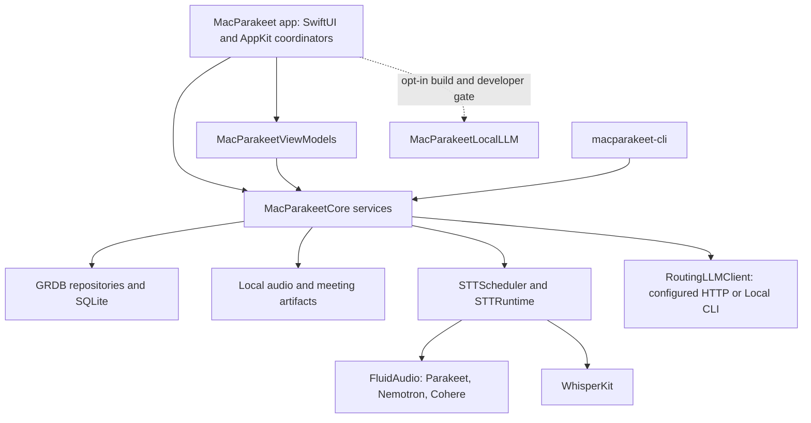
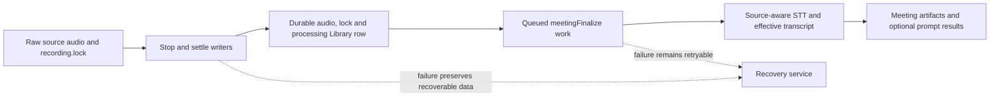
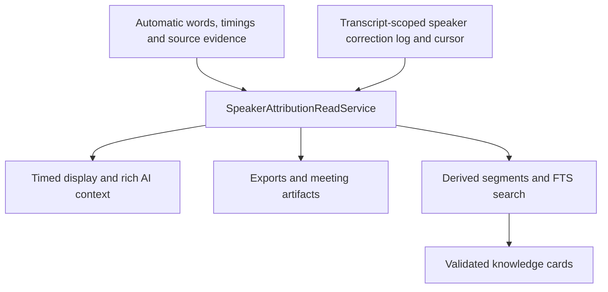

# MacParakeet: Architecture

> Status: **ACTIVE** — implementation map, audited 2026-09-07.
> Source presence describes development capability. The
> [release and flag table](README.md#release-channels-and-feature-flags)
> governs availability; this document is not release qualification.

## System Overview

MacParakeet has two executable products: the SwiftUI macOS app and the public
`macparakeet-cli`. Both use Core services and the same local database model.
The app composes one microphone source and one speech scheduler/runtime;
a separate CLI process owns its own connections and speech runtime.



### Target and composition boundaries

[Package.swift](../Package.swift) defines the build graph. The app composition
root is [AppEnvironment](../Sources/MacParakeet/App/AppEnvironment.swift), with
app-level wiring in `AppEnvironmentConfigurer` and the app delegates/coordinators.

| Target | Ownership |
|---|---|
| `MacParakeetCore` | Audio, STT, deterministic processing, database models/repositories, meeting settlement/recovery/artifacts, speaker corrections, retrieval, exports, LLM routing and system adapters. No SwiftUI view ownership; small AppKit adapters are allowed. |
| `MacParakeetViewModels` | Testable `@Observable` presentation state, library and prompt flows, live and saved notes, async selection/context coordination. Depends on Core; some presentation helpers use AppKit/SwiftUI. |
| `MacParakeet` | SwiftUI views, windows/panels, hotkey and menu integration, app lifecycle, dependency composition and feature coordinators. It is not literally free of orchestration logic. |
| `CLI` | Argument parsing, stable automation output and command orchestration over Core. GUI hotkeys and live recording controls are outside its current contract. |
| `MacParakeetObjCShims` | Small Objective-C exception-catching bridge for platform operations Swift `do/catch` cannot catch. |
| `MacParakeetLocalLLM` | Optional in-process MLX implementation; linked only with `MACPARAKEET_ENABLE_MLX_LOCAL_LLM=1`. Normal package builds do not resolve this dependency graph. |
| `MacParakeetTests`, `CLITests` | App/Core/ViewModel and public CLI verification. |

Use injectable protocols at service boundaries and explicit ownership of
process-wide resources. This is not a claim that every type has a protocol or
that no shared helpers exist. Keep slow I/O, model work and process execution
off `@MainActor`; await work whose result or ordering affects user state.

## Capture and speech control

### Shared microphone, independent sessions

`SharedMicrophoneStream`, owned by `AppEnvironment`, fans out microphone
buffers to dictation's `AudioRecorder` and meeting `MicrophoneCapture`; consumers
own downstream copies.
`AudioProcessor` wraps the dictation recorder and `AudioFileConverter`; feature
services do not install independent microphone engines. System meeting audio
comes through `SystemAudioStream` using ScreenCaptureKit.

Meeting source selection is mic, system, or both. Mic-only recording requires
no Screen Recording permission. The shipping microphone processing mode is
raw; VPIO is explicit opt-in plumbing. Meeting echo suppression runs after
stop on derived audio and does not change the live microphone sent to a call.

Dictation and meeting recording can run concurrently. Source lifecycle repair
belongs to the source owners, which require actual replacement buffers before
claiming recovery. Silence by itself is not proof of a dead source. See the
[Audio subsystem guide](../Sources/MacParakeetCore/Audio/README.md),
[audio pipeline](05-audio-pipeline.md), [ADR-015](adr/015-concurrent-dictation-meeting.md)
and [ADR-025](adr/025-meeting-capture-reliability.md).

### One speech control plane per process

`STTScheduler` owns admission, cancellation, queueing, progress and meeting
leases. `STTRuntime` owns engine/model lifecycle. GUI services receive the shared
scheduler; `STTClient` is the self-contained CLI/test facade, not a second
runtime for app features.

| Lane | Work and policy |
|---|---|
| Interactive | Reserved for dictation. Native live dictation sessions occupy it for their lifetime. |
| Background | `meetingFinalize` > `meetingLiveChunk` > `fileTranscription` among pending work. An already running file job is not preempted by meeting stop. |
| Display preview | Parakeet TDT tail-window preview uses a bounded single-flight path outside those job slots; it has cancellation/drain and engine-switch guards. |

Cohere is a scheduler-wide single-flight resource even though two semantic
lanes exist. On macOS 14, `ANEInferenceGate` also serializes guarded Neural
Engine inference; it is a no-op on macOS 15+. Diarization is outside STT job
admission but shares that inference guard. Model download must not monopolize
it; see [ADR-010's model-preparation contract](adr/010-speaker-diarization.md).

There are two user-facing routes over this control plane:

- **Live Speech** serves dictation and eligible meeting preview.
- **Final Transcription** inherits Live Speech unless explicitly overridden;
  it serves files/media and post-stop meeting STT.

A meeting captures an immutable `MeetingSpeechPlan` and live-engine lease at
start. The lease is released at durable stop/cancel; queued finalization uses
the captured final route. File/media jobs snapshot their resolved route too.
An unavailable captured model leaves a retryable failure rather than silently
substituting a different engine.

| Engine | Runtime and capability |
|---|---|
| Parakeet v3/v2 | FluidAudio TDT; v3 standard-path default, v2 English-only opt-in; word timings and display-only tail preview. |
| Parakeet Unified | FluidAudio `StreamingUnifiedAsrManager`, English-only opt-in; native partials and token-derived word timings. |
| Nemotron | FluidAudio multilingual/English streaming variants; opt-in Beta, native partials and token-derived timings. |
| Whisper | WhisperKit, broad multilingual coverage; locale-aware CJK/Korean onboarding may select it. Live dictation preview remains default-off. |
| Cohere | FluidAudio `CoherePipeline`, explicit local download, batch-only; no word timings, diarization alignment or live preview. |

The capability registry, selected variants and supported language policies are
in the [STT spec](06-stt-engine.md) and [STT subsystem guide](../Sources/MacParakeetCore/STT/README.md).
[ADR-026](adr/026-asr-engine-strategy.md) governs runtime expansion. Benchmark
results in [benchmarks/asr](../benchmarks/asr/) describe their recorded hardware,
datasets and builds; they are not current-release speed/memory guarantees.

## Durable workflow paths

### Dictation

Hotkey/overlay coordinators call `DictationService`, which records through
`AudioProcessor` and submits stop-time audio to the shared scheduler. Live
partials are display-only: final paste and history use recorded-file STT.
The Raw/Clean preference selects deterministic refinement, after which the
separately enabled AI formatter may run. Persistence, insertion and post-paste
actions use the owning service's result and failure paths.

The pure `TextProcessingPipeline` takes text, words and snippets as values; it
does not fetch repositories. Clean processing runs filler removal, custom-word
replacement, trailing-action extraction, snippet expansion, then whitespace
cleanup/insertion styling. Raw still extracts configured terminal actions.
Meetings reuse only the custom-word step. See [text processing](07-text-processing.md)
and [ADR-004](adr/004-deterministic-pipeline.md).

### Files and media URLs

`TranscriptionService` coordinates local-file conversion or media download,
route snapshotting, STT, optional diarization, refinement and completion.
`AudioFileConverter` owns format/track conversion; `YouTubeDownloader` and the
podcast helpers own user-initiated remote imports. Network download does not
occupy an STT slot. GUI local-file batches are sequential and preserve already
completed Library items when cancelled.

Completion uses `TranscriptionRepository.savePreservingUserMetadata`: merge
against current user notes, names, favorites, artifact/audio pointers and other
user metadata inside the write transaction. Publish the returned row. A missing
row aborts completion instead of recreating an item deleted during processing.
See the [database guide](../Sources/MacParakeetCore/Database/README.md) and
[file audio-track contract](contracts/file-transcription-audio-tracks.md).

`MeetingImportService` is the shared app/CLI boundary for turning one external
recording into a managed meeting. It normalizes the first/default audio stream
under the meeting-recordings root while holding the media mutation lease,
publishes the ordinary recovery lock before the database stub, then delegates
to `TranscriptionService`, `MeetingRecordingSettlement`, and
`SavedAudioAutoPromptCompletionService`. The source path never becomes owned
meeting state. `createdAt` preserves historical chronology, while
`audioRetentionStartedAt` ages only the managed copy. See
[ADR-030](adr/030-external-meeting-import.md) and the
[meeting import contract](contracts/meeting-import-v1.md).

### Meeting stop, finalization and recovery



The recorder can return to idle once durable stop succeeds, allowing another
meeting while final STT waits. That does not create a new speech lane. Raw mic
and system sources remain the evidence; optional `microphone-cleaned.m4a` is a
fail-soft AEC derivative. The finalizer aligns source transcripts, applies
vocabulary and optional system-side diarization, and persists capture quality
independently of whether STT returned text.

`MeetingRecordingSettlement`, `MeetingRecordingRecoveryService`, source writer
ownership and the lock-file store protect audio during stop, retry and discard.
A lock is protective metadata, not sufficient proof that a session is orphaned.
The [recovery/retention contract](contracts/meeting-recovery-retention.md) owns
deadlines, active-writer guards, empty-session handling and explicit discard;
[meeting artifacts v1](contracts/meeting-artifacts-v1.md) owns filenames,
alignment, capture reports and compatibility. [ADR-028](adr/028-meeting-echo-cancellation.md)
owns the AEC decision. Never infer successful dual-source capture from a
successful transcript or absent telemetry alone.

## Transcript evidence and derived views

The durable transcript is not the same thing as every rendered or indexed
view of it. Current development adds a cross-cutting correction layer:



`SpeakerCorrectionService` applies commands against a transcript fingerprint
and revision. Add/rename/assign/split/merge/remove/reset and Undo/Redo preserve
recognized words and automatic evidence. Correction writes, derived segment
replacement and card invalidation commit atomically. Replacement transcript evidence is fingerprinted again; corrections tied to a
different fingerprint do not replay. A failed attempt preserves the prior
transcript/corrections. Async display/context reads must reject stale
same-ID snapshots and revisions. Consumers use effective attribution through
`SpeakerAttributionReadService`, rather than modifying baseline speaker arrays.
See [ADR-010](adr/010-speaker-diarization.md) and the
[data model](01-data-model.md#speaker_corrections--speaker_correction_states-v032).

`KnowledgeSegmenter` derives rebuildable `segments` and FTS search for meeting
and file/URL transcripts. Dictation history remains a separate search surface.
`CardGenerationService` validates bounded JSON and citations, then checks source
freshness again after provider latency and inside persistence. Failed generation
does not erase the previous valid card. `KnowledgeLayerMutationService` owns
cross-table invalidation/replacement. Corpus-wide Ask, semantic retrieval and
cross-file speaker identity are not implied by these components.

Saved meeting notes are user-authored SQLite state. `SavedMeetingNotesViewModel`
and `SavedMeetingNotesCoordinator` debounce saves and flush before dependent
AI/navigation/quit operations; artifact refreshes are serialized per meeting.
Result prompts can explicitly include notes, and persist what was actually
sent. [ADR-020](adr/020-live-meeting-notepad-and-memo-summaries.md) governs these
boundaries; notes are never silently replaced by generated results.

## Optional AI and presentation

`LLMService` builds operations over `RoutingLLMClient`. Configured HTTP adapters
support cloud and local endpoints; Local CLI uses a managed subprocess and is
not a guarantee that the invoked tool performs inference locally. The optional
MLX target supplies a separate in-process runtime. Visibility requires both
runtime availability and the product/developer gate.

`prompts` owns stable identity and operational metadata; immutable
`prompt_versions` owns content, requested settings and model override.
`PromptRepository` resolves the active-version join; `PromptEditingService`
coordinates transactional saves and restores without rewriting history. Optional
`prompt_collections` organize prompts. `PromptLabelApplicabilityResolver` applies
transcription-label policies for manual selection and source-aware auto-run;
legacy meeting-type policies are compatibility data only.

Prompt definitions and versions remain in the same GRDB database; completed `PromptResult` values retain
the compatibility table name `summaries`. Result prompts snapshot prompt
content, included notes and effective inference settings so a later edit does
not rewrite a historical request receipt. Default/unsupported provider settings
follow [spec 14](14-per-prompt-inference-settings.md), not arbitrary passthrough.
Transforms have separate selected-text capture/replacement and history semantics.
See [LLM integration](11-llm-integration.md), [processing layer](12-processing-layer.md)
and [ADR-022](adr/022-transforms-system-wide-rewrite.md).

App-owned Markdown views render static and streaming results/chat using the
pinned `SwiftStreamingMarkdown` dependency. They preserve the original Markdown
for copy/export. Rich rendering is presentation, not transcript mutation;
[UI patterns](04-ui-patterns.md#llm-markdown-content) owns interaction details.
`ExportService` supports TXT, Markdown, SRT, VTT, DAPT, DOCX, PDF and JSON; timing
and speaker behavior depend on the effective transcript projection. Automatic
text can use word timing, a corrected line can use only its segment envelope,
and a transcript without word timestamps or with a legacy whole-text replacement
is untimed. The
[DAPT contract](contracts/dapt-export-v1.md) defines the same alignment boundary.

## Storage and external boundaries

| Data | Owner/location |
|---|---|
| Library, dictations, vocabulary, prompts/results, corrections, retrieval, cards, run metadata | GRDB `DatabaseManager` / repositories; normally `~/Library/Application Support/MacParakeet/macparakeet.db`. |
| Preferences and provider metadata | `AppRuntimePreferences` / `UserDefaults`; provider configuration excludes API-key contents. |
| Provider credentials | Per-provider Keychain entries through `LLMConfigStore`. |
| Meeting audio, locks, metadata and materialized artifacts | Configured meeting artifact root plus `{uuid}/` (default `~/Library/Application Support/MacParakeet/meeting-recordings/`); retained artifact folder pointers survive managed audio removal. |
| Dictation/file/media retained audio | App-managed paths and workflow-specific retention preferences; see `AppPaths` and storage contracts. |
| Speech models and downloaded helper binaries | FluidAudio-managed caches, MacParakeet's Whisper cache and app `bin/` paths. |
| Optional local LLM models | Explicitly downloaded `LLMModels/` directory; no model bundled or automatically downloaded. |
| Diagnostics | Bounded local audio log, OSLog and explicit exports; governed separately from transmitted telemetry. |

SQLite is the canonical structured record store, not a complete backup of all
app state. `DatabaseManager(path:)` uses process-serialized migrations and a
five-second busy timeout; CLI `health` uses read-only, non-migrating probes.
Migration identifiers are historical schema labels, not app or CLI release
versions. See [data model](01-data-model.md) and [AppPaths](../Sources/MacParakeetCore/Services/AppPaths.swift).

Core STT has no network dependency after model setup. Other surfaces include
configured AI, model/helper/media downloads, updates, opt-out telemetry/crash
reporting, default-on Discover with its own opt-out, explicit submissions and
retained activation plumbing, including startup validation of an existing
legacy license (see [ADR-006](adr/006-trial-and-license-activation.md)). Calendar
reads local EventKit data. The
[local-only ADR](adr/002-local-only.md) enumerates these boundaries; neither
telemetry opt-out nor hiding Discover is a global network switch.

The app ships by Developer ID signing, notarization and DMG/Sparkle delivery,
not as an App Store sandbox configuration. Use the actual entitlements and
[distribution guide](../docs/distribution.md) for packaging. Microphone,
Accessibility, system-audio and Calendar permissions are requested in the
appropriate product flows; see [ADR-005](adr/005-onboarding-first-run.md).

## Dependencies

Package requirements below describe this audited revision; `Package.swift` and
`Package.resolved` own requested and resolved versions respectively.

| Dependency | Requirement and use |
|---|---|
| FluidAudio | Exact `0.15.7`; local STT and offline diarization. Deliberate upgrades require speech/diarization validation. |
| GRDB.swift | From `7.0.0`; database access and migrations. |
| swift-argument-parser | From `1.3.0`; public CLI. |
| Sparkle | From `2.9.0`; app updates and embedded framework packaging. |
| yyjson | Exact `0.12.0`; exposed by FluidAudio's module graph. |
| WhisperKit / argmax-oss-swift | Exact `0.18.0`; optional compatibility-build exclusion. |
| SwiftStreamingMarkdown fork | Immutable revision pinned in `Package.swift`; app/test rendering and transitive macro plugin. |
| MLX packages and Tokenizers | Opt-in graph only: exact `mlx-swift-lm 3.31.4`, `mlx-swift 0.31.4`, `swift-transformers 1.1.6..<1.2.0`. |

`MACPARAKEET_SKIP_WHISPERKIT=1` also excludes the Markdown dependency graph for
the first-party Swift 6 compatibility build. Normal builds include both.
`yt-dlp` and FFmpeg are helper executables, not additional speech runtimes.

## Testing Strategy

Use [spec 09](09-testing.md) and subsystem guides for focused behavioral checks.
Database fixtures should use `DatabaseManager()` to apply the actual migrations
to isolated in-memory storage. Do not copy a partial schema into a purported
canonical test fixture. Hardware capture, permissions, model accuracy and signed
upgrades need their own evidence; mocked service tests do not establish them.

For documentation-only changes, verify source claims, local links and the diff.
For code, iterate with focused tests and run the full suite at most once as the
final gate, with one owner across the task and release workflow.

## Build & Run

```sh
swift build
swift test --filter TextProcessingPipelineTests
scripts/dev/run_app.sh
swift run macparakeet-cli --help
```

Run from the worktree that owns the change. The development script owns GUI
bundle preparation and `-skipMacroValidation` for the Markdown dependency; do
not reconstruct a partial Xcode invocation from an old architecture example.
Use isolated app state for QA as documented in the distribution/testing guides.
